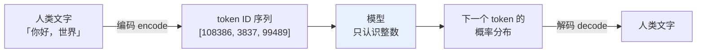
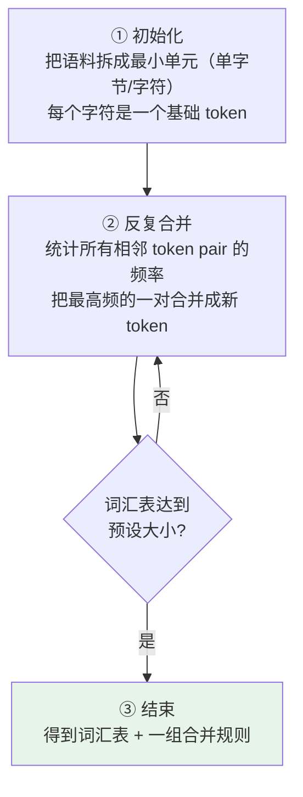

# 第五章：Tokenizer 分词器

## 5.1 为什么需要 Tokenizer

大语言模型的本质是一个函数：**输入一串整数（token ID 序列），输出下一个整数的概率分布**，再把整数查表得到文字。

整个过程里模型看到的全是整数，**完全不认识字符串**。



Tokenizer 就是**连接人类文字和模型整数世界的桥梁**，做两件事：编码与解码。

## 5.2 两种朴素方案都不行

### 5.2.1 字符级：太碎

每个字母或汉字算一个 token。

| 优点 | 问题 |
|---|---|
| 词汇表极小（英文才 26 个字母加标点） | **序列变得非常长**：「hello」就是 5 个 token，一篇文章能膨胀到上万 token |
| 永远不会有未登录词 | Attention 的 $O(N^2)$ 计算量大幅飙升 |
| | **语义信息太少**：模型要从一堆离散字符里重新学出「单词」的概念，效率极低 |

### 5.2.2 词级：太散

每个完整单词算一个 token。

| 问题 | 说明 |
|---|---|
| **词汇表爆炸** | 光是 `cat / cats / catting / catty` 这种变形就要分别存，膨胀到几十万甚至几百万 |
| **OOV 未登录词** | 遇到训练时没见过的新词（专有名词、网络用语、拼写错误）直接无法处理，只能输出「未知词」标记，**语义完全丢失** |
| **中文更糟** | 要先做中文分词，分词错了下游全错——这正是 [第一章](01-what-is-llm.md) 讲的传统 NLP pipeline 痛点 |

### 5.2.3 子词分词是甜蜜点

**字符级太碎，词级太散**，子词（subword）级分词取中间：既控制词汇表大小，又能处理新词，同时保留比字符更多的语义信息。

BPE 是最常见的一类，但不是唯一方案——SentencePiece / Unigram、WordPiece 也很常用。

## 5.3 BPE 算法

BPE（Byte Pair Encoding，字节对编码）原理很简单，三步：



**合并过程举例**：

```
「t」和「h」经常相邻   → 合并成「th」，加入词汇表
「th」和「e」经常相邻  → 合并成「the」，加入词汇表
...
```

每轮合并产生一条合并规则，同时词汇表增加一个 token。

| 模型 | 词汇表大小 |
|---|---|
| GPT-2 | 50,257 |
| Llama 2 | 32,000 |
| Llama 3 | 128,000 |
| Qwen 2/3 | 约 15 万 |

### 5.3.1 为什么它能解决 OOV

以「lowest」为例，BPE 可能切成 `low` + `est`，因为两者都是高频子词。

遇到训练时**完全没见过**的「lowest123」：

```
lowest123  →  low + est + 1 + 2 + 3
```

**不会出现 OOV**。对于采用 byte-level BPE 的 tokenizer，最坏情况下会退化为若干字节 token；这些 token 只是可逆编码单元，不一定各自有语言学意义。

这也是「Byte」这个词的含义：以字节为最小单位，**任何 UTF-8 文本都能被表示**，包括从未见过的表情符号和小语种。它并不保证 token 边界等于 Unicode 字符边界：一个汉字的 UTF-8 字节可能分属多个 token，单独解码中间 token 时甚至可能不是有效文本。

## 5.4 中文的特点

中文没有空格分隔，BPE 的处理方式和英文不同。

在大多数主流模型的词汇表里：

- **常用汉字直接作为独立 token**（每个汉字出现频率足够高，不需要拆）；
- **常见词语**（如「人工智能」）可能被合并成单个 token，也可能是「人工」+「智能」两个——取决于训练数据里的频率。

### 5.4.1 一个经验规则和它的适用边界

粗估：**1000 个汉字大约对应 1000–1500 个 token**（汉字 token 化效率略低于英文，因为英文的合并词能覆盖更多字符）。

> **但这只是粗估。** Qwen、Llama、OpenAI、Claude 的 tokenizer 完全不一样；中文、英文、代码、表格混在一起时比例会明显变化。**正式算成本前一定要用目标模型的 tokenizer 实际跑一遍。**

## 5.5 特殊 Token

Tokenizer 里还有一些不来自文本的 token，用来给模型传递**结构信息**：

| 特殊 Token | 作用 |
|---|---|
| **BOS**（Beginning of Sequence） | 标记序列开始 |
| **EOS**（End of Sequence） | 标记序列结束，模型生成到它就停止输出 |
| **PAD**（Padding） | 批量处理时对齐不同长度的序列 |
| **SEP**（Separator） | 分隔不同部分 |
| `<\|im_start\|>` / `<\|im_end\|>` | ChatML 格式里区分对话轮次和角色 |

**模型对这些 token 有特殊的「意识」**——它们的 embedding 在训练中被专门优化，所以模型能根据这些信号理解对话结构。

这解释了一件很多人困惑的事：为什么把对话历史拼成一段纯文本喂给模型，效果会明显不如用标准的 messages 格式？因为后者会被渲染成带特殊 token 的模板，而模型在训练时就是按这个模板学的。

### 5.5.1 EOS 与停止生成

EOS 是最值得单独说的一个：**模型「知道该停下来」不是靠外部长度限制，而是靠它自己预测出 EOS token。**

这也解释了一类线上故障：如果推理时用的 chat template 和训练时不一致，模型可能永远预测不出 EOS，表现为「停不下来一直说」，只能靠 `max_tokens` 硬截断。

## 5.6 Tokenizer 对工程的四个直接影响

理解 Tokenizer 不只是理论知识，搞不清楚就容易踩坑。

### 5.6.1 API 成本估算

主流 LLM API **按 token 计费，不是按字数**。

| 内容类型 | 粗略比例 |
|---|---|
| 中文 | 1000 字 ≈ 1000–1500 token |
| 英文 | 1000 词 ≈ 1300 token |
| 代码 | 效率更低，标点、缩进常单独成 token |

**这些都只是经验值**——要预估费用必须用目标模型的 tokenizer 数出来，不能只按字数拍脑袋。

### 5.6.2 上下文窗口管理

每个模型有最大 token 限制。字数和 token 数的比例取决于语言和内容类型，**中文 + 代码混合内容很容易让你以为「才 5 万字应该不超」，实际已经 8 万 token 了**。

这种「直觉和实际不符」是新人最常见的坑。

### 5.6.3 避免截断重要信息

如果文档恰好卡在上下文边缘，**按 token 长度截断可能落在词、Unicode 字符或 UTF-8 字节序列的内部**。这不会产生一个可发送给模型的「半个 token」，但把已截断 token 单独解码、或交给只接受完整 Unicode 的下游系统时，可能得到替换字符、乱码或不完整词语。

工程上要处理这种边界情况：**保留几百 token 的安全 buffer**，并且在语义边界（句号、段落）而不是 token 边界上截断。

### 5.6.4 影响模型的数学与字符级能力

一个经典现象：**问模型「strawberry 里有几个 r」经常答错。**

分词粒度会让这类任务更难：`strawberry` 可能被切成 `str` + `aw` + `berry` 这样的块，模型不一定逐字符操作。**但这不是唯一原因**；训练数据、位置表示和推理策略也会影响结果，不能据此把字符计数错误完全归因于 tokenizer。

同理，数字的切分方式会直接影响算术能力。有些 tokenizer 把「12345」切成「123」+「45」，有些逐位切成「1」「2」「3」「4」「5」——后者对多位数运算明显更友好，所以不少新模型专门规定数字按固定位数切分。

## 5.7 常见错误

### 5.7.1 说不出「为什么需要 Tokenizer」

模型只能处理整数、不认识字符串——这句铺垫先讲到，才说明抓住了本质。

### 5.7.2 说不清三种粒度的取舍

字符级太碎（序列长、语义少），词级太散（OOV 严重、词汇表爆炸），子词级是折中。这是 BPE 存在的动机。

### 5.7.3 认为 BPE 是唯一的子词方案

SentencePiece / Unigram、WordPiece 也很常用。BPE 是最常见的一类，不是全部。

### 5.7.4 用字数直接估算 token 数

比例随语言和内容类型变化很大。必须用目标模型的 tokenizer 实际跑。

### 5.7.5 忽略特殊 token 与 chat template

拼纯文本 vs 用标准 messages 格式效果差别很大，因为模型训练时就是按模板学的。template 不一致还会导致模型停不下来。

### 5.7.6 不知道 tokenizer 会影响模型能力

「strawberry 有几个 r」答错、多位数运算不稳，根源都在切分方式，不是模型「笨」。

### 5.7.7 在 token 边界上截断

应先按 token 预算定位，再回退到可验证的 Unicode 与语义边界并留安全 buffer；不要假定 token 边界就是字符边界。

## 5.8 本章总结

1. **模型只认识整数**，Tokenizer 是文字与整数世界之间的桥梁；
2. **字符级太碎**：序列长、$O(N^2)$ 计算量飙升、语义信息少；
3. **词级太散**：词汇表爆炸、OOV 严重、中文还要先分词；
4. **BPE 三步**：拆成最小单元 → 反复合并最高频相邻 pair → 达到预设词汇表大小；
5. **byte-level BPE 解决 OOV 的方式**是最坏退化到字节级，任何 UTF-8 文本都能表示；token 边界不保证等于字符边界；
6. **中文常用汉字通常是独立 token**，1000 字约 1000–1500 token，但必须用目标 tokenizer 实测；
7. **特殊 token 传递结构信息**，EOS 决定模型何时停止，chat template 不一致会导致停不下来；
8. **四个工程影响**：成本估算、上下文管理、截断边界、模型的字符级与数学能力。


## 参考资料

- [Neural Machine Translation of Rare Words with Subword Units（BPE）](https://arxiv.org/abs/1508.07909)
- [SentencePiece: A simple and language independent subword tokenizer](https://arxiv.org/abs/1808.06226)
- [Subword Regularization: Improving NMT Models with Multiple Subword Candidates（Unigram）](https://arxiv.org/abs/1804.10959)
- [Hugging Face: Tokenizers 教程](https://huggingface.co/learn/nlp-course/chapter6/1)
- [OpenAI tiktoken](https://github.com/openai/tiktoken)
- [The Llama 3 Herd of Models](https://arxiv.org/abs/2407.21783)
