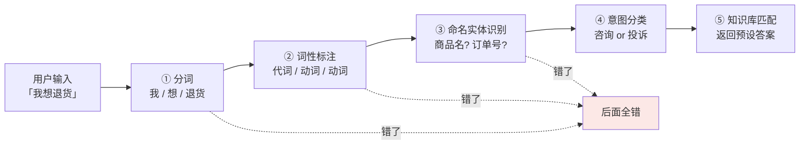
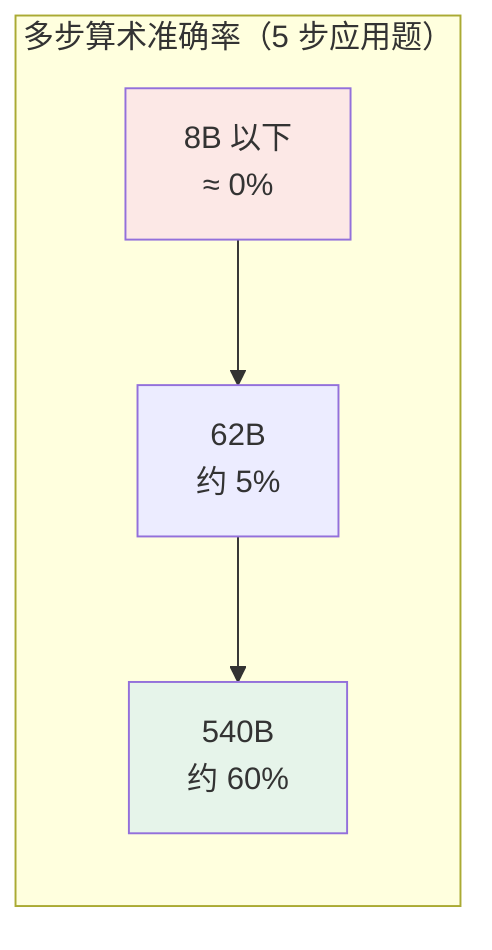

# 第一章：大语言模型与传统 NLP 的本质区别

## 1.1 传统 NLP 是怎么干活的

理解 LLM 厉害在哪，得先看它之前业界怎么处理自然语言任务。

传统 NLP 是**流水线式**的：一个完整任务拆成好几个独立步骤，每步用一个专门的模型。这不是大家想这么干，而是当时小模型能力有限，必须把复杂问题拆成一个个简单子问题，每个子问题单独训一个模型才搞得定。



### 1.1.1 光是分词就一堆坑

中文不像英文有空格天然分隔，「南京市长江大桥」到底是「南京市 / 长江大桥」还是「南京 / 市长 / 江大桥」？

这种歧义靠规则解决不了，必须有专门的分词模型来判断。而分词模型本身依赖大量人工标注语料，遇到训练时没见过的新词就懵了——这就是著名的 **OOV（Out-of-Vocabulary，未登录词）问题**。

### 1.1.2 三个致命问题

| 问题 | 表现 |
|---|---|
| **误差累积传导** | 分词错 → 词性标注错 → 实体识别错 → 意图分类错，且事后无法补救 |
| **标注成本高** | 每一步都要自己的训练数据和标注规范 |
| **迁移成本高** | 换个领域（客服→医疗）几乎所有模型都得重训 |

医疗领域的「实体」（药名、症状、检查项目）和电商领域的「实体」（商品、订单、品牌）完全不是一回事，原来训好的模型用不上。一个公司想做几个不同领域的 NLP 应用，等于要养几套独立的模型团队。

> **整个行业被困在一个死循环里：任务越细分，模型越多；模型越多，标注成本越高；标注越贵，迁移越难。**

## 1.2 BERT 时代：预训练通了一半

2018 年 Google 推出 BERT，出现第一次大转折。核心创新是**预训练 + 微调两阶段范式**。

### 1.2.1 预训练做了什么

在海量**无标注**文本（维基百科 + 图书，约 33 亿词）上做两个任务：

| 任务 | 做什么 |
|---|---|
| **MLM**（Masked Language Model） | 随机遮掉句子里 15% 的词，让模型根据上下文猜被遮的是什么 |
| **NSP**（Next Sentence Prediction） | 给两个句子，判断它们是不是连续的 |

关键在于**这两个任务都不需要人工标注**，纯靠原始文本就能训练，所以能用海量数据。

预训练后 BERT 学到了通用的语言表示能力。下游任务只需接一个小「任务头」，用少量标注数据微调，就能拿到很好效果——这一招把各项 NLP 任务的 SOTA 刷了个遍。

### 1.2.2 但它走到一半就停了

BERT 解决了**「特征通用」**（一个 BERT 服务多个下游任务），但没解决**「任务统一」**（不同任务还是要不同的微调副本）。原因有两个：

**第一，BERT 的输出是「表示」，不是「文本」。**

它每层输出的是每个 token 的向量表示。做分类要接分类头（全连接 + softmax），做命名实体识别要接序列标注头，做问答要接抽取式 QA 头。每种任务都需要单独设计的头、单独标注的数据、单独训练的过程。**一个 BERT 在公司里可能派生出十几个微调副本。**

**第二，BERT 不擅长生成。**

它的预训练目标 MLM 是「填空题」，每次只猜一个被遮的词，**没学过怎么连续生成长文本**。所以 BERT 几乎不用来做翻译、写作、对话。这块得交给另一条路线（GPT-2、T5）。

> BERT 把「理解」做到极致，「生成」是它的短板。它证明了「预训练 + 大规模无标注数据」这条路是对的，但还没把所有任务收归到同一个接口下。

## 1.3 LLM 的本质：把所有任务收编成「预测下一个 token」

### 1.3.1 训练目标简单得出奇

这个目标叫 **CLM（Causal Language Modeling，因果语言模型）**：给一段文本，模型从左到右一个字一个字往后猜。

训练数据是「我喜欢吃苹果」，模型要学会：

```
看到「我」        → 预测「喜」
看到「我喜」      → 预测「欢」
看到「我喜欢」    → 预测「吃」
看到「我喜欢吃」  → 预测「苹」
```

这种方式叫**自回归（Autoregressive）**：下一步的预测依赖上一步的输出。GPT、Claude、Qwen、DeepSeek 这些主流模型，本质都是「自回归 + 因果掩码」的语言模型。

设预测目标是最大化训练语料的对数似然：

$$
\mathcal{L} = -\sum_{t=1}^{T} \log P(x_t \mid x_1, x_2, \ldots, x_{t-1}; \theta)
$$

其中 $x_t$ 是第 $t$ 个 token，$\theta$ 是模型参数。整个训练过程就是让这个损失变小。

### 1.3.2 威力在于「Prompt + 续写」统一了所有任务

| 任务 | Prompt 写法 | 模型续写出 |
|---|---|---|
| 翻译 | `把下面这句翻译成英文：我喜欢你 ->` | `I like you` |
| 分类 | `下面这条评论是正面还是负面？「这家店太黑了」-> 答：` | `负面` |
| 总结 | `请用一句话总结：xxxxxx -> 总结：` | 一句话总结 |
| 写代码 | `写一个返回斐波那契前 N 项的 Python 函数 -> def` | 完整代码 |

**所有任务都被「Prompt + 续写」这个统一接口收编了。** 你不需要为每个任务训不同的模型，只需要在 Prompt 里换个说法。

### 1.3.3 为什么这么简单的目标能学到这么多

关键是**规模 + 数据两个杠杆**。

**数据的杠杆**：CLM 不需要任何人工标注，互联网上所有文本天然都是合格训练数据。

| 模型 | 训练数据量 |
|---|---|
| BERT（2018） | 约 33 亿词 |
| GPT-3（2020） | 约 3000 亿 token |
| Llama 3（2024） | 超过 15 万亿 token |

**模型的杠杆**：参数量从 BERT 的 0.3B 堆到 GPT-3 的 175B，再到后来更大的闭源模型。

> 注意：GPT-4 这类模型的具体参数量官方从未公开，外界只有估计。面试里别把「万亿级」当成确定事实来讲，更稳的说法是「模型规模、数据和算力一起放大后，预测下一个 token 这件事被推向了新境界」。

**深层原因是：要在不同上下文里准确预测，模型就必须学到语法、事实和推理模式。**

- 要预测「北京是中国的____」，模型必须知道「北京是首都」这个事实；
- 要预测「如果 $x=2$，那么 $x^2=$____」，模型必须会算数；
- 要预测一段代码的下一行，模型必须理解编程逻辑。

所有这些能力，都被这个看似简单的目标**逼着**学会了。

### 1.3.4 一个让人惊讶的副产物：In-Context Learning

在 Prompt 里给几个例子，模型就能学会新任务，**不需要更新任何参数**：

```
苹果 -> apple
香蕉 -> banana
草莓 -> strawberry
橘子 ->
```

模型直接输出 `orange`。它从几个例子里推出了「中译英水果名」这个模式，然后应用到新输入上。

这种能力是 GPT-3 之后才被业界发现的，也是 **Prompt Engineering 这门工程学科诞生的基础**。

## 1.4 涌现能力：量变到质变

### 1.4.1 定义与一个重要的 caveat

常见定义是：**某项能力在小模型上几乎看不到，规模到了某个临界点之后突然表现出来。**

但这里要留一个保留意见：有研究认为，一部分「突然出现」可能来自**评测指标的离散性**——比如 exact match 这种非黑即白的指标，会把连续的提升看成突变。换成更细的部分得分指标，曲线可能平滑得多。

> 面试里可以说：「涌现是工程上能观察到的能力跃迁，但学术上对它是不是测量假象还有争议。」这个表述比断言「就是涌现」更稳。

### 1.4.2 三个经典例子



| 能力 | 小模型 | 临界点 | 大模型 |
|---|---|---|---|
| **多步算术** | 8B 以下几乎 0% | 数百 B | 540B 约 60% |
| **In-Context Learning** | GPT-2（1.5B）看不到 | 约 100B | GPT-3（175B）接近专门微调的小模型 |
| **跨语言迁移** | — | — | GPT-3 训练语料 92% 是英文，却能处理中日阿拉伯语甚至冰岛语 |

跨语言这个尤其反直觉：**模型从来没被显式教过「中文怎么说」**，它通过大规模多语言混合语料的预训练，自己学会了不同语言之间的对应关系。

### 1.4.3 为什么会涌现：Scaling Law

业界给出的工程经验叫 **Scaling Law（缩放定律）**：模型规模、训练数据量、训练算力三者存在可预测的关系——按一定比例同时放大，损失值会沿一条幂律曲线下降。

OpenAI 在 2020 年提出这条经验律，DeepMind 后来在 Chinchilla 论文里给出了更精细的比例：**参数和数据大致按 1:20 配**（70B 参数最好配约 1.4T token）。

（这部分在 [第七章](07-scaling-law-emergence.md) 详细展开。）

### 1.4.4 涌现不等于「越大越好」

近几年研究发现，超过某个规模后**单纯堆参数的边际收益在递减**。

现在的趋势是：参数不一定要最大，但数据要够多、算力要够花。**Llama 3 的 8B 模型用 15 万亿 token 训出来，效果反而比早期的 GPT-3 175B 还好**——这就是数据规模超过参数规模带来的回报。

## 1.5 三个本质区别

| 维度 | 传统 NLP | LLM |
|---|---|---|
| **任务方式** | 一任务一模型，pipeline 串联 | 一个模型干所有事，Prompt 统一接口 |
| **输出范式** | 判别式（输出标签 / 概率） | 生成式（输出文本） |
| **能力来源** | 显式监督训练（喂什么学什么） | 大规模预训练 + 涌现（学到没教过的能力） |

这三行分别从**工程层面、范式层面、能力层面**刻画同一个变化的不同侧面。

### 1.5.1 工程层面：从拼装积木到统一系统

| | 传统 NLP | LLM |
|---|---|---|
| 团队结构 | N 个小模型组各管一摊 | 一个大模型组统一服务全公司 |
| 部署成本 | N 个模型同时上线各占资源 | 一个模型挂上线多场景复用 |
| 维护方式 | 每个小模型各自迭代版本 | 所有应用跟着 base model 升级走 |

### 1.5.2 范式层面：从分类器思维到生成器思维

| | 传统 NLP | LLM |
|---|---|---|
| 用户交互 | 在屏幕上点选项 | 打字跟模型聊 |
| 产品思考 | 如何穷举所有用户意图 | 如何写好 Prompt |
| 评估指标 | 准确率 / 召回率 | LLM-as-Judge 评分 / 用户满意度 |

### 1.5.3 能力层面：可以做「人没明确教过」的任务

这是最关键的突破。

过去想让模型多一项能力，**必须为这项能力标注新数据**；现在只需要在 Prompt 里描述新需求，模型就有概率能直接做。

> **模型的能力上限不再被人工标注规模锁死。** 这在 NLP 历史上是前所未有的，也是 LLM 真正颠覆性的地方。

## 1.6 这场转变对工程团队意味着什么

这不是「又出了一个新模型」，而是**整个 NLP 领域的工作方式被重写了**。

| | 过去做一个 NLP 项目 | 现在做一个 LLM 项目 |
|---|---|---|
| 第一件事 | 数据怎么标 | **Prompt 怎么写** |
| 第二件事 | 选哪个 BERT 变体 | **需不需要 RAG 加外部知识** |
| 第三件事 | 微调怎么调超参 | **要不要做 LoRA 微调** |

核心技能也换了一批：

- **过去**：词法分析、句法分析、特征工程、模型调参
- **现在**：Prompt Engineering、RAG 系统设计、Agent 编排、对齐微调

工程的着力点完全变了：**先想 Prompt，再想数据，最后才考虑微调。**

理解了这一点，再看 [RAG](../rag/README.md)、[Agent](../agent/README.md)、Prompt 工程这些话题，会发现它们都不是凭空出现的，而是**「一个模型干所有事 + 生成式 + 涌现」这三个特征延伸出来的工程实践**。底层范式变了，上面的工具链当然也要跟着重写一遍。

## 1.7 常见错误

### 1.7.1 只说「LLM 参数更多、数据更大」

这是量的描述，不是本质。本质是**任务范式的统一**：所有任务被「Prompt + 续写」这一个接口收编，不再一任务一模型。

### 1.7.2 把 BERT 和 LLM 说成同一类

BERT 是判别式的，输出向量表示，需要接任务头、需要为每个任务保留一个微调副本，而且不擅长生成。它只做到了「特征通用」，没做到「任务统一」。

### 1.7.3 断言 GPT-4 的参数量

官方从未公开。说「万亿参数」是把传闻当事实。

### 1.7.4 把涌现说成板上钉钉的现象

要提到学术界对「是不是评测指标离散性造成的假象」有争议。能说出这一点，说明你读过原始文献而不只是二手总结。

### 1.7.5 认为「模型越大越好」

Chinchilla 之后的共识是参数和数据要配比（约 1:20）。Llama 3 的 8B 用 15T token 训出来超过 GPT-3 175B，就是最直接的反例。

### 1.7.6 忽略 In-Context Learning 的意义

它是 Prompt Engineering 存在的前提——**不更新参数就能学会新任务**，这在传统 NLP 里是不可想象的。

## 1.8 本章总结

1. **传统 NLP 是 pipeline**，误差累积传导、标注成本高、迁移几乎要重训，整个行业被困在死循环里；
2. **BERT 用预训练打破了标注瓶颈**，但只做到「特征通用」，没做到「任务统一」，且不擅长生成；
3. **LLM 的本质是把所有任务收编成「预测下一个 token」**，用 Prompt + 续写作为统一接口；
4. **威力来自规模与数据两个杠杆**：CLM 不需标注，互联网文本天然可用，数据量比 BERT 时代翻了几千倍；
5. **要准确预测就必须学会语法、事实和推理**——能力是被这个简单目标逼出来的；
6. **In-Context Learning 是关键副产物**，不更新参数就能学新任务，是 Prompt 工程的基础；
7. **涌现是可观察的能力跃迁**，但学术上对它是否为测量假象仍有争议；
8. **三个本质区别**：任务方式（一模型干所有事）、输出范式（生成式）、能力来源（预训练 + 涌现）；
9. **能力上限不再被标注规模锁死**，这是最具颠覆性的一点。

> **一句话概括：传统 NLP 是「教什么会什么」，LLM 是「让它把互联网读一遍，然后什么都会一点」——变的不是模型大小，而是能力从哪里来。**

## 参考资料

- [Attention Is All You Need](https://arxiv.org/abs/1706.03762)
- [BERT: Pre-training of Deep Bidirectional Transformers for Language Understanding](https://arxiv.org/abs/1810.04805)
- [Language Models are Few-Shot Learners（GPT-3）](https://arxiv.org/abs/2005.14165)
- [Emergent Abilities of Large Language Models](https://arxiv.org/abs/2206.07682)
- [Are Emergent Abilities of Large Language Models a Mirage?](https://arxiv.org/abs/2304.15004)
- [Scaling Laws for Neural Language Models](https://arxiv.org/abs/2001.08361)
- [Training Compute-Optimal Large Language Models（Chinchilla）](https://arxiv.org/abs/2203.15556)
- [The Llama 3 Herd of Models](https://arxiv.org/abs/2407.21783)
