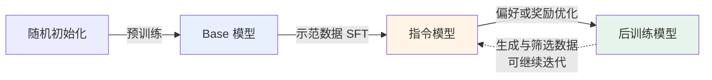
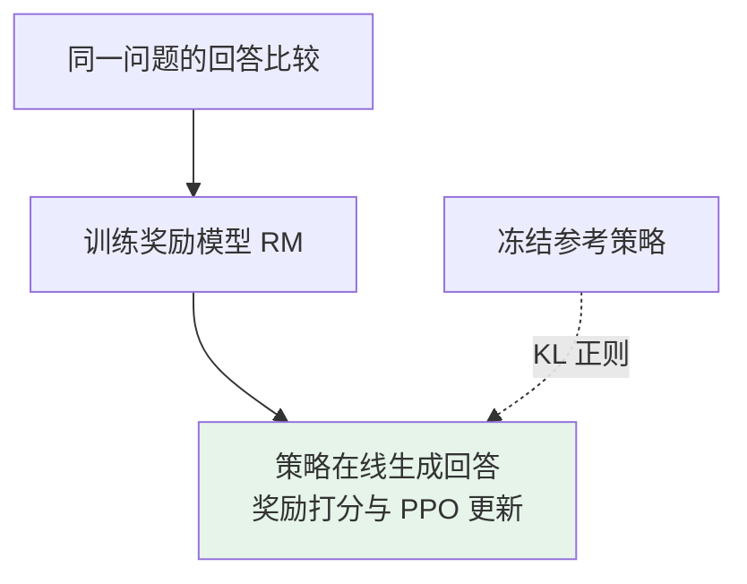

# 第六章：大模型的三阶段训练流程

## 6.1 为什么训练常被分成三个阶段

“预训练 → SFT → 偏好优化”是理解聊天模型的常用框架，**不是每个模型必须依次执行一次的固定流水线**。SFT 本身也属于后训练（post-training），安全行为可以在多个阶段学习；实际系统常把监督学习、采样筛选与强化学习交替执行。

| 阶段 | 主要数据 | 直接优化什么 |
|---|---|---|
| 预训练 | 大规模文本、代码等序列 | 数据分布下的 token 预测损失 |
| SFT（监督微调） | 指令、上下文与示范回答 | 给定上下文时复现示范回答 |
| 偏好或奖励优化 | 比较标签、奖励模型或可验证反馈 | 偏好一致性或任务奖励，通常限制策略偏移 |



这几个名字不是严格的产品类型：`Instruct`、`Chat` 后缀不能反推出模型使用了 PPO 还是 DPO。要查对应版本的技术报告。

## 6.2 第一阶段：预训练

### 6.2.1 数据量与数据处理

以下是原始论文公开的**训练 token 数**，不等于去重后语料的独立 token 数，也不是把整个数据集读了多少遍：

| 模型及口径 | 训练 token 数 | 原始依据 |
|---|---|---|
| GPT-3 | 3000 亿 | 论文 §2.1、§2.2；不同来源按不同权重采样 |
| Llama 2 | 2 万亿 | 论文 §2.1 |
| Llama 3 报告中的 405B 模型 | 15.6 万亿 | 2024 年技术报告 §3；不要混同所有后续版本 |

数据来源可能包括网页、书籍、论文、代码及许可数据，并不意味着“所有公开文本都可以任意抓取和训练”。需要核对来源授权、个人信息、重复内容、质量和语言分布。

数据处理直接影响模型学什么：

- **去重**减少重复网页的权重和记忆风险；精确去重不能代替近似去重。
- **质量过滤与混合采样**在高质量内容和语言、领域覆盖之间取舍；过滤器也会引入偏差。
- **基准污染检查**排查训练数据是否包含测试题及答案，避免把记忆当泛化。
- **数据版本与配比记录**使训练和评估结果可追溯。

清洗确实消耗工程、人力和计算资源，但没有可泛化的依据说它“一定比预训练更贵”。

### 6.2.2 训练目标：预测下一个 token

这里讨论自回归语言模型。对长度为 `T` 的序列，常用平均负对数似然：

$$
\mathcal{L}_{\mathrm{pre}} =
-\frac{1}{T}\sum_{t=1}^{T}
\log \pi_\theta(x_t \mid x_1,\ldots,x_{t-1})
$$

训练时使用真实前缀（teacher forcing），通过 causal mask 防止位置 `t` 看到未来 token；一个前向传播可以并行计算多个位置的损失。推理时则要把模型自己生成的 token 接回上下文。

为了降低预测损失，模型可能学习语法、事实关联、代码结构和某些推理规律，但**低损失不保证事实正确、因果理解或推理可靠**。模型也可能靠表面统计规律、记忆或数据泄漏得分。

### 6.2.3 计算开销怎么估

对常规稠密 Transformer、忽略部分注意力和其他开销时，可用：

$$
C \approx 6ND
$$

其中 `N` 是参数量，`D` 是实际处理的训练 token 数，`C` 的单位是 FLOPs。系数约 6 来自前向与反向计算的粗略核算，不是所有架构、序列长度下都成立的常数。

以 GPT-3 175B 与 300B token 代入，可得约 `3.15 × 10²³ FLOPs`。这只是量级估算，**不是 GPU 年数或美元成本**。墙钟时间还需要有效吞吐、并行效率、通信、故障与重算信息；不能直接把峰值算力当持续训练吞吐。

### 6.2.4 Base 模型能不能回答问题

能。GPT-3 就评估了无梯度更新的 zero-shot / few-shot 任务表现。问题不在于 Base 模型“完全不会回答”，而在于它的目标是续写训练分布中的文本，未必稳定服从当前用户指令、遵守角色边界或在正确位置结束。

例如，问题后面既可能接答案，也可能接另一道题。具体输出取决于上下文、预训练分布和解码设置，不能用一段发散示例证明模型没有问答能力。

## 6.3 第二阶段：SFT

### 6.3.1 从示范中学习条件分布

SFT 数据可以是单轮 `(指令, 回答)`，也可以是包含 system、user、assistant、工具消息的多轮序列：

```text
user: 请解释为什么天空通常呈蓝色。
assistant: 大气分子对较短波长的可见光散射更强……
```

对输入 `x` 与示范回答 `y`，常见的 completion-only 损失为：

$$
\mathcal{L}_{\mathrm{SFT}} =
-\sum_{t=1}^{|y|}
\log \pi_\theta(y_t \mid x,y_1,\ldots,y_{t-1})
$$

仍是自回归交叉熵；改变的是训练分布与 loss mask。Prompt token 通常不作为预测目标，**但仍参与前向计算、作为回答的上下文**。不同实现也可能对全序列或所有 assistant 轮次计损失，应检查实际配置。

### 6.3.2 数据质量不是一个固定条数

Llama 2 论文 §3.1.1 报告收集 **27,540 条 SFT 标注**；模型卡中的“超过一百万条人工标注”指更广的微调数据，不能写成一百万条 SFT 示范。

LIMA 在 65B LLaMA 上使用 **1,000 条精心筛选的示范**，在其评测条件下获得较强的指令跟随表现。这说明好的预训练基座可能用较少数据适配输出行为，**不证明任意任务都只需千条，也不证明小数据总胜过大数据**。

判断数据是否足够，应看验证集学习曲线、任务覆盖、难例和标注一致性，而不是背一个数量门槛。

### 6.3.3 为什么 loss 下降，产品表现却可能退步

- 模型可能更会复现训练集措辞，却没有改善任务成功率。
- 大量同质长回答可能带来长度偏好；错误推理示范会被直接模仿。
- 不一致的 chat template、结束符或工具调用格式，会造成训练与部署分布不一致。
- 单一领域过采样可能损伤其他能力；训练集与验证集相似文本泄漏则会掩盖问题。

因此应同时评估任务指标、格式合法率、事实性、安全拒绝与正常请求误拒绝，而不是只看训练 loss。

## 6.4 第三阶段：偏好与奖励优化

### 6.4.1 SFT 与偏好优化的边界

SFT 可以直接学习高质量回答、拒绝行为和推理过程，并非“只学格式”。但只给一份示范，不会显式说明同一问题下两个候选回答为什么一个更好。

偏好优化补充的是比较或奖励信号。人类偏好也不等于客观正确：标注员可能偏好更长、更自信的错误回答，必须区分帮助性、事实性、安全性等评估维度。

### 6.4.2 经典 PPO-RLHF 流程

RLHF 早于 InstructGPT；2017 年《Deep Reinforcement Learning from Human Preferences》已研究从人类比较学习奖励。InstructGPT 是把这一思路用于指令语言模型的重要案例。



典型实现涉及策略、参考、奖励与价值估计四种角色，不是四个模型都一起训练：策略和价值估计通常更新，参考和已训练奖励模型通常冻结。共享主干、模型大小和分阶段调度会改变实际显存。

主要风险是奖励模型分布外失真、优化不稳定和 reward hacking。KL 正则限制相对参考策略的偏移，能降低过度优化风险，**不能保证不钻奖励漏洞**。

### 6.4.3 DPO 简化了哪一部分

DPO 在 KL 正则化奖励最大化与 Bradley–Terry 偏好模型等假设下，用策略相对参考策略的对数概率比重参数化奖励，直接训练 `(问题, chosen, rejected)` 偏好对。

标准离线 DPO 不需要单独训练奖励模型，也不需要训练循环中的在线生成和价值网络。它优化的是**偏好对的相对 log-ratio 间隔**，不保证每个 chosen 的绝对概率都上升。

这个推导不意味着有限数据下 DPO 与 PPO 的训练轨迹、泛化或最终效果相同。详见 [第十一章](11-dpo-vs-ppo.md)。

## 6.5 三阶段不是能力的硬分区

| 情况 | 应怎样理解 |
|---|---|
| 只有预训练 | 可以提示或 few-shot 使用，但指令稳定性与行为控制需要评测 |
| 预训练 + SFT | 可以形成有用的模型；是否增加偏好优化取决于剩余错误和收益 |
| 从现有基座开始 SFT / RL | 是复用了前人的预训练，不是跳过了知识积累 |
| 不经 SFT 直接 RL | 有公开实验，例如基于 DeepSeek-V3-Base 的 R1-Zero；并非从随机参数训练 |

“预训练定死天花板，后训练只能整理格式”过于绝对。后训练能学习新知识、工具使用和任务策略，也可能造成遗忘；其收益受基座能力、训练信号、探索和计算预算约束。公开结果通常难以把“新学会”与“更可靠地调用已有能力”完全分开。

R1-Zero 与完整 R1 也不是同一路径：后者使用冷启动 SFT、推理 RL、筛选数据后的 SFT 和后续 RL。不要把实验消融当成最终产品流程。

## 6.6 进一步追问

1. **为什么 SFT 后还会幻觉？** 交叉熵奖励复现示范，不自带事实校验；示范、检索上下文和模型知识都可能出错。
2. **偏好优化能代替数据质量吗？** 不能。错误或有偏的奖励会被更强的优化放大。
3. **训练成本如何比较？** 区分预训练 FLOPs、标注、采样、奖励评估和多轮迭代成本；不能只比较反向传播步数。
4. **怎样验证某阶段有用？** 保持基座、测试集、解码预算一致，做 SFT / 偏好优化前后的消融，并检测通用能力回归。

## 6.7 本章总结

三阶段框架区分的是数据与优化信号，不是把知识、格式、价值观切成互不相交的盒子。解释训练流程时，至少说清楚：**从哪个 checkpoint 开始、哪些 token 计损失、反馈来自哪里、哪些参数更新、如何验证收益与退化**。

## 参考资料

- [GPT-3，§2 与 few-shot 评估](https://arxiv.org/html/2005.14165v4)
- [Llama 2，§2.1、§3.1.1 与模型卡](https://arxiv.org/html/2307.09288v2)
- [The Llama 3 Herd of Models，§3、§4](https://arxiv.org/html/2407.21783v3)
- [Chinchilla：训练计算量近似](https://arxiv.org/html/2203.15556v1)
- [InstructGPT](https://arxiv.org/abs/2203.02155)
- [LIMA](https://arxiv.org/abs/2305.11206)
- [Deep Reinforcement Learning from Human Preferences](https://arxiv.org/abs/1706.03741)
- [DPO：奖励重参数化与偏好损失](https://arxiv.org/html/2305.18290v3)
- [DeepSeek-R1，2025 年初版训练流程](https://arxiv.org/html/2501.12948v1)
