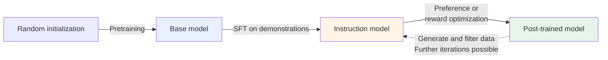
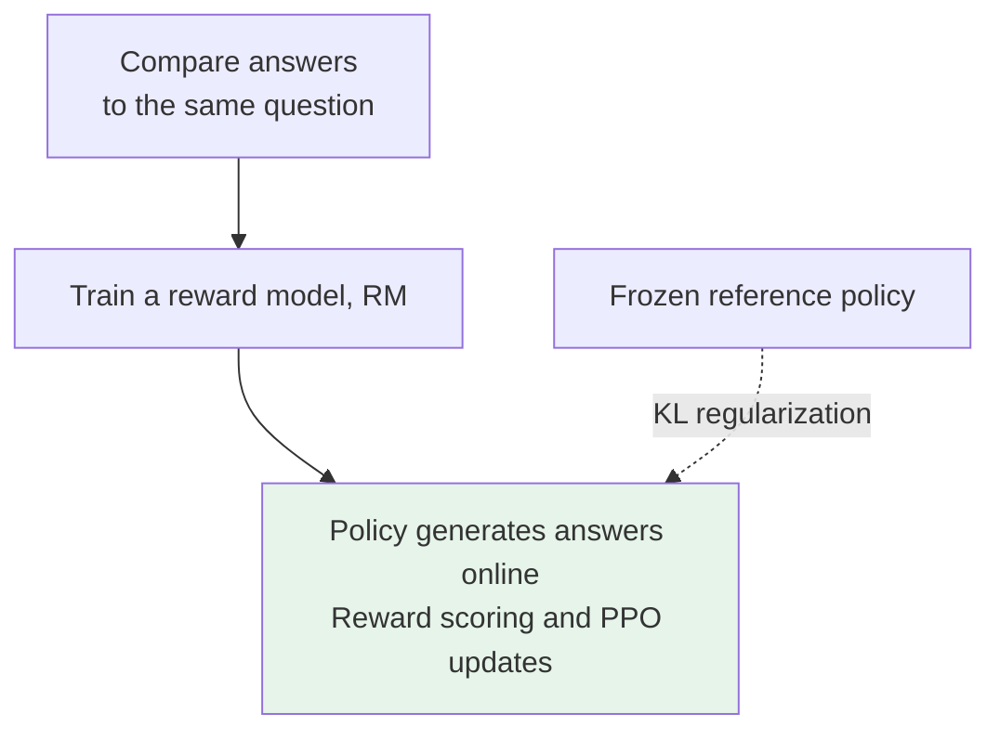

# Chapter 6: The Three-Stage Training Framework for LLMs

## 6.1 Why Training Is Often Divided into Three Stages

“Pretraining → SFT → preference optimization” is a useful framework for understanding chat models, **not a fixed pipeline that every model must run exactly once in that order**. SFT is itself part of post-training, and safety behavior can be learned at several stages. Real systems often alternate supervised learning, sample generation and filtering, and reinforcement learning.

| Stage | Main data | Direct optimization target |
|---|---|---|
| Pretraining | Large-scale sequences of text, code, and other content | Token prediction loss under the data distribution |
| SFT (supervised fine-tuning) | Instructions, context, and demonstration answers | Reproducing the demonstration answer given the context |
| Preference or reward optimization | Comparison labels, reward models, or verifiable feedback | Agreement with preferences or task rewards, usually with constraints on policy drift |



These names are not strict product categories: an `Instruct` or `Chat` suffix does not tell you whether a model used PPO or DPO. Consult the technical report for that version.

## 6.2 What Data and Objective Does Pretraining Use?

The autoregressive base model discussed here learns a distribution over the next token from large-scale text and code sequences. The data determines what it encounters; the prediction objective determines how gradients arise. Together, they shape the capabilities available downstream.

### 6.2.1 Data Volume and Processing

The following figures are **training token counts** disclosed in the original papers. They are neither counts of unique tokens in a deduplicated corpus nor the number of passes over an entire dataset:

| Model and scope | Training tokens | Original source |
|---|---|---|
| GPT-3 | 300 billion | Paper §§2.1–2.2; sources are sampled with different weights |
| Llama 2 | 2 trillion | Paper §2.1 |
| The 405B model in the Llama 3 report | 15.6 trillion | 2024 technical report §3; do not conflate this with every later version |

Sources may include web pages, books, papers, code, and licensed data. This does not mean that all publicly accessible text may be scraped and used for training without restriction. Source permissions, personal information, duplication, quality, and language distribution all need review.

Data processing directly affects what the model learns:

- **Deduplication** reduces the weight of repeated pages and the risk of memorization. Exact deduplication does not replace near-duplicate detection.
- **Quality filtering and mixture sampling** trade off high-quality content against language and domain coverage. Filters can introduce biases of their own.
- **Benchmark contamination checks** look for test questions and answers in training data, so memorization is not mistaken for generalization.
- **Data version and mixture records** make training and evaluation results traceable.

Cleaning consumes engineering effort, human labor, and compute, but there is no general basis for claiming that it must cost more than pretraining.

### 6.2.2 The Training Objective: Predicting the Next Token

For the autoregressive language model considered here, a common objective for a sequence of length `T` is the mean negative log-likelihood:

$$
\mathcal{L}_{\mathrm{pre}} =
-\frac{1}{T}\sum_{t=1}^{T}
\log \pi_\theta(x_t \mid x_1,\ldots,x_{t-1})
$$

Training uses the ground-truth prefix, or *teacher forcing*. A causal mask prevents position `t` from seeing future tokens, while one forward pass can compute the losses at multiple positions in parallel. At inference time, the model instead feeds its own generated tokens back into the context.

Reducing prediction loss may lead the model to learn grammar, factual associations, code structure, and some reasoning patterns. However, **low loss does not guarantee factuality, causal understanding, or reliable reasoning**. Surface statistics, memorization, or data leakage can also improve scores.

### 6.2.3 Estimating Compute

For a conventional dense Transformer, ignoring some attention costs and other overhead, a rough estimate is:

$$
C \approx 6ND
$$

Here, `N` is the parameter count, `D` is the number of training tokens actually processed, and `C` is measured in FLOPs. The coefficient of approximately 6 comes from rough forward- and backward-pass accounting; it is not a constant valid for every architecture and sequence length.

Substituting GPT-3's 175B parameters and 300B tokens gives approximately `3.15 × 10²³ FLOPs`. This is an order-of-magnitude estimate, **not a number of GPU-years or a dollar cost**. Wall-clock time also depends on effective throughput, parallel efficiency, communication, failures, and recomputation. Peak hardware compute cannot simply be treated as sustained training throughput.

### 6.2.4 Can a Base Model Answer Questions?

Yes. GPT-3 evaluated zero-shot and few-shot task performance without gradient updates. The issue is not that a base model cannot answer questions at all. Its objective is to continue text from the training distribution, so it may not reliably follow the current user's instructions, respect role boundaries, or stop at the right point.

For example, a question might be followed by an answer—or by another question. The output depends on context, the pretraining distribution, and decoding settings. One example of an unfocused continuation cannot establish that a model has no question-answering ability.

## 6.3 If SFT Uses a Similar Loss, Why Does Behavior Change?

SFT can still use autoregressive cross-entropy, but concentrates training examples on instructions and demonstration answers while selecting which positions contribute to the loss. This makes the model more likely to produce the demonstrated behavior after an instruction, rather than continue arbitrary raw text.

### 6.3.1 Learning a Conditional Distribution from Demonstrations

SFT data may contain single-turn `(instruction, answer)` pairs or multiturn sequences with system, user, assistant, and tool messages. This Chinese example asks why the sky is usually blue; the demonstration explains that atmospheric molecules scatter shorter wavelengths of visible light more strongly:

```text
user: 请解释为什么天空通常呈蓝色。
assistant: 大气分子对较短波长的可见光散射更强……
```

For input `x` and demonstration answer `y`, a common completion-only loss is:

$$
\mathcal{L}_{\mathrm{SFT}} =
-\sum_{t=1}^{|y|}
\log \pi_\theta(y_t \mid x,y_1,\ldots,y_{t-1})
$$

This is still autoregressive cross-entropy; the training distribution and loss mask have changed. Prompt tokens are usually not prediction targets, **but still participate in the forward pass as context for the answer**. Other implementations may compute loss over the full sequence or every assistant turn. Check the actual configuration.

### 6.3.2 Data Quality Is Not a Fixed Example Count

Llama 2 §3.1.1 reports collecting **27,540 SFT annotations**. The model card's “over one million human annotations” refers to a broader set of fine-tuning data, not one million SFT demonstrations.

LIMA used **1,000 carefully curated demonstrations** with a 65B LLaMA model and achieved strong instruction-following performance under its evaluation conditions. This suggests that a well-pretrained base may need relatively little data to adapt its output behavior. It **does not establish that a thousand examples suffice for every task, or that small datasets always beat large ones**.

Judge data sufficiency through validation learning curves, task coverage, difficult examples, and annotation consistency—not a memorized count threshold.

### 6.3.3 Why Can Product Performance Decline While Loss Falls?

- The model may get better at reproducing training-set phrasing without improving task success.
- Large volumes of similar long answers can induce a length preference; incorrect reasoning demonstrations can be copied directly.
- Inconsistent chat templates, end markers, or tool-call formats can create a mismatch between training and deployment distributions.
- Oversampling one domain can damage other capabilities, while near-duplicate leakage between training and validation data can conceal the problem.

Evaluate task metrics, output-format validity, factuality, appropriate safety refusals, and false refusals of legitimate requests alongside training loss.

## 6.4 Why Add Preference and Reward Signals When We Already Have Demonstrations?

Demonstrations show the model one way to answer. Comparisons and rewards can distinguish better candidates among the answers it generates itself. Whether this stage is needed depends on whether feedback can identify the remaining errors—not on an assumption that more training stages are always better.

### 6.4.1 The Boundary Between SFT and Preference Optimization

SFT can directly teach high-quality answers, refusal behavior, and reasoning processes; it is not limited to learning formats. A single demonstration, however, does not explicitly compare why one of two candidate answers to the same question is preferable.

Preference optimization adds comparison or reward signals. Human preference is not the same as objective correctness: annotators may prefer a longer, more confident answer that is wrong. Helpfulness, factuality, and safety therefore need distinct evaluation criteria.

### 6.4.2 The Classic PPO-RLHF Workflow

RLHF predates InstructGPT. *Deep Reinforcement Learning from Human Preferences* studied learning rewards from human comparisons in 2017. InstructGPT is an important application of that idea to instruction-following language models.



A typical implementation has four roles: policy, reference, reward, and value estimation. This does not mean four models train together. The policy and value estimator usually update; the reference and previously trained reward model usually remain frozen. Shared backbones, model sizes, and scheduling across stages change actual GPU memory requirements.

Major risks include out-of-distribution reward-model errors, optimization instability, and reward hacking. KL regularization limits drift from the reference policy and can reduce overoptimization, but **does not guarantee that the policy cannot exploit reward flaws**.

### 6.4.3 What Does DPO Simplify?

Under assumptions including KL-regularized reward maximization and a Bradley–Terry preference model, DPO reparameterizes rewards using the policy's log probability ratio relative to a reference policy. It trains directly on `(question, chosen, rejected)` preference pairs.

Standard offline DPO does not require a separately trained reward model, online generation within the training loop, or a value network. It optimizes the **relative log-ratio margin between the preferred and rejected answers**, not a guarantee that every chosen answer increases in absolute probability.

The derivation does not imply that DPO and PPO have identical training trajectories, generalization, or final performance with finite data. See [Chapter 11](11-dpo-vs-ppo.md).

## 6.5 The Three Stages Do Not Partition Capabilities

| Situation | How to interpret it |
|---|---|
| Pretraining alone | Prompting or few-shot use is possible, but instruction reliability and behavioral control need evaluation |
| Pretraining + SFT | Can produce a useful model; preference optimization depends on remaining errors and expected gains |
| Starting SFT / RL from an existing base | Reuses someone else's pretraining rather than skipping knowledge acquisition |
| RL without preceding SFT | Public experiments exist, such as R1-Zero based on DeepSeek-V3-Base; this is not training from random parameters |

“Pretraining fixes the ceiling; post-training only tidies up the format” is too absolute. Post-training can teach new knowledge, tool use, and task strategies, and can also cause forgetting. Its gains depend on base-model capabilities, training signals, exploration, and compute budgets. Public results often cannot fully separate learning something new from using an existing capability more reliably.

R1-Zero and full R1 also follow different paths. The latter uses cold-start SFT, reasoning-oriented RL, SFT on filtered data, and subsequent RL. Do not mistake an ablation experiment for the final product's workflow.

## 6.6 Further Questions

1. **Why do hallucinations remain after SFT?** Cross-entropy rewards reproducing demonstrations; it contains no built-in fact checker. Demonstrations, retrieved context, and model knowledge can all be wrong.
2. **Can preference optimization replace data quality?** No. Stronger optimization can amplify incorrect or biased rewards.
3. **How should training costs be compared?** Separate pretraining FLOPs, annotation, sampling, reward evaluation, and repeated iterations; counting backward-pass steps alone is insufficient.
4. **How do you establish that a stage helps?** Hold the base model, test set, and decoding budget constant, run before-and-after ablations for SFT and preference optimization, and check for regressions in general capabilities.

## 6.7 Chapter Summary

The three-stage framework distinguishes data and optimization signals; it does not put knowledge, format, and values into disjoint boxes. When explaining a training workflow, identify at least **the starting checkpoint, the tokens included in the loss, the feedback source, the parameters being updated, and how gains and regressions are measured**.

## References

- [GPT-3, §2 and few-shot evaluations](https://arxiv.org/html/2005.14165v4)
- [Llama 2, §§2.1 and 3.1.1, and the model card](https://arxiv.org/html/2307.09288v2)
- [The Llama 3 Herd of Models, §§3–4](https://arxiv.org/html/2407.21783v3)
- [Chinchilla: the training-compute approximation](https://arxiv.org/html/2203.15556v1)
- [InstructGPT](https://arxiv.org/abs/2203.02155)
- [LIMA](https://arxiv.org/abs/2305.11206)
- [Deep Reinforcement Learning from Human Preferences](https://arxiv.org/abs/1706.03741)
- [DPO: reward reparameterization and preference loss](https://arxiv.org/html/2305.18290v3)
- [DeepSeek-R1: the training workflow in the initial 2025 report](https://arxiv.org/html/2501.12948v1)
