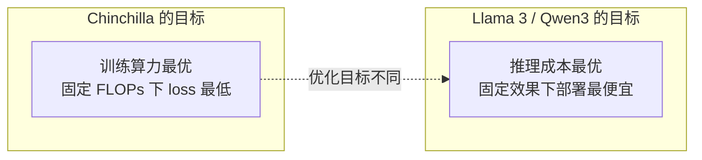
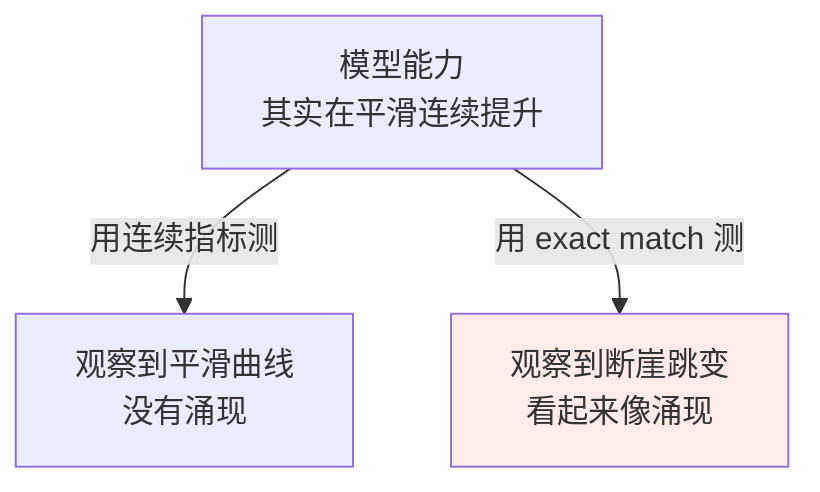

# 第七章：Scaling Law 与涌现能力

## 7.1 Scaling Law 是什么，为什么它震撼了业界

要理解 Scaling Law 的重要性，得先回到 2018–2020 年那个语境。

那时候深度学习圈子里对「模型加大有没有用」是有分歧的。一派觉得「模型再大也有上限，参数加多了就饱和」，另一派觉得「先加大试试再说」。**但谁都没有量化证据，全凭经验和直觉。**

### 7.1.1 Kaplan 2020 的发现

OpenAI 的 Kaplan 等人系统训练了一系列从几万到几十亿参数的语言模型，发现损失值随**模型参数 $N$、训练数据量 $D$、训练算力 $C$** 按幂律下降：

$$
L(N) \approx \left(\frac{N_c}{N}\right)^{\alpha_N}
$$

直观理解：**模型规模翻倍，损失按一个固定比例下降，而且这个比例可以提前算出来。**

### 7.1.2 震撼业界的三个点

| 关键点 | 意义 |
|---|---|
| **可预测** | 不是「试试看运气」，而是「我有 X 算力，算一下最终能到什么 loss」。**这给了大公司投资大模型的底气**，因为投入产出比可预测 |
| **没看到饱和点** | 论文把规模加到当时能训的极限，loss 还在按幂律下降。传递的信号是：继续加大就还能继续提升 |
| **三个变量可独立分析** | 可以分别问「加倍参数 / 数据 / 算力各能降多少 loss」，为后来 Chinchilla 把三者联立打下基础 |

### 7.1.3 但它没回答一个关键问题

**参数和数据应该按什么比例配？**

当时业界的普遍做法是「能加多少参数加多少，数据用差不多就行」。结果训出了一批**严重欠训**的大模型，最典型的就是 GPT-3。

## 7.2 Chinchilla 2022：参数和数据要 1:20

DeepMind 在《Training Compute-Optimal Large Language Models》里做了一个相当壕的实验：**训了 400 个不同规模的 Transformer**，参数从 70M 到 16B，数据从 5B 到 500B token，全部跑完拟合损失曲面。

### 7.2.1 结论

给定固定训练算力 $C$，**参数和数据按接近 1:20 的比例配，最终损失更低**——经验上大约「每个参数配 20 个 token」。

> 这个 1:20 **不是自然常数**，而是 Chinchilla 实验条件下拟合出的 compute-optimal 经验点。但它把业界从「只堆参数」拉回了「参数和数据要均衡」。

### 7.2.2 对照实验

| 模型 | 参数 | 数据 | 训练算力 | 最终效果 |
|---|---|---|---|---|
| Gopher（DeepMind 旧版） | 280B | 300B token | X | 基线 |
| GPT-3 | 175B | 300B token | 0.7X | 比 Gopher 略弱 |
| **Chinchilla（按 1:20）** | **70B** | **1.4T token** | X | **明显超过前两者** |

训练算力量级相同，**参数砍到 1/4、数据加到 4.7 倍**，结果反超了 4 倍参数的 Gopher。

### 7.2.3 大家都严重欠训

```
GPT-3:      175B 参数 / 300B tokens  =  1 : 1.7
Chinchilla 最优比例:                    1 : 20
GPT-3 的数据缺口:                       约 12 倍
```

GPT-3 应该配 3.5T token 才是 compute-optimal，实际只用了 300B，**差了一个数量级**。

### 7.2.4 行业被改变了

2022 年之后训的主流模型配比都比之前激进得多：

| 模型 | 参数 : 数据 |
|---|---|
| LLaMA 1 7B | 1 : 140 |
| Llama 2 7B | 1 : 285 |

**都远超 Chinchilla 推荐的 1:20**——越来越多模型主动「过量」喂数据。

## 7.3 Llama 3 时代：Chinchilla 不是数据上限

2024 年 Meta 训 Llama 3 时做了一件激进的事：

```
Llama 3 8B:  8B 参数 / 15T tokens  =  1 : 1875
Chinchilla 推荐:                       1 : 20
                                       ↑ 94 倍
```

按当时常识，早就该过拟合或收益递减了。**但 Meta 实测发现，数据从 1T 推到 15T 的过程中 loss 一直在稳定下降。**

最终 Llama 3 8B 在多项基准上超过了 GPT-3 175B——**一个 8B 小模型打赢了 22 倍参数的大模型**。

### 7.3.1 重新理解 Chinchilla

Chinchilla 的 1:20 **不是「数据上限」**，而是「**给定训练算力时，参数和数据怎么分配更划算**」的经验答案。

如果你愿意投入更多训练计算、继续喂更多高质量 token，loss 仍然可能下降，只是边际收益变小。

两句话不矛盾，只是**在优化不同目标**：



Qwen3-0.6B 把这个趋势推到更极端：**36T token 训一个 0.6B 模型，比例 1:60000**。

### 7.3.2 为什么会出现这个趋势

两个很现实的工程原因：

| 原因 | 说明 |
|---|---|
| **推理成本与参数强相关** | 8B 模型一张消费级 GPU 就够，175B 要好几台 H100，成本天差地别。如果 8B + 大数据能达到同等效果，何乐不为 |
| **数据相对便宜** | 算力是真金白银的硬件投入（一张 H100 三万美元，集群上千万），数据虽然也要花钱清洗，但相比 GPU 集群仍便宜得多 |

在算力受限的环境下，把算力多花在「跑过更多数据」而不是「跑过更多参数」更划算。

## 7.4 涌现能力：量变到质变的临界点

Scaling Law 有一个让所有人都没想到的副产物。

**涌现的精确定义**：某项能力在小模型上完全看不到，规模超过某个临界点之后突然出现。**不是平滑上升，而是「先趴在地上、到某个点垂直冲天」的折线。**

### 7.4.1 三类典型涌现能力

**① 多步算术推理**

Google PaLM 论文里测试 5 步算术应用题：

```
8B   →  约 0%
62B  →  约 5%
540B →  约 60%
```

**中间没有任何渐进过程**，从「完全不会」直接到「会一大半」。

**② In-Context Learning**

不更新任何参数，只在 prompt 里给几个示例，模型就能学会新任务。小模型给示例也没用，规模够大之后这个能力才稳定出现。

**③ 跨语言泛化**

GPT-3 训练数据 92% 是英文，训完之后却能直接处理中文、阿拉伯语甚至冰岛语。**模型从没被显式教过「中文怎么说」**，它通过大规模混合语料自己学会了语言间的对应关系。这种能力也是规模到 100B 左右才稳定出现。

### 7.4.2 临界规模

通常出现在 **50B–100B** 这个区间。这个区间的物理意义业界还没有定论。一个流行的解释是：模型大到一定程度，注意力头数、隐藏维度等达到了「能编码复杂推理结构」的最低门槛。

## 7.5 Mirage 挑战：涌现可能是测量假象

正当涌现被广泛接受时，2023 年斯坦福的《Are Emergent Abilities of Large Language Models a Mirage?》炸了锅。

### 7.5.1 论点

作者观察到：**很多「涌现」能力只在某些评估指标下才出现，换个指标就消失了。**

以多步算术为例，常规指标是 **exact match**（最终答案完全正确）：

| 指标 | 特性 | 观察到的曲线 |
|---|---|---|
| **Exact Match** | 离散二元，答错任何一步就是 0 分 | 小模型一直 0 分，大模型突然跳到 60%——**看起来像涌现** |
| **部分正确率** | 连续，答对前 4 步算 0.8 分 | **同样的实验数据，曲线变成平滑的对数曲线，没有任何突变** |

**核心论点**：「涌现」可能不是模型本身的非线性特性，而是**评估指标的不连续性放大了一个本来连续的能力提升过程**。



### 7.5.2 目前的中立结论

后续也有论文反驳，认为某些涌现现象在多种连续指标下都能观察到。争议还在继续，中立的说法是：

1. **能力跃迁客观存在**：从工程效果看，规模到 100B 之后确实能做小模型完全做不了的事；
2. **但「涌现」被过度神化了**：很多所谓突变是连续提升 + 指标放大效应；
3. **不存在「魔法的涌现规模」**：不同任务的临界点不同，没有统一的「100B 之后必然涌现」。

> 面试里能指出 Mirage 论文的存在、并把双方观点都讲清楚，会显得你真的看过论文而不是在背技术博客。

## 7.6 对工程选型的四个启发

### 7.6.1 不是越大越好，要看训练是否充分

至少不能出现「参数很大但数据很少」的欠训状态。1:20 可作为理解标尺但不是硬指标。选型时该问的是：

- 这个模型训练充分吗？
- 数据质量怎么样？
- 它是为**训练算力最优**设计，还是为**推理成本最优**设计？

### 7.6.2 数据规模可能比参数规模更值得加

有限算力 X 之下，与其训 7B + 100B token，不如训 3B + 250B token。同样开销效果通常更好，**推理还便宜**。Llama 3 和 Qwen3 都验证了这个直觉。

### 7.6.3 推理成本与参数规模强相关

效果差不多的前提下，「小参数 + 海量数据」在推理成本上有天然优势。这是 2024 年之后开源社区疯狂做「小模型大数据」的根本原因。

### 7.6.4 涌现能力决定模型规模下限

| 任务类型 | 最低规模 |
|---|---|
| 多步推理、ICL、跨语言迁移等依赖涌现的能力 | 30B–70B 量级起步 |
| 简单分类、抽取、摘要 | 7B–13B 完全够用，**没必要硬上大模型** |

## 7.7 Scaling Law 的天花板

虽然还没看到饱和点，但业界已经开始担心两个潜在天花板。

### 7.7.1 数据墙（Data Wall）

互联网上高质量公开文本的总量是有限的，估计在 10T–50T token 量级。Llama 3 已经用了 15T，Qwen3 用了 36T——**再过几年就会把人类历史上所有公开文本用完**。

三个应对方向：

| 方向 | 说明 |
|---|---|
| **合成数据** | 用强模型生成训练数据训弱模型（DeepSeek-Math、Qwen2.5-Math 大量使用） |
| **多模态数据** | 扩展到图像、视频、音频，把人类所有形式的信号纳入训练 |
| **强化学习数据** | 用环境交互生成数据（DeepSeek-R1 的 RL 训练属于这一类） |

### 7.7.2 算力墙

摩尔定律接近物理极限，GPU 算力增长在放缓。能买得起 10 万张 H100 的玩家就那么几个，**进一步堆参数的边际成本越来越高**。

这也是「测试时计算」（test-time compute）这条新曲线受关注的原因——不再只在训练时加规模，而是在推理时用更多计算换效果，这正是 o1、DeepSeek-R1 这类推理模型的思路。

## 7.8 常见错误

### 7.8.1 只会说「模型越大越好」

Scaling Law 的核心是**幂律关系和可预测性**，不是「大就好」。而且 Chinchilla 已经证明参数和数据不匹配会严重欠训。

### 7.8.2 把 1:20 当成硬性规则

它是 Chinchilla 实验条件下的 compute-optimal 经验点。Llama 3 的 1:1875 和 Qwen3 的 1:60000 都远超它，且效果更好。

### 7.8.3 认为 Llama 3 推翻了 Chinchilla

**没有推翻，是优化目标不同**。Chinchilla 优化训练算力最优，Llama 3 优化推理成本最优。这是这道题最能体现理解深度的一句话。

### 7.8.4 把涌现讲成神秘魔法

必须提 Mirage 论文：很多「突变」是 exact match 这类离散指标造成的测量假象。

### 7.8.5 认为存在统一的「涌现规模」

不同任务临界点不同，没有「过了 100B 就必然涌现」这回事。

### 7.8.6 选型时无视任务是否依赖涌现

简单分类抽取用 7B 就够，硬上 70B 是浪费。反过来多步推理任务上 7B 会直接做不了，不是调 prompt 能救的。

### 7.8.7 说不出 Scaling Law 的天花板

数据墙 + 算力墙，以及合成数据、多模态、RL 这三个应对方向。能聊到这层说明在思考未来趋势。

## 7.9 本章总结

1. **Scaling Law 讲的是 loss 与 $N$、$D$、$C$ 的幂律关系**，OpenAI 2020 年提出；
2. **它震撼业界的是「可预测」**——投入产出比能提前算出来，这是后来所有烧钱投入的理论基础；
3. **Kaplan 版没回答参数与数据的配比**，导致 GPT-3 这批模型严重欠训；
4. **Chinchilla 训 400 个模型得出 1:20**，用 70B + 1.4T 反超 280B 的 Gopher；
5. **1:20 是 compute-optimal 经验点，不是自然常数**；
6. **Llama 3 用 1:1875 训出 8B 打赢 175B**，说明 Chinchilla 不是数据上限；
7. **两者不矛盾**：一个优化训练算力最优，一个优化推理成本最优；
8. **涌现是能力在临界规模突然出现**，典型三类：多步算术、ICL、跨语言泛化，临界区间 50B–100B；
9. **Mirage 论文挑战涌现**：换成连续指标曲线就平滑了，可能是指标不连续放大的假象；
10. **选型启发**：看训练是否充分、数据比参数更值得加、推理成本与参数强相关、依赖涌现的任务有规模下限；
11. **两个天花板**：数据墙与算力墙，应对方向是合成数据、多模态、强化学习与测试时计算。

> **一句话概括：Scaling Law 把「加大模型」从赌博变成了可计算的工程决策，而 Chinchilla 到 Llama 3 的演进说明——真正的问题从来不是「多大」，而是「你在优化训练成本还是推理成本」。**

## 参考资料

- [Scaling Laws for Neural Language Models](https://arxiv.org/abs/2001.08361)
- [Training Compute-Optimal Large Language Models（Chinchilla）](https://arxiv.org/abs/2203.15556)
- [Emergent Abilities of Large Language Models](https://arxiv.org/abs/2206.07682)
- [Are Emergent Abilities of Large Language Models a Mirage?](https://arxiv.org/abs/2304.15004)
- [PaLM: Scaling Language Modeling with Pathways](https://arxiv.org/abs/2204.02311)
- [The Llama 3 Herd of Models](https://arxiv.org/abs/2407.21783)
- [LLaMA: Open and Efficient Foundation Language Models](https://arxiv.org/abs/2302.13971)
- [Qwen3 Technical Report](https://arxiv.org/abs/2505.09388)
- [DeepSeek-R1: Incentivizing Reasoning Capability in LLMs via Reinforcement Learning](https://arxiv.org/abs/2501.12948)
