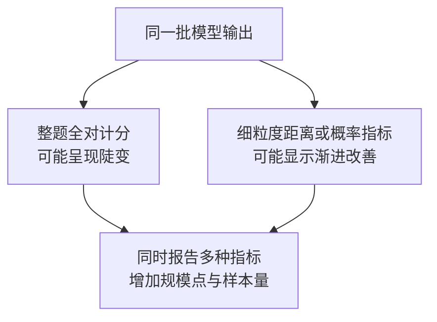

# 第七章：Scaling Law 与涌现能力

## 7.1 Scaling Law 预测的是什么

语言模型的 scaling law 描述在一定架构、数据分布和训练设定下，**损失如何随参数、数据或计算量变化**。它是经验规律，不是模型越大就必然更聪明的定理，更不能直接预测产品收入。

### 7.1.1 Kaplan 2020 的发现

Kaplan 等人系统研究了自回归语言模型交叉熵与参数量 `N`、数据量 `D`、计算量 `C` 的关系。其他瓶颈足够宽松时，参数方向可以近似写成：

$$
L(N) \approx \left(\frac{N_c}{N}\right)^{\alpha_N}
$$

`N_c` 和指数来自拟合，不是自然常数。这里是论文的简化关系；不能忽略数据不足或训练不充分，直接套用到任意模型。

如果考虑损失下限，更直观的形式是：

$$
L(N) = L_\infty + aN^{-\alpha}
$$

翻倍参数时按固定比例缩小的是 `L − L∞` 这一项，**不是每次都减掉固定 loss，也不是准确率固定增加若干百分点**。

### 7.1.2 它的工程价值与限制

| 可以做什么 | 不能直接推出什么 |
|---|---|
| 用小规模实验预测较大训练的 loss 趋势 | 某业务任务准确率会同步提高多少 |
| 对比预算下的模型、数据配比 | 数据分布改变后仍沿用同一组系数 |
| 检查实际训练是否偏离预期曲线 | 越过已测规模后永远不饱和 |

Kaplan 之前已有神经网络 scaling 的实证研究，不能说“此前没有量化证据”。这篇工作的重点是语言模型上的系统拟合与计算预算分配。

### 7.1.3 Kaplan 已经回答过参数与数据配比

原文并非只讨论“加大参数有没有用”。其计算最优分析倾向于更大的模型、相对较少的数据，并在收敛前停止训练。Chinchilla 后来重新估计了这个配比，而不是首次提出配比问题。

## 7.2 Chinchilla：固定训练预算如何分配

Hoffmann 等人训练了 **400 多个**语言模型，参数从 70M 到超过 16B，训练数据从 5B 到 500B token，并用不同拟合方法交叉检验。

### 7.2.1 核心不是固定比例，而是共同增长

对常规稠密 Transformer，先采用粗略计算约束：

$$
C \approx 6ND
$$

再用参数化损失模型：

$$
L(N,D) \approx E+\frac{A}{N^\alpha}+\frac{B}{D^\beta}
$$

把 `D = C/(6N)` 代入并求最小值，可得到：

$$
N_{\mathrm{opt}} \propto C^{\frac{\beta}{\alpha+\beta}},
\qquad
D_{\mathrm{opt}} \propto C^{\frac{\alpha}{\alpha+\beta}}
$$

解释是：参数太小会受到容量限制；参数太大则在同一预算下读不到足够数据。最优点需要平衡两项，而不是只把一种资源用满。

Chinchilla 的多种拟合都支持 `N` 与 `D` 随预算**近似等比例增长**。论文对比中，Kaplan 的指数约为 `0.73 / 0.27`；Chinchilla 一种拟合为 `0.50 / 0.50`，另一些拟合并不恰好各为一半。

### 7.2.2 1:20 是怎样来的

| 模型 | 参数量 | 训练 token 数 | 对比口径 |
|---|---|---|---|
| Gopher | 280B | 300B | Chinchilla 的主要训练预算对照 |
| Chinchilla | 70B | 1.4T | 与 Gopher 使用大致相同训练预算 |

Chinchilla 的 `D/N = 20`，在论文的大量下游评估中超过 Gopher，说明相近预算可以通过更小模型、更多数据得到更好的结果。

**“每个参数约 20 个 token”是这一设置的经验标尺，不是永远成立的最优比例。** 数据质量、去重与重复采样、tokenizer、架构、训练 schedule 和目标都可能改变拟合。

### 7.2.3 为什么不能说 GPT-3 “固定缺 12 倍数据”

GPT-3 175B 训练了 300B token，`D/N` 约为 1.7。按 `20N` 算 3.5T token 只是一个比例外推，**固定参数再加约 12 倍 token，也把训练计算加了约 12 倍**，不再是原预算下的最优解。

在固定预算问题里，应该重新选择更小的 `N` 与更大的 `D`；在固定模型问题里，才是在问继续训练的边际收益。两种问题不能混在一起。

## 7.3 为什么小模型可以训练远超 20N 的数据

### 7.3.1 训练最优与全生命周期成本不同

如果模型会处理大量请求，多花一些一次性的训练计算，换成更小且够用的模型，可能降低总成本：

$$
C_{\mathrm{total}} =
C_{\mathrm{train}} + QC_{\mathrm{serve}}
$$

`Q` 表示同一服务口径下的请求量，`Cserve` 是单次请求成本。两项必须采用同一单位：若都用 FLOPs，比较的是总计算量；若要计入显存、运维等经济成本，则应统一折算为货币成本，不能把 FLOPs 与费用相加。实际还需要纳入输入输出长度、吞吐和延迟，不能只比参数量。

### 7.3.2 Llama 3 与 Qwen3 的案例边界

Llama 3 技术报告明确区分：**405B 旗舰模型在其训练预算下接近 compute-optimal，小模型则训练得远超其训练计算最优点**。因此，不能把整个 Llama 3 系列都概括成“只追求推理最优”。

Qwen3 初版技术报告描述约 36T token 的预训练数据及分阶段训练，也介绍了小模型的 strong-to-weak distillation。它说明数据、训练策略和后训练共同影响效果，不宜把某个小型号的能力全部归因于一个 `token / 参数` 比例。

**超过 Chinchilla 配比不自动等于过拟合。** 增加新而有用的数据与反复记忆同一批数据不同；收益递减也不意味着收益已经为零。是否过拟合应观察同分布与目标分布验证损失，而不是检查比例是否超过 20。

### 7.3.3 更小不总是更便宜

- 稠密模型参数量影响权重显存和矩阵计算，但长上下文 KV cache、带宽和批量大小同样重要。
- MoE 的总参数量与每 token 激活参数量不同，不能按总参数直接比较 FLOPs。
- 小模型若需要更多采样、更长思维链或频繁调用大模型兜底，端到端成本优势可能缩小。
- 数据清洗、授权和合成也有成本；“数据总比算力便宜”没有通用依据。

## 7.4 涌现能力：观察定义不等于物理阈值

Wei 等人把“小规模模型中不显现、较大模型中出现，且难以由小模型表现简单外推”的能力称为涌现。论文讨论了部分算术、少样本任务和提示策略随规模变化的表现。

但观察对象是**任务、模型族、提示和评估指标共同决定的曲线**，不是一条只由参数量决定的能力开关。

### 7.4.1 三类容易过度解读的例子

| 现象 | 需要补上的条件 |
|---|---|
| 多步算术 exact match 突然改善 | 样本是否充足？是否使用 CoT？是否只有几个稀疏规模点？ |
| Few-shot / ICL 随规模变强 | 小模型也可能利用示例；不是所有任务都在同一规模出现 |
| 跨语言任务表现提升 | 训练中是否已有目标语言、平行文本或代码？不能写成“从未接触该语言” |

ICL 是推理时通过上下文改变行为，不更新模型参数；它不必意味着永久学会了一项新技能。跨语言迁移也不能仅凭“英文占多数”证明完全零样本的语言习得。

### 7.4.2 不存在通用的 50B–100B 临界点

原先常见的“30B 才能推理”“100B 才能 ICL”把特定年代的实验观察误写成架构定律。模型族、数据、蒸馏和后训练改变后，更小模型也可能完成这些任务。

只有几个规模点的评估无法证明中间没有渐进过程。报告拐点时，应给出具体基准、提示、解码方法、误差范围和模型训练差异。

## 7.5 Mirage：评估指标如何制造陡变

### 7.5.1 非线性计分的例子

假设某项任务要求 `k` 个位置全部正确，且为说明问题而假设各位置独立、正确率均为 `p`，那么：

$$
P_{\mathrm{exact}} = p^k
$$

即使 `p` 平滑增长，整串全对概率也可能长期接近零，再在有限采样中看似突然可见。这不是严格的数学不连续，却容易在图表中表现为“能力突然出现”。

Schaeffer 等人的 Mirage 论文通过数学模型和实验说明，**非线性或不连续指标可以产生表观涌现**。对固定模型输出，改用 token 级编辑距离、概率等更细粒度指标，有时会呈现更平滑的趋势。

### 7.5.2 论文没有证明什么

- 没有证明一切能力变化都只是测量假象。
- 没有证明任意连续指标下所有任务都必然平滑。
- 没有否定 exact match 的业务价值：编译、支付或数学答案可能确实需要全对。

因此要同时区分“业务成功率出现可用门槛”和“模型内部机制发生相变”。前者可以直接测量，后者需要额外证据。

## 7.6 工程选型：从口号变成实验

1. **先固定评测口径。** 任务、模板、解码与推理预算不一致时，不宜把分数差归因于参数。
2. **重新拟合，而不是机械套 20N。** 在自己的数据混合上做较小预算实验，检查外推误差。
3. **比较成本曲线。** 包括预训练、后训练、评估和预计服务量，避免只优化一次性训练 FLOPs。
4. **选最小达标模型，而非“有涌现的型号”。** 对准确率、尾部错误、上下文长度、延迟与安全分别设门槛。

例如，“7B + 100B token 不如 3B + 250B token”不能无条件成立：两者预算本就不完全相等，而且最终结果依赖数据和优化。正确做法是在同一预算与协议下验证候选组合。

## 7.7 外推会在哪里失效

### 7.7.1 数据约束

可获得、可授权、足够高质量且不过度重复的数据是有限的；但不同来源对“高质量公开文本”的统计口径不同。**训练 token 数不能直接当成互联网剩余数据量的倒计时**。

| 方向 | 收益与代价 |
|---|---|
| 合成数据 | 可增加任务覆盖，但可能放大教师错误、降低多样性，需要筛选与独立验证 |
| 多模态数据 | 扩展信息来源，但并非与文本 token 一一等价，编码与训练目标也改变 |
| 可验证反馈或环境交互 | 可筛选策略、生成新轨迹，但依赖题目、验证器、探索覆盖与反馈质量 |

DeepSeekMath 的一个重要来源是筛选的网页数学数据，不能把它笼统列作“主要依靠合成数据”的例证。R1 的可验证任务 RL 也不等于开放环境中无限获得新知识。

### 7.7.2 计算与系统约束

电力、互连、显存、可靠性、部署预算都会限制扩展。无需用未经核验的 GPU 价格或集群卡数来支持这个结论。

测试时计算把更多预算用于推理中的采样、搜索、验证或更长生成。它与训练计算是不同轴，收益取决于模型和任务；不是只要延长回答就能弥补训练不足。

## 7.8 常见追问

- **Loss 更低为什么 benchmark 未必更高？** 训练分布平均预测更好，不一定改善测试任务所需的尾部能力。
- **多读重复数据等于多收集新数据吗？** 不等价；重复次数、过拟合与数据新颖性改变有效收益。
- **如何比较 MoE 与稠密模型？** 同时报总参数、激活参数、实际训练/推理 FLOPs、内存和通信成本。
- **什么时候可信地谈涌现？** 明确指标和观察范围，并排查评测噪声、稀疏采样及训练配方变化。

## 7.9 本章总结

Scaling law 是预算规划工具，Chinchilla 是特定条件下的训练预算分配研究。延长小模型训练可以服务于部署成本目标，未推翻其结论。涌现争议提醒我们：**可用性门槛、评估曲线和内部能力机制是三件不同的事**。

## 参考资料

- [Scaling Laws for Neural Language Models](https://arxiv.org/abs/2001.08361)
- [Chinchilla：§3、表 2 与计算最优推导](https://arxiv.org/html/2203.15556v1)
- [Emergent Abilities of Large Language Models](https://arxiv.org/abs/2206.07682)
- [Are Emergent Abilities of Large Language Models a Mirage?](https://arxiv.org/abs/2304.15004)
- [The Llama 3 Herd of Models](https://arxiv.org/html/2407.21783v3)
- [Qwen3 Technical Report，初版](https://arxiv.org/html/2505.09388v1)
- [DeepSeekMath：数据构建与 GRPO](https://arxiv.org/html/2402.03300v2)
- [DeepSeek-R1，初版](https://arxiv.org/html/2501.12948v1)
