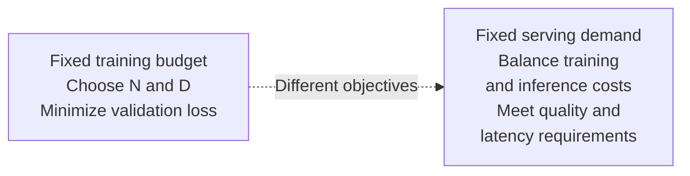
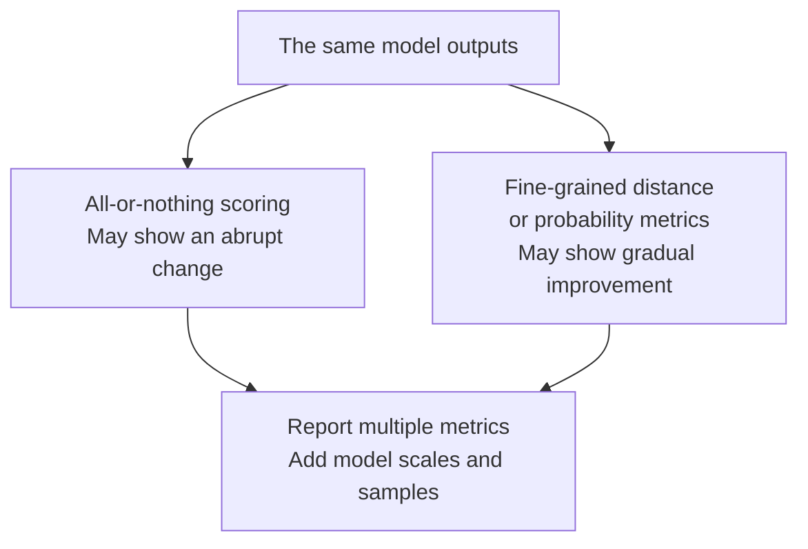

# Chapter 7: Scaling Laws and Emergent Abilities

## 7.1 What Do Scaling Laws Predict?

Language-model scaling laws describe **how loss changes with parameters, data, or compute** under particular architectures, data distributions, and training settings. They are empirical relationships—not a theorem that larger models must be smarter, and certainly not a direct predictor of product revenue.

### 7.1.1 Findings from Kaplan 2020

Kaplan and colleagues systematically studied the relationship between autoregressive language-model cross-entropy and parameter count `N`, data volume `D`, and compute `C`. When other resources are not major bottlenecks, the parameter-scaling relationship can be approximated as:

$$
L(N) \approx \left(\frac{N_c}{N}\right)^{\alpha_N}
$$

`N_c` and the exponent are fitted quantities, not constants of nature. This is a simplified relationship from the paper. It cannot be applied to arbitrary models while ignoring insufficient data or incomplete training.

With a loss floor, a more intuitive form is:

$$
L(N) = L_\infty + aN^{-\alpha}
$$

Doubling the parameters reduces the `L − L∞` term by a fixed proportion. **It does not subtract a fixed amount of loss each time, or add a fixed number of percentage points to accuracy.**

### 7.1.2 Engineering Uses and Limits

| What scaling laws can help with | What they do not directly establish |
|---|---|
| Predicting larger-run loss trends from small experiments | How much accuracy will improve on a business task |
| Comparing model and data allocations under a budget | That the same coefficients remain valid after the data distribution changes |
| Checking whether a run deviates from its expected curve | That gains never saturate beyond the measured scales |

Empirical research on neural-network scaling predates Kaplan, so it would be wrong to say there had been no quantitative evidence before this paper. Its contribution centers on systematic language-model fits and compute-budget allocation.

### 7.1.3 Kaplan Already Studied the Parameter–Data Tradeoff

The paper did not merely ask whether adding parameters helps. Its compute-optimal analysis favored larger models trained on relatively less data, stopping before convergence. Chinchilla later re-estimated this allocation; it did not introduce the allocation question for the first time.

## 7.2 Chinchilla: Allocating a Fixed Training Budget

Hoffmann and colleagues trained **more than 400** language models, ranging from 70M to over 16B parameters and from 5B to 500B training tokens, and cross-checked their findings with different fitting methods.

### 7.2.1 The Key Is Joint Growth, Not a Fixed Ratio

For conventional dense Transformers, start with a rough compute constraint:

$$
C \approx 6ND
$$

Then use a parametric loss model:

$$
L(N,D) \approx E+\frac{A}{N^\alpha}+\frac{B}{D^\beta}
$$

Substituting `D = C/(6N)` and minimizing gives:

$$
N_{\mathrm{opt}} \propto C^{\frac{\beta}{\alpha+\beta}},
\qquad
D_{\mathrm{opt}} \propto C^{\frac{\alpha}{\alpha+\beta}}
$$

A model that is too small is capacity-limited; a model that is too large cannot process enough data within the same budget. The optimum balances these two terms instead of maximizing only one resource.

Chinchilla's different fits support scaling `N` and `D` in **approximately equal proportions** as the budget grows. The paper's comparison gives Kaplan's exponents as approximately `0.73 / 0.27`. One Chinchilla fit gives `0.50 / 0.50`; other fits are not exactly one-half each.

### 7.2.2 Where Does 1:20 Come From?

| Model | Parameters | Training tokens | Basis of comparison |
|---|---|---|---|
| Gopher | 280B | 300B | Chinchilla's main training-budget comparison |
| Chinchilla | 70B | 1.4T | Approximately the same training budget as Gopher |

Chinchilla has `D/N = 20` and outperformed Gopher on many downstream evaluations in the paper. This shows that a smaller model trained on more data can deliver better results at a similar budget.

**“About 20 tokens per parameter” is an empirical reference point for this setting, not an eternally optimal ratio.** Data quality, deduplication and repeated sampling, the tokenizer, architecture, training schedule, and objective can all change the fit.

### 7.2.3 Why GPT-3 Was Not Simply “Missing 12 Times the Data”

GPT-3 175B was trained on 300B tokens, giving `D/N` of about 1.7. Calculating 3.5T tokens from `20N` is only a ratio-based extrapolation. **Holding parameters fixed and using roughly 12 times as many tokens also uses roughly 12 times as much training compute.** That is no longer the optimum under the original budget.

Under a fixed budget, the question is how to choose a smaller `N` and a larger `D`. With a fixed model, the question is the marginal return from continued training. These are different problems.

## 7.3 Why Train Small Models on Far More Than 20N Tokens?

### 7.3.1 Training Optimality Is Not Lifecycle Cost Optimality

If a model will serve many requests, spending more one-time training compute to obtain a smaller, sufficiently capable model may reduce total cost:

$$
C_{\mathrm{total}} =
C_{\mathrm{train}} + QC_{\mathrm{serve}}
$$

`Q` is the request volume under a consistent serving definition, and `Cserve` is the cost per request. Both terms must use the same units: FLOPs compare total computation; including economic costs such as memory and operations requires converting both terms to monetary costs. FLOPs cannot be added to money. Input and output lengths, throughput, and latency also matter; parameter count alone is insufficient.

### 7.3.2 What the Llama 3 and Qwen3 Examples Do—and Do Not—Show

The Llama 3 technical report explicitly distinguishes its models: **the 405B flagship is approximately compute-optimal for its training budget, while the smaller models are trained far beyond their training-compute-optimal points**. It is therefore incorrect to describe the entire Llama 3 family as pursuing only inference optimality.

The initial Qwen3 technical report describes approximately 36T tokens of pretraining data, staged training, and strong-to-weak distillation for smaller models. It illustrates the combined effects of data, training strategies, and post-training. A small model's capabilities should not be attributed entirely to a single tokens-per-parameter ratio.

**Exceeding the Chinchilla ratio does not automatically mean overfitting.** Adding new, useful data differs from repeatedly memorizing the same data; diminishing returns do not mean returns have reached zero. Diagnose overfitting through validation loss on both the training distribution and the target distribution, not by checking whether a ratio exceeds 20.

### 7.3.3 Smaller Is Not Always Cheaper

- Dense-model parameter counts affect weight memory and matrix computation, but long-context KV caches, bandwidth, and batch size matter too.
- MoE total parameters differ from active parameters per token; total parameter count cannot directly determine comparative FLOPs.
- A small model may need more samples, longer chains of thought, or frequent fallback calls to a larger model, reducing its end-to-end cost advantage.
- Data cleaning, licensing, and synthesis also cost money. There is no general rule that data is always cheaper than compute.

## 7.4 Emergent Abilities: An Observational Definition Is Not a Physical Threshold

Wei and colleagues describe an ability as emergent when it is absent in smaller models, appears in larger models, and is difficult to predict by straightforward extrapolation from smaller-model performance. Their paper discusses how some arithmetic tasks, few-shot tasks, and prompting strategies behave as scale increases.

However, the observed curve depends jointly on **the task, model family, prompt, and evaluation metric**. It is not a capability switch controlled only by parameter count.

### 7.4.1 Three Examples That Invite Overinterpretation

| Observation | Conditions that need to be specified |
|---|---|
| A sudden improvement in multistep arithmetic exact match | Are there enough samples? Is CoT used? Are only a few widely spaced model sizes tested? |
| Stronger few-shot / ICL performance at larger scales | Small models may also use examples; different tasks do not all appear at the same scale |
| Better cross-lingual performance | Did training already include the target language, parallel text, or code? Do not describe this as never having encountered the language |

ICL changes behavior through inference-time context without updating model parameters. It need not imply permanently learning a new skill. Likewise, a predominantly English training corpus is not sufficient evidence for entirely zero-shot acquisition of another language.

### 7.4.2 There Is No Universal 50B–100B Threshold

Claims such as “reasoning requires 30B” or “ICL requires 100B” misrepresent experiments from a particular period as architectural laws. Changes in model families, data, distillation, and post-training can let smaller models perform those tasks.

Evaluation at only a few scales cannot rule out gradual improvement between them. When reporting an inflection point, specify the benchmark, prompts, decoding method, uncertainty, and differences in model training.

## 7.5 Mirage: How Evaluation Metrics Can Create Abrupt Changes

### 7.5.1 An Example of Nonlinear Scoring

Suppose a task requires all `k` positions to be correct. For illustration, assume the positions are independent and each has accuracy `p`. Then:

$$
P_{\mathrm{exact}} = p^k
$$

Even if `p` improves smoothly, the probability of getting the entire sequence right can remain near zero for a long time and then appear suddenly in a finite sample. This is not a mathematical discontinuity, but a chart can easily make it look as though an ability has abruptly appeared.

Schaeffer and colleagues' Mirage paper uses mathematical models and experiments to show that **nonlinear or discontinuous metrics can produce apparent emergence**. For the same model outputs, finer-grained measures such as token-level edit distance or probabilities can sometimes reveal smoother trends.

### 7.5.2 What the Paper Does Not Establish

- It does not prove that every change in capability is a measurement artifact.
- It does not prove that every task must be smooth under every continuous metric.
- It does not negate the practical value of exact match: compilation, payments, or mathematical answers may genuinely require complete correctness.

Distinguish a threshold at which task success becomes practically useful from a phase transition in the model's internal mechanisms. The former is directly measurable; the latter requires additional evidence.

## 7.6 Engineering Choices: Turn Slogans into Experiments

1. **Fix the evaluation conditions first.** If tasks, templates, decoding, and inference budgets differ, score differences cannot safely be attributed to parameter counts.
2. **Refit rather than mechanically applying 20N.** Run smaller-budget experiments on your own data mixture and check extrapolation error.
3. **Compare cost curves.** Include pretraining, post-training, evaluation, and expected serving volume rather than optimizing only one-time training FLOPs.
4. **Choose the smallest model that meets requirements, not a model “with emergence.”** Set separate thresholds for accuracy, tail errors, context length, latency, and safety.

For example, “7B + 100B tokens is worse than 3B + 250B tokens” is not universally true. Their compute budgets are not exactly equal to begin with, and the outcome depends on data and optimization. Test candidate combinations under the same budget and protocol.

## 7.7 Where Can Extrapolation Fail?

### 7.7.1 Data Constraints

Data that is available, licensable, sufficiently high-quality, and not excessively repetitive is finite. However, sources use different definitions when estimating “high-quality public text.” **Training token counts are not a direct countdown to exhausting the remaining internet data.**

| Direction | Benefits and costs |
|---|---|
| Synthetic data | Can expand task coverage, but may amplify teacher errors and reduce diversity; filtering and independent validation are needed |
| Multimodal data | Expands information sources, but is not equivalent one-for-one to text tokens; encoding and training objectives also change |
| Verifiable feedback or environment interaction | Can select strategies and generate new trajectories, but depends on problems, verifiers, exploration coverage, and feedback quality |

Filtered mathematical web data is an important source for DeepSeekMath, so it should not be casually cited as a model relying primarily on synthetic data. RL on verifiable tasks in R1 is likewise not an unlimited source of new knowledge from an open environment.

### 7.7.2 Compute and System Constraints

Power, interconnects, memory, reliability, and deployment budgets all limit scaling. Unverified GPU prices or cluster sizes are unnecessary to support that conclusion.

Test-time compute allocates more resources to sampling, search, verification, or longer generation during inference. It is a different axis from training compute, and its benefits depend on the model and task. Simply making an answer longer does not compensate for insufficient training.

## 7.8 Common Follow-Up Questions

- **Why might lower loss fail to improve benchmark scores?** Better average prediction on the training distribution need not improve the tail capabilities required by a test task.
- **Is rereading data equivalent to collecting new data?** No. Repetition, overfitting, and data novelty change the effective return.
- **How should MoE and dense models be compared?** Report total and active parameters, actual training and inference FLOPs, memory, and communication costs.
- **When is a claim of emergence credible?** Define the metric and observation range, and check evaluation noise, sparse scale sampling, and changes in training recipes.

## 7.9 Chapter Summary

Scaling laws are tools for budget planning. Chinchilla studies training-budget allocation under particular conditions. Training smaller models longer can serve deployment-cost objectives without contradicting its conclusions. The emergence debate reminds us that **practical usability thresholds, evaluation curves, and internal capability mechanisms are three different things**.

## References

- [Scaling Laws for Neural Language Models](https://arxiv.org/abs/2001.08361)
- [Chinchilla: §3, Table 2, and the compute-optimal derivation](https://arxiv.org/html/2203.15556v1)
- [Emergent Abilities of Large Language Models](https://arxiv.org/abs/2206.07682)
- [Are Emergent Abilities of Large Language Models a Mirage?](https://arxiv.org/abs/2304.15004)
- [The Llama 3 Herd of Models](https://arxiv.org/html/2407.21783v3)
- [Qwen3 Technical Report, initial version](https://arxiv.org/html/2505.09388v1)
- [DeepSeekMath: data construction and GRPO](https://arxiv.org/html/2402.03300v2)
- [DeepSeek-R1, initial version](https://arxiv.org/html/2501.12948v1)
