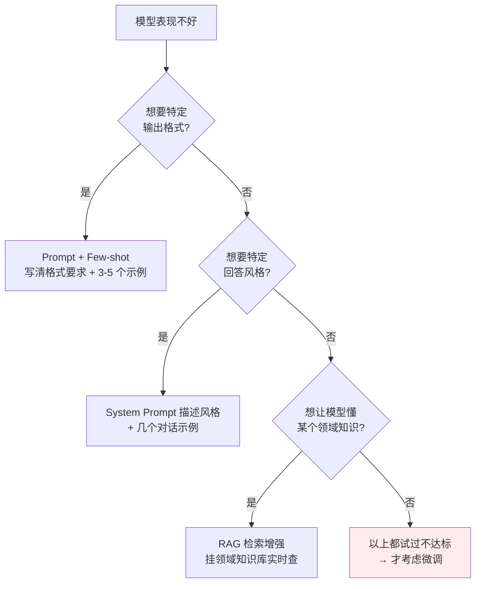
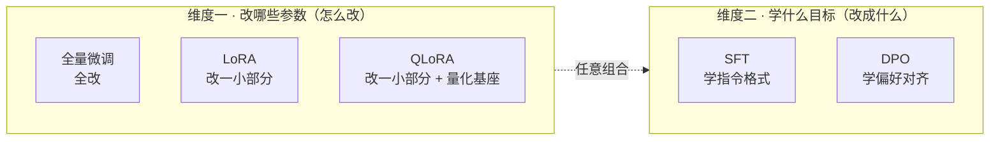

# 第八章：大模型微调方案

## 8.1 前置问题：什么时候才真的需要微调

很多人一遇到「模型表现不好」就想上微调，这是新人的本能反应。但踩过坑的人都知道：**微调是最后手段，不是第一选择。**

### 8.1.1 微调的成本远比想象大

| 成本项 | 说明 |
|---|---|
| **数据成本** | 高质量数据集光标注可能就要花几万到几十万 |
| **算力成本** | 少说几张 A100 |
| **工程经验** | 调参、防过拟合、防灾难性遗忘 |
| **维护成本（最坑）** | 底层基础模型一升级，之前微调的版本基本就废了，得重新来一遍 |

最后一条尤其致命——**微调产出的是一个会随基座过期的资产**。

### 8.1.2 先试这三条更轻的路



### 8.1.3 三种场景微调才真的值得做

1. **需要持续以一种特殊风格输出**，Prompt 控制不住（如生成特定格式的代码、特定语气的文案）；
2. **需要模型稳定掌握某类任务模式或内部术语表达**；
3. **想用小模型替代大模型省成本**（7B 微调模型替代 70B 通用模型，推理成本能省很多）。

### 8.1.4 一个重要的反例

> **如果需求是「补充经常变化的事实知识」，微调通常不是好选择。**

产品价格、政策条款、库存状态、合同原文这些应该放进 RAG 或数据库实时查。

**微调适合学行为、格式、风格和任务模式，不适合当一个会频繁更新的知识库。**

## 8.2 关键框架：两个正交维度

这里有个特别容易踩的坑：很多人把「全量微调、LoRA、QLoRA、SFT、DPO」当成同一类的「不同微调方法」来背。

**其实它们分属两个完全不同的维度。**



**这两个维度是正交的，可以任意组合**：全量微调 + SFT、LoRA + SFT、QLoRA + SFT、LoRA + DPO、QLoRA + DPO……每种组合都是合法的微调方案。

> 理解这两个维度的正交关系，是回答这道题的钥匙。

## 8.3 维度一：改哪些参数

### 8.3.1 全量微调：所有参数都改

最朴素的方案，把所有参数拿出来在新数据上继续训练。效果上限最高，因为模型有最大自由度。

**但代价大到吓人。** 一个 7B 模型的全量微调显存账：

| 项目 | 显存（FP16） |
|---|---|
| 权重本身 | 约 14 GB |
| 梯度 | 约 14 GB |
| 优化器状态（Adam 两个矩，FP32） | 约 56 GB |
| **合计** | **80 GB 起步** |

70B 模型更夸张，要几十张 A100 组集群。

**更糟的是灾难性遗忘（Catastrophic Forgetting）**：模型在新任务上学好了，原本预训练学到的通用能力反而下降。因为所有参数都在被改写，新数据分布有偏的话，模型会忘掉通用知识。

### 8.3.2 LoRA：只改一小部分

**核心洞见**：模型参数的更新量 $\Delta W = W_{\mathrm{after}} - W_{\mathrm{before}}$ 虽然维度很大（比如 $4096 \times 4096$），但**真正有意义的变化只发生在一个低维子空间里**——权重更新具有「内在低秩性」。

做法：冻结原始权重 $W$，在旁边新增两个小矩阵：

$$
W' = W + BA, \quad A \in \mathbb{R}^{r \times d},\ B \in \mathbb{R}^{d \times r},\ r \ll d
$$

训练时只更新 $A$ 和 $B$（通常 $r = 8$ 或 $16$）。

**便利贴类比**：全量微调像把一本厚教科书全部重写，LoRA 像在书的空白处贴便利贴——**原书一字不动**，便利贴上写着修正和补充，看书时原文 + 便利贴一起看。

参数量对比很直观：

| | 参数量 |
|---|---|
| 一个 $4096 \times 4096$ 权重矩阵 | 1600 万 |
| LoRA $r=16$：$4096 \times 16 + 16 \times 4096$ | 13 万（**1/120**） |
| 整个 7B 模型可训练参数 | 从 70 亿降到 2000 万量级 |
| 显存需求 | 从 80GB+ 降到 20GB 量级，**一张 A100 就够** |

LoRA 是 2023 年之后最主流的微调方案，几乎所有开源社区微调项目都在用。详见 [第九章](09-lora.md)。

### 8.3.3 QLoRA：消费级 GPU 的入场券

LoRA 解决了「不用 80GB 也能微调」，但 20GB 对个人开发者仍有门槛（4090 是 24GB，刚够 7B）。

QLoRA 的思路：

1. **先把基础模型 4-bit 量化**（用 NF4 格式，专为权重的近似高斯分布设计），7B 显存从 14GB 压到 4GB 左右；
2. **在量化后的基座上套 LoRA**。

整个微调过程显存降到 10GB 以内，**一张 4090 就能微调 7B 甚至 13B**。

**精度损失非常小**，实测效果和全精度 LoRA 几乎没差别。这一招直接让微调民主化了。

### 8.3.4 三者对比

| 维度 | 全量微调 | LoRA | QLoRA |
|---|---|---|---|
| 可训练参数 | 100% | 约 0.3% | 约 0.3% |
| 7B 训练显存 | 80GB+ | 20GB 量级 | 10GB 以内 |
| 硬件门槛 | 多卡 A100 | 单张 A100 | **单张 4090** |
| 效果上限 | 最高 | 接近全量 | 略低于 LoRA，差距很小 |
| 灾难性遗忘 | 风险最高 | 低（基座冻结） | 低 |
| 训练速度 | 慢 | 快 | 比 LoRA 略慢（有反量化开销） |

## 8.4 维度二：学什么目标

「改哪些参数」回答的是「怎么改」，但还有更核心的问题：**改的目标是什么？**

### 8.4.1 SFT：学会按指令回答

预训练模型本质是文本续写机器，不知道「问问题」是什么意思。SFT 把它从**续写模式**切换到**对话模式**。

数据格式是 (指令, 期望回答) 对：

```
请介绍一下北京  →  北京是中国的首都，位于华北平原……
```

**SFT 是一个「目标」，不是「方法」。** 可以用全量微调做 SFT、用 LoRA 做 SFT、用 QLoRA 做 SFT。工业界最常见的组合是 **QLoRA + SFT**，性价比最高。

数据的关键仍然是**质量大于数量**（见 [第六章](06-llm-training.md)）。

### 8.4.2 DPO：学会哪种回答更受欢迎

SFT 之后模型会按指令回答了，但风格不一定是用户喜欢的（太啰嗦、太简洁、说话不得体）。这时需要**偏好对齐**。

早期标配是 RLHF：收集偏好数据 → 训奖励模型 → PPO 优化。但流程长、要维护好几个模型、训练不稳定。

DPO 发现一个数学等价转换：**RLHF 的优化目标可以推导成纯监督学习的损失函数**，完全绕过奖励模型和 PPO。直接拿 (问题, 好回答, 差回答) 三元组训练。

**DPO 同样是「目标」不是「方法」**，可以用全量微调实现，也可以用 LoRA 实现。最常见的工业组合是 **LoRA + DPO**。

> 别说得太绝对：Llama 2-Chat 公开流程主要是 SFT + 拒绝采样 + PPO/RLHF；社区模型为降低成本才大量换成 DPO。

两者的详细对比见 [第十一章](11-dpo-vs-ppo.md)。

## 8.5 实战选型

| 你的情况 | 推荐组合 | 理由 |
|---|---|---|
| **个人开发者 / 资源受限小团队** | **QLoRA + SFT** | 一张 4090 训 7B，几千条精标数据就够。**绝大多数项目走这条路就够了** |
| 中小企业，有几张 A100 | LoRA + SFT | 基座不量化，精度略好、训练更快 |
| 需要回答风格贴合用户偏好 | SFT 之后加 **LoRA + DPO** | 先学格式再对齐风格，社区 Instruct 模型的主流轻量路线 |
| 大厂，充足 GPU，追求最高效果 | 全量微调 + SFT（+ RLHF） | 最贵也最强，但要承担几十张 A100 的成本和工程复杂度 |

### 8.5.1 一个常见误区：方案越重越好

工程上恰恰相反。**能用轻量方案搞定的需求，一定不要上重的**，原因有三：

1. 训练成本指数级上升；
2. 调参难度上升；
3. 维护成本上升（基座升级后要重新微调）。

所以实战中绝大多数项目都在用 QLoRA + SFT 这种最轻组合，只有需求真的特殊才往上加。

## 8.6 常见错误

### 8.6.1 一遇到效果不好就上微调

先试 Prompt + Few-shot、System Prompt、RAG。这一句说出来，就说明不是「为了微调而微调」。

### 8.6.2 把五个名词当成并列项罗列

「全量微调 / LoRA / QLoRA」是**改哪些参数**，「SFT / DPO」是**学什么目标**，两个维度正交可任意组合。这是本章最核心的框架。

### 8.6.3 用微调来灌注频繁变化的事实知识

价格、条款、库存这类应该走 RAG。微调学的是行为、格式、风格、任务模式。

### 8.6.4 低估维护成本

基座一升级微调版本就废了。这是很多团队上了微调之后才发现的坑。

### 8.6.5 忽略灾难性遗忘

全量微调风险最高。LoRA/QLoRA 因为冻结基座，天然缓解了这个问题——这也是它们除省显存之外的一个重要优点。

### 8.6.6 认为 QLoRA 精度损失很大

实测和全精度 LoRA 几乎没差别。NF4 是专为权重分布设计的量化格式。

### 8.6.7 认为方案越重效果越好

成本、调参难度、维护成本都会指数级上升。克制是工程美德。

## 8.7 本章总结

1. **微调是最后手段**：先试 Prompt + Few-shot、System Prompt、RAG；
2. **微调成本包含数据、算力、工程和维护**，其中基座升级导致的重做最坑；
3. **三种值得微调的场景**：Prompt 控不住的输出风格、稳定的任务模式与内部术语、用小模型替大模型省钱；
4. **频繁变化的事实知识不该用微调**，该走 RAG；
5. **两个正交维度是回答本题的钥匙**：改哪些参数 vs 学什么目标；
6. **全量微调**效果上限最高，但 7B 就要 80GB 显存，且灾难性遗忘风险最大；
7. **LoRA 基于更新量的内在低秩性**，冻结基座只训两个小矩阵，参数量降到 1/120；
8. **QLoRA = 4-bit NF4 量化基座 + LoRA**，10GB 以内，一张 4090 搞定 7B，精度损失极小；
9. **SFT 学格式，DPO 学偏好**，两者都是目标，可与任一参数方案组合；
10. **实战首选 QLoRA + SFT**，能轻则轻，方案越重成本、调参和维护都指数级上升。

> **一句话概括：微调这道题的关键不是背方案名字，而是先答出「该不该微调」，再把「改哪些参数」和「学什么目标」这两个正交维度拆开——大多数项目的正确答案其实就是最轻的那个组合。**

## 参考资料

- [LoRA: Low-Rank Adaptation of Large Language Models](https://arxiv.org/abs/2106.09685)
- [QLoRA: Efficient Finetuning of Quantized LLMs](https://arxiv.org/abs/2305.14314)
- [Direct Preference Optimization: Your Language Model is Secretly a Reward Model](https://arxiv.org/abs/2305.18290)
- [Training language models to follow instructions with human feedback（InstructGPT）](https://arxiv.org/abs/2203.02155)
- [LIMA: Less Is More for Alignment](https://arxiv.org/abs/2305.11206)
- [Parameter-Efficient Transfer Learning for NLP（Adapter）](https://arxiv.org/abs/1902.00751)
- [Hugging Face PEFT](https://github.com/huggingface/peft)
