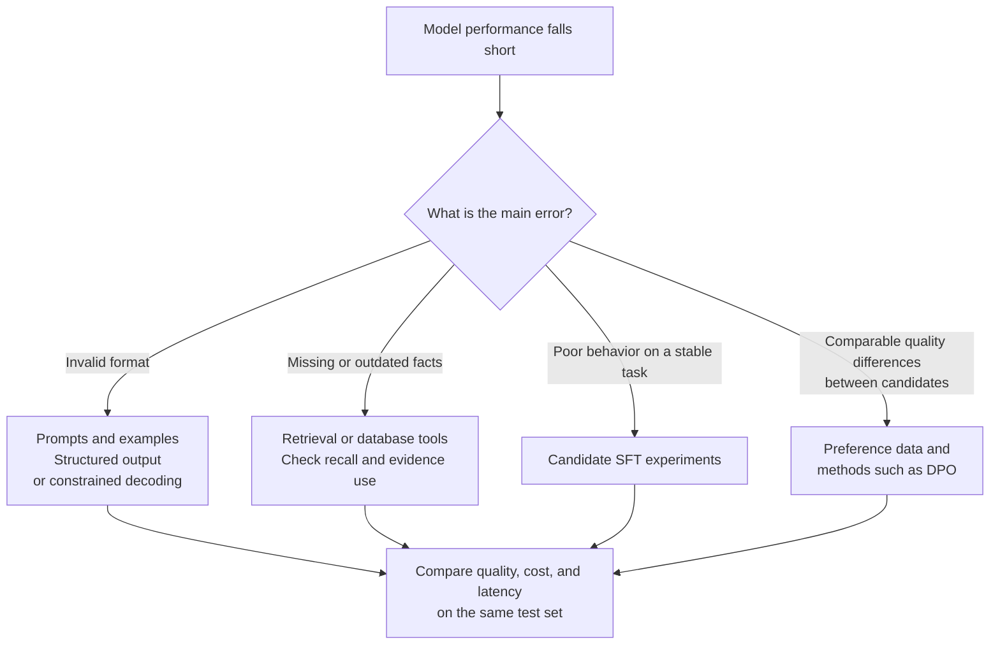

# Chapter 8: Fine-Tuning Approaches for LLMs

## 8.1 First Ask Whether Fine-Tuning Fits the Error

Fine-tuning should not be the automatic first reaction, nor must it always be the last resort. Establish a baseline, determine whether the problem concerns knowledge access, task behavior, output constraints, or model capacity, and then compare benefits and costs.

### 8.1.1 Attribute the Errors First

These approaches can be combined. RAG might supply the latest contract, while SFT teaches the model to answer from evidence and cite its sources. If retrieval misses the relevant clause, further tuning of the generator usually will not fix the root cause.

### 8.1.2 When Is Fine-Tuning Worth Trying?

- A frequent, stable domain task has consistent, verifiable demonstrations available.
- Reliable tool calls, structured expression, or specialized terminology are required, and lighter-weight baselines still fall short.
- A smaller model could replace a larger one on a well-defined task distribution, with cumulative serving savings covering training and maintenance.

Fine-tuning can teach factual knowledge, but **it is a poor substitute for a database that needs frequent updates and precise traceability**. Product prices, inventory, and policy versions should generally be accessed through retrieval or tools.

### 8.1.3 Cost Estimates Require a Configuration

| Cost item | What to record |
|---|---|
| Data | Licensing, annotation, cleaning, quality review, distribution coverage |
| Training | Model size, precision, sequence length, effective batch size, tokens used for updates, hardware-hours |
| Evaluation | Business test sets, human review, general-capability and safety regression tests |
| Maintenance | Base-model and tokenizer versions, adapter compatibility, deployment, rollback |

There is no universal minimum number of A100s for fine-tuning, or a rule that annotation must cost hundreds of thousands of yuan. A new base-model release does not automatically invalidate an older fine-tuned model: the old version can remain in service. Migrating to a new base generally requires retraining or adaptation and fresh validation, not blindly loading an old adapter.

## 8.2 Two Dimensions: Which Parameters Change, and What Signal Is Used?

| Dimension | Examples | What it determines |
|---|---|---|
| Parameterization and precision | Full fine-tuning, LoRA, QLoRA | Which weights update, and their storage and compute precision |
| Training data and objective | SFT, DPO, reward optimization | What is learned from demonstrations, preferences, or rewards |

LoRA + SFT, full fine-tuning + DPO, and QLoRA + DPO are therefore possible combinations. **Conceptual compatibility does not mean every framework, model, and quantization backend supports every combination.**

SFT and DPO can certainly be called training methods. The point is not to treat them as mutually exclusive alternatives to LoRA. SFT learns more than formats, and preference optimization learns more than writing style.

## 8.3 Parameterization and GPU Memory Budgets

### 8.3.1 Full Fine-Tuning

Full fine-tuning updates all or nearly all model parameters, allowing greater flexibility. It does not guarantee the best result with the same data and budget. Small datasets, distribution shifts, or unsuitable learning rates can cause overfitting and regressions in general capabilities.

Consider **7 × 10⁹ parameters, without sharding or offloading**. The table accounts only for persistent model state, using decimal GB:

| Item | Assumed precision | Size |
|---|---|---|
| Weights used for computation | BF16 / FP16, 2 bytes | 14 GB |
| Gradients | If stored in 2 bytes | 14 GB |
| FP32 master weight copy | If retained by the optimizer, 4 bytes | 28 GB |
| Adam first and second moments | FP32 each, 8 bytes total | 56 GB |
| **Total for this configuration** | 16 bytes per parameter | **112 GB** |

FP32 gradients raise this example to **126 GB**. An implementation without FP32 master weights has a different budget again. Activations, logits, temporary buffers, communication, and allocator overhead are still excluded. Thus, “about 84 GB for weights, gradients, and two moments” is not a complete training-memory estimate.

ZeRO / FSDP shard states; offloading moves some states to host memory; gradient checkpointing saves activation memory through recomputation. These methods change **per-device peak memory and speed** rather than eliminating all costs.

### 8.3.2 LoRA

For column-vector inputs, freeze `W` and train only a low-rank update:

$$
W' = W+\frac{\alpha}{r}BA,\qquad
A\in\mathbb{R}^{r\times d_{\mathrm{in}}},
\quad B\in\mathbb{R}^{d_{\mathrm{out}}\times r}
$$

The idea that updates can be usefully approximated in low-rank form is an empirically supported modeling assumption. **It does not mean every task's true update has rank 8 or 16.**

For a `4096 × 4096` matrix with `r = 16`:

- Original matrix: 16,777,216 parameters.
- Two LoRA matrices: 131,072 parameters.
- Trainable-parameter ratio: **1/128**.

The whole-model ratio requires summing over every target matrix. It also depends on whether embeddings, output heads, biases, and other parameters are updated. This single-layer example cannot establish that every 7B model has only 20 million trainable parameters.

LoRA greatly reduces the gradients and optimizer states associated with trainable parameters, but **the base still runs a forward pass, and gradients must still propagate through frozen layers to reach adapters**. Activations therefore do not shrink in proportion to trainable parameters, and training does not automatically become 128 times faster. See [Chapter 9](09-lora.md).

### 8.3.3 QLoRA

QLoRA combines low-bit storage of the frozen base with trainable LoRA parameters. The original paper includes:

1. **NF4:** A 4-bit representation designed for approximately normally distributed weights.
2. **Double quantization:** Further quantization of some quantization constants to reduce metadata overhead.
3. **Paged optimizers:** Memory paging to handle GPU memory spikes; paging may incur transfer costs.

During the forward pass, quantized weights are restored to the compute precision as needed, with arithmetic typically performed in BF16 or a similar format. **Not all training arithmetic, activations, and gradients become 4-bit.** Gradients update the adapters, not the discrete quantized base values directly.

Raw 4-bit storage for 7B parameters is about 3.5 GB. Quantization metadata, unquantized modules, adapters, optimizer states, and activations must be added. The paper demonstrates **fine-tuning a 65B model on a single 48GB GPU** under its configuration; that does not imply arbitrary 7B / 13B long-context training fits within 10GB.

Task performance in the paper can approach 16-bit fine-tuning, but this is not a lossless guarantee for every model, quantization setting, and task. Quantization error, target-module coverage, and optimization settings all require validation.

### 8.3.4 Comparing the Three Approaches

| Dimension | Full fine-tuning | LoRA | QLoRA |
|---|---|---|---|
| Updated parameters | All or most | Low-rank parameters for selected matrices | Low-rank parameters on a low-bit frozen base |
| Main memory pressure | Weights, gradients, optimizer states, activations | Base weights and activations, plus adapter states | Quantized base, activations, adapter states |
| Expressive constraints | Fewer | Rank and target-module restrictions | Same as LoRA, plus quantization error |
| Merging for deployment | No adapter merge required | Floating-point merging can remove the extra branch | Merging and requantization require backend and error checks |
| Speed | Depends on the system and batch size | Often reduces weight-gradient computation | Dequantization costs compute; larger batches may also help |
| General-capability regressions | Require regression evaluation | Also require evaluation; disabling adapters can restore the base | Also require evaluation |

Do not assign them a predetermined “best, second-best, worst” quality ranking.

## 8.4 Training Objectives: How Data Becomes Gradients

### 8.4.1 SFT: Imitating Demonstrations

Given an instruction and its context, compute autoregressive cross-entropy on the demonstration answer. Prompt and padding labels are usually assigned an ignore value so that only the assistant's target tokens contribute to loss.

Pay particular attention to:

- **Template consistency:** Use the same role separators and end markers in training and inference.
- **Label alignment:** The model or trainer usually performs the shift internally; avoid shifting twice.
- **Truncation:** A long prompt must not truncate away the entire target answer, leaving no effective supervision.
- **Packing boundaries:** Distinguish sample boundaries, attention masks, and position IDs to avoid unintentionally including the preceding sample as context.

A small set of high-quality demonstrations may work well, but learning curves should determine data needs. LIMA's experiment is not a rule that a thousand examples suffice for every task.

### 8.4.2 DPO: Learning Relative Preferences

Standard DPO takes chosen / rejected answers to the same prompt and computes a preference loss from their log probabilities under the policy and frozen reference policy. Its simplification follows from particular reward and preference modeling assumptions—not from all RLHF being completely equivalent to supervised learning.

At a minimum, check that both answers address the same question, preference labels are reliable, length and format are not shortcuts, and the data is not confined to answers an old policy readily generates. DPO does not require LoRA, and there is no basis for reciting an unsupported “most common industry combination.”

## 8.5 A Practical Selection Process

| Established constraint | What to try first | When to consider a different approach |
|---|---|---|
| Floating-point base weights do not fit; the task tolerates quantization | A small QLoRA + SFT experiment | Change configuration if quantization error or throughput is unacceptable |
| The floating-point base fits and efficient adaptation is needed | LoRA + SFT | Compare full fine-tuning if broader target modules / higher rank still leave a capacity bottleneck |
| Demonstration-trained behavior is usable and reliable preference pairs exist | DPO, optionally with LoRA | Compare online optimization when coverage is insufficient and reliable online rewards exist |
| Substantial domain shift, with ample data and budget | Controlled comparisons of continued pretraining, SFT, or full-parameter adaptation | Decide from task gains and general-capability regressions |

Choose by constraints and measured gaps, not by whether the user is an individual or a large company.

### 8.5.1 Evaluation and Data Splits

Freeze a target test set first. Split by user, document, time, or question source to keep near-duplicate demonstrations out of the test set. Compare the original base, a prompting baseline, and the fine-tuned model under the same decoding budget.

Beyond the target score, measure:

- Regressions on unseen tasks and general capabilities.
- Increases in hallucinations, false refusals, or reproduction of sensitive information.
- Whether changes in answer length create misleading preference-evaluation gains.
- Whether the cost per successful request actually falls.

### 8.5.2 What Should Be Saved with the Training Artifact?

Save the exact base revision, tokenizer / chat template, adapter configuration, quantization configuration, data version, training parameters, and evaluation results. An `adapter_model` file alone is not enough to reproduce a fine-tuned system reliably.

## 8.6 Common Mistakes and Diagnostics

- **“The base is frozen, so forgetting is impossible.”** With the adapter active, the model uses `W + ΔW` and behavior can change. Being able to restore the base by disabling the adapter does not imply no regression while it is active.
- **“Fine-tuning permanently writes knowledge into the model.”** It changes a distribution; it does not guarantee precise memorization, retrieval, or updating.
- **“QLoRA must be faster, worse, or lossless.”** Each claim depends on quantization, kernels, tasks, and batch size.
- **“Fewer parameters mean no hyperparameter tuning.”** Learning rate, training steps, rank, alpha, target layers, and data quality still need joint examination.
- **“Heavier methods increase costs exponentially.”** A complexity adjective is not a growth law. Account for actual state sizes, FLOPs, and experiment counts.

## 8.7 Chapter Summary

Use error analysis to choose a training signal, then select a parameterization based on memory and expressive needs. Full fine-tuning, LoRA, and QLoRA differ in more than the number of GPUs: optimizer states, activations, quantization, and deployment constraints all matter. **Reliable choices come from comparable evaluations and artifacts that support rollback, not fixed recommended combinations.**

## References

- [LoRA](https://arxiv.org/abs/2106.09685)
- [QLoRA](https://arxiv.org/abs/2305.14314)
- [Transformers v4.46.3: Model training anatomy](https://huggingface.co/docs/transformers/v4.46.3/model_memory_anatomy)
- [PEFT: LoRA configuration and initialization](https://huggingface.co/docs/peft/package_reference/lora)
- [DPO](https://arxiv.org/html/2305.18290v3)
- [LIMA](https://arxiv.org/abs/2305.11206)
