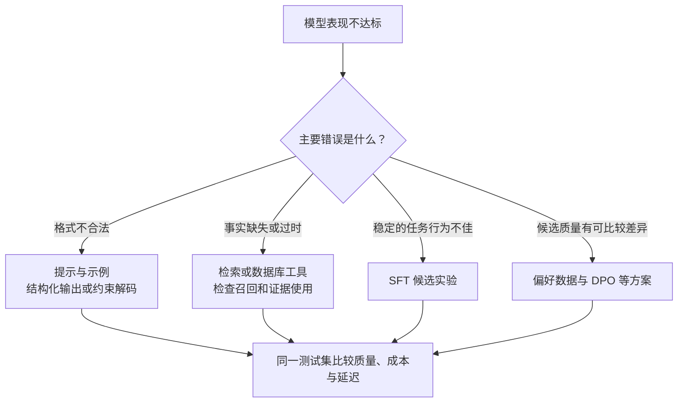

# 第八章：大模型微调方案

## 8.1 前置问题：错误是否适合用微调解决

微调不是第一反应，也不是必须最后才允许尝试的方案。应先建立基线，确认问题来自知识访问、任务行为、输出约束还是模型容量，再比较收益与成本。

### 8.1.1 先做错误归因

这些方案可组合。例如，RAG 负责提供最新合同，SFT 教模型基于证据回答并引用出处。若检索没有召回正确条款，继续调生成模型通常解决不了根因。

### 8.1.2 哪些场景值得微调

- 高频、稳定的领域任务，已有一致且可验证的示范数据。
- 需要可靠的工具调用、结构化表达或专门术语，而较轻量基线仍不达标。
- 在明确任务分布上用较小模型替代大模型，且累计服务成本能覆盖训练和维护。

微调可以学到事实知识，但**不适合作为需要频繁更新、精确追溯的数据库**。产品价格、库存、政策版本通常应通过检索或工具访问。

### 8.1.3 成本不能脱离配置报价

| 成本项 | 应记录什么 |
|---|---|
| 数据 | 授权、标注、清洗、质量复核、分布覆盖 |
| 训练 | 模型大小、精度、序列长度、有效 batch、更新 token 数、硬件小时 |
| 评估 | 业务测试集、人工复核、通用能力与安全回归 |
| 维护 | 基座与 tokenizer 版本、adapter 兼容性、部署、回滚 |

不存在“微调至少几张 A100”或“标注必然几十万元”的统一门槛。基座升级后，旧微调模型也不会自动失效：可以继续部署旧版本；若要迁移到新基座，则通常需要重训或适配并重新验证，不能盲目加载旧 adapter。

## 8.2 两个维度：更新哪些参数，使用什么信号

| 维度 | 例子 | 决定什么 |
|---|---|---|
| 参数化与精度 | 全量微调、LoRA、QLoRA | 哪些权重更新、以什么精度存储和计算 |
| 训练数据与目标 | SFT、DPO、奖励优化 | 从示范、偏好或奖励中学习什么 |

因此可以有 LoRA + SFT、全量微调 + DPO、QLoRA + DPO。**概念上可组合，不等于任何框架、模型和量化后端都支持任意组合**。

SFT 和 DPO 当然也可以称为训练方法；这里要避免的只是把它们与 LoRA 当成互斥选项。SFT 不仅学格式，偏好优化也不仅学文风。

## 8.3 参数方案与显存预算

### 8.3.1 全量微调

全量微调更新全部或几乎全部模型参数，表达自由度大，但不保证同样数据和预算下效果最好。小数据、分布偏移或不合适的学习率，都可能导致过拟合与通用能力退化。

以 **7 × 10⁹ 参数、无分片无卸载**为例，下面只计算持久模型状态，使用十进制 GB：

| 项目 | 假定精度 | 大小 |
|---|---|---|
| 计算用权重 | BF16 / FP16，2 字节 | 14 GB |
| 梯度 | 若为 2 字节 | 14 GB |
| FP32 主权重副本 | 若优化器保留，4 字节 | 28 GB |
| Adam 一阶矩与二阶矩 | 各 FP32，共 8 字节 | 56 GB |
| **此配置合计** | 每参数 16 字节 | **112 GB** |

若梯度也是 FP32，此例增加到 **126 GB**；若实现不维护 FP32 主权重，预算又不同。还没有算激活、logits、临时 buffer、通信与分配器开销，所以不能把“权重 + 梯度 + 两个矩约 84 GB”当成完整训练显存。

ZeRO / FSDP 把状态分片，offload 把部分状态移到主机，梯度检查点通过重算节省激活；这些方法改变**单卡峰值显存与速度**，不是消除了全部成本。

### 8.3.2 LoRA

对列向量输入，冻结 `W`，仅训练低秩增量：

$$
W' = W+\frac{\alpha}{r}BA,\qquad
A\in\mathbb{R}^{r\times d_{\mathrm{in}}},
\quad B\in\mathbb{R}^{d_{\mathrm{out}}\times r}
$$

“更新可以用低秩形式有效近似”是有实证支持的建模假设，**不代表所有任务真实更新的秩都只有 8 或 16**。

对一个 `4096 × 4096` 矩阵、`r = 16`：

- 原矩阵：16,777,216 参数；
- LoRA 两个矩阵：131,072 参数；
- 可训练参数比：**1/128**。

整个模型的比例要对所有目标矩阵求和；还取决于是否更新 embedding、输出头、bias 等。不能从这个单层例子推出任何 7B 模型都只有 2000 万可训练参数。

LoRA 大幅减少可训练参数对应的梯度与优化器状态，但**基座仍需前向传播，梯度仍需经冻结层传到 adapter**。因此激活不会按参数比例一起缩小，速度也不会自动提高 128 倍。详见 [第九章](09-lora.zh.md)。

### 8.3.3 QLoRA

QLoRA 把冻结基座低比特存储，与可训练的 LoRA 结合。原论文包含：

1. **NF4**：针对近似正态权重分布设计的 4-bit 表示。
2. **Double quantization**：再量化部分量化常数，降低元数据开销。
3. **Paged optimizers**：借助内存分页应对显存峰值；换页可能有传输开销。

前向时按需把量化权重恢复到计算精度，通常用 BF16 等完成计算；**不是把全部训练算术、激活和梯度都变成 4-bit**。梯度更新 adapter，不直接更新离散的基座量化值。

7B 参数的裸 4-bit 位存储约为 3.5 GB，但还要加入量化元数据、未量化模块、adapter、优化器和激活。原论文展示了其配置下在**单张 48GB GPU 微调 65B 模型**，不意味着任意 7B / 13B 长上下文训练都能在 10GB 内完成。

论文中的任务效果可接近 16-bit 微调；这不是对任何模型、量化设置和任务的无损保证。量化误差、目标模块覆盖和优化设置都需验证。

### 8.3.4 三种方案怎样比较

| 维度 | 全量微调 | LoRA | QLoRA |
|---|---|---|---|
| 更新参数 | 全部或大部分 | 选定矩阵的低秩参数 | 低比特冻结基座上的低秩参数 |
| 主要显存压力 | 权重、梯度、优化器、激活 | 基座权重与激活，另有 adapter 状态 | 量化基座、激活与 adapter 状态 |
| 表达约束 | 较少 | rank 与目标模块限制 | 同左，另有量化误差 |
| 合并部署 | 不需 adapter 合并 | 浮点合并后可无额外分支 | 合并与再量化需核对后端和误差 |
| 速度 | 取决于系统与 batch | 常减少权重梯度计算 | 反量化有成本，较大 batch 也可能受益 |
| 通用能力退化 | 需回归评测 | 同样需评测，可停用 adapter 回退 | 同样需评测 |

不要为三者预先排定“最高、次高、最低”的质量顺序。

## 8.4 训练目标：数据如何变成梯度

### 8.4.1 SFT：模仿示范

给定指令及上下文，在示范回答上计算自回归交叉熵。通常把 prompt 和 padding 对应 label 设为忽略值，只对 assistant 的目标 token 计损失。

实施时尤其检查：

- **模板一致**：训练和推理使用相同角色分隔符与结束标记。
- **标签对齐**：移位通常由模型或 trainer 内部处理，避免重复 shift。
- **截断位置**：长 prompt 不能把整段目标回答裁掉；否则有效监督可能为空。
- **Packing 边界**：分清样本边界、attention mask 与 position id，避免无意混入前一条样本上下文。

少量高质量示范可能有效，但应通过学习曲线判断需求，不能把 LIMA 的实验结果变成“千条足够所有任务”。

### 8.4.2 DPO：学习相对偏好

标准 DPO 接收同一 prompt 的 chosen / rejected，使用策略与冻结参考策略对两份回答的 log probability 计算偏好损失。其简化来自特定奖励与偏好建模假设，而非“所有 RLHF 都与监督学习完全等价”。

数据检查至少包括：两份回答是否对应同一问题、偏好标签是否可靠、长度与格式是否成为捷径、是否只覆盖旧策略容易生成的答案。DPO 不要求一定采用 LoRA，也不存在已知的“工业界最常见组合”可无依据地背诵。

## 8.5 一个可执行的选型过程

| 已确认的约束 | 可以先试什么 | 什么情况下升级 |
|---|---|---|
| 基座浮点权重装不下，任务允许量化 | QLoRA + SFT 小实验 | 量化误差或吞吐不能接受时换配置 |
| 浮点基座装得下，需要高效适配 | LoRA + SFT | 扩大目标模块 / rank 仍受容量限制时比较全量 |
| 示范表现已可用，有可靠成对偏好 | DPO，可配 LoRA | 覆盖不足且有可靠在线奖励时比较在线优化 |
| 明显领域迁移，有大量数据和预算 | 继续预训练、SFT 或全量适配的对照 | 根据任务收益与通用能力退化决定 |

不是按“个人 / 大厂”选方案，而是按约束与实测差距选择。

### 8.5.1 评估与数据切分

先冻结一份目标测试集；按用户、文档、时间或问题来源分组切分，避免近重复示范跨到测试集。比较原基座、提示基线、微调模型，保持解码预算一致。

除目标分数外，还要测：

- 未见任务和通用能力是否下降；
- 幻觉、误拒绝和敏感信息复现是否增加；
- 输出长度变化是否制造了偏好评估假象；
- 每次成功请求成本是否真的降低。

### 8.5.2 什么需要随训练产物一起保存

基座精确 revision、tokenizer / chat template、adapter 配置、量化配置、数据版本、训练参数和评测结果。仅保存 `adapter_model` 文件，不足以可靠复现一个微调系统。

## 8.6 常见错误与排查

- **“基座冻结，所以不会遗忘。”** 激活后的模型使用 `W + ΔW`，行为仍会变；停用 adapter 可以恢复基座不等于启用时无退化。
- **“微调是把知识永久写进模型。”** 它只是改变分布，不能保证精确记忆、检索或更新。
- **“QLoRA 一定更快、更差或无损。”** 三种结论都取决于量化、内核、任务和 batch。
- **“参数少就无需调参。”** 学习率、训练步数、rank、alpha、目标层与数据质量仍需联合检查。
- **“越重成本越指数增长。”** 不应把复杂度形容词当成增长规律，按实际状态量、FLOPs 和实验次数核算。

## 8.7 本章总结

先用错误分析确定训练信号，再根据显存和表达需求选择参数方案。全量微调、LoRA、QLoRA 的区别不只是“几张卡”，更包括优化状态、激活、量化与部署约束。**可靠的选型结论来自同口径评测与可回滚产物，而不是固定推荐组合。**

## 参考资料

- [LoRA](https://arxiv.org/abs/2106.09685)
- [QLoRA](https://arxiv.org/abs/2305.14314)
- [Transformers v4.46.3：Model training anatomy](https://huggingface.co/docs/transformers/v4.46.3/model_memory_anatomy)
- [PEFT：LoRA 配置与初始化](https://huggingface.co/docs/peft/package_reference/lora)
- [DPO](https://arxiv.org/html/2305.18290v3)
- [LIMA](https://arxiv.org/abs/2305.11206)
