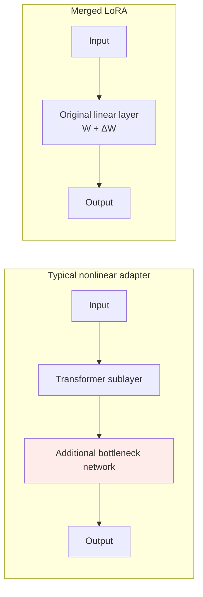

# Chapter 9: LoRA in Depth

## 9.1 Background: Reduce Trainable State, Not Base-Model Computation

Full fine-tuning stores not just weights but gradients, optimizer states, and activations. In the explicit budget example in [Chapter 8](08-finetuning.md), a 7B model retaining FP32 master weights, two FP32 Adam states, and 16-bit weights and gradients needs approximately **112 GB** of persistent state before activations. Implementation choices, sharding, and offloading change per-device usage.

LoRA is a parameter-efficient fine-tuning (PEFT) method: freeze the base and train low-rank updates for selected matrices. Its main savings are in **gradients and optimizer states associated with trainable parameters, and per-task storage**. Base-model forward computation and backpropagation through activations remain necessary.

## 9.2 The Core Equations and Implementation

### 9.2.1 A Consistent Matrix Convention

Use column vectors:

$$
x\in\mathbb{R}^{d_{\mathrm{in}}},\quad
W\in\mathbb{R}^{d_{\mathrm{out}}\times d_{\mathrm{in}}},
\quad
A\in\mathbb{R}^{r\times d_{\mathrm{in}}},
\quad
B\in\mathbb{R}^{d_{\mathrm{out}}\times r}
$$

$$
h=Wx+\frac{\alpha}{r}B(Ax),\qquad
\Delta W=\frac{\alpha}{r}BA
$$

For batch inputs stored as rows in PyTorch, the equivalent forward pass is:

```python
import torch.nn.functional as F

# W: [out, in], A: [r, in], B: [out, r]
output = F.linear(x, W) + (alpha / r) * F.linear(F.linear(x, A), B)
```

During training, compute two small projections rather than materializing a full `B @ A` at every step before multiplying by the input. The latter loses part of the low-rank computation advantage. The example omits bias and LoRA dropout.

### 9.2.2 Why Initialize One Matrix Randomly and the Other to Zero?

Original LoRA randomly initializes `A` and zero-initializes `B`, making `ΔW = 0` at the start of training so the model matches the base model's output. PEFT's default uses Kaiming-uniform initialization for `A` and zeros for `B`; its distribution details are not identical to the original paper's.

**Do not initialize both A and B to zero.** The product's gradient with respect to either factor depends on the other factor, so neither branch receives a useful gradient at the starting point. If only `B` is zero, `A` may have zero gradient on the first step, but `B` can update and `A` can subsequently begin learning.

This is one optimization difference between a low-rank product parameterization and directly training a dense `ΔW`.

## 9.3 The Low-Rank Assumption and Parameter Budget

### 9.3.1 The Update Is Constrained, Not the Original Weight

$$
\mathrm{rank}(\Delta W)\leq r
$$

The original `W` and merged `W + ΔW` can still be full-rank matrices. LoRA does not first compress pretrained weights to low rank, nor does it compute a full update and then apply SVD. It trains directly in a low-rank parameter space.

The paper found low ranks effective for several models and tasks, but this does not prove that every useful update has rank 8–16. Intrinsic dimensionality and the algebraic rank of a particular weight matrix are also not interchangeable concepts.

### 9.3.2 Counting Trainable Parameters

The added parameters for one target matrix are:

$$
P_{\mathrm{LoRA}}=r(d_{\mathrm{in}}+d_{\mathrm{out}})
$$

| Example | Parameters |
|---|---|
| Original `4096 × 4096` matrix | 16,777,216 |
| LoRA with `r = 16` | 131,072 |
| Ratio | 1/128 |

For the full model, sum over each target layer, then add other actually trained parameters such as `modules_to_save` and biases. Attention Q/K/V/O shapes may differ; in particular, GQA K/V projections cannot be assumed to have the same width as Q.

**Before asking what percentage of the base LoRA occupies, specify the target modules, rank, and whether the output head is also trained.**

### 9.3.3 Higher Rank Does Not Necessarily Reproduce Full Fine-Tuning

Increasing `r` relaxes the rank constraint on representable updates. However, target layers may still cover only part of the model, and product parameterization follows a different optimization trajectory. Even a sufficiently large rank does not guarantee the same solution as full fine-tuning.

A higher rank can reduce underfitting, but can also increase storage and overfitting risk. Compare validation performance and training curves instead of assuming that 8–16 is enough for most tasks.

## 9.4 Merging for Inference: When Is There No Extra Branch?

```python
# After training, with dropout disabled, merge compatible floating-point weights once.
W_merged = W + (alpha / r) * (B @ A)
output = F.linear(x, W_merged)
```

After merging, the computation graph is the same as the original linear layer, with no adapter branch to execute. “Zero overhead” means **no additional inference operators after merging**. It does not mean merging uses no memory, or that every deployment form adds zero latency.

| Deployment form | Benefit | Limitation |
|---|---|---|
| Merge one adapter into a complete model | Standard inference path | Each merged version needs full weights; switching is no longer cheap |
| Base + unmerged adapter | Share the base across tasks and switch flexibly | Additional matrix multiplications, loading, and scheduling |
| Adapter on a quantized base | Lower base storage | Merge support and error depend on the quantization backend |

For QLoRA, distinguish merging into a dequantized base from reloading the original floating-point base and merging into that. These bases have different weights. Quantizing after merging introduces further rounding error and requires reevaluation.



Typical bottleneck adapters contain nonlinearities and generally cannot be folded into the same linear weight matrix. This does not establish a fixed number of extra milliseconds per layer; latency must be measured.

## 9.5 One Base, Multiple Adapters

The following is a **sequential switching example using PEFT**. The local adapters must have been trained from the same compatible checkpoint. The paths are placeholders, not downloadable adapters. If the configuration lacks the exact revision, retrieve it from the training records:

```python
from peft import PeftConfig, PeftModel
from transformers import AutoModelForCausalLM

service_path = "path/to/service_lora"
coding_path = "path/to/coding_lora"
config = PeftConfig.from_pretrained(service_path)
base_model = AutoModelForCausalLM.from_pretrained(
    config.base_model_name_or_path,
    revision=config.revision,
)
model = PeftModel.from_pretrained(
    base_model, service_path, adapter_name="service"
)
model.load_adapter(coding_path, adapter_name="coding")
model.eval()
model.set_adapter("service")
# Finish this customer-service inference request before switching to the coding adapter.
model.set_adapter("coding")
```

Do not repeatedly wrap the same mutable `base_model` in multiple `PeftModel` instances and assume they are independent service instances. An explicit single wrapper with named adapter loading and switching is easier to manage.

### 9.5.1 Switching Is Not Concurrent Isolation

`set_adapter` mutates instance state. Multiple requests must not call it arbitrarily and concurrently on a shared instance. Concurrent serving needs a backend with request-level adapter routing or explicitly serialized switching.

vLLM supports per-request LoRA selection and limits such as the number of adapters per batch, rank, and CPU/GPU caches. Check the deployed version's documentation for support for a particular architecture and quantization combination.

### 9.5.2 What Is Missing from the Memory Budget?

Suppose, **only as an illustration**, that floating-point base weights occupy 14 GB and each adapter occupies 50 MB. Weight storage for five tasks is approximately `14 + 5 × 0.05 = 14.25 GB`, compared with 70 GB for five independent sets of 14 GB weights.

This accounts only for weights. Concurrent generation also requires KV caches, activations, and runtime workspace; 50 MB is not a fixed LoRA size. Bases with incompatible versions, tokenizers, target layers, or vocabulary additions cannot simply be forced to share.

## 9.6 Frozen Bases and Forgetting: Recoverable Does Not Mean Regression-Free

LoRA preserves the original `W`, so disabling an unmerged adapter can restore base-model behavior, provided other modules such as embeddings have not also been trained or modified.

With an adapter active, however, the model uses `W + ΔW`. Even with unchanged `W`, the output distribution can shift substantially, causing reduced general capabilities, excessive refusals, or a formulaic style. Biased data, an overly high learning rate, and too much training can all contribute. **A small rank is no insurance against these problems.**

Mitigations include mixing in general data, limiting training steps, early stopping on validation performance, and regression testing on general tasks. To support rollback after merging, retain the original base and adapter; do not rely on adding and then subtracting in low precision to restore the weights exactly.

## 9.7 How Rank, Alpha, and Learning Rate Interact

The original scaling is `s = α/r`. `α` controls the adapter branch's scale, but is not fully interchangeable with the learning rate: scaling affects both the forward pass and factor gradients, while the optimizer, initialization, and training process also influence the outcome.

| Hyperparameter or configuration | Main effect | Diagnostic approach |
|---|---|---|
| `r` | Expressive capacity, parameter and state sizes | Increase after diagnosing underfitting, not from training loss alone |
| `lora_alpha` | Update scale | When comparing ranks, record whether `α/r` also changes |
| Learning rate and steps | Update magnitude and convergence | Examine validation regressions, gradients, and update norms |
| `target_modules` | Which mappings may change | If Q/V is insufficient, compare broader attention and MLP coverage |
| Dropout and data mixture | Regularization and generalization | Watch for overfitting on small datasets; larger values are not automatically better |

PEFT supports rsLoRA's `α/√r` scaling, which is not the same configuration as the original `α/r`. **Hold the scaling rule fixed or report it explicitly when comparing rank experiments.**

Fewer parameters do not guarantee stable optimization or insensitivity to hyperparameters. Parameterization, data, and optimization settings can still cause problematic gradients, underfitting, or forgetting.

## 9.8 Mixing LoRA Adapters: Additive Weights Do Not Guarantee Additive Capabilities

For two updates to the same compatible base:

$$
W' = W+\lambda_1\Delta W_1+\lambda_2\Delta W_2
$$

Each `ΔWi` already includes its own `αi/ri`. The updates can be added mathematically, but this does not imply that the output will contain “70% coding ability + 30% writing ability.”

Averaging `A` and `B` separately and then multiplying introduces cross terms and generally **does not equal averaging the two BA updates**. Concatenating along the rank dimension can represent the sum, but the ranks and storage add up. Compression such as truncated SVD introduces approximation error.

PEFT provides a dedicated weighted-composition API. For example, continue with the `model` loaded above:

```python
model.add_weighted_adapter(
    adapters=["service", "coding"],
    weights=[0.5, 0.5],
    adapter_name="mixed",
    combination_type="cat",
)
model.set_adapter("mixed")
```

This example represents weighted updates through concatenation. It does not treat `set_adapter(["a", "b"])` as a general weighted-mixing interface. Check method support, conflicts involving extra saved modules, and memory requirements for the PEFT version in use.

Two adapters can produce opposing updates, so their combination may regress on either task. Compare against individual adapters and fresh multitask training. Composition is a candidate to evaluate, not a guarantee of combining capabilities without training.

## 9.9 Comparison with Full Fine-Tuning and Adapters

| Dimension | Full fine-tuning | Typical bottleneck adapter | LoRA |
|---|---|---|---|
| Parameterization | Directly changes original weights | Adds a small network | Linear low-rank update |
| Training state | Usually larger | Smaller, configuration-dependent | Smaller, depending on rank / target layers |
| Extra inference branch | None | Usually present | None after merging; present when unmerged |
| Multitask storage | Usually full weights per task | Can share the base | Can share the base |
| Regressions and stability | Must be validated | Must be validated | Must be validated |

Do not conclude that fully fine-tuned weights cannot be merged, or that LoRA is universally better than adapters. Weight-merging methods also exist for full models. Compare the quality and optimization properties of different parameterizations through task evaluation.

## 9.10 Common Follow-Up Questions

1. **Why is backpropagation needed when W is frozen?** Downstream losses must propagate through frozen layers to obtain gradients for upstream adapters. Not computing gradients for `W` does not mean disconnecting the computation graph.
2. **Can increasing r solve all underfitting?** No. Target-layer coverage, flawed data, and base-model capability can also be bottlenecks.
3. **Is alpha the final update norm?** No. The actual norm also depends on the learned `BA`.
4. **Why can results differ slightly after merging?** Floating-point operation order, dtype, quantization, and dropout left enabled can all matter. Compare logits for identical inputs as well as task metrics.
5. **Why is multi-adapter serving not necessarily faster than several small models?** Sharing saves weights, but scheduling, batch fragmentation, KV caches, and adapter-branch kernels still have costs.

## 9.11 Chapter Summary

LoRA's central idea is to **constrain updates through low-rank parameterization while retaining a base that can be frozen, shared, and merged**. Memory savings, low latency, and convenient switching each require different conditions. They do not imply no forgetting, no tuning, or guaranteed additive capabilities when adapters are mixed.

## References

- [LoRA: equations, initialization, and rank experiments](https://arxiv.org/abs/2106.09685)
- [QLoRA](https://arxiv.org/abs/2305.14314)
- [Parameter-Efficient Transfer Learning for NLP](https://arxiv.org/abs/1902.00751)
- [PEFT v0.17.0: LoRA configuration, initialization, and scaling](https://huggingface.co/docs/peft/v0.17.0/en/developer_guides/lora)
- [PEFT: Model merging and add_weighted_adapter](https://huggingface.co/docs/peft/developer_guides/model_merging)
- [PEFT v0.17.0: weighted-adapter implementation and limitations](https://github.com/huggingface/peft/blob/v0.17.0/src/peft/tuners/lora/model.py)
- [vLLM: LoRA adapters](https://docs.vllm.ai/en/stable/features/lora/)
- [Transformers: memory components of model training](https://huggingface.co/docs/transformers/v4.46.3/model_memory_anatomy)
