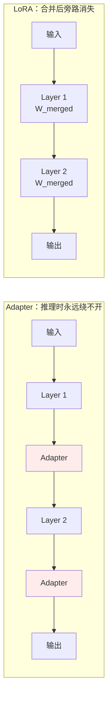

# 第九章：LoRA 深入解析

## 9.1 背景：全量微调的代价

[第八章](08-finetuning.md) 算过一笔账：一个 7B 模型全量微调需要 80GB+ 显存。

| 项目 | FP16 显存 |
|---|---|
| 权重 | 约 14 GB |
| 梯度 | 约 14 GB |
| Adam 优化器一阶矩 + 二阶矩 | 约 56 GB |

普通开发者手里顶多是一张 24GB 的 RTX 4090，**跑不动**。70B 模型显存以百 GB 计，普通公司都难负担。

这催生了 **PEFT（Parameter-Efficient Fine-Tuning，参数高效微调）**：不更新全部参数，只训练一小部分，同时尽量不损失效果。LoRA 是其中最成功的方案。

## 9.2 核心思路：不改原模型，在旁边打补丁

不动原始权重 $W$，在旁边加两个小矩阵 $A$ 和 $B$，训练时只更新它们，$W$ 全程冻结。以下采用行向量输入约定：$x\in\mathbb{R}^{d_{\mathrm{in}}}$、$W\in\mathbb{R}^{d_{\mathrm{in}}\times d_{\mathrm{out}}}$、$B\in\mathbb{R}^{d_{\mathrm{in}}\times r}$、$A\in\mathbb{R}^{r\times d_{\mathrm{out}}}$。

$$
h = x(W + \Delta W),\qquad
\Delta W = \frac{\alpha}{r}BA
$$

```python
# W 是原始权重（冻结，不更新）
# A、B 是两个小矩阵（可训练）
# alpha 是缩放因子（超参，控制 LoRA 更新的强度）

output = x @ (W + (alpha / r) * (B @ A))
#                    ↑ 旁路分支，只有这里在学习
```

- **$A$、$B$ 组成旁路分支**，负责学习微调任务需要的增量知识；
- **$W$ 保存预训练学到的通用知识，一字不改。**

> **给书批注的类比**：全量微调是把书重新印一遍、改掉原文；LoRA 是在空白处贴便利贴，原书一个字不动。读书时原文和便利贴都能看到，效果叠加。

**这种「在旁边打补丁」的设计，是 LoRA 后续所有优点的根源。**

## 9.3 低秩分解到底是什么意思

这是最让初学者困惑的词，拆开来理解。

### 9.3.1 「秩」是什么

矩阵的秩代表矩阵里**真正独立的信息维度**。一个 $4096 \times 4096$ 的矩阵，秩最高可以是 4096。

但研究发现：**微调时权重的更新量 $\Delta W$ 往往具有内在低秩性**——变化只在很低维的子空间里发生，秩通常只有 8–16，其余几千个维度几乎没有有效信息。

> **JPEG 类比**：一张 4K 照片有几百万像素，但信息量可以用几十个主要频率分量近似表达。低秩分解的思路与此类似——把高维数据投影到低维空间，保留主要信息，丢掉噪声。

### 9.3.2 「分解」是什么操作

既然有效信息只在 $r$ 维子空间，就不需要存整个 $d \times d$ 的大矩阵，用两个小矩阵的乘积近似它：

| 矩阵 | 形状 | 作用 |
|---|---|---|
| $B$ | $d_{\mathrm{in}} \times r$ | 把输入从 $d_{\mathrm{in}}$ 维投影到 $r$ 维 |
| $A$ | $r \times d_{\mathrm{out}}$ | 从 $r$ 维投影到输出维 |
| $BA$ | $d_{\mathrm{in}} \times d_{\mathrm{out}}$ | 和原始更新矩阵同维，**但参数量大幅减少** |

$r$ 就是 **rank**，LoRA 最重要的超参：

- $r$ 越小 → 参数越少，表达能力越弱；
- $r$ 越大 → 参数越多，越接近全量微调。

**大多数任务 $r = 8$ 到 $16$ 就够了。**

### 9.3.3 参数量算一笔账

| | 参数量 |
|---|---|
| 原始更新矩阵（$d = 4096$） | $4096 \times 4096 \approx 1677$ 万 |
| LoRA $r = 16$ | $4096 \times 16 + 16 \times 4096 \approx 13.1$ 万 |
| **减少倍数** | **约 128 倍** |

放到整个 7B 模型上：可训练参数从 70 亿降到约 2000 万，**不到 0.3%**。

## 9.4 优点一：推理零开销

这是 LoRA 最被低估的优点。

### 9.4.1 数学上为什么能做到

```python
# 前向计算时：
output = x @ (W + (alpha / r) * (B @ A))

# 但 W 是固定的，可以提前把 LoRA 更新合并进去：
W_merged = W + (alpha / r) * (B @ A)   # 只做一次

# 推理时和原始模型完全一样，没有额外计算
output = x @ W_merged
```

训练完成后把 $\frac{\alpha}{r}BA$ 加到 $W$ 上得到 `W_merged`，**合并后**推理时计算图与原始模型相同，不需要带着 $A$、$B$。未合并的 adapter 仍有额外矩阵乘法与调度成本，但便于按请求切换。

### 9.4.2 与 Adapter 的鲜明对比

Adapter 是在 Transformer 每层之间插入一个小型网络，**推理时每次都要让激活值额外过一遍这个小网络**，每层延迟叠加。

在一个 32 层模型里，每层多几毫秒，叠加起来就很可观。



**对延迟敏感的在线服务来说，这个特性非常重要。**

## 9.5 优点二：模块化插拔，一个基底多套能力

LoRA 带来一种非常灵活的部署模式：**一个基础模型 + 多套 LoRA 权重，按需加载。**

> **手机类比**：基础模型像操作系统（14GB），每套 LoRA 像一个 APP（10–100MB）。你不需要为「打电话」和「拍照」分别买两部手机。

```python
from peft import PeftModel
from transformers import AutoModelForCausalLM

# 基础模型只加载一次，常驻显存（约 14GB）
base_model = AutoModelForCausalLM.from_pretrained("Qwen2.5-7B")

# 场景一：客服请求，挂载客服 LoRA（只有几十 MB）
service_model = PeftModel.from_pretrained(base_model, "path/to/service_lora")

# 场景二：代码请求，挂载代码 LoRA
coding_model = PeftModel.from_pretrained(base_model, "path/to/coding_lora")
```

`base_model` 始终只有一份，两套 LoRA 都挂在同一个基座上，**显存里不需要同时跑两个完整的 7B 模型**。

| 方案 | 服务 5 个场景的显存 |
|---|---|
| 每场景一个全量微调模型 | $5 \times 14 = 70$ GB |
| 一个基座 + 5 套 LoRA | $14 + 5 \times 0.05 \approx 14.3$ GB |

在 AI 应用平台里，「一基座 + 多 LoRA」已经是非常普遍的架构。vLLM 等推理框架甚至支持**同一批请求里不同请求挂不同 LoRA**（Multi-LoRA batching）。

## 9.6 优点三：不丢通用能力

### 9.6.1 灾难性遗忘怎么产生的

全量微调时所有参数都在被更新。如果新任务数据分布比较窄（比如只有医疗问答），模型会逐渐**忘掉预训练学到的通用能力**——你微调完一个医疗模型，发现它写代码的能力大幅下降。

### 9.6.2 LoRA 为什么风险低

原因直接体现在设计上：**原始权重 $W$ 全程冻结，训练过程中一个参数都不动**，所有学习都发生在旁边的小矩阵里。

> 全量微调是在白板上擦掉原内容再重写；LoRA 是在白板旁边贴便利贴，**原内容完好无损**。

### 9.6.3 但不是免测金牌

**LoRA 不是绝对不会遗忘。** 如果：

- 数据分布很偏，
- rank 设得很大，
- 学习率过高，
- 或者把 LoRA 合并后继续训练，

通用能力仍然可能下降。**微调后还是要跑通用能力回归测试。**

## 9.7 优点四：训练更稳定，超参不敏感

全量微调对超参很敏感，尤其学习率：大一点就「跑飞」，小一点收敛极慢。因为要同步调整几十亿个参数，梯度空间极其复杂。

LoRA 只训练两个小矩阵，**可训练参数减少 100 倍以上，梯度搜索空间大幅缩小**。空间小意味着优化器更容易找到好方向，训练更平稳，对超参敏感性更低。

实践中 LoRA 最关键的超参只有 rank $r$，取 8–64 在很多任务上都能得到不错结果，不需要反复调参。

**对资源有限的团队，「调参成本低」意味着更少的实验开销**，这是很实际的优点。

## 9.8 优点五（进阶）：LoRA 权重可加权混合

多个 LoRA 可以**加权混合实现能力融合，而不需要重新训练**。

$$
W' = W + \alpha_1 B_1 A_1 + \alpha_2 B_2 A_2
$$

调整 $\alpha_1$、$\alpha_2$ 的比例，就能调整两种能力的配比。

```python
from peft import PeftModel

# 加载第一个 LoRA（指令遵循能力）
model = PeftModel.from_pretrained(base_model, "instruction_lora")

# 再加载第二个 LoRA（代码生成能力）
model.load_adapter("coding_lora", adapter_name="coding")

# 同时激活，两套权重叠加生效
model.set_adapter(["default", "coding"])
```

这项技术叫 **LoRA Merging**，是 Model Merging 领域的重要方向。

实际意义：分别微调了「擅长写代码的 LoRA」和「擅长遵循指令的 LoRA」，可以直接混合，得到「既擅长写代码又遵循指令」的效果，**不用为这个组合重新收集数据训练**。

## 9.9 三方对比：LoRA vs 全量微调 vs Adapter

| 维度 | 全量微调 | Adapter | **LoRA** |
|---|---|---|---|
| 可训练参数量 | 100% | 约 1% | **0.1%–1%** |
| **推理额外开销** | 无 | **有（每层额外网络）** | **无（可合并进 W）** |
| 灾难性遗忘风险 | 高 | 低 | 低 |
| 部署灵活性 | 低（每任务一个全量模型） | 中 | **高（一基座 + 多套 LoRA）** |
| 训练稳定性 | 较差（超参敏感） | 较好 | **好（超参不敏感）** |
| 权重可组合性 | 不支持 | 不支持 | **支持（LoRA Merging）** |
| 效果上限 | 最高 | 中等 | 接近全量微调 |

LoRA 在推理开销、灵活性、稳定性、可组合性上**全面优于 Adapter**，效果上与全量微调接近，资源需求远低于全量微调。

**这就是它成为 PEFT 常用基线的原因——不是单一维度领先，而是五个优点叠加。**

## 9.10 常见错误

### 9.10.1 只说「LoRA 省参数省显存」

这是最容易被追问倒的答法。真正的价值在于**推理零开销 + 部署灵活 + 不遗忘 + 训练稳 + 可组合**这五点叠加。

### 9.10.2 说不清「低秩」的含义

关键是 $\Delta W$ 的内在低秩性——微调的有效变化只发生在很低维的子空间里。说不出这一点等于只在背公式形状。

### 9.10.3 认为 LoRA 推理时要多算两个矩阵

合并之后旁路就消失了，计算图和原始模型完全相同。这是它区别于 Adapter 的关键。

### 9.10.4 把 LoRA 当成「绝不遗忘」的保险

数据偏、rank 大、学习率高、合并后继续训练，都可能导致通用能力下降。微调后必须做回归评测。

### 9.10.5 认为 rank 越大越好

$r$ 越大越接近全量微调，但也越容易过拟合和遗忘。多数任务 8–16 足够。

### 9.10.6 不知道多 LoRA 可以共享同一个基座部署

这是工业界最有价值的落地形态，也是 vLLM 等框架支持 Multi-LoRA batching 的原因。

### 9.10.7 没听说过 LoRA Merging

加权混合多个 LoRA 实现能力融合而不重新训练，是进阶加分点。

## 9.11 本章总结

1. **全量微调 7B 需要 80GB+ 显存**，催生了 PEFT 这一类方法；
2. **LoRA 冻结 $W$，只训练旁路的 $A$、$B$**，像在书上贴便利贴而不是重印整本书；
3. **低秩性的依据**是微调更新量 $\Delta W$ 的有效信息只在很低维子空间里；
4. **$r=16$ 时单个矩阵参数量降到 1/128**，整个 7B 模型可训练参数不到 0.3%；
5. **合并后无额外计算分支**：$\frac{\alpha}{r}BA$ 可提前合并进 $W$，计算图与原模型一致；未合并时仍有额外矩阵乘法与调度成本；
6. **一基座 + 多 LoRA 的部署模式**：基座 14GB 常驻，每套 LoRA 只有几十 MB，可热切换；
7. **灾难性遗忘风险低**因为基座冻结，但**不是免测金牌**，仍需回归评测；
8. **训练稳定、超参不敏感**，最关键超参只有 rank，调参成本远低于全量微调；
9. **LoRA Merging 支持能力加权融合**，无需为组合重新训练；
10. **成为 PEFT 常用基线的原因是五个优点叠加**，而不是单点领先。

> LoRA 之所以常用，不只是因为参数少，而是「冻结主干、旁路可合并」这个设计同时带来了低显存、低延迟、易部署和较稳的训练过程。

## 参考资料

- [LoRA: Low-Rank Adaptation of Large Language Models](https://arxiv.org/abs/2106.09685)
- [QLoRA: Efficient Finetuning of Quantized LLMs](https://arxiv.org/abs/2305.14314)
- [Parameter-Efficient Transfer Learning for NLP（Adapter）](https://arxiv.org/abs/1902.00751)
- [Intrinsic Dimensionality Explains the Effectiveness of Language Model Fine-Tuning](https://arxiv.org/abs/2012.13255)
- [S-LoRA: Serving Thousands of Concurrent LoRA Adapters](https://arxiv.org/abs/2311.03285)
- [DoRA: Weight-Decomposed Low-Rank Adaptation](https://arxiv.org/abs/2402.09353)
- [Hugging Face PEFT](https://github.com/huggingface/peft)
