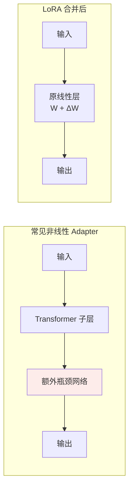

# 第九章：LoRA 深入解析

## 9.1 背景：减少可训练状态，而不是跳过基座计算

全量微调不仅存权重，还存梯度、优化器状态和激活。[第八章](08-finetuning.md) 的显式预算示例中，7B 参数在保留 FP32 主权重、两份 FP32 Adam 状态以及 16-bit 权重和梯度时，持久状态约 **112 GB**，尚未计激活。实现、分片与卸载改变单卡占用。

LoRA 属于 PEFT（参数高效微调）：冻结基座，在指定矩阵上训练低秩增量。主要节省的是**可训练参数对应的梯度、优化器状态和每任务存储**；基座前向和激活反向传播仍然存在。

## 9.2 核心公式与实现

### 9.2.1 统一矩阵约定

采用列向量约定：

$$
x\in\mathbb{R}^{d_{\mathrm{in}}},\quad
W\in\mathbb{R}^{d_{\mathrm{out}}\times d_{\mathrm{in}}},
\quad
A\in\mathbb{R}^{r\times d_{\mathrm{in}}},
\quad
B\in\mathbb{R}^{d_{\mathrm{out}}\times r}
$$

$$
h=Wx+\frac{\alpha}{r}B(Ax),\qquad
\Delta W=\frac{\alpha}{r}BA
$$

对 PyTorch 中按行存储的 batch 输入，等价的前向写法是：

```python
import torch.nn.functional as F

# W: [out, in]，A: [r, in]，B: [out, r]
output = F.linear(x, W) + (alpha / r) * F.linear(F.linear(x, A), B)
```

训练时应计算两个小投影，而不是每步先物化一个完整的 `B @ A` 再乘输入；后者会丢掉部分低秩计算优势。上例省略 bias 和 LoRA dropout。

### 9.2.2 为什么通常一个矩阵随机、另一个为零

原始 LoRA 用随机初始化的 `A` 和零初始化的 `B`，使训练开始时 `ΔW = 0`，模型输出与基座一致。PEFT 的默认 `A` 使用 Kaiming-uniform、`B` 为零；分布细节与原论文不完全相同。

**不能把 A、B 都初始化为零**：乘积对任一因子的梯度都依赖另一个因子，这会让两个分支在起点都收不到有效梯度。只有 `B` 为零时，第一步 `A` 梯度可以为零，但 `B` 可更新，随后 `A` 也开始学习。

这也是低秩乘积参数化与直接训练一个稠密 `ΔW` 的优化差异之一。

## 9.3 低秩假设与参数预算

### 9.3.1 限制的是更新，不是原权重

$$
\mathrm{rank}(\Delta W)\leq r
$$

原权重 `W` 和合并后的 `W + ΔW` 仍可是满秩矩阵。LoRA 不是先把预训练权重压缩成低秩，也不是先算出全量更新再做 SVD；它直接在低秩参数空间里训练。

论文在若干模型和任务上发现较低 rank 已有效，但这不证明“所有有效更新秩都在 8–16”。内在维度与某个权重矩阵的代数秩也不能简单视为同一概念。

### 9.3.2 怎么计算可训练参数

单个目标矩阵的新增参数：

$$
P_{\mathrm{LoRA}}=r(d_{\mathrm{in}}+d_{\mathrm{out}})
$$

| 示例 | 参数量 |
|---|---|
| 原矩阵 `4096 × 4096` | 16,777,216 |
| `r = 16` 的 LoRA | 131,072 |
| 两者之比 | 1/128 |

全模型要对目标层逐个求和，再加入 `modules_to_save`、bias 等实际训练的参数。Attention 的 Q/K/V/O 形状可能不同，尤其 GQA 的 K/V 投影不能默认与 Q 同宽。

**问“LoRA 占基座百分之几”时，应先问 target modules、rank 与是否额外训练输出头。**

### 9.3.3 Rank 并非越大越接近同一次全量训练

增大 `r` 会放宽可表示更新的秩约束，但目标层仍可能只覆盖一部分模型，而且乘积参数化的优化轨迹不同。即使 rank 足够大，也不保证得到全量微调的同一个解。

更大的 rank 可能改善欠拟合，也可能增加存储和过拟合风险。应比较验证集表现与训练曲线，而不是规定“多数任务 8–16 足够”。

## 9.4 推理合并：什么时候没有额外分支

```python
# 训练结束、关闭 dropout 后，只对兼容的浮点权重做一次合并
W_merged = W + (alpha / r) * (B @ A)
output = F.linear(x, W_merged)
```

合并后计算图与原线性层相同，无需再运行 adapter 分支。“零开销”指**合并后没有额外推理算子**，不代表合并没有内存开销，也不代表所有部署形式都零延迟。

| 部署形式 | 好处 | 限制 |
|---|---|---|
| 单 adapter 合并成完整模型 | 标准推理路径 | 每个合并版本需要完整权重，不能再廉价切换 |
| 基座 + 未合并 adapter | 多任务共享基座、切换灵活 | 有额外矩阵乘法、加载与调度成本 |
| 量化基座上的 adapter | 降低基座存储 | 合并支持与误差取决于量化后端 |

对 QLoRA，要区分在反量化后的基座上合并与重新载入原浮点基座后合并；这两者权重不同。合并后再量化也会引入舍入误差，需要重新评估。



常见瓶颈 Adapter 含非线性，通常不能折叠成同一个线性权重。不能据此给出“每层固定多几毫秒”的延迟，必须实际测量。

## 9.5 一个基座，多个 adapter

下面是 **PEFT 的顺序切换示例**，本地 adapter 必须基于同一个兼容 checkpoint 训练。路径是占位符，不是可下载的适配器；若配置未记录精确 revision，需要从训练记录补齐：

```python
from peft import PeftConfig, PeftModel
from transformers import AutoModelForCausalLM

service_path = "path/to/service_lora"
coding_path = "path/to/coding_lora"
config = PeftConfig.from_pretrained(service_path)
base_model = AutoModelForCausalLM.from_pretrained(
    config.base_model_name_or_path,
    revision=config.revision,
)
model = PeftModel.from_pretrained(
    base_model, service_path, adapter_name="service"
)
model.load_adapter(coding_path, adapter_name="coding")
model.eval()
model.set_adapter("service")
# 完成本次客服推理后，再切换到代码 adapter
model.set_adapter("coding")
```

不要反复把同一个可变 `base_model` 包装成多个 `PeftModel`，再假定它们是彼此独立的服务实例。明确使用一个 wrapper、命名加载和切换更容易管理。

### 9.5.1 切换不等于并发隔离

`set_adapter` 修改实例状态，不能在共享实例上让多个请求随意同时调用。并发服务应使用支持请求级 adapter 路由的后端，或明确串行化切换。

vLLM 支持按请求选择 LoRA，并对批次中 adapter 数、rank、CPU/GPU 缓存等设限制。是否支持具体架构与量化组合，应检查部署版本文档。

### 9.5.2 显存账还缺什么

如果**仅为举例**假设浮点基座权重 14 GB、每个 adapter 权重 50 MB，那么五个任务的权重存储约为 `14 + 5 × 0.05 = 14.25 GB`，而五份独立 14 GB 权重是 70 GB。

这只是权重预算。并发生成还要计算 KV cache、激活和运行时 workspace；50 MB 也不是 LoRA 的固定大小。不同基座版本、tokenizer、目标层或新增词表不兼容时，不能强行共享。

## 9.6 冻结基座与遗忘：可恢复，不等于不退化

LoRA 保留了原始 `W`，因此停用未合并 adapter 可以回到原基座行为（前提是没有另外训练或修改 embedding 等模块）。

但启用 adapter 时使用的是 `W + ΔW`。即使 `W` 不变，输出分布也可能显著改变，出现通用能力下降、过度拒绝或某种模板化风格。数据偏、学习率过大、训练过久都可能导致问题，**小 rank 同样不是保险**。

可以采用混合通用数据、控制训练步数、验证集早停和通用任务回归。合并之后若要回退，应保留原基座与 adapter，不要依赖低精度“先加再减”恰好恢复。

## 9.7 Rank、Alpha 与学习率如何共同作用

原始缩放为 `s = α/r`。`α` 控制 adapter 分支尺度，但它与学习率不是完全可互换：尺度同时影响前向和因子梯度，优化器、初始化和训练过程也参与其中。

| 超参数或配置 | 主要影响 | 排查思路 |
|---|---|---|
| `r` | 表达容量、参数与状态大小 | 判断欠拟合后再扩大，不靠训练 loss 单独决定 |
| `lora_alpha` | 更新尺度 | 比较 rank 时记录 `α/r` 是否也变了 |
| 学习率、步数 | 更新幅度与收敛 | 看验证退化、梯度、更新范数 |
| `target_modules` | 允许修改哪些映射 | Q/V 不足时比较更多注意力和 MLP 层 |
| dropout、数据混合 | 正则化与泛化 | 小数据时观察过拟合，不默认越大越好 |

PEFT 支持 rsLoRA 的 `α/√r` 缩放，和原始 `α/r` 不是同一配置。**比较 rank 实验时，连缩放规则一起固定或明确报告**。

LoRA 的参数少不意味着优化必然稳定、超参数不敏感。参数化、数据和优化设置仍可能造成梯度异常、欠拟合或遗忘。

## 9.8 多 LoRA 混合：权重可加，能力不保证可加

对同一兼容基座的两个更新：

$$
W' = W+\lambda_1\Delta W_1+\lambda_2\Delta W_2
$$

其中每个 `ΔWi` 已包含各自的 `αi/ri`。数学上可以求和，不意味着“代码能力 70% + 写作能力 30%”会按比例出现在输出中。

如果直接分别平均 `A` 和 `B` 再相乘，会产生交叉项，通常**不等于平均两个 BA 更新**。按 rank 方向拼接可以表示更新之和，但 rank 与存储会相加；SVD 截断等压缩方案又会引入近似误差。

PEFT 提供专门的加权合成 API，例如接续上节已加载的 `model`：

```python
model.add_weighted_adapter(
    adapters=["service", "coding"],
    weights=[0.5, 0.5],
    adapter_name="mixed",
    combination_type="cat",
)
model.set_adapter("mixed")
```

这个例子使用拼接表示加权更新，不是把 `set_adapter(["a", "b"])` 当成通用的加权混合接口。方法支持、额外保存模块的冲突和显存需求都要按所用 PEFT 版本检查。

两个 adapter 可能产生相反更新，合成后任一任务都退步。应与单 adapter 和重新做多任务训练比较；合成是可评测的候选，不是无需训练就一定获得能力融合。

## 9.9 与全量微调、Adapter 的对比

| 维度 | 全量微调 | 常见瓶颈 Adapter | LoRA |
|---|---|---|---|
| 参数化 | 直接改原权重 | 额外小网络 | 线性低秩增量 |
| 训练状态 | 通常较多 | 较少，取决于配置 | 较少，取决于 rank / 目标层 |
| 推理额外分支 | 无 | 通常有 | 合并后无，未合并有 |
| 多任务存储 | 通常每任务完整权重 | 可共享基座 | 可共享基座 |
| 退化与稳定性 | 都需要验证 | 都需要验证 | 都需要验证 |

不能写成“全量权重无法合并”或“LoRA 全面优于 Adapter”。全量模型也有权重合并方法；不同参数化的质量与优化特性应通过任务评估比较。

## 9.10 常见追问

1. **W 冻结，为什么还需要反向传播？** 下游损失需要通过冻结层对上游 adapter 求梯度；不计算 `W` 的梯度，不等于切断计算图。
2. **把 r 加大能解决所有欠拟合吗？** 不能，目标层、数据缺陷和基座能力也可能是瓶颈。
3. **Alpha 是最终更新范数吗？** 不是，实际范数还由训练得到的 `BA` 决定。
4. **合并后结果为什么略有差别？** 浮点计算顺序、dtype、量化及未关闭 dropout 都可能影响；应比较同一输入下的 logits 与任务指标。
5. **为什么多 adapter 部署不一定比多个小模型快？** 共享省的是权重，调度、批次碎片、KV cache 和旁路内核仍有成本。

## 9.11 本章总结

LoRA 的关键是**用低秩参数化约束更新，同时保留可冻结、可共享、可合并的基座**。省显存、低延迟和方便切换分别需要不同条件，不能再推导成“不遗忘、无需调参、混合后能力必然叠加”。

## 参考资料

- [LoRA：公式、初始化与 rank 实验](https://arxiv.org/abs/2106.09685)
- [QLoRA](https://arxiv.org/abs/2305.14314)
- [Parameter-Efficient Transfer Learning for NLP](https://arxiv.org/abs/1902.00751)
- [PEFT v0.17.0：LoRA 配置、初始化与缩放](https://huggingface.co/docs/peft/v0.17.0/en/developer_guides/lora)
- [PEFT：Model merging 与 add_weighted_adapter](https://huggingface.co/docs/peft/developer_guides/model_merging)
- [PEFT v0.17.0：加权 adapter 的实现与限制](https://github.com/huggingface/peft/blob/v0.17.0/src/peft/tuners/lora/model.py)
- [vLLM：LoRA adapters](https://docs.vllm.ai/en/stable/features/lora/)
- [Transformers：模型训练的内存组成](https://huggingface.co/docs/transformers/v4.46.3/model_memory_anatomy)
