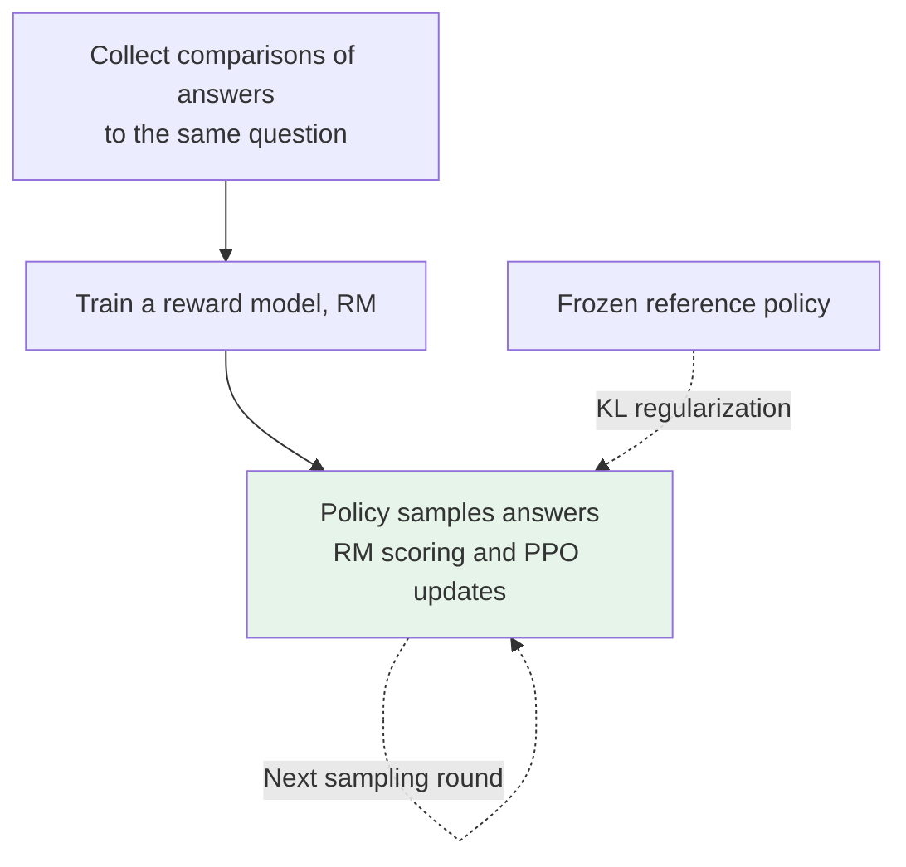
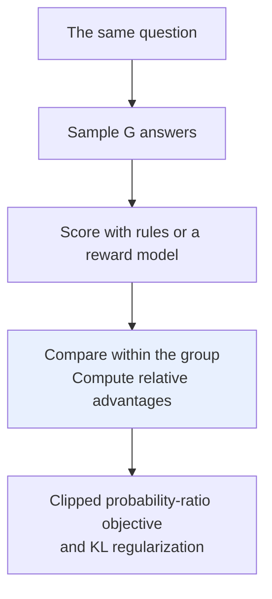

# Chapter 10: A Survey of Post-Training Methods

## 10.1 Post-Training Does Not Just Mean What Comes After SFT

Post-training usually means subsequent adaptation of a pretrained base model's capabilities and behavior, **including SFT**. The Llama 3 technical report also places both SFT and preference optimization within post-training.

SFT can teach high-quality answers, refusals, tool use, and reasoning demonstrations; it does not merely teach acceptable formats. Preference or reward optimization adds signals such as comparisons and outcome feedback beyond demonstrations, but still does not guarantee factuality or safety.

### 10.1.1 Separate Three Dimensions First

| Question | Examples |
|---|---|
| Who supplies the supervision? | Human demonstrations, human preferences, AI evaluations, verifiable rules |
| How is the policy updated? | SFT, DPO, PPO, GRPO |
| How is the data generated? | Fixed offline data, online sampling, rejection sampling, multiple iterations |

The five approaches discussed here are therefore not mutually exclusive algorithms at the same level. RLHF and RLAIF describe feedback sources, whereas PPO and GRPO are policy optimizers. RLAIF changes the source of feedback; rejection sampling changes data construction. Both can be combined with different training objectives.

### 10.1.2 Diagnose the Remaining Problems After SFT

If errors come from missing up-to-date facts, check retrieval first. If correct solutions appear among candidates but the model generates them infrequently, consider filtering, preferences, or reward optimization. If almost every sample is wrong, inspect the base model, problem difficulty, demonstrations, and reward sparsity.

“Add another alignment stage” is not a universal remedy for every error.

## 10.2 PPO-RLHF: The Classic Online Optimization Workflow

InstructGPT is a representative application of RLHF to language models, not the origin of RLHF. Research in 2017 already learned rewards from human comparisons of trajectories and used them to optimize policies.

### 10.2.1 A Three-Step Workflow



Relative comparisons can reduce inconsistencies in absolute rating scales, but still depend on annotation guidelines, reading burden, and position and length biases. Comparing answers to the same question teaches relative quality, not an absolute “true score” directly comparable across questions.

### 10.2.2 Four Roles, Not Four Simultaneously Trained Models

| Role | Purpose | Updated during a typical RL stage? |
|---|---|---|
| Policy | Generates answers and receives policy gradients | Yes |
| Reference | Supplies the baseline distribution for KL regularization | No |
| Reward model | Estimates preference rewards for answers | Usually frozen; may be retrained between iterations |
| Value / Critic | Estimates future returns from a prefix to help compute advantages | Yes |

A value head can share a backbone, and the reward model need not match the policy's size. Implementations also retain a snapshot or log probabilities of the old sampling policy. Memory cannot simply be budgeted as four equally sized models.

### 10.2.3 Advantages and Risks

PPO can continually obtain reward feedback on answers generated by the current policy, extending coverage beyond old preference pairs. The cost is managing data and versions across generation, scoring, advantage estimation, and policy updates, as well as coordinating rollout and training throughput.

KL regularization controls drift relative to the reference policy. It can mitigate reward overoptimization but cannot repair the reward function itself. If the reward favors long, empty answers, the model may still learn that shortcut.

Monitor reward, KL, length, entropy, and independent validation scores together. **Rising rewards with falling task scores** usually deserve more attention than a smooth training curve.

## 10.3 DPO: Learning Directly from Preference Pairs

### 10.3.1 Which Assumptions Enable the Simplification?

DPO starts from KL-regularized reward maximization. Under preference models such as Bradley–Terry, it reparameterizes rewards as policy log-ratios relative to a reference policy. This allows direct policy training on preference labels without separately fitting a scalar reward network.

This derivation rests on particular modeling assumptions; it does not imply that arbitrary RLHF workflows and DPO behave identically with finite samples.

The Chinese example below shows the structure of offline preference data. The prompt asks how to plan an introduction to Python. The chosen answer recommends basic syntax, a small project, and tests; the rejected answer dismisses the task as merely watching a few tutorials.

```python
# Example structure of offline preference data
{
    "prompt": "如何安排 Python 入门学习？",
    "chosen": "先练基础语法，再做一个小项目，并用测试检查结果……",
    "rejected": "随便看几个教程就会了……",
}
```

`chosen` means relatively preferred under the annotation rules, not a proven perfect answer.

### 10.3.2 The Objective Is a Relative Margin

Let `ℓθ(y|x)` be the sum of log probabilities over the answer tokens. DPO aims to increase:

$$
m_\theta =
\bigl[\ell_\theta(y_w\mid x)-\ell_{\mathrm{ref}}(y_w\mid x)\bigr]
-\bigl[\ell_\theta(y_l\mid x)-\ell_{\mathrm{ref}}(y_l\mid x)\bigr]
$$

The loss for one preference pair is:

$$
\mathcal{L}_{\mathrm{DPO}}=-\log \sigma(\beta m_\theta)
$$

An increase in the chosen answer's relative margin does not guarantee that its absolute probability rises and the rejected answer's falls. For example, the loss can improve when both probabilities fall but the rejected answer falls more.

### 10.3.3 Which Costs Disappear?

Standard offline DPO requires no training-time rollouts, value network, or independent reward model. Frozen reference-model log probabilities can also be precomputed, so a second complete model need not remain resident.

Each example still contains both chosen and rejected sequences. Activations, sequence lengths, batch size, and the way reference probabilities are computed affect memory. Halving the number of models does not imply exactly halving memory.

Offline DPO **does not itself explore online, but can still generalize to unseen answers**. An outer loop can repeatedly generate new preference data to form an iterative workflow. There is no fixed quality ranking between DPO and PPO independent of data, rewards, and budgets.

## 10.4 GRPO: Replacing a Learned Value Baseline with Group Returns

GRPO was introduced by DeepSeekMath and used in the initial DeepSeek-R1 report. It is still online policy optimization, not a “middle tier” between DPO and PPO ranked by model count.

### 10.4.1 PPO Advantages Are Not Always r − V

For a task that terminates in one step, reward minus a baseline is a useful intuition for advantage. Token-level language generation, however, usually involves future returns, discounting, bootstrapping, and GAE. A value model estimates expected return after a given prefix; it does more than score a final answer.

### 10.4.2 Outcome-Supervised GRPO

For the same question, draw `G` answers from the sampling policy, with rewards `r1,…,rG`:

$$
\bar r=\frac{1}{G}\sum_{j=1}^{G}r_j,\qquad
\hat A_i=\frac{r_i-\bar r}{s_r+\varepsilon}
$$

`sr` is the within-group reward standard deviation. The small positive `ε` shown here is an implementation safeguard against division by zero. The original outcome-supervised version assigns an answer's normalized reward to each of its tokens, using PPO-style probability-ratio clipping and KL regularization.



`G` is a hyperparameter affecting coverage, cost, and estimate quality, not a universal constant of 8. Process-supervised versions can construct rewards for reasoning steps, so broadcasting a final reward is not the only form of GRPO.

### 10.4.3 What Is Saved, and What Problems Remain?

- **The learned critic and its optimizer states are removed**, but generating and scoring several answers per question and training on long sequences can still be expensive.
- **All-correct or all-incorrect groups** with identical rewards have zero relative advantage, leaving no learning signal from the task-reward term. Other terms, including KL, can still act.
- **Standard-deviation normalization** changes the weighting of different question groups. Small variance can amplify noise; it does not guarantee lower variance or greater stability than PPO.
- **Final-answer rewards provide coarse credit assignment:** they do not directly identify which steps in an answer contributed to the outcome.

Being suitable for verifiable tasks does not mean every math or coding problem has a reliable verifier. Incomplete tests, answer-parsing flaws, timeout handling, and data leakage can all create reward flaws.

### 10.4.4 R1-Zero Uses More Than a Single 0/1 Reward

The initial DeepSeek-R1 report's §2.2.2 describes **accuracy rewards and format rewards** for R1-Zero, without neural outcome or process reward models. Math answers and code tests can supply accuracy feedback; format rules require a particular output structure.

R1-Zero applies RL directly to the pretrained DeepSeek-V3-Base. It does not learn reasoning from random weights without data or prior knowledge. Full R1 also includes SFT and broader post-training, so the two should not be conflated.

## 10.5 Rejection Sampling Fine-Tuning: Select Data, Then Apply Supervised Learning

Here, *rejection sampling fine-tuning* refers to its use in model-training literature. It need not be identical to rejection sampling as formally defined in Monte Carlo methods.

```text
Given a question → Generate multiple candidates → Score with rules, an RM, or humans
                 → Retain candidates by threshold or ranking → Use them as SFT targets
```

Distinguish **selecting the highest-scoring samples and training on them** from **inference-time best-of-N**, which returns only the highest-scoring candidate without updating parameters.

### 10.5.1 Why Can It Work?

If the policy already generates good answers with some probability, filtering can improve training-target quality. Across iterations, the updated policy generates new candidates. It is therefore incorrect to say this method has no sampling-based exploration or necessarily has a lower ceiling than RL.

### 10.5.2 Main Costs

- Sampling costs can far exceed what the final retained dataset size suggests.
- Keeping only the highest scores can discard diversity. If all candidates for a question are wrong, the highest-scoring one is still wrong.
- Optimizing a biased scorer can amplify preferences for length or style, or flaws in how answers are judged.
- Pure SFT has a simpler optimization form, but poor data can still cause regressions.

Both the Llama 2 and Llama 3 reports use sample generation and filtering. This should not be dismissed as merely a warm-up before RL; it can be central to iterative data construction.

## 10.6 RLAIF: Changing the Feedback Source

RLAIF uses AI evaluation signals to replace or supplement human feedback. The teacher need not be strictly larger or stronger than the policy. Evaluating a given answer is not identical to generating one from scratch, and prompts, rules, and comparison procedures also affect evaluation quality.

### 10.6.1 The Two Stages of Constitutional AI

1. **Supervised stage:** Have the model produce self-critiques and revisions guided by principles, then use the revised answers for SFT.
2. **Reinforcement learning stage:** Have AI compare candidates according to principles, train a preference model, and use that model to provide RL rewards.

The critique–revision stage is not the entire RLAIF preference-pair workflow. Human-authored principles also mean that the process is not entirely free of human supervision.

Google's RLAIF comparison study reported results comparable to RLHF on summarization, helpful dialogue, and harmless dialogue tasks. It also found that feedback could help when the evaluator and policy were the same size or even started from the same checkpoint. The paper additionally studied a variant that uses AI scores directly, bypassing separate RM training.

### 10.6.2 Accounting for Cost and Bias

AI evaluation may reduce the cost of human pairwise comparisons, but accounting must include inference charges, latency, human spot checks, and the consequences of incorrect feedback. There is no general basis for saying each preference pair takes 1–2 minutes, or that RM data must cost millions of dollars at a minimum.

Check position bias, verbosity preference, self-preference, factual misjudgments, and interference by candidate answers with the judge's prompt. Calibrate a sample against independent human judgments or verifiable outcomes rather than using the same judge both to generate labels and to prove final success.

## 10.7 Choosing and Combining Methods

| Available resources or signals | Candidate approach | Main risk |
|---|---|---|
| Reliable demonstrations | SFT | Inadequate coverage, incorrect demonstrations, forgetting |
| Fixed preference pairs; online generation is inconvenient | Offline DPO | Preference noise and distribution coverage |
| Online generation and reliable rewards are available | Compare PPO / GRPO | Reward flaws, exploration cost, sparse feedback |
| Many candidates can be generated and their quality is easy to judge | Filter, then apply SFT | Selection bias and reduced diversity |
| Human comparison is expensive | AI-assisted evaluation with an appropriate optimizer | Teacher bias and quality review |

### 10.7.1 Examples from Public Model Reports

- **Llama 2-Chat:** SFT, rejection sampling, and PPO-RLHF.
- **Llama 3 technical report:** Multiple rounds of SFT, rejection sampling, and DPO.
- **Initial DeepSeek-R1 report:** Cold-start SFT → reasoning-oriented RL → filter reasoning data, add non-reasoning data, and fine-tune the base again → RL for broader scenarios.

These examples refer to specific reports. They do not infer undisclosed commercial-model algorithms or automatically apply an initial workflow to every later version with the same name.

## 10.8 Common Follow-Up Questions

- **Does a high reward-model score mean an answer is correct?** No. Reward is a proxy for the supervision signal and needs independent validation.
- **Can KL guarantee safety?** No. It controls drift relative to a reference policy; it is not a hard behavioral constraint.
- **Does removing GRPO's critic guarantee lower total cost?** It removes one class of training state, but rollout counts, lengths, and verification costs may dominate.
- **If DPO cannot explore, why can it answer new questions?** Offline optimization does not actively gather new feedback; that does not eliminate statistical generalization.
- **Why not simply rank the five methods by quality?** They span different dimensions, and quality also depends jointly on the base, data, rewards, and budget.

## 10.9 Chapter Summary

Understand post-training through **supervision signals, policy optimizers, and data-generation loops**. The decisive questions are whether feedback is trustworthy, whether examples cover the target distribution, whether online generation is affordable, and whether independent evaluation reproduces the task gains.

## References

- [InstructGPT](https://arxiv.org/abs/2203.02155)
- [Deep Reinforcement Learning from Human Preferences](https://arxiv.org/abs/1706.03741)
- [DPO](https://arxiv.org/html/2305.18290v3)
- [DeepSeekMath: GRPO and iterative training](https://arxiv.org/html/2402.03300v2)
- [DeepSeek-R1: initial report, §2](https://arxiv.org/html/2501.12948v1)
- [Llama 2](https://arxiv.org/html/2307.09288v2)
- [The Llama 3 Herd of Models](https://arxiv.org/html/2407.21783v3)
- [Constitutional AI](https://arxiv.org/abs/2212.08073)
- [RLAIF vs. RLHF](https://arxiv.org/abs/2309.00267)
- [Proximal Policy Optimization Algorithms](https://arxiv.org/abs/1707.06347)
