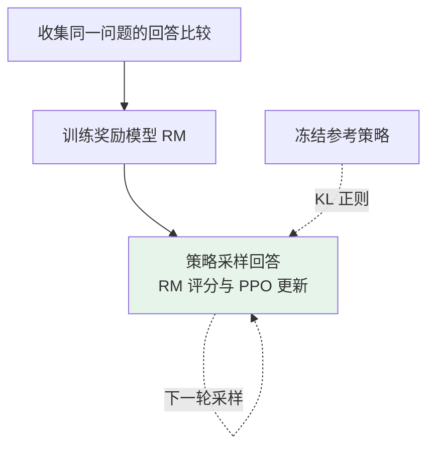
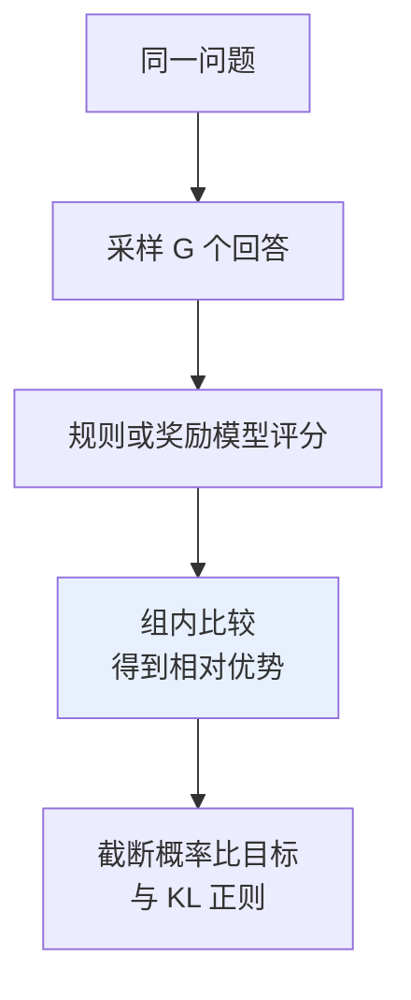

# 第十章：Post-Training 方法全景

## 10.1 Post-Training 不只是 SFT 之后

后训练通常指在预训练基座上进行的后续能力与行为适配，**包括 SFT**。Llama 3 技术报告也把 SFT 和偏好优化放在 post-training 内。

SFT 可以学高质量回答、拒绝行为、工具使用和推理示范，不是“只学合格格式”。偏好或奖励优化是在示范以外引入比较、结果反馈等信号，仍不保证事实正确与安全。

### 10.1.1 先拆开三个维度

| 问题 | 例子 |
|---|---|
| 谁提供监督信号？ | 人类示范、人类偏好、AI 评价、可验证规则 |
| 怎样更新策略？ | SFT、DPO、PPO、GRPO |
| 数据怎样产生？ | 固定离线数据、在线采样、拒绝采样、多轮迭代 |

因此，RLHF、RLAIF 与 PPO、GRPO 不是同一层级的五个互斥算法。RLAIF 改变反馈来源，拒绝采样改变数据构建方式；两者都可以和不同训练目标组合。

### 10.1.2 SFT 后应先定位剩余问题

如果错误来自最新事实缺失，优先检查检索；如果候选中已有正确解但模型不常生成，可以考虑筛选、偏好或奖励优化；如果采样几乎全错，则需要检查基座、题目难度、示范与奖励稀疏性。

“再加一次对齐”不是对所有错误都有效的通用步骤。

## 10.2 PPO-RLHF：经典在线优化流程

InstructGPT 是语言模型 RLHF 的代表工作，不是 RLHF 的起源；2017 年已有从人类轨迹比较学习奖励并优化策略的研究。

### 10.2.1 三步流程



相对比较可以减轻绝对评分标尺不一致的问题，但也受标注指南、阅读负担、位置和长度偏差影响。相同问题的比较只学习相对质量，不提供跨问题可直接比较的绝对“真分数”。

### 10.2.2 四种角色，不是四个模型都在训练

| 角色 | 作用 | 典型 RL 阶段是否更新 |
|---|---|---|
| Policy | 生成回答，接受策略梯度 | 是 |
| Reference | 提供 KL 正则的基准分布 | 否 |
| Reward model | 为回答估计偏好奖励 | 通常冻结；可能在迭代间重新训练 |
| Value / Critic | 根据前缀估计未来回报，帮助计算优势 | 是 |

价值头可以共享主干，奖励模型也不必和策略同尺寸。实际实现还维护采样旧策略的快照或 log probabilities，因此不能简单按“四份等大模型”报价显存。

### 10.2.3 优势与风险

PPO 可以持续在当前策略生成的回答上获得奖励反馈；相比只使用旧的偏好对，这能补充数据覆盖。代价是生成、打分、优势估计、策略更新之间的数据与版本管理，以及 rollout 和训练的吞吐协调。

KL 正则用于控制相对参考策略的偏移。它能缓解奖励过优化，却不能修复奖励函数本身：一旦奖励偏好长而空的回答，模型仍可能学会这一捷径。

应同时观察奖励、KL、长度、熵和独立验证分数。**奖励上升、任务分数下降**通常比“训练曲线很平滑”更值得关注。

## 10.3 DPO：直接从偏好对学习

### 10.3.1 简化来自什么假设

DPO 从 KL 正则化的奖励最大化出发，在 Bradley–Terry 等偏好模型下，将奖励重参数化为策略相对参考策略的 log-ratio。于是可以不单独拟合标量奖励网络，直接对偏好标签训练策略。

这是一套特定模型假设下的推导，不意味着任意 RLHF 流程与 DPO 有同样的有限样本表现。

```python
# 离线偏好数据的结构示例
{
    "prompt": "如何安排 Python 入门学习？",
    "chosen": "先练基础语法，再做一个小项目，并用测试检查结果……",
    "rejected": "随便看几个教程就会了……",
}
```

`chosen` 是标注规则下的相对优选，不是经过证明的完美答案。

### 10.3.2 目标是相对间隔

记 `ℓθ(y|x)` 为回答 token 的 log probability 之和。DPO 希望扩大：

$$
m_\theta =
\bigl[\ell_\theta(y_w\mid x)-\ell_{\mathrm{ref}}(y_w\mid x)\bigr]
-\bigl[\ell_\theta(y_l\mid x)-\ell_{\mathrm{ref}}(y_l\mid x)\bigr]
$$

单个偏好对的损失为：

$$
\mathcal{L}_{\mathrm{DPO}}=-\log \sigma(\beta m_\theta)
$$

“chosen 的相对间隔增大”不等于“chosen 绝对概率必然上升、rejected 必然下降”。例如两者概率都下降，但 rejected 降得更多，损失也可能改善。

### 10.3.3 哪些成本被省掉

标准离线 DPO 无需训练时 rollout、价值网络和独立奖励模型。冻结参考模型的 log probabilities 还可预计算，未必需要常驻第二份完整模型。

但每条数据有 chosen / rejected 两段序列，激活、序列长度、batch 和参考计算方式都会影响显存；不能说“模型数减半，所以显存恰好减半”。

离线 DPO **本身不进行在线探索，但仍可泛化到未见回答**；也可以在外层反复生成新偏好数据形成迭代流程。DPO 与 PPO 没有脱离数据、奖励和预算的固定质量排名。

## 10.4 GRPO：用组内回报替代学习的价值基线

GRPO 由 DeepSeekMath 提出，DeepSeek-R1 初版报告使用了这一算法。它仍属于在线策略优化，不是 DPO 与 PPO 之间按模型数排列的“中间档”。

### 10.4.1 PPO 的优势不总是 r − V

一步终止任务中，可以用 `奖励 − 基线` 理解优势；token 级语言生成则通常涉及未来回报、折扣、bootstrap 和 GAE。Value model 估计给定前缀后的预期回报，不只是“给最终答案打分”。

### 10.4.2 Outcome-supervision GRPO

同一个问题，从采样策略产生 `G` 个回答，奖励分别为 `r1,…,rG`：

$$
\bar r=\frac{1}{G}\sum_{j=1}^{G}r_j,\qquad
\hat A_i=\frac{r_i-\bar r}{s_r+\varepsilon}
$$

`sr` 是组内奖励标准差；这里的正小量 `ε` 是避免数值除零的实现保护。原始结果监督版本将同一回答的归一化奖励用于该回答的各个 token，并使用 PPO 风格的概率比 clipping 与 KL 正则。



`G` 是影响覆盖、成本与估计质量的超参数，不是通用固定值 8。过程监督版本还可以按推理步骤构造奖励，不能把最终奖励广播看成所有 GRPO 变体的唯一形式。

### 10.4.3 省了什么，又增加了什么问题

- **省去学习的 Critic**及其优化状态，但同题多回答的生成、打分和长序列训练仍可能昂贵。
- **全对或全错**时，组内奖励无差异，相对优势为零，任务奖励项没有学习信号；KL 等其他项仍可能作用。
- **标准差归一化**改变不同题目组的权重，小方差可能放大噪声，并不保证总比 PPO 方差小或更稳定。
- **最终答案奖励的归因粗糙**：一条回答内哪些步骤贡献了结果并不直接可知。

适合可验证任务，不代表任意数学或代码问题都有可靠验证器。测试集不完备、答案解析漏洞、超时处理或数据泄漏都会产生奖励漏洞。

### 10.4.4 R1-Zero 的奖励不是只有一个 0/1

DeepSeek-R1 初版 §2.2.2 描述 R1-Zero 使用**准确性奖励和格式奖励**，不使用神经网络 outcome / process reward model。数学答案与代码测试可以提供准确性反馈；格式规则要求特定输出组织方式。

R1-Zero 是在已预训练的 DeepSeek-V3-Base 上直接进行 RL，不是无数据、无先验地从随机模型学推理。完整 R1 还包含 SFT 和更广泛的后训练，不能把两者混为一谈。

## 10.5 拒绝采样微调：先选数据，再做监督学习

这里指模型训练文献中的 rejection sampling fine-tuning，不必等同于蒙特卡洛方法中严格定义的拒绝采样。

```text
给定问题 → 生成多个候选 → 用规则、RM 或人类评分
         → 按阈值或排名保留候选 → 作为 SFT 目标
```

**筛出最高分再训练**与**推理时 best-of-N 只返回最高分、不更新参数**也需要区分。

### 10.5.1 为什么有效

如果策略已经有一定概率生成好答案，筛选可以提高训练目标的质量；在多轮迭代中，新的策略会生成新的候选。因此不能说它“没有采样探索能力”或“上限必然低于 RL”。

### 10.5.2 核心代价

- 采样成本可能远高于最终保留的数据量。
- 只留下最高分容易丢掉回答多样性；某题所有候选都错时，最高分仍是错的。
- 优化有偏评分器，同样会放大长度、风格或答案漏洞。
- 纯 SFT 的优化形式较简单，但数据质量差时照样会退化。

Llama 2 与 Llama 3 报告都使用采样筛选，不应把它一概降格为“RL 前的热身”；它可以是多轮数据构建的关键部分。

## 10.6 RLAIF：改变反馈来源

RLAIF 用 AI 提供评价信号替代或补充人类反馈。教师不必是严格更大、更强的模型：评价给定答案与从头生成答案并不完全相同，提示、规则和比较方式也会影响评价质量。

### 10.6.1 Constitutional AI 的两个阶段

1. **监督阶段**：依据原则，让模型生成自我批评和修订，再用修订后的回答做 SFT。
2. **强化学习阶段**：让 AI 根据原则比较候选，训练偏好模型，再用这一模型提供 RL 奖励。

不能把“批评—修订”直接说成整个 RLAIF 偏好对流程。原则由人制定，也不意味着完全没有人工监督。

Google 的 RLAIF 对比研究在摘要、帮助性对话和无害性对话任务上获得与 RLHF 可比的结果，并报告评价者与策略相同大小、甚至同一初始 checkpoint 时仍可能有效。该论文也研究直接用 AI 评分而绕过单独 RM 训练的变体。

### 10.6.2 成本与偏差怎样核算

AI 评价可能降低人工逐条比较成本，但需要计算调用费用、延迟、人工抽检和错误反馈的代价。没有可泛化的依据说每个偏好对都花 1–2 分钟，或 RM 数据必然“几百万美元起步”。

重点检查位置偏差、冗长偏好、自我偏好、事实误判及候选回答对裁判提示的干扰。应与独立人工或可验证结果抽样对齐，而不是用同一个裁判既生成标签又证明最终成功。

## 10.7 怎样组合与选择

| 资源或信号条件 | 候选路线 | 主要风险 |
|---|---|---|
| 有可靠示范 | SFT | 覆盖不足、错误示范、遗忘 |
| 有固定偏好对，不便在线生成 | 离线 DPO | 偏好噪声与分布覆盖 |
| 可在线生成且有可靠奖励 | PPO / GRPO 对照 | 奖励漏洞、探索成本、稀疏反馈 |
| 能生成较多候选、易判优劣 | 筛选后 SFT | 筛选偏差、多样性下降 |
| 人工比较成本高 | AI 辅助评价，再配相应优化方法 | 教师偏差与质量复核 |

### 10.7.1 公开模型流程示例

- **Llama 2-Chat**：SFT、拒绝采样与 PPO-RLHF。
- **Llama 3 技术报告**：多轮 SFT、拒绝采样与 DPO。
- **DeepSeek-R1 初版**：冷启动 SFT → 推理导向 RL → 筛选推理数据并加入非推理数据、重新微调基座 → 面向更广场景的 RL。

这里注明具体报告，不推断未公开的商业模型算法，也不把后续同名版本自动套入初版流程。

## 10.8 常见追问

- **奖励模型高分就是正确吗？** 不是，奖励是监督信号的代理，需要独立验证。
- **KL 能保证安全吗？** 不能，它只控制相对参考策略的偏移，不是行为的硬约束。
- **GRPO 无 Critic 就一定省总成本吗？** 省一类训练状态，但 rollout 数、长度和验证成本可能占主导。
- **DPO 不能探索，为什么能答新问题？** 离线优化不主动采集新反馈，不等于模型没有统计泛化能力。
- **为什么不能只给五种方法排质量名次？** 它们跨越不同维度，质量还受基座、数据、奖励与预算共同影响。

## 10.9 本章总结

后训练应按**监督信号、策略优化器、数据生成循环**来理解。真正影响选择的是反馈能否信赖、样本是否覆盖目标分布、在线生成是否负担得起，以及任务收益能否通过独立评测复现。

## 参考资料

- [InstructGPT](https://arxiv.org/abs/2203.02155)
- [Deep Reinforcement Learning from Human Preferences](https://arxiv.org/abs/1706.03741)
- [DPO](https://arxiv.org/html/2305.18290v3)
- [DeepSeekMath：GRPO 与迭代训练](https://arxiv.org/html/2402.03300v2)
- [DeepSeek-R1：初版 §2](https://arxiv.org/html/2501.12948v1)
- [Llama 2](https://arxiv.org/html/2307.09288v2)
- [The Llama 3 Herd of Models](https://arxiv.org/html/2407.21783v3)
- [Constitutional AI](https://arxiv.org/abs/2212.08073)
- [RLAIF vs. RLHF](https://arxiv.org/abs/2309.00267)
- [Proximal Policy Optimization Algorithms](https://arxiv.org/abs/1707.06347)
