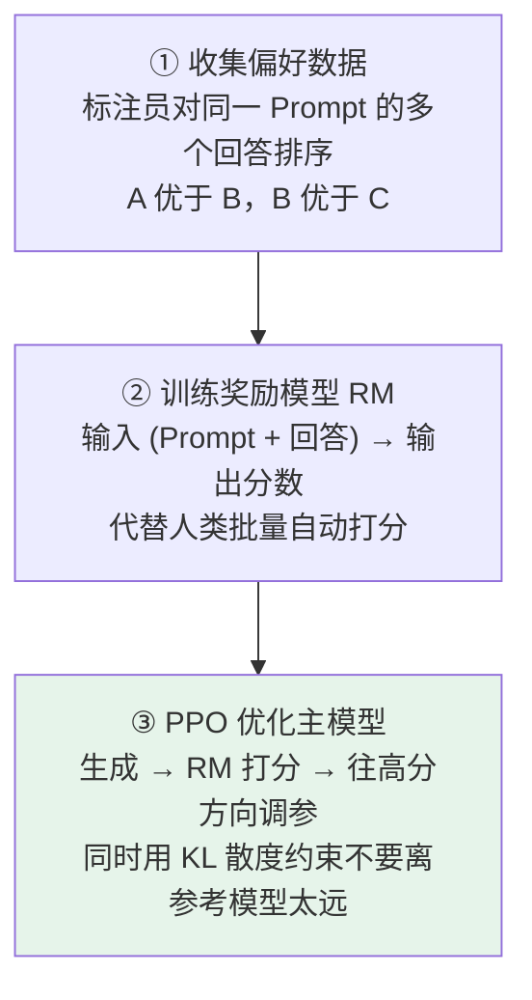
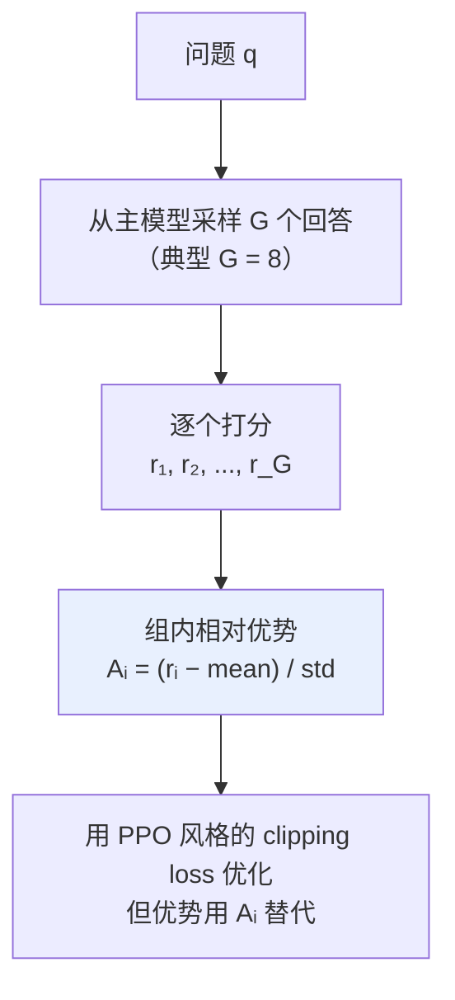

# 第十章：Post-Training 方法全景

## 10.1 SFT 之后模型还差什么

[第六章](06-llm-training.md) 讲过，SFT 把模型从「文本续写机器」变成「按指令回答的对话机器」。

**但 SFT 学到的只是「合格」，不是「优质」。**

### 10.1.1 两个没解决的问题

**① 质量偏好没有区分**

同一个问题可以有很多种「合格」回答：简洁的、啰嗦的、带代码的、纯文字的、承认不确定的、硬装专业胡说的。SFT 数据里各种风格都有，模型学完之后**会随机挑一种输出**，但用户对质量是有偏好的。

**② 安全对齐缺失**

SFT 数据里可能没覆盖「怎么造毒」「怎么诈骗」这类场景，SFT 模型遇到可能就一本正经地回答了。Post-Training 的任务之一就是教会模型**什么不能说、不知道就说不知道**。

### 10.1.2 Post-Training 是个上位概念

它覆盖 SFT 之后所有继续训练的方法。工业界主流的 post-training 方案大致可以分成五类，**而且每一类解决的问题都不一样**。

## 10.2 RLHF：经典方案，4 模型架构

由 OpenAI 在 InstructGPT 中开创，也是 ChatGPT 早期版本的核心训练方法。

### 10.2.1 三步流程



**为什么用排序而不是打分？** 因为人类比较两个回答的相对好坏，比给绝对分数容易得多、也更稳定。

**参考模型（SFT 模型的冻结副本）的作用**：用 KL 散度把主模型拴住，防止**奖励 hacking**——模型学会欺骗奖励模型而不是真的变好。

### 10.2.2 四个模型

| 模型 | 作用 |
|---|---|
| **Policy** | 正在被训练的主模型 |
| **Reference** | SFT 模型的冻结副本，提供 KL 约束基准 |
| **Reward Model** | 给回答打分 |
| **Value Model** | 估计当前状态的预期奖励，作为优势函数的基线 |

### 10.2.3 优缺点

| 优点 | 缺点 |
|---|---|
| **效果上限高**：RL 能探索出 SFT 数据里没有的好回答方式 | **4 个模型同时训练**，显存是 SFT 的好几倍 |
| | PPO 本身不稳定、超参敏感 |
| | reward hacking 风险始终存在 |

工业界能稳定驾驭 RLHF 的团队凤毛麟角，所以后来出现了一系列简化方案。

## 10.3 DPO：绕过奖励模型的等价转换

2023 年斯坦福提出，核心是一个**数学上的等价转换**：RLHF 的优化目标可以推导改写成纯监督学习的目标函数。

直觉上，**奖励模型的功能被「主模型相对于参考模型的概率比值」完全替代了**。

### 10.3.1 数据格式简单到不能再简单

```python
# DPO 训练数据：每条是一个三元组
{
    "prompt": "如何学好 Python？",
    "chosen": "建议先从官方文档入手，配合做小项目实践……",   # 人类更偏好
    "rejected": "Python 很简单，随便找个教程看看就行了……"    # 人类不喜欢
}
```

### 10.3.2 损失函数的直觉

```python
# 简化直觉版，不是完整公式
loss = -log(sigmoid(
    beta * (
        log(policy(chosen)   / ref(chosen))     # 好回答上的概率比
      - log(policy(rejected) / ref(rejected))   # 差回答上的概率比
    )
))
# 目标：让 chosen 的比值大于 rejected 的比值
# 即训练后对好回答的概率提升，对差回答的概率降低
```

### 10.3.3 优势与代价

| 优势 | 代价 |
|---|---|
| **只需 2 个模型**（policy + reference），显存是 RLHF 的一半 | **效果上限略低于精心调过的 PPO**：优化目标是「往偏好数据分布靠拢」，**没法探索数据之外的好回答** |
| **训练稳定**：变成监督学习，没有 RL 的不稳定性 | **依赖偏好数据质量**：偏好对收集得不好，学到的偏好就失真 |
| 实现简单，现成框架就能写 | |

**谁在用**：Zephyr、部分 Mistral / Qwen 社区微调版本，以及大量开源 Instruct 派生模型。

> **Llama 2-Chat 要单独记**：它不是 DPO 的代表，而是 **SFT + 拒绝采样 + PPO/RLHF** 的经典案例。

## 10.4 GRPO：砍掉 Value Model 的 PPO 进化版

由 DeepSeek 在 DeepSeek-Math 论文里提出，后来 DeepSeek-R1 把它推向风口浪尖。**最近公开讨论对齐方法时，GRPO 几乎绕不过去。**

### 10.4.1 先搞清楚 PPO 为什么需要 Value Model

在强化学习里，**优势（Advantage）**表示「这个动作比平均水平好多少」，PPO 用它决定参数往哪调。

$$
A = r - V(s)
$$

Value Model 的作用就是估计 $V(s)$ 作为基线。**它是个独立神经网络，规模通常和主模型一样大**，要单独训练、占显存、调参——这是 PPO 显存吃紧的根源之一。

### 10.4.2 GRPO 的核心创新

**直接砍掉 Value Model，用「同一个问题采样 G 个回答，组内归一化」来估计优势。**



**这个替换的洞见在于**：既然要的是「比平均好多少」，那就直接采样一组、拿组内均值当基线——**根本不需要一个神经网络来预测基线**。

### 10.4.3 三个优势

| 优势 | 说明 |
|---|---|
| **省掉 Value Model** | 4 个模型变 3 个，显存接近 DPO，**但保留了 RL 的探索能力** |
| **训练更稳** | 组内归一化天然降低梯度方差，比 PPO 容易训 |
| **特别适合可验证任务** | 数学、代码这种「对就是对」的任务，$r_i$ 不需要训练奖励模型，**直接用对错判定**（DeepSeek R1-Zero 连 Reward Model 都省了） |

第三点是它为什么在推理模型时代爆火的关键：**推理任务天然有对错可验证的特性**。

> 但别把所有推理模型都一口咬定为 GRPO。公开报告怎么写就怎么说，没有公开细节的说「可能采用类似路线」更稳妥。

## 10.5 拒绝采样：简单粗暴的迭代式 SFT

五种方法里最简单的一个，**根本不用 RL**。

### 10.5.1 流程

```
① 给模型一批 Prompt
② 每个 Prompt 生成多个候选回答（典型 K = 8 或 16）
③ 用奖励模型 / 人类标注 / 规则判定给所有候选打分
④ 筛出每个 Prompt 得分最高的回答
⑤ 把（Prompt, 最高分回答）当作新的 SFT 数据，再做一轮 SFT
```

**没有 RL 算法、没有 PPO/DPO 损失函数**，就是「采样 → 筛选 → 再 SFT」的循环。

### 10.5.2 优缺点

| 优点 | 代价 |
|---|---|
| 实现极简，就是反复 SFT | **上限不如 RL**：学到的只是「自己生成的高分回答的分布」，没有探索能力 |
| 训练极稳（纯监督学习） | 多轮迭代成本高：每轮都要采样 + 筛选 + SFT |
| **可解释**：训练数据全在那里，调试容易 | |

**谁在用**：Llama 2 的对齐流程、Llama 3 的早期阶段。它通常作为对齐的**热身步骤**——先把模型推到一个不错的起点，再用 DPO 或 GRPO 精修。

## 10.6 RLAIF：让强 AI 当老师

RLHF 的变种：**用一个更强的 AI 模型替代人类标注员**去给候选回答打偏好排序。

### 10.6.1 动机是成本

人类标注偏好极其昂贵：

| 环节 | 成本 |
|---|---|
| 一个偏好对 | 标注员读两份回答做选择，平均 1–2 分钟 |
| 训一个高质量 RM | 需要几十万对偏好数据 |
| 总数据成本 | 几百万美金起步 |

用 GPT-4 级别模型给训练数据打分，可以批量生成偏好数据，把人工成本大幅降下来。

> 当然这不是零成本——**教师模型调用本身要钱，还可能把教师的偏见带进数据**。

### 10.6.2 代表工作与代价

| 代表工作 | 说明 |
|---|---|
| **Anthropic Constitutional AI** | 用模型自己批评自己的回答，生成「自我修正后的好版本」作为偏好对 |
| **Google RLAIF 论文** | 直接对比 RLHF 与 RLAIF，发现多个任务上效果相当甚至更好 |

**代价**：

1. **依赖一个强教师**——如果你的模型本身就是当前最强的，找不到比它更强的老师；
2. **可能放大教师的偏见**。

现在很多大厂用的是「人类标注 + AI 标注混合」策略，**纯人类标注已经越来越少**。

## 10.7 五类方案对比

| 方法 | 是否用 RL | 维护模型数 | 训练稳定性 | 效果上限 | 典型应用 |
|---|---|---|---|---|---|
| **RLHF（PPO）** | 是 | 4（policy / ref / RM / value） | 较差 | 高 | ChatGPT 早期 |
| **DPO** | 否（监督学习） | 2（policy / ref） | 好 | 中高 | Zephyr、社区 Instruct 模型 |
| **GRPO** | 是 | 3（policy / ref / RM） | 好 | 高 | DeepSeek-R1、Qwen-Math |
| **拒绝采样** | 否（迭代 SFT） | 2（policy / RM） | 极好 | 中 | Llama 2 早期、Llama 3 热身 |
| **RLAIF** | 是 | 3–4（RM 由 AI 标注） | 较差 | 高 | Constitutional AI |

### 10.7.1 怎么选

| 你的情况 | 选择 |
|---|---|
| **资源有限 + 实现优先简单** | **DPO**。2 个模型搞定，绝大多数开源 Instruct 模型都用这招 |
| **推理类任务（数学、代码等答案可验证）+ 想探索能力上限** | **GRPO**。DeepSeek-R1 走的就是这条路 |
| 想先有稳定对齐基线再精修 | 先**拒绝采样**热身，再按资源选 DPO 或 PPO |
| 数据规模大 + 标注成本敏感 | **RLAIF** 替代部分人类标注 |

### 10.7.2 最关键的认知：它们不是互相替代

**真实的对齐流程通常是组合使用的：**

- **Llama 2-Chat**：SFT + 拒绝采样 + PPO/RLHF；
- **DeepSeek-R1**：SFT 冷启动 + GRPO 多轮迭代 + 拒绝采样筛数据。

把这五类当成「五选一」，会直接看错真实训练流程。

## 10.8 常见错误

### 10.8.1 认为 SFT 之后就够了

SFT 只学到「合格」不是「优质」，且**安全对齐完全没做**。

### 10.8.2 把五类方法当成互斥选项

真实流程是组合的。Llama 2-Chat 和 DeepSeek-R1 都用了多种方法串联。

### 10.8.3 说不清 RLHF 为什么要 4 个模型

policy / reference / reward / value 各司其职。说不出 value model 干什么，就没法理解 GRPO 的创新点。

### 10.8.4 说不出参考模型的作用

KL 约束防止奖励 hacking。这是 RLHF 最关键的工程细节之一。

### 10.8.5 认为 DPO 全面优于 PPO

DPO 省资源、更稳，但**没有探索能力**，效果上限低于精心调过的 PPO。这是一个明确的权衡。

### 10.8.6 说不清 GRPO 到底省掉了什么

省的是 **Value Model**，用组内归一化替代神经网络基线。不知道这一点就只是在背名词。

### 10.8.7 把「所有推理模型都用 GRPO」说死

只说公开报告写了的。没有公开细节的说「可能采用类似路线」。

### 10.8.8 忽略拒绝采样

它是最简单也最稳的方法，常作为对齐热身步骤。忽略它说明只看过论文没看过实际流程。

## 10.9 本章总结

1. **SFT 只解决「合格」**，质量偏好与安全对齐都得靠 Post-Training；
2. **RLHF 三步**：偏好排序 → 训 RM → PPO 优化，用 KL 约束防奖励 hacking；
3. **RLHF 要维护 4 个模型**，显存和调参成本都高，能驾驭的团队很少；
4. **DPO 的本质是等价转换**：RM 的功能被「policy 相对 ref 的概率比值」替代，模型数减半；
5. **DPO 的代价是没有探索能力**，上限低于精调 PPO，且高度依赖偏好数据质量；
6. **GRPO 砍掉 Value Model**，用组内采样归一化估计优势，4 模型变 3 模型；
7. **GRPO 特别适合可验证任务**，R1-Zero 连 Reward Model 都省了，直接用对错判定；
8. **拒绝采样是「采样-筛选-再 SFT」的循环**，极简极稳，常作为对齐热身；
9. **RLAIF 用强 AI 代替人类标注**，省成本但依赖强教师且可能放大偏见；
10. **五类方法不是互斥的**，真实流程是组合使用——这是这道题最核心的认知。

> post-training 的一个明显趋势是尽量减少要维护的模型和训练不稳定性；RLHF、GRPO、DPO、拒绝采样分别代表了几种不同的取舍。

## 参考资料

- [Training language models to follow instructions with human feedback（InstructGPT / RLHF）](https://arxiv.org/abs/2203.02155)
- [Direct Preference Optimization: Your Language Model is Secretly a Reward Model](https://arxiv.org/abs/2305.18290)
- [DeepSeekMath: Pushing the Limits of Mathematical Reasoning in Open Language Models（GRPO）](https://arxiv.org/abs/2402.03300)
- [DeepSeek-R1: Incentivizing Reasoning Capability in LLMs via Reinforcement Learning](https://arxiv.org/abs/2501.12948)
- [Llama 2: Open Foundation and Fine-Tuned Chat Models](https://arxiv.org/abs/2307.09288)
- [Constitutional AI: Harmlessness from AI Feedback](https://arxiv.org/abs/2212.08073)
- [RLAIF vs. RLHF: Scaling Reinforcement Learning from Human Feedback with AI Feedback](https://arxiv.org/abs/2309.00267)
- [Proximal Policy Optimization Algorithms（PPO）](https://arxiv.org/abs/1707.06347)
- [Zephyr: Direct Distillation of LM Alignment](https://arxiv.org/abs/2310.16944)
