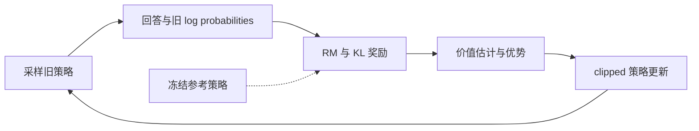
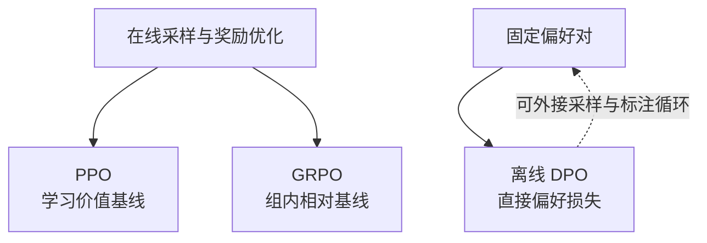

# 第十一章：DPO vs PPO 深度对比

## 11.1 先限定比较对象

**PPO 是通用的强化学习优化算法**，可以使用环境奖励、规则奖励或奖励模型；并非天生需要先训练“裁判”。**DPO 是从偏好数据直接优化策略的方法**，标准离线形式不需要独立奖励模型与在线 rollout。

本章重点比较“带学习奖励模型的 PPO-RLHF”和“标准离线 DPO”，而不是把所有 PPO 应用都算成四模型 RLHF。

| | PPO-RLHF | 标准离线 DPO |
|---|---|---|
| 数据流 | 学 RM，再采样、评分、更新策略 | 在固定 chosen / rejected 上计算偏好损失 |
| 新反馈 | 来自训练中策略生成的回答 | 优化阶段不主动生成新数据 |
| 两者共享的难点 | 反馈偏差、分布外泛化、过优化与独立评估 | 同左 |

SFT 也能学到质量与安全行为；进一步偏好优化是针对剩余问题，而非跨越一道“只能合格、不能优质”的硬边界。

## 11.2 PPO：奖励建模与在线策略更新

### 11.2.1 偏好如何训练奖励模型

设同一 prompt `x` 下，人类更偏好 `yw` 而不是 `yl`。Bradley–Terry 模型写成：

$$
P(y_w\succ y_l\mid x)
=\sigma\bigl(r_\phi(x,y_w)-r_\phi(x,y_l)\bigr)
$$

最小化偏好标签的负对数似然得到奖励模型。这里 `σ` 是 sigmoid，`rφ` 是可学习标量分数。相对比较只能识别奖励差：给同一问题的所有答案加一个相同常数，不改变比较概率。

奖励是标注偏好的代理，不是真实质量的无误测量。学习奖励模型也不会自动消除标注噪声，它可能学习长度、措辞等捷径，并在策略探索到分布外回答时失准。

### 11.2.2 KL 正则化目标

$$
J(\theta)=
\mathbb{E}_{x\sim\mathcal D}
\left[
\mathbb{E}_{y\sim\pi_\theta(\cdot\mid x)}r_\phi(x,y)
-\beta D_{\mathrm{KL}}
\bigl(\pi_\theta(\cdot\mid x)\Vert\pi_{\mathrm{ref}}(\cdot\mid x)\bigr)
\right]
$$

其中 `β` 为正，参考策略通常是冻结的 SFT checkpoint。KL 惩罚偏离参考分布，限制奖励过优化；它不是硬性的安全边界，也不保证 reward hacking 不发生。

常见实现把 log-ratio 的 KL 估计放入 token 奖励，再在终止位置加入 RM 分数。奖励缩放与 KL 系数共同决定优化强度，因此只报告 `β` 而不报告奖励尺度，比较意义有限。

### 11.2.3 PPO clipping 到底截断什么

对采样旧策略产生的状态 `st`（文本前缀）和动作 `at`（下一个 token），定义：

$$
\rho_t(\theta)=
\frac{\pi_\theta(a_t\mid s_t)}
{\pi_{\mathrm{old}}(a_t\mid s_t)}
$$

PPO 的 clipped surrogate 要最大化：

$$
J_{\mathrm{clip}}(\theta)=
\mathbb{E}_t\left[
\min\left(
\rho_t\hat A_t,
\mathrm{clip}(\rho_t,1-\epsilon,1+\epsilon)\hat A_t
\right)
\right]
$$

`Ât` 是估计优势。正优势动作不应因一次更新就获得无限增大的相对概率；负优势动作的更新也在相应方向受到截断。**Clipping 限制的是目标中的激励，不是保证实际概率比永不越界的硬投影。**

两个容易混淆的基准：

| 策略 | 用途 | 更新频率 |
|---|---|---|
| `πold` | PPO 重要性概率比的分母，匹配本批 rollout 来源 | 随采样迭代变化 |
| `πref` | 相对原始行为分布的 KL 正则基准 | 通常整个阶段固定 |

PPO clipping 与 reference KL 解决不同问题，不能说“有 clipping 就不用参考约束”。

### 11.2.4 Value / Critic 做什么

Critic 估计某前缀之后的预期回报。token 级 PPO 常用时序差分残差及 GAE：

$$
\delta_t=r_t+\gamma V(s_{t+1})-V(s_t),
\qquad
\hat A_t=\sum_{l=0}^{T-t-1}(\gamma\lambda)^l\delta_{t+l}
$$

这里按 `t = 0,…,T−1` 编号，终止状态通常取 `V(sT) = 0`。`γ` 为折扣系数，`λ` 控制优势估计的偏差—方差取舍；截断但未终止的样本如何 bootstrap 需要按实现处理。

所以“优势永远等于最终奖励减 V”只是一步任务的简化直觉，不能代替一般 token 级公式。



策略和价值网络通常训练，参考和奖励网络通常冻结。共享价值头、参考计算缓存、模型大小、rollout 引擎和分片都会改变资源占用，不能用“4 个模型所以显存固定是 4 倍”估计。

## 11.3 DPO：从最优策略关系得到偏好损失

### 11.3.1 推导中的等价性

对固定奖励 `r`、固定参考策略以及正的 `β`，在合适支持集上优化前述 KL 正则化目标，理想最优策略为：

$$
\pi^*(y\mid x)=
\frac{1}{Z(x)}\pi_{\mathrm{ref}}(y\mid x)
\exp\left(\frac{r(x,y)}{\beta}\right)
$$

其中：

$$
Z(x)=\sum_y\pi_{\mathrm{ref}}(y\mid x)
\exp\left(\frac{r(x,y)}{\beta}\right)
$$

重排得到：

$$
r(x,y)=
\beta\log\frac{\pi^*(y\mid x)}{\pi_{\mathrm{ref}}(y\mid x)}
+\beta\log Z(x)
$$

**这是相差一个只依赖 x 的加性项，不是简单的“奖励正比于 log-ratio”。** 同一个 prompt 的两答案做差时，`β log Z(x)` 抵消，因此无需计算昂贵的配分函数。

这个推导要求参考策略在有关回答上有非零概率、归一化可定义，并采用特定偏好概率模型。它描述奖励与最优策略的关系，不能推出有限数据、有限模型和有限训练下 DPO 与 PPO 完全等效。

### 11.3.2 完整损失

用 `πθ` 参数化策略，把上述奖励差代入 Bradley–Terry 偏好似然：

$$
\mathcal{L}_{\mathrm{DPO}}(\theta)=
-\mathbb{E}_{(x,y_w,y_l)\sim\mathcal D}
\log\sigma\left[
\beta\left(
\log\frac{\pi_\theta(y_w\mid x)}{\pi_{\mathrm{ref}}(y_w\mid x)}
-\log\frac{\pi_\theta(y_l\mid x)}{\pi_{\mathrm{ref}}(y_l\mid x)}
\right)
\right]
$$

这是直接对偏好标签的分类损失，不需要先得到一个显式 RM 再用 PPO 优化它。

序列 log probability 应通过回答 token 求和：

$$
\log\pi_\theta(y\mid x)=
\sum_{t=1}^{|y|}
\log\pi_\theta(y_t\mid x,y_1,\ldots,y_{t-1})
$$

标准形式不能随意改成平均 token log probability 而仍声称目标未变。长度归一化属于改变目标或变体，需要说明理由与评测。

### 11.3.3 实现中的数值与 masking

```python
import torch.nn.functional as F

# 输入是已按回答 token 掩码求和后的序列 log probabilities
policy_margin = policy_chosen_logps - policy_rejected_logps
reference_margin = ref_chosen_logps - ref_rejected_logps
loss = -F.logsigmoid(beta * (policy_margin - reference_margin)).mean()
```

直接计算 token 概率的连乘容易下溢，应使用 log-softmax 后 gather 与求和。Prompt、padding 不计入回答得分，EOS 与截断规则必须保持策略和参考一致。

若预计算参考 log probabilities，必须固定参考权重、tokenizer、模板和截断方式，并保证无随机 dropout；改变这些配置后缓存应失效。

### 11.3.4 为什么 chosen 概率也可能下降

DPO 优化的是两答案相对参考策略的 log-ratio **差值**。两者都下降但 rejected 降得更多，也可能让偏好损失改善。因此不仅要看偏好分类准确率，还应观察 chosen 的似然、回答长度、独立任务分数与生成退化。

在理想 KL 奖励目标中，较大的 `β` 表示更强的参考约束；但在实际 DPO 损失中，它也缩放 margin 与梯度，并影响 sigmoid 饱和。不能简单解释成“β 越大每一步更新必然越小”，需要与学习率、数据和训练步数联合验证。

## 11.4 真正的取舍：反馈覆盖与系统成本

| 维度 | PPO-RLHF | 标准离线 DPO |
|---|---|---|
| 在线生成 | 通常需要 | 优化阶段不需要 |
| 奖励来源 | 此处用学习 RM；PPO 本身也可用规则 | 成对偏好标签，隐式奖励参数化 |
| 价值估计 | 常用 Critic / GAE | 不需要 |
| 主要工程复杂度 | 采样与训练协调、奖励、优势与策略版本 | 成对数据、log probability、参考一致性 |
| 分布风险 | RM 对新策略输出的外推误差 | 离线数据覆盖不足 |
| 稳定性 | 依赖奖励、优势和更新设置 | 流程较简单，但仍可能过拟合、退化 |
| 质量上限 | 无统一保证 | 无统一保证 |

### 11.4.1 离线不等于不能泛化

DPO 模型仍通过共享参数学习，能生成训练对之外的回答。缺少的是**标准训练循环中的主动采样与新反馈**，不是把输出限制成已知 chosen / rejected 的查表。

反过来，PPO 能探索也不意味着探索一定有效：如果奖励判断错了，探索越多可能越善于钻漏洞。用 AI 或人类重新标注当前策略输出，再继续 DPO，也能形成在线收集、离线更新的迭代系统。

### 11.4.2 如何公平比较

至少控制基座、目标任务分布、评测集与解码预算，并分别报告：

- 偏好标注、RM 训练与在线采样成本；
- 策略训练 token 数及总硬件时间；
- RM 分数与独立人类/可验证指标是否一致；
- 长度、事实性、安全和通用能力退化。

不存在“PPO 的 RM 总能平滑噪声，所以比 DPO 更不怕脏数据”的保证。两者都可能放大监督信号里的系统偏差。

## 11.5 GRPO 与这个比较的关系

GRPO 是 PPO 风格的在线优化路线，主要改变优势估计：同题采样多个回答，用组内奖励均值和标准差计算相对优势，不训练 Critic。

$$
\hat A_i=
\frac{r_i-\bar r}{s_r+\varepsilon},
\qquad
\bar r=\frac{1}{G}\sum_{j=1}^{G}r_j
$$

这里的 `ε` 是数值保护。结果监督版本把同一优势赋给回答中的 token，再结合截断概率比与 KL。全组奖励相同则任务优势为零；组内归一化也可能引入难度加权和噪声敏感问题。



可验证任务可以用规则奖励，省掉学习 RM，但这一点**不是 GRPO 独有**。R1-Zero 的初版报告使用准确性与格式奖励，并复用了预训练基座，不能称为“只用 0/1 从零学会推理”。

省掉 Critic 不意味着总显存接近 DPO：多回答 rollout、上下文长度、参考策略和训练调度都可能占很大比重。

## 11.6 按条件选择，而不是按效果排队

- 已有可信偏好对、在线生成昂贵：DPO 是自然基线。
- 可以稳定在线打分、需要持续覆盖当前策略的回答：比较 PPO 或 GRPO。
- 组内奖励几乎总相同：先改善题目难度、采样覆盖或奖励，不要仅更换算法名字。
- 奖励模型与独立评测不一致：先排查奖励漏洞和评测，而不是增加 RL 步数。

公开报告支持的例子包括 InstructGPT、Llama 2-Chat 的 PPO-RLHF，以及 Llama 3 报告中的 DPO。不能据此断言未公开模型用哪种算法，也不能把同名后续版本的流程自动等同于初版。

## 11.7 常见追问

1. **DPO 为什么不需要 Z(x)？** 同一问题的奖励差抵消了加性归一化项。
2. **两个 ratio 的分母是不是同一个模型？** PPO clipping 比的是采样旧策略；DPO 隐式奖励和 RLHF KL 用的是参考策略。
3. **参考策略可以删掉吗？** 预计算可以省常驻显存；改成 reference-free 损失则是另一个目标，不能假装公式未变。
4. **KL 可以防止所有奖励黑客吗？** 不能，只能约束偏移，奖励错误仍需要修正。
5. **训练 loss 更低就更对齐吗？** 只说明拟合了训练目标；需要独立的生成评估。

## 11.8 本章总结

PPO-RLHF 用在线奖励、优势估计和截断策略更新；DPO 通过特定偏好模型下的奖励重参数化，直接训练偏好对。二者的关键区别是**新反馈如何获得、参考约束如何进入目标，以及为此承担什么系统成本**，而不是谁拥有固定更高的能力上限。

## 参考资料

- [Proximal Policy Optimization Algorithms](https://arxiv.org/abs/1707.06347)
- [OpenAI Spinning Up：PPO-Clip 公式与约束边界](https://spinningup.openai.com/en/latest/algorithms/ppo.html)
- [InstructGPT](https://arxiv.org/abs/2203.02155)
- [DPO：§4 与附录 A 推导](https://arxiv.org/html/2305.18290v3)
- [DeepSeekMath：GRPO](https://arxiv.org/html/2402.03300v2)
- [DeepSeek-R1，初版](https://arxiv.org/html/2501.12948v1)
- [Llama 2](https://arxiv.org/html/2307.09288v2)
- [The Llama 3 Herd of Models](https://arxiv.org/html/2407.21783v3)
- [High-Dimensional Continuous Control Using Generalized Advantage Estimation](https://arxiv.org/abs/1506.02438)
