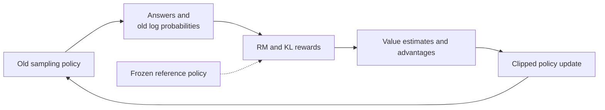
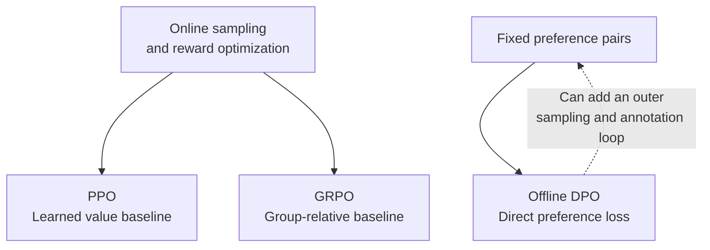

# Chapter 11: DPO vs. PPO in Depth

## 11.1 Define the Comparison First

**PPO is a general reinforcement learning optimization algorithm.** It can use environment rewards, rule-based rewards, or a reward model; it does not inherently require training a “judge” first. **DPO directly optimizes a policy from preference data.** Its standard offline form needs neither an independent reward model nor online rollouts.

This chapter compares PPO-RLHF with a learned reward model against standard offline DPO, rather than treating every PPO application as four-model RLHF.

| | PPO-RLHF | Standard offline DPO |
|---|---|---|
| Data flow | Learn an RM, then sample, score, and update the policy | Compute preference loss on fixed chosen / rejected pairs |
| New feedback | Comes from answers generated by the policy during training | No active generation of new data during optimization |
| Shared challenges | Feedback bias, out-of-distribution generalization, overoptimization, independent evaluation | Same |

SFT can also teach quality and safety behavior. Further preference optimization addresses remaining problems; it does not cross a hard boundary from “merely acceptable” to “high-quality.”

## 11.2 PPO: Reward Modeling and Online Policy Updates

### 11.2.1 How Preferences Train a Reward Model

Suppose humans prefer `yw` to `yl` for the same prompt `x`. The Bradley–Terry model is:

$$
P(y_w\succ y_l\mid x)
=\sigma\bigl(r_\phi(x,y_w)-r_\phi(x,y_l)\bigr)
$$

The reward model is trained by minimizing the negative log-likelihood of preference labels. Here, `σ` is the sigmoid and `rφ` is a learned scalar score. Relative comparisons identify only reward differences: adding the same constant to every answer's reward for a given question leaves comparison probabilities unchanged.

Reward is a proxy for annotated preferences, not an infallible measurement of true quality. Learning a reward model does not automatically remove annotation noise. It may learn shortcuts based on length or phrasing and become inaccurate when the policy explores out-of-distribution answers.

### 11.2.2 The KL-Regularized Objective

$$
J(\theta)=
\mathbb{E}_{x\sim\mathcal D}
\left[
\mathbb{E}_{y\sim\pi_\theta(\cdot\mid x)}r_\phi(x,y)
-\beta D_{\mathrm{KL}}
\bigl(\pi_\theta(\cdot\mid x)\Vert\pi_{\mathrm{ref}}(\cdot\mid x)\bigr)
\right]
$$

`β` is positive, and the reference policy is usually a frozen SFT checkpoint. KL penalizes drift from the reference distribution to limit reward overoptimization. It is not a hard safety boundary and does not guarantee the absence of reward hacking.

Common implementations put a log-ratio estimate of KL into token rewards and add the RM score at the terminal position. Reward scaling and the KL coefficient jointly determine optimization strength, so reporting `β` without the reward scale makes comparisons less meaningful.

### 11.2.3 What Does PPO Clipping Actually Clip?

For a state `st` (a text prefix) and action `at` (the next token) generated by the old sampling policy, define:

$$
\rho_t(\theta)=
\frac{\pi_\theta(a_t\mid s_t)}
{\pi_{\mathrm{old}}(a_t\mid s_t)}
$$

PPO maximizes the clipped surrogate:

$$
J_{\mathrm{clip}}(\theta)=
\mathbb{E}_t\left[
\min\left(
\rho_t\hat A_t,
\mathrm{clip}(\rho_t,1-\epsilon,1+\epsilon)\hat A_t
\right)
\right]
$$

`Ât` is the estimated advantage. An action with positive advantage should not gain unlimited relative probability from an update; updates for negative-advantage actions are also clipped in the corresponding direction. **Clipping limits the incentive in the objective. It is not a hard projection guaranteeing that actual probability ratios never leave the interval.**

Two baselines are easy to confuse:

| Policy | Purpose | Update frequency |
|---|---|---|
| `πold` | Denominator of PPO's importance ratio, matching the source of the current rollout batch | Changes with sampling iterations |
| `πref` | KL-regularization baseline relative to the original behavior distribution | Usually fixed throughout the stage |

PPO clipping and reference KL address different problems. Having clipping does not make the reference constraint unnecessary.

### 11.2.4 What Does the Value Model / Critic Do?

The critic estimates expected return after a prefix. Token-level PPO often uses temporal-difference residuals and GAE:

$$
\delta_t=r_t+\gamma V(s_{t+1})-V(s_t),
\qquad
\hat A_t=\sum_{l=0}^{T-t-1}(\gamma\lambda)^l\delta_{t+l}
$$

The indexing here is `t = 0,…,T−1`, and the terminal state usually has `V(sT) = 0`. `γ` is the discount factor; `λ` controls the bias–variance tradeoff in advantage estimation. How to bootstrap truncated but nonterminal samples depends on the implementation.

“Advantage always equals final reward minus V” is therefore only a simplified intuition for one-step tasks, not a replacement for the general token-level formula.



The policy and value network usually train, while the reference and reward network usually remain frozen. Shared value heads, cached reference computations, model sizes, rollout engines, and sharding all change resource usage. Four model roles do not establish a fixed fourfold memory requirement.

## 11.3 DPO: From the Optimal-Policy Relationship to Preference Loss

### 11.3.1 What Is Equivalent in the Derivation?

For a fixed reward `r`, a fixed reference policy, and positive `β`, optimizing the earlier KL-regularized objective over a suitable support gives the ideal optimal policy:

$$
\pi^*(y\mid x)=
\frac{1}{Z(x)}\pi_{\mathrm{ref}}(y\mid x)
\exp\left(\frac{r(x,y)}{\beta}\right)
$$

Here:

$$
Z(x)=\sum_y\pi_{\mathrm{ref}}(y\mid x)
\exp\left(\frac{r(x,y)}{\beta}\right)
$$

Rearranging gives:

$$
r(x,y)=
\beta\log\frac{\pi^*(y\mid x)}{\pi_{\mathrm{ref}}(y\mid x)}
+\beta\log Z(x)
$$

**The relationship includes an additive term depending only on x; it is not simply “reward is proportional to the log-ratio.”** When subtracting rewards for two answers to the same prompt, `β log Z(x)` cancels, avoiding the expensive partition-function computation.

The derivation requires nonzero reference probability for the relevant answers, well-defined normalization, and a particular preference probability model. It relates rewards to optimal policies; it does not establish complete equivalence between DPO and PPO with finite data, model capacity, and training.

### 11.3.2 The Full Loss

Parameterize the policy as `πθ` and substitute the reward difference into the Bradley–Terry preference likelihood:

$$
\mathcal{L}_{\mathrm{DPO}}(\theta)=
-\mathbb{E}_{(x,y_w,y_l)\sim\mathcal D}
\log\sigma\left[
\beta\left(
\log\frac{\pi_\theta(y_w\mid x)}{\pi_{\mathrm{ref}}(y_w\mid x)}
-\log\frac{\pi_\theta(y_l\mid x)}{\pi_{\mathrm{ref}}(y_l\mid x)}
\right)
\right]
$$

This is a classification loss directly on preference labels. It does not require first obtaining an explicit RM and then optimizing against it with PPO.

Sequence log probabilities are sums over answer tokens:

$$
\log\pi_\theta(y\mid x)=
\sum_{t=1}^{|y|}
\log\pi_\theta(y_t\mid x,y_1,\ldots,y_{t-1})
$$

Replacing this sum with the mean token log probability changes the standard objective. Length normalization is an objective modification or variant that requires a rationale and evaluation.

### 11.3.3 Numerical Details and Masking

```python
import torch.nn.functional as F

# Inputs are sequence log probabilities, summed with an answer-token mask.
policy_margin = policy_chosen_logps - policy_rejected_logps
reference_margin = ref_chosen_logps - ref_rejected_logps
loss = -F.logsigmoid(beta * (policy_margin - reference_margin)).mean()
```

Multiplying token probabilities directly is prone to underflow. Use log-softmax, then gather and sum. Prompt and padding tokens do not contribute to the answer score, and the policy and reference must use consistent EOS and truncation rules.

If reference log probabilities are precomputed, fix the reference weights, tokenizer, template, and truncation procedure, and ensure dropout introduces no randomness. Changes to these settings must invalidate the cache.

### 11.3.4 Why Can the Chosen Answer's Probability Also Fall?

DPO optimizes the **difference** between the two answers' log-ratios relative to the reference policy. Both probabilities can decline while the preference loss improves if the rejected answer declines more. Monitor chosen-answer likelihood, answer lengths, independent task scores, and generation regressions—not just preference-classification accuracy.

In the ideal KL-regularized reward objective, larger `β` means a stronger reference constraint. In the actual DPO loss, however, it also scales margins and gradients and affects sigmoid saturation. It is not valid to conclude that larger `β` necessarily makes every update smaller. Evaluate it jointly with learning rate, data, and training steps.

## 11.4 The Real Tradeoff: Feedback Coverage and System Cost

| Dimension | PPO-RLHF | Standard offline DPO |
|---|---|---|
| Online generation | Usually required | Not required during optimization |
| Reward source | A learned RM here; PPO itself can also use rules | Pairwise preference labels and implicit reward parameterization |
| Value estimation | Commonly a critic / GAE | Not required |
| Main engineering complexity | Coordinating sampling and training, rewards, advantages, policy versions | Paired data, log probabilities, reference consistency |
| Distribution risk | RM extrapolation errors on new policy outputs | Inadequate offline-data coverage |
| Stability | Depends on rewards, advantages, and update settings | Simpler workflow, but can still overfit or regress |
| Quality ceiling | No universal guarantee | No universal guarantee |

### 11.4.1 Offline Does Not Mean Unable to Generalize

A DPO model still learns through shared parameters and can generate answers beyond its training pairs. What it lacks is **active sampling and fresh feedback inside the standard training loop**, not the ability to do more than look up known chosen / rejected answers.

Conversely, PPO's capacity to explore does not guarantee useful exploration. If reward judgments are wrong, more exploration may simply produce better exploitation of reward flaws. Relabeling current-policy outputs with AI or human feedback and continuing DPO can also form an iterative system of online collection and offline updates.

### 11.4.2 How to Compare Fairly

At a minimum, control the base model, target task distribution, evaluation set, and decoding budget, and separately report:

- Preference annotation, RM training, and online sampling costs.
- Policy training token counts and total hardware time.
- Agreement between RM scores and independent human or verifiable metrics.
- Length, factuality, safety, and regressions in general capabilities.

There is no guarantee that PPO's RM always smooths out noise and therefore tolerates dirty data better than DPO. Both can amplify systematic biases in supervision.

## 11.5 How Does GRPO Fit into This Comparison?

GRPO is a PPO-style online optimization approach whose main change is advantage estimation. It samples multiple answers to the same question and computes relative advantages using the group's reward mean and standard deviation, without training a critic.

$$
\hat A_i=
\frac{r_i-\bar r}{s_r+\varepsilon},
\qquad
\bar r=\frac{1}{G}\sum_{j=1}^{G}r_j
$$

Here, `ε` is a numerical safeguard. The outcome-supervised version assigns the same advantage to an answer's tokens, then combines this with a clipped probability ratio and KL. Equal rewards across the group give zero task advantage. Group normalization can also introduce difficulty-dependent weighting and sensitivity to noise.



Verifiable tasks can use rule-based rewards without a learned RM, but this is **not unique to GRPO**. The initial R1-Zero report used accuracy and format rewards and reused a pretrained base. It cannot be described as learning reasoning from scratch using only a 0/1 signal.

Removing the critic does not put total memory close to DPO's by default. Multi-answer rollouts, context length, reference policies, and training schedules can all consume substantial resources.

## 11.6 Choose by Conditions, Not a Fixed Performance Ranking

- Trustworthy preference pairs are available and online generation is expensive: DPO is a natural baseline.
- Reliable online scoring is possible and current-policy answers need continuous coverage: compare PPO and GRPO.
- Group rewards are almost always identical: improve problem difficulty, sampling coverage, or rewards before merely changing the algorithm's name.
- The reward model disagrees with independent evaluation: investigate reward flaws and evaluation before adding RL steps.

Publicly documented examples include PPO-RLHF in InstructGPT and Llama 2-Chat, and DPO in the Llama 3 report. These examples cannot establish which algorithms undisclosed models use or justify automatically assigning an initial workflow to later versions with the same name.

## 11.7 Common Follow-Up Questions

1. **Why does DPO not need Z(x)?** The reward difference for the same question cancels the additive normalization term.
2. **Do the two ratios use the same model in the denominator?** PPO clipping compares against the old sampling policy; DPO's implicit reward and RLHF KL use the reference policy.
3. **Can the reference policy be removed?** Precomputation can save resident memory. Switching to a reference-free loss changes the objective; it is not the same formula.
4. **Can KL prevent all reward hacking?** No. It only constrains drift; incorrect rewards still need fixing.
5. **Does lower training loss mean better alignment?** It only shows a better fit to the training objective. Independent generation evaluation is still necessary.

## 11.8 Chapter Summary

PPO-RLHF uses online rewards, advantage estimation, and clipped policy updates. DPO directly trains on preference pairs through reward reparameterization under a particular preference model. Their key differences are **how fresh feedback is obtained, how reference constraints enter the objective, and the system costs incurred**, not a fixed difference in capability ceilings.

## References

- [Proximal Policy Optimization Algorithms](https://arxiv.org/abs/1707.06347)
- [OpenAI Spinning Up: PPO-Clip equations and constraint limits](https://spinningup.openai.com/en/latest/algorithms/ppo.html)
- [InstructGPT](https://arxiv.org/abs/2203.02155)
- [DPO: §4 and Appendix A derivations](https://arxiv.org/html/2305.18290v3)
- [DeepSeekMath: GRPO](https://arxiv.org/html/2402.03300v2)
- [DeepSeek-R1, initial version](https://arxiv.org/html/2501.12948v1)
- [Llama 2](https://arxiv.org/html/2307.09288v2)
- [The Llama 3 Herd of Models](https://arxiv.org/html/2407.21783v3)
- [High-Dimensional Continuous Control Using Generalized Advantage Estimation](https://arxiv.org/abs/1506.02438)
