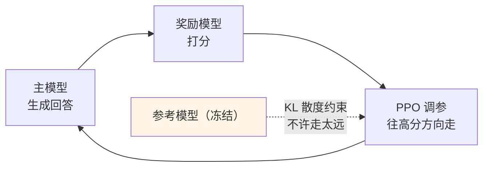
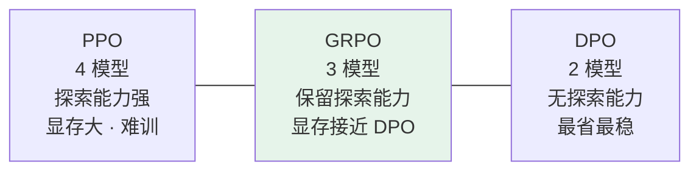

# 第十一章：DPO vs PPO 深度对比

> PPO 和 DPO 经常被放在一起比较，因为它们解决的是同一件事：让模型在 SFT 之后学会区分「能答」与「答得更好」。

## 11.1 一句话抓住区别

| | 类比 |
|---|---|
| **PPO** | **先培养裁判，再训练选手**。裁判（奖励模型）学会打分，选手不断上场比赛拿分，教练根据分数调整训练 |
| **DPO** | **直接拿比赛录像告诉选手哪个动作对**。跳过裁判，直接对照「好动作 / 坏动作」学 |

这个类比能快速抓住两者的结构差异，比直接堆术语更清楚。

## 11.2 PPO：先培养裁判，再训练选手

PPO（Proximal Policy Optimization）本身是强化学习的经典算法，最早不是为大模型设计的，OpenAI 在 InstructGPT 里把它用进了 RLHF 流程。

### 11.2.1 第一步：训练奖励模型

标注员拿到「同一问题的多个回答」按质量排名——比如问「解释什么是递归」，得到 A 优于 B、B 优于 C。

用这些排名训练一个专门的奖励模型，让它学会给回答打质量分。**这个奖励模型就是裁判，它代替人类完成后续的自动评分。**

### 11.2.2 第二步：用 PPO 优化主模型



### 11.2.3 KL 约束这根绳子

**危险在于**：如果只追求高分，模型可能学会钻空子——生成奖励模型给高分但实际没用的内容，这就是 **reward hacking**。

典型表现包括疯狂堆字数、无脑加免责声明、反复复述问题，因为这些模式在偏好数据里恰好与「好回答」相关。

**防御手段**：维护一个参考模型（SFT 模型的冻结副本），用 KL 散度约束主模型不要偏离太远。

$$
\mathrm{objective} = \mathbb{E}\big[r(x,y)\big] - \beta \cdot D_{KL}\big(\pi_\theta \,\|\, \pi_{\mathrm{ref}}\big)
$$

> **KL 散度就像一根绳子**：主模型可以向高分方向移动，但不能走太远。

### 11.2.4 四个模型分别干什么

```python
# PPO 训练时需要同时维护的四个模型
policy_model    = load_sft_model()     # 主模型（正在被优化）
reference_model = load_sft_model()     # 参考模型（冻结副本，用于 KL 约束）
reward_model    = load_reward_model()  # 奖励模型（裁判，给回答打分）
value_model     = load_value_model()   # 价值模型（估算未来奖励期望，做优势基线）
```

**这四个角色分不清，就很难解释 PPO 为什么重、GRPO 又到底省掉了什么**——尤其 value model，不知道它干什么就理解不了 GRPO 的创新点。

4 个模型同时加载进显存，每个都和主模型差不多大，**光显存占用就是 SFT 训练的好几倍**。加上 RL 本身的不稳定性（超参敏感、易 reward hacking、训练曲线震荡），能驾驭 PPO 的团队在业界凤毛麟角。

## 11.3 DPO：绕过裁判，直接看回放

### 11.3.1 核心是一个数学等价转化

研究者发现：**带 KL 约束的 RLHF 优化目标，可以推导改写成一个纯监督学习的损失函数**，不需要显式训练和调用奖励模型。

直觉上，奖励模型的功能被「**主模型相对于参考模型的概率比值**」完全替代了：

$$
r(x, y) \;\propto\; \beta \log \frac{\pi_\theta(y \mid x)}{\pi_{\mathrm{ref}}(y \mid x)}
$$

**如果主模型在某个回答上比参考模型提升了更多概率，那这个回答就被认为更受偏好。**

### 11.3.2 损失函数在做什么

```python
# DPO 损失函数直觉（简化版，不是完整公式）
loss = -log(sigmoid(
    beta * (
        log(policy(chosen)   / ref(chosen))
      - log(policy(rejected) / ref(rejected))
    )
))
```

同时发生两件事：

1. 模型对**好回答**的概率，相对参考模型**升高**；
2. 模型对**差回答**的概率，相对参考模型**降低**。

### 11.3.3 只需两个模型

```python
policy_model    = load_sft_model()   # 主模型（正在被优化）
reference_model = load_sft_model()   # 参考模型（冻结，用于计算概率比）
# 相比 PPO 少了 reward_model 和 value_model，资源需求减半
```

DPO 把对齐训练变成了普通的监督学习问题，**用现成的深度学习框架就能实现**，训练稳定、超参好调。这就是开源社区大量采用它的原因——**不需要复杂的 RL 基础设施**。

## 11.4 完整对比

| 维度 | PPO | DPO |
|---|---|---|
| **是否需要奖励模型** | 需要（要单独训练） | **不需要** |
| **同时维护的模型数** | 4 个 | **2 个** |
| **训练稳定性** | 较差（RL 本身不稳定） | **好（等价于监督学习）** |
| **实现难度** | 高（需要 RL 基础设施） | 低（标准训练框架即可） |
| **表达能力** | **强（可探索训练数据之外的空间）** | 稍弱（受偏好数据分布限制） |
| **对数据质量的敏感度** | 中（RM 可平滑部分噪声） | **高（偏好对有噪声直接学歪）** |
| **代表模型** | InstructGPT、ChatGPT 早期、Llama 2-Chat | Zephyr、部分 Mistral / Qwen 派生 Instruct 模型 |

### 11.4.1 那个最关键的权衡

**DPO 的优化目标是「往偏好数据分布靠拢」**，它永远只能在你给的 chosen/rejected 之间做取舍。

**PPO 是在线采样的**：主模型自己生成回答、拿到分数、再调整。它**能发现偏好数据里根本不存在的更好回答方式**。

这就是「表达能力」那一行的实质含义——不是 DPO 学得不好，而是**它天然被数据分布圈住了**。

## 11.5 GRPO：站在两者中间的方案

GRPO 是 DeepSeek 在 DeepSeekMath 里提出的 PPO 改进版，**核心创新是砍掉 Value Model**。

在 PPO 里，Value Model 估计「当前状态的预期奖励」作为基线，用来算优势函数。它是独立神经网络、规模和主模型差不多、要单独训练和占显存。

GRPO 的做法是：对一个问题采样 $G$ 个回答（典型 $G=8$），用组内归一化算相对优势：

$$
A_i = \frac{r_i - \mathrm{mean}(r_1 \dots r_G)}{\mathrm{std}(r_1 \dots r_G)}
$$

**组内平均分充当了 Value Model 的角色**，这个基线天然就有，不用单独训练。



**GRPO 的杀手级特性**：对可验证任务特别友好。数学题、代码题这类「对就是对、错就是错」的场景，$r_i$ 直接用 0/1 判定，**连 Reward Model 都能省**——DeepSeek R1-Zero 就是纯靠这个训出推理能力的。

实际讨论里，GRPO 的关键就落在这句「**砍掉 Value Model，用组内归一化代替**」。

## 11.6 各自适合什么场景

| 方案 | 适合谁 |
|---|---|
| **PPO** | 对齐效果要求极高、**资源充足、有 RL 工程能力**的团队。ChatGPT 早期的强大效果很大程度来自精心调优的 PPO 流程，但门槛极高 |
| **DPO** | **快速迭代、GPU 有限、开源社区场景**。不需要 RL 工程能力，偏好数据众包打排名就能收集，训练一次成功率高 |
| **GRPO** | **可验证任务**（数学、代码），想保留 RL 探索能力但显存吃紧 |

### 11.6.1 一条简单的判断原则

> **想在已有偏好数据的分布上把质量提升一步 → DPO 够用且高效。**
> **需要模型探索超出现有数据的能力边界，或对齐效果要求接近顶级水平 → 才值得投入 PPO 的工程成本。**

## 11.7 常见错误

### 11.7.1 说不清两者都在解决什么问题

先铺垫「SFT 让模型学会按指令回答，但不知道哪种回答更受欢迎」，再讲两条路径。跳过这句就显得只在背算法。

### 11.7.2 讲不出 PPO 的四个模型各自的职责

policy / reference / reward / value。尤其 value model 做优势基线这一点，是理解 GRPO 的前提。

### 11.7.3 忘记提 KL 约束和 reward hacking

这是 PPO 最关键的工程细节。没有 KL 这根绳子，模型会去讨好奖励模型而不是真的变好。

### 11.7.4 认为 DPO 全面碾压 PPO

DPO 省资源、更稳，但**受偏好数据分布限制、没有在线探索能力**。这是明确的权衡不是纯优势。

### 11.7.5 说不出 DPO 的等价转换是什么

奖励模型的功能被「policy 相对 ref 的对数概率比」替代。这是 DPO 的全部精髓。

### 11.7.6 忽略 DPO 对数据质量更敏感

PPO 里的 RM 能平滑一部分标注噪声，DPO 直接在偏好对上学，**噪声会被原样学进去**。

### 11.7.7 不提 GRPO

它是现在这条线上最热的方案。能说出「砍掉 Value Model 用组内归一化代替」就是加分项。

## 11.8 本章总结

1. **两者目标一致**：都在解决 SFT 之后「知道合格但不知道哪个更好」的问题；
2. **PPO 是先培养裁判再训练选手**：训 RM → 生成 → 打分 → 调参循环；
3. **KL 散度是防 reward hacking 的绳子**，允许移动但不许走太远；
4. **PPO 要同时维护 4 个模型**，显存是 SFT 的好几倍，训练不稳定、超参敏感；
5. **DPO 的精髓是一个等价转换**：奖励模型被「policy 相对 ref 的对数概率比」替代；
6. **DPO 只需 2 个模型**，变成普通监督学习，标准框架就能跑；
7. **最关键的权衡是探索能力**：PPO 在线采样能发现数据外的好回答，DPO 只能在给定偏好对之间取舍；
8. **DPO 对偏好数据质量更敏感**，因为没有 RM 帮忙平滑噪声；
9. **GRPO 站在两者中间**：砍掉 Value Model 用组内归一化替代，显存接近 DPO 但保留 RL 探索能力；
10. **选型原则**：在已有数据分布内提升选 DPO，要突破数据边界才值得投 PPO 的工程成本。

> PPO 和 DPO 的分水岭不在口号式的「谁更强」，而在你是否需要在线探索能力，以及是否愿意为此承担奖励模型和 RL 基础设施的成本。

## 参考资料

- [Proximal Policy Optimization Algorithms（PPO）](https://arxiv.org/abs/1707.06347)
- [Training language models to follow instructions with human feedback（InstructGPT）](https://arxiv.org/abs/2203.02155)
- [Direct Preference Optimization: Your Language Model is Secretly a Reward Model](https://arxiv.org/abs/2305.18290)
- [DeepSeekMath: Pushing the Limits of Mathematical Reasoning in Open Language Models（GRPO）](https://arxiv.org/abs/2402.03300)
- [DeepSeek-R1: Incentivizing Reasoning Capability in LLMs via Reinforcement Learning](https://arxiv.org/abs/2501.12948)
- [Llama 2: Open Foundation and Fine-Tuned Chat Models](https://arxiv.org/abs/2307.09288)
- [Zephyr: Direct Distillation of LM Alignment](https://arxiv.org/abs/2310.16944)
- [Hugging Face TRL](https://github.com/huggingface/trl)
