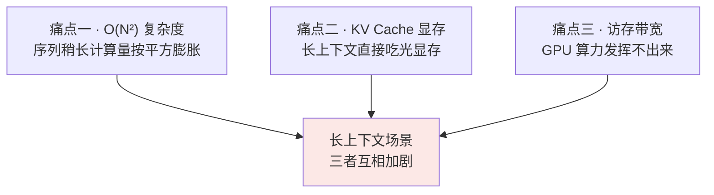
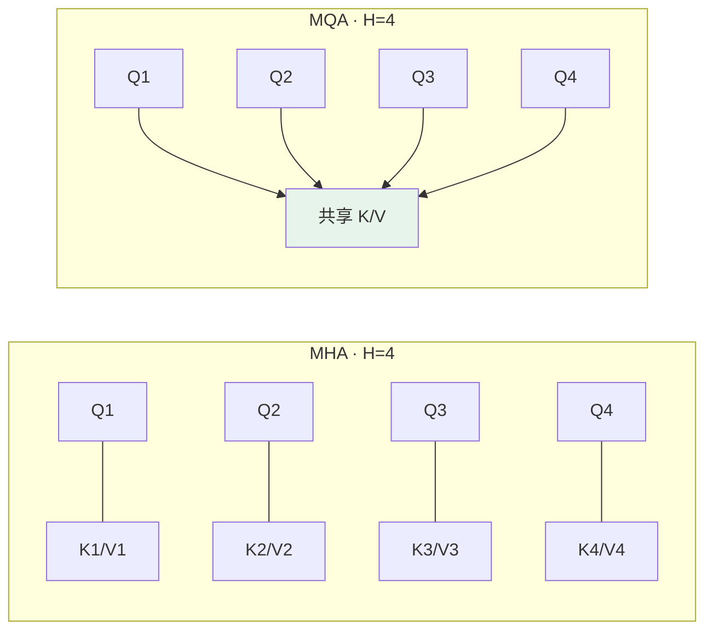
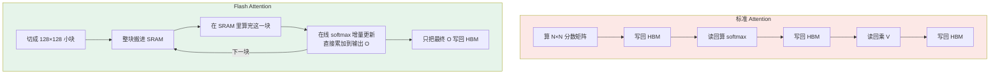
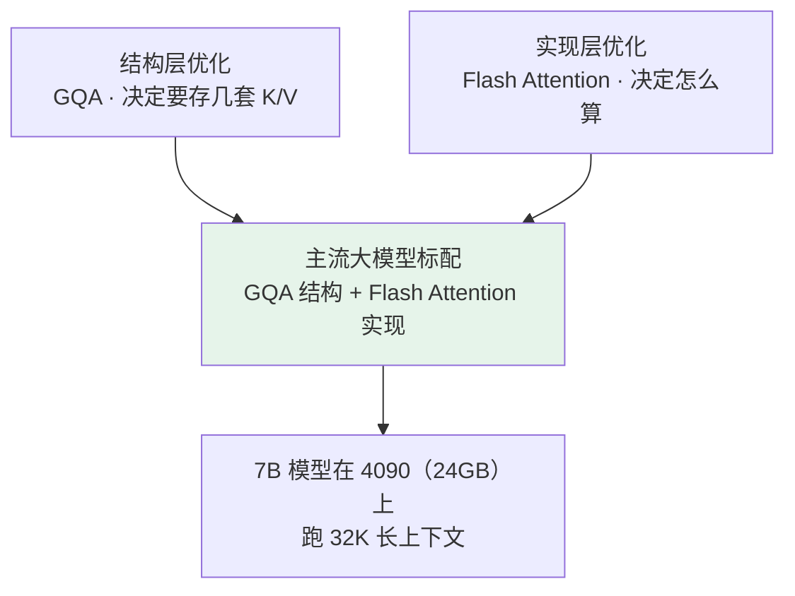

# 第三章：MHA 的局限与 MQA、GQA、Flash Attention

## 3.1 MHA 的瓶颈卡在哪

讲清楚 MHA 的局限，必须**把训练和推理两个阶段分开看**。很多人只笼统说「$O(N^2)$ 慢」，一追问就答不下去，根源就是把这两个阶段混在一起讲。

### 3.1.1 训练阶段

长度为 $N$ 的序列，每层 Attention 都要算一个 $N \times N$ 的注意力分数矩阵，而且**这个矩阵要存在显存里给反向传播用**：

| 序列长度 | $N \times N$ 矩阵元素数 | FP16 显存（单层单头） |
|---|---|---|
| 4K | 1600 万 | 约 32 MB |
| 32K | 10 亿 | 约 2 GB |

计算复杂度是 $O(N^2)$，**$N$ 翻倍计算量翻 4 倍**。

好消息是训练时这个矩阵是「一次性算完」的，不需要在多个时间步之间持续保留。

### 3.1.2 推理阶段：KV Cache 是救星也是显存大户

LLM 是自回归生成，每生成一个新 token 都要对前面所有 token 算注意力。如果每次从头算，总成本会累加到 $O(N^3)$。

**KV Cache** 的做法是把前面所有 token 的 K 和 V 存下来，新 token 只算自己的 Q，和缓存的 K/V 做注意力。这是推理优化的标配（详见 [第十四章](14-kv-cache.md)）。

但它本身很吃显存：

$$
\mathrm{KVCache} = 2 \times B \times N \times L \times H \times d_k \times 2\ \mathrm{bytes}
$$

（前面的 2 是 K 和 V 各一份，后面的 2 是 FP16 每个数 2 字节）

以一个 7B 模型（$L=32$、$H=32$、$d_k=128$）跑 $B=1$、$N=32000$ 为例：

$$
2 \times 1 \times 32000 \times 32 \times 32 \times 128 \times 2 \approx 17\ \mathrm{GB}
$$

**光 KV Cache 就 17GB，加上模型权重 14GB 一共 31GB——一张 24GB 的 4090 根本放不下。**

### 3.1.3 更隐蔽的痛点：访存受限

显存挤爆只是一面，另一面是**速度也快不起来**。

GPU 的计算单元算力很猛，但显存带宽跟不上。Attention 计算里大量时间花在「等数据从显存搬到计算单元」，计算单元很多时候在「等米下锅」——这就是 **memory-bound（访存受限）**。

> 哪怕你的 GPU 算力是另一台的两倍，跑 Attention 时可能只快 20%，因为**瓶颈根本不在算力**。

### 3.1.4 三个痛点连成一条线



**后面所有优化方案，都是在攻击这三个痛点中的一个或多个。**

## 3.2 MQA：暴力共享 K/V

### 3.2.1 思路

**所有 head 共享同一份 K 和 V，只有 Q 每个 head 独立。**

原本 MHA 有 32 个 head，每个都有自己的 $W_Q$、$W_K$、$W_V$，输出 32 套 Q、K、V。MQA 只保留 32 套 Q，K 和 V 全部 32 个 head 共享一套。



### 3.2.2 收益与代价

**收益**：KV Cache 直接变成 $1/H$。上面那个 17GB 的例子，用 MQA 只剩 **0.5GB 多一点**。

而且注意力公式不变——每个 head 还是各算各的分数，只是共用同一份 K，模型结构基本保持，训练流程几乎不用改。

**代价是表达能力下降**。

直觉理解：原本 32 个 head 各有 32 套不同的「视角」（K 表示「我有什么标签」、V 表示「我的内容」），可以从 32 个角度理解上下文。MQA 让它们共用一套，等于**32 个视角变成「都看同样的标签和内容，只是用不同的 Query 去问」**，多视角能力被压成单视角。

实测在大模型上效果下降 **2–5%**。简单任务差不多，但**对推理类任务（数学、代码）损失明显**。所以 MQA 在工业界不如它的折中版本受欢迎。

## 3.3 GQA：效果与显存的甜蜜点

### 3.3.1 思路

把 $H$ 个 head 分成 $G$ 组，**每组内部共享一份 K/V，组之间各自独立**。

| 方案 | head 数 | K/V 套数 |
|---|---|---|
| MHA | $H$ | $H$ |
| **GQA** | $H$ | $G$（$1 \le G \le H$） |
| MQA | $H$ | 1 |

**GQA 是一个连续光谱**：$G=H$ 退化成 MHA，$G=1$ 退化成 MQA，中间任意取值都行。

### 3.3.2 为什么是好折中

| 维度 | 效果 |
|---|---|
| **显存** | KV Cache 从 $H$ 套压到 $G$ 套，占用比例 $G/H$。$H=32, G=8$ 时压到 **1/4** |
| **表达力** | 每组有自己的「视角」，组数越多视角越丰富，$G=8$ 通常已足够 |
| **实测** | GQA 论文中 $G=8$ 配置下效果几乎和 MHA 持平（差距不到 0.5%） |

「**显存大幅下降、效果几乎不损失**」这个甜蜜点，让 GQA 成为现代大模型的标配：

| 模型 | 配置 |
|---|---|
| Llama 2 70B | GQA，$H=64$、$G=8$ |
| Llama 3 全系 | GQA |
| Qwen 2 / 3 主力模型 | GQA |
| DeepSeek V2 / V3 | **MLA**（另一条路线，见下） |

### 3.3.3 MLA 不是 GQA 的升级版

DeepSeek V2/V3 用的 **MLA（Multi-head Latent Attention，多头潜在注意力）** 走的是另一条路：

**不共享 K/V，而是把每个 token 的 K/V 通过降维投影压缩到低维 latent 向量存起来**，需要时再配合额外投影参与注意力计算。

存的不是「$H$ 套或 $G$ 套高维 K/V」，而是「低维压缩后的表示」，显存比传统 MHA / GQA 更省。

> 目标相似（都是省 KV Cache），但**实现机制完全不同**。别说成「GQA 的升级版」——GQA 是「少存几套」，MLA 是「换一种更紧凑的表示存」。

## 3.4 Flash Attention：换一条赛道

MQA/GQA 改的是 Attention **结构**（有几套 K/V）。Flash Attention 完全是另一条赛道——**不改数学公式，从底层实现优化**。

### 3.4.1 根源：显存层级的巨大差距

GPU 的存储分两层：

| 层级 | 容量 | 带宽 |
|---|---|---|
| **HBM**（高带宽显存，平时说的「显存」） | A100 是 40/80 GB | 约 1.5 TB/s |
| **SRAM**（片上缓存） | A100 每个 SM 仅 192 KB | 约 19 TB/s（**HBM 的 13 倍**） |

标准 Attention 的实现是这样的：

```python
S = Q @ K.T              # 算出 N×N 分数矩阵，写回 HBM
P = softmax(S)           # 从 HBM 读 S，算 softmax，再写回 HBM
O = P @ V                # 从 HBM 读 P，算最终输出，再写回 HBM
```

整个过程在 HBM 上**反复读写 $N \times N$ 的大矩阵**，访存时间远超实际计算时间。

这就是为什么 $N=4K$ 的注意力比 $N=2K$ 慢的倍数往往超过理论上的 4 倍——瓶颈在于搬运 $N^2$ 大小的中间结果。

### 3.4.2 核心思路：分块 + 在线 softmax

既然 SRAM 带宽快但容量小，那就**把 Q、K、V 切成小块**（比如 128×128），每次只在 SRAM 里算一小块的注意力，算完直接和最终输出累加，**不把 $N \times N$ 的中间矩阵写回 HBM**。



**这里有个数学难题**：softmax 要看「整行」才能算，不能局部独立计算。

Flash Attention 用**在线 softmax（online softmax）**解决：分块计算的同时维护「当前最大值 + 累积和」的状态，每来一块做增量更新，**最终结果和一次性算 softmax 完全一样**。

### 3.4.3 三个收益

| 收益 | 说明 |
|---|---|
| **显存 $O(N^2) \to O(N)$** | 不需要把中间矩阵存 HBM，只存最终输出 |
| **速度快 2–4 倍** | HBM 读写次数从 $O(N^2)$ 降到 $O(N^2/M)$（$M$ 是块大小） |
| **数学等价** | 算的是同一个公式，**不是稀疏或低秩近似** |

关于「等价」要精确一点：实际浮点实现里因为分块顺序和数值精度不同，最后几位可能有微小差异，但**不会像近似注意力那样引入模型精度损失**。

Flash Attention 现已迭代到 v3，针对 H100 等新一代 GPU 做了进一步优化，是 vLLM、SGLang、TGI 等主流推理框架的默认实现。

## 3.5 三类优化是叠加不是替代

| 方案 | 改的是什么 | 攻击的痛点 | 效果损失 |
|---|---|---|---|
| **MQA** | 结构（K/V 压成 1 份） | 显存 | 中等（2–5%） |
| **GQA** | 结构（K/V 压成 G 份） | 显存 | 几乎无（不到 0.5%） |
| **Flash Attention** | 实现（分块 + 在线 softmax） | 显存 + 访存 + 速度 | 基本无（数学等价） |

**这是本章最重要的认知：**



Llama 3、Qwen 2、DeepSeek V3 都是这个组合：GQA 把 KV Cache 压到 1/4，Flash Attention 让计算快 2–4 倍。

> 面试官如果问「MQA、GQA、Flash Attention 只能选一个，选哪个」，正确回答是**指出这是个伪命题**——它们攻击的是不同维度的瓶颈，真实工程里一定组合用。能说出这句，说明你理解的是整套优化体系的层次结构，不是在背单点优化。

## 3.6 长上下文时代的其他方向

作为补充了解：

| 方向 | 思路 | 现状 |
|---|---|---|
| **MLA** | K/V 压缩到低维潜在空间 | DeepSeek V2/V3 在用，已工程验证 |
| **Sliding Window Attention** | 每个 token 只关注最近 $N$ 个（如 4096） | Mistral 系列用过，代价是丢失远距离信息，通常和全局注意力混合 |
| **Linear Attention** | 用核函数近似 softmax，复杂度降到 $O(N)$ | Performer、Linformer 等，效果离 MHA 差一截，未成主流 |
| **Mamba / SSM** | 完全抛弃 Attention，用状态空间方程 | 理论上可处理无限长上下文，效果仍有争议，研究热点 |

**面试深度建议**：把 MQA、GQA、Flash Attention 三个讲透就足够拿高分，MLA 作为加分项提一句，再深的不用展开。

## 3.7 常见错误

### 3.7.1 只说「$O(N^2)$ 慢」

这只是三个痛点之一，而且是最表面的一个。要能分训练/推理两阶段讲，说出 KV Cache 显存和访存受限这两个更工程化的痛点。

### 3.7.2 说不出 KV Cache 的量级

能现场算出「7B 模型 32K 上下文约 17GB」这个数，比空谈「显存很大」有说服力得多。

### 3.7.3 忽略访存受限

这是最容易被漏掉的一点，也是理解 Flash Attention 的前提。**瓶颈不在算力在带宽**——不知道这一点就理解不了为什么「不改公式只改实现」能快 2–4 倍。

### 3.7.4 认为 Flash Attention 是近似算法

它是**数学等价**的精确实现，不是稀疏近似或低秩近似。这是它能被无条件默认启用的原因。

### 3.7.5 把 MQA 和 GQA 当成两种独立方案

GQA 是一个连续光谱，两端分别退化成 MHA 和 MQA。

### 3.7.6 把 MLA 说成 GQA 的升级版

GQA 是「少存几套」，MLA 是「换一种低秩压缩表示存」，机制不同。

### 3.7.7 把三类优化当成互斥选项

结构层和实现层攻击不同维度，主流模型都是 GQA + Flash Attention 同时用。

## 3.8 本章总结

1. **必须分训练和推理两阶段讲 MHA 的瓶颈**，两者痛点不同；
2. **三个痛点**：$O(N^2)$ 复杂度、KV Cache 显存、访存受限，长上下文场景下互相加剧；
3. **KV Cache 的量级要能算**：7B 模型 32K 上下文约 17GB，加权重放不进 24GB 显卡；
4. **MQA 把 K/V 压成 1 套**，显存降到 $1/H$，但表达力损失 2–5%，推理类任务尤其明显；
5. **GQA 分 G 组共享**，是连续光谱，$G=8$ 时显存 1/4、效果差距不到 0.5%，现代大模型标配；
6. **MLA 是另一条路线**：低秩压缩存储，不是 GQA 的升级版；
7. **Flash Attention 走实现层赛道**：分块 + 在线 softmax，显存 $O(N^2) \to O(N)$，速度 2–4 倍，且数学等价；
8. **理解 Flash Attention 的前提是知道 HBM 与 SRAM 的 13 倍带宽差距**；
9. **三类优化是叠加不是替代**，GQA + Flash Attention 是主流组合，让 7B 模型能在消费级显卡上跑 32K。

> **一句话概括：MQA 和 GQA 在问「K/V 到底要存几套」，Flash Attention 在问「同样的公式能不能少搬几次数据」——一个改结构一个改实现，所以它们从来不是二选一。**

## 参考资料

- [Attention Is All You Need](https://arxiv.org/abs/1706.03762)
- [Fast Transformer Decoding: One Write-Head is All You Need（MQA）](https://arxiv.org/abs/1911.02150)
- [GQA: Training Generalized Multi-Query Transformer Models from Multi-Head Checkpoints](https://arxiv.org/abs/2305.13245)
- [FlashAttention: Fast and Memory-Efficient Exact Attention with IO-Awareness](https://arxiv.org/abs/2205.14135)
- [FlashAttention-2: Faster Attention with Better Parallelism and Work Partitioning](https://arxiv.org/abs/2307.08691)
- [DeepSeek-V2: A Strong, Economical, and Efficient Mixture-of-Experts Language Model（MLA）](https://arxiv.org/abs/2405.04434)
- [Online normalizer calculation for softmax](https://arxiv.org/abs/1805.02867)
- [Mistral 7B（Sliding Window Attention）](https://arxiv.org/abs/2310.06825)
- [Mamba: Linear-Time Sequence Modeling with Selective State Spaces](https://arxiv.org/abs/2312.00752)
