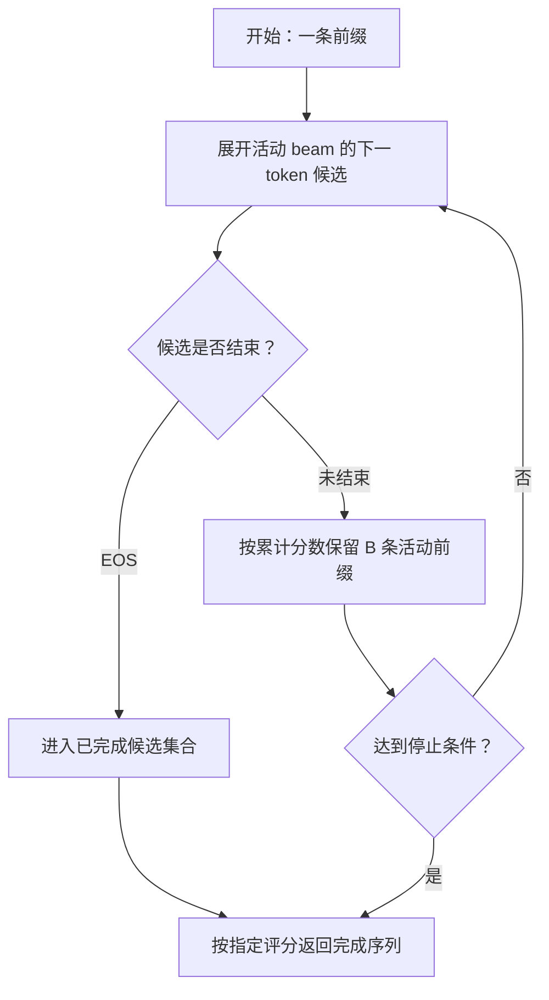

# 第十二章：解码策略

## 12.1 本质：从条件分布生成序列

本章讨论自回归语言模型。给定前缀，模型输出词表大小的 logits；经过 softmax 和解码规则后选出下一个 token。token 不一定是完整的词，词表大小也由具体 tokenizer 决定。

```text
示意分布，不是实测：
下一个 token：A 0.50，B 0.30，C 0.20
```

解码不只是「随机还是不随机」，还涉及**优化什么分数、何时停止、允许哪些输出**。

| 方法 | 实际目标 | 不保证什么 |
|---|---|---|
| 贪心 | 每一步选择当前概率最大的 token | 不保证整条序列概率最大 |
| Beam Search（束搜索） | 在有限候选中搜索累计得分较高的序列 | 不保证全局最优，也不保证任务质量最好 |
| 随机采样 | 从原始或变换后的条件分布抽样 | 不保证多样性一定带来正确性 |

这些算法都**不要求任务存在唯一正确答案**。翻译也可以有多种正确译文；关键是模型概率与任务评价标准是否一致。

## 12.2 贪心解码：局部最优与可复现性

每步取 `argmax(logits)`，选择开销随词表大小线性增长，但整步延迟还包括模型前向、输出投影和设备通信。

### 12.2.1 为什么局部最优不等于序列最优

假设两步生成后都结束：

```text
第一步：p(A)=0.6，p(B)=0.4
第二步：A 后最大条件概率为 0.5；B 后最大条件概率为 0.9
贪心路径概率：0.6 × 0.5 = 0.30
另一条路径概率：0.4 × 0.9 = 0.36
```

第一步丢掉 B 后，贪心不会回头。这个例子也说明「累计概率最大」不等价于「每一步都选当前最稳的 token」。

### 12.2.2 确定的是选择规则，不是整个服务系统

在 logits、并列值处理与执行环境相同的条件下，贪心是确定的。但浮点归约顺序、量化 kernel、批次组成、模型更新可能改变 logits；当最大几个值很接近时，微小差异就会改变输出。

需要回归复现时应记录模型与 tokenizer 修订、chat template、精度、框架版本及解码配置。`temperature=0` 不是跨硬件、跨版本逐字复现的承诺。vLLM 的 batch invariance 文档专门讨论了为一致性选择确定性 kernel 的性能代价。

### 12.2.3 重复、格式与正确性

贪心在某些开放式续写任务中容易进入重复模式；是否发生与模型、提示、训练和停止条件有关，不是「一旦重复就永远出不来」的定理。增加随机性也可能引入错误，不能把升温当作通用修复。

低随机性可以作为抽取、代码等任务的基线，但**贪心不会保证 JSON 合法、SQL 正确或代码通过测试**。语法问题需用 schema/grammar 约束，语义问题仍需类型检查、执行验证或业务校验。

## 12.3 Beam Search：保留多条前缀

束宽为 B 时，每轮扩展当前活动前缀，从候选中保留 B 条继续搜索。常见分数是条件对数概率之和：

$$
s(y_{1:n})=\sum_{t=1}^{n}\log p(y_t\mid x,y_1,\ldots,y_{t-1})
$$

t=1 时，条件中没有已生成 token。使用对数避免长序列概率连乘下溢；加入长度惩罚或约束后，搜索的就不再是原始序列概率。



图中省略了实现对完成集合的裁剪。EOS 候选不应继续像活动前缀那样扩展；`early_stopping`、最大长度和完成序列的评分方式都会影响最终结果。

### 12.3.1 更大的束宽为何未必更好

1. **搜索误差**：有限束宽会剪掉后来可能得高分的路径。
2. **模型或目标误差**：模型的高概率输出不一定符合人类质量标准；更充分搜索可能更准确地找到不理想的输出。
3. **长度偏置**：未经长度校正的连乘概率容易偏好短序列，包括过早 EOS。长度归一化可缓解，但超参数需要验证。

机器翻译研究中的 beam search curse 常涉及束宽增大后译文变短、质量下降；开放生成中的重复和乏味是相关但不同的退化现象。不能把它归结为「B=8 必然比 B=4 差」。

## 12.4 Beam Search 与推理优化能否共存

可以共存，但会增加候选状态管理和计算开销。

| 机制 | 与多候选搜索的关系 |
|---|---|
| KV Cache | 不同 beam 要维护不同后缀的 KV；共享前缀可复用，重排时需同步状态 |
| PagedAttention | 原论文明确支持共享块、引用计数与写时复制，可用于并行采样和 beam search |
| FlashAttention | 优化 attention 的访存与计算，并非只允许一条序列；具体 beam API 支持取决于框架 |

B 条分支意味着更多 token 前向和后缀缓存，但**不是每次都完整复制 B 份提示缓存，也不是端到端延迟严格乘 B**。批处理、共享前缀、候选提前结束和调度都会改变成本。

束搜索适合需要多个高分候选、后续重排的任务。开放对话通常使用贪心或采样，不应只用「没有唯一答案」解释选型。

## 12.5 采样族：变换分布而非提高事实可信度

直接从整个 softmax 分布采样可能选中低概率 token。Nucleus Sampling 论文在开放文本生成中展示了截断不可靠长尾的价值，但**低概率不等于错误，高概率也不等于事实**。

| 参数 | 机制 | 边界 |
|---|---|---|
| Temperature | 对正温度 T，把 logits 除以 T 再 softmax | T 小于 1 时更尖锐，大于 1 时更平坦；不改变有限 logits 的排序 |
| Top-K | 保留概率最高的 K 个 token 后重新归一化 | 固定候选规模，不适应分布的尖锐程度 |
| Top-P | 保留累计概率至少达到 P 的最小高概率集合 | 自适应候选规模，但不识别答案真伪 |

$$
p_i(T)=\frac{\exp(z_i/T)}{\sum_j\exp(z_j/T)}
$$

T=0 不能直接代入公式。部分 API 用它表示关闭采样；正温度趋近 0 且最大 logit 唯一时，分布趋向贪心。详细计算与参数顺序见[第十三章](13-temperature-top-p-top-k.md)。

## 12.6 按任务设置基线，而不是背一组温度

| 需求 | 先比较什么 | 如何判断有效 |
|---|---|---|
| JSON、工具参数 | 模型推荐解码 + schema 约束 | schema 通过率、字段语义正确率、拒绝与截断处理 |
| 代码、SQL | 推荐配置与低随机性基线；有预算再生成多候选 | 单元测试、执行结果、权限与业务约束 |
| 数学推理 | 官方推理模式配置；单样本与多样本聚合 | 规范化后的答案准确率、token 成本和延迟 |
| 翻译、摘要 | 贪心、束搜索或受控采样 | 忠实度、遗漏、长度与术语一致性 |
| 开放创作 | 从推荐配置逐步增加多样性 | 可用候选比例、重复率、风格和约束满足率 |

例如 Qwen3-30B-A3B 的官方模型卡明确不建议在 thinking 模式使用贪心，防止性能下降与重复。因此「数学、代码一律 T=0」并不是可靠规则。

约束解码通常在每步屏蔽语法不允许的 token 后再选择，能提高结构合法性；它不是另一种知识来源，合法 JSON 中仍可能填错数值。还要处理最大 token 限制导致的未闭合结构。

## 12.7 两个进阶策略

### 12.7.1 推测解码：怎样保持目标分布

草稿模型先生成若干候选 token，目标模型通过一次带因果掩码的前向，计算这些位置在各自候选前缀下的分布。草稿可来自小模型，也可来自其他提案机制；这里解释经典双模型算法。

**随机采样时，不是比较两个模型是否选中了相同 token。** 记目标分布为 p、草稿分布为 q。对草稿采得的 token x，接受概率为：

$$
a(x)=\min\left(1,\frac{p(x)}{q(x)}\right)
$$

在首次拒绝的位置，从修正分布抽取替代 token：

$$
r(x)=\frac{\max(0,p(x)-q(x))}{\sum_y\max(0,p(y)-q(y))}
$$

后续依赖被拒绝前缀的草稿全部丢弃；若整段通过，可以利用目标模型额外算出的下一位置分布再采一个 token。拒绝发生时分母为正；p=q 时不会走拒绝分支。

在满足算法假设且正确使用上述接受/修正规则时，**目标采样分布不变**；不是保证同一随机种子下得到逐字相同的一条序列。若目标使用 temperature、截断或语法约束，验证也必须对应那个变换后的目标分布。贪心版本则验证目标的 `argmax`。

收益来自把多个目标 token 的验证合并，摊薄权重读取和启动开销。它尤其适合目标模型低批量 decode 受带宽限制、草稿便宜且接受率高的情形。草稿耗时、额外 KV、低接受率和高并发算力饱和都可能让它不加速。原论文 T5-XXL 实验中的 2–3 倍是特定配置结果，不能当部署承诺。

### 12.7.2 Self-Consistency：多路径聚合而非多次求证

对同一道题采样 N 条推理路径，规范化最终答案后取出现最多的答案。这里是最多票，不要求票数超过一半；平票和无法解析的回答要有处理规则。

它依赖正确答案在采样分布中占有足够质量。不同样本共享模型知识和偏差，**完全可能反复得到同一个错误答案**。形式不同的推理文字也不意味着证据独立。

与单次生成相比，成本大致随总生成 token 数增长；可共享前缀和并行生成，所以费用、吞吐占用与用户延迟不能都简单说成 N 倍。应固定总预算，比较多数投票、验证器重排与单条更长推理，不套用统一准确率涨幅。

## 12.8 可以继续追问的问题

- **束搜索拿到更高概率，为什么评分反而下降？** 区分搜索误差、长度偏置与模型目标错配。
- **温度为零为什么还会变？** 区分确定性选择规则与浮点、批次、模型版本。
- **推测解码拒绝后为什么不能直接从 p 重采？** 拒绝事件已改变条件分布，需要残差修正才能保持边际分布。
- **更多候选是否一定更好？** 候选质量、聚合器能力、相关错误与预算共同决定收益。

## 12.9 本章总结

选择规则、序列评分、输出约束和执行加速是不同层次。贪心做局部选择，束搜索近似搜索，采样探索候选；推测解码在条件满足时保持目标分布，Self-Consistency 则改变最终答案的聚合方式。评价应落到正确率、格式通过率、延迟与成本，而不是固定的温度或束宽口诀。

## 参考资料

- [The Curious Case of Neural Text Degeneration](https://arxiv.org/abs/1904.09751)
- [If Beam Search Is the Answer, What Was the Question?](https://arxiv.org/abs/2010.02650)
- [Fast Inference from Transformers via Speculative Decoding](https://arxiv.org/html/2211.17192v2)
- [Self-Consistency Improves Chain of Thought Reasoning in Language Models](https://arxiv.org/abs/2203.11171)
- [PagedAttention：包含 beam search 的缓存共享设计](https://arxiv.org/abs/2309.06180)
- [Qwen3-30B-A3B 官方模型卡](https://huggingface.co/Qwen/Qwen3-30B-A3B)
- [vLLM：Batch Invariance](https://docs.vllm.ai/en/stable/features/batch_invariance/)

本文原创讲解与示意图：Polo Li，采用 CC BY 4.0。
