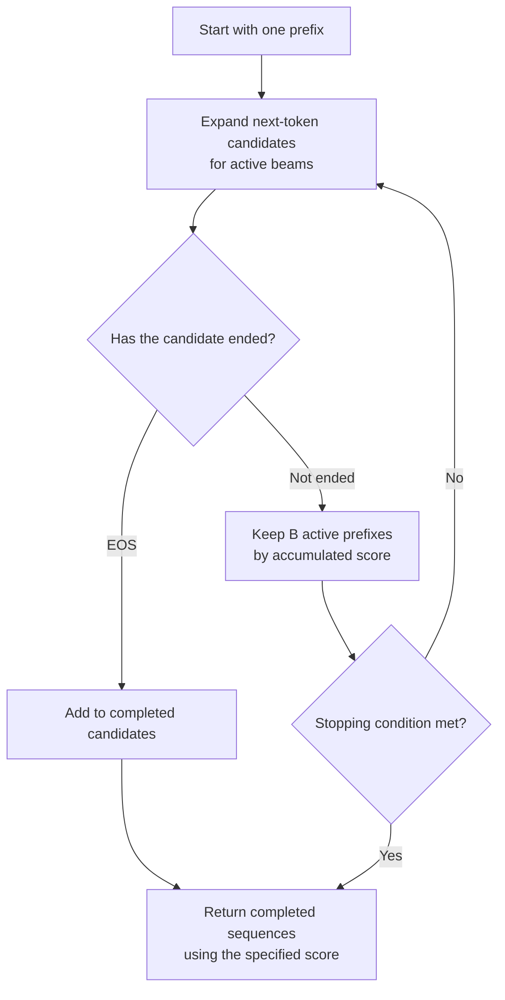

# Chapter 12: Decoding Strategies

## 12.1 What remains to be decided after the model produces probabilities?

This chapter concerns autoregressive language models. Given a prefix, the model produces a vocabulary-sized vector of logits; softmax and the decoding rules then determine the next token. A token is not necessarily a whole word, and vocabulary size depends on the tokenizer.

```text
Illustrative distribution, not a measurement:
Next token: A 0.50, B 0.30, C 0.20
```

Decoding is not just a choice between random and deterministic generation. It also determines **which score to optimize, when to stop, and which outputs are allowed**.

| Method | Actual objective | What it does not guarantee |
|---|---|---|
| Greedy decoding | Select the highest-probability token at each step | The highest-probability complete sequence |
| Beam search | Search a limited set of candidates for sequences with high accumulated scores | A global optimum or the best task quality |
| Random sampling | Draw from the original or a transformed conditional distribution | That diversity necessarily improves correctness |

None of these algorithms **requires a task to have exactly one correct answer**. Translation can have several valid answers too; what matters is whether model probability aligns with the task's evaluation criteria.

## 12.2 Greedy decoding: local optimality and reproducibility

At each step, greedy decoding takes `argmax(logits)`. Selection cost grows linearly with vocabulary size, but step latency also includes the model forward pass, output projection, and device communication.

### 12.2.1 Why a locally optimal choice need not produce the best sequence

Suppose both paths end after two generation steps:

```text
Step 1: p(A)=0.6, p(B)=0.4
Step 2: the largest conditional probability after A is 0.5; after B it is 0.9
Greedy path probability: 0.6 × 0.5 = 0.30
Alternative path probability: 0.4 × 0.9 = 0.36
```

Once greedy decoding discards B at the first step, it never revisits that decision. The example also shows why maximizing sequence probability is not equivalent to taking the most probable token at every step.

### 12.2.2 The selection rule is deterministic; the entire serving system may not be

Greedy decoding is deterministic when the logits, tie-breaking rules, and execution environment are identical. However, floating-point reduction order, quantization kernels, batch composition, and model updates can change the logits. When the largest values are close, a tiny difference can change the output.

For reproducible regression tests, record the model and tokenizer revisions, chat template, precision, framework version, and decoding configuration. `temperature=0` is not a promise of verbatim reproducibility across hardware or versions. The vLLM batch invariance documentation specifically discusses the performance cost of choosing deterministic kernels for consistent results.

### 12.2.3 Repetition, formatting, and correctness

Greedy decoding can fall into repetitive patterns in some open-ended continuation tasks. Whether this happens depends on the model, prompt, training, and stopping conditions; there is no theorem that repetition, once started, can never end. Adding randomness can also introduce errors, so increasing temperature is not a universal remedy.

Low randomness can provide a baseline for extraction or code generation, but **greedy decoding does not guarantee valid JSON, correct SQL, or passing code tests**. Syntax requires schema or grammar constraints; semantics still require type checking, execution-based verification, or business-rule validation.

## 12.3 Beam search: retaining multiple prefixes

With beam width B, each round expands the current active prefixes and retains B candidates for further search. A common score is the sum of conditional log probabilities:

$$
s(y_{1:n})=\sum_{t=1}^{n}\log p(y_t\mid x,y_1,\ldots,y_{t-1})
$$

At t=1, the conditioning context contains no generated tokens. Logarithms avoid underflow from multiplying many small probabilities. Once length penalties or constraints are introduced, the search no longer optimizes raw sequence probability.



The diagram omits implementation-specific pruning of the completed set. EOS candidates should not continue to expand like active prefixes. `early_stopping`, maximum length, and the scoring of completed sequences all affect the result.

### 12.3.1 Why a wider beam is not necessarily better

1. **Search error**: a finite beam can prune paths that would later score well.
2. **Model or objective error**: high model probability does not necessarily match human quality judgments. More thorough search can become better at finding undesirable outputs.
3. **Length bias**: multiplying probabilities without length correction tends to favor short sequences, including premature EOS. Length normalization can help, but its hyperparameters need validation.

The beam search curse in machine translation often involves shorter translations and lower quality as beam width increases. Repetition and blandness in open-ended generation are related but distinct forms of degeneration. Neither implies that B=8 must be worse than B=4.

## 12.4 Can beam search coexist with inference optimizations?

Yes, but it adds computation and candidate-state management.

| Mechanism | Relationship to multi-candidate search |
|---|---|
| KV cache | Different beams need KV state for their different suffixes; shared prefixes can be reused, and state must follow beam reordering |
| PagedAttention | The original paper explicitly supports shared blocks, reference counting, and copy-on-write for parallel sampling and beam search |
| FlashAttention | Optimizes attention computation and memory access; it does not restrict execution to a single sequence. Beam API support depends on the framework |

B branches require more token forward passes and suffix cache storage, but **they do not always require B complete copies of the prompt cache, nor do they multiply end-to-end latency by exactly B**. Batching, shared prefixes, early completion, and scheduling all affect cost.

Beam search is useful when a task needs several high-scoring candidates for subsequent reranking. Open-ended dialogue commonly uses greedy decoding or sampling; the absence of a unique answer is not enough to explain that choice.

## 12.5 Sampling methods transform distributions, not factual reliability

Sampling directly from the full softmax distribution can select low-probability tokens. The nucleus sampling paper demonstrates the value of truncating an unreliable tail in open-ended generation, but **low probability does not mean incorrect, and high probability does not establish a fact**.

| Parameter | Mechanism | Limitation |
|---|---|---|
| Temperature | For positive T, divide logits by T before softmax | T below 1 sharpens the distribution; T above 1 flattens it. Finite logits retain their ranking |
| Top-K | Keep the K highest-probability tokens and renormalize | A fixed candidate count does not adapt to distribution sharpness |
| Top-P | Keep the smallest high-probability set whose cumulative probability reaches at least P | The candidate count adapts, but the method cannot determine whether an answer is true |

$$
p_i(T)=\frac{\exp(z_i/T)}{\sum_j\exp(z_j/T)}
$$

T=0 cannot be substituted into this formula. Some APIs use it to disable sampling. As positive temperature approaches 0, the distribution approaches greedy selection if the largest logit is unique. See [Chapter 13](13-temperature-top-p-top-k.md) for calculations and parameter ordering.

## 12.6 Establish task-specific baselines instead of memorizing temperatures

| Requirement | What to compare first | How to evaluate effectiveness |
|---|---|---|
| JSON and tool arguments | Model-recommended decoding plus schema constraints | Schema pass rate, field-level semantic correctness, and handling of refusals and truncation |
| Code and SQL | Recommended settings and a low-randomness baseline; multiple candidates if the budget allows | Unit tests, execution results, authorization, and business constraints |
| Mathematical reasoning | Official reasoning-mode settings; single samples versus multi-sample aggregation | Accuracy after answer normalization, token cost, and latency |
| Translation and summarization | Greedy decoding, beam search, or controlled sampling | Faithfulness, omissions, length, and terminology consistency |
| Open-ended creative work | Start from recommended settings and gradually increase diversity | Fraction of usable candidates, repetition, style, and constraint satisfaction |

For example, the official Qwen3-30B-A3B model card explicitly discourages greedy decoding in thinking mode to avoid degraded performance and repetition. “Always use T=0 for math and code” is therefore not a reliable rule.

Constrained decoding commonly masks syntactically invalid tokens at each step before selection, improving structural validity. It is not another source of knowledge: valid JSON can still contain incorrect values. It must also handle incomplete structures caused by maximum-token limits.

## 12.7 Two advanced strategies

### 12.7.1 Speculative decoding: preserving the target distribution

A draft model proposes several tokens. In one causally masked forward pass, the target model computes the distribution at each position under its corresponding candidate prefix. Drafts can come from a small model or another proposal mechanism; this section explains the classic two-model algorithm.

**For random sampling, verification is not a test of whether both models selected the same token.** Let p be the target distribution and q the draft distribution. For a token x sampled from the draft, the acceptance probability is:

$$
a(x)=\min\left(1,\frac{p(x)}{q(x)}\right)
$$

At the first rejection, draw a replacement from the corrected distribution:

$$
r(x)=\frac{\max(0,p(x)-q(x))}{\sum_y\max(0,p(y)-q(y))}
$$

Discard all subsequent drafts that depend on the rejected prefix. If the entire draft is accepted, sample one additional token from the next-position distribution already computed by the target model. The denominator is positive when rejection occurs; when p=q, the rejection branch is never taken.

When the algorithm's assumptions hold and these acceptance and correction rules are applied correctly, **the target sampling distribution is unchanged**. This does not guarantee a verbatim identical sequence under the same random seed. If the target uses temperature, truncation, or grammar constraints, verification must use that transformed target distribution. The greedy variant verifies the target's `argmax`.

The speedup comes from combining verification of several target tokens, amortizing weight reads and launch overhead. This is particularly useful when low-batch target decoding is bandwidth-bound, the draft is cheap, and acceptance is high. Draft latency, extra KV storage, low acceptance, and compute saturation at high concurrency can eliminate the speedup. The original paper's 2–3× result for T5-XXL is specific to its experimental configuration, not a deployment guarantee.

### 12.7.2 Self-consistency: aggregating paths, not independently verifying them

Sample N reasoning paths for the same question, normalize their final answers, and select the most frequent answer. This is a plurality vote: it need not exceed half the votes. Ties and unparseable responses need explicit handling.

The method relies on the correct answer having sufficient probability mass in the sampling distribution. Samples share the model's knowledge and biases, so **they can repeatedly produce the same wrong answer**. Different-looking reasoning does not make the evidence independent.

Compared with a single generation, cost grows roughly with the total number of generated tokens. Prefix sharing and parallel generation mean that monetary cost, throughput consumption, and user latency cannot all be described as N times greater. Under a fixed total budget, compare voting, verifier-based reranking, and a single longer reasoning path rather than assuming a universal accuracy gain.

## 12.8 Questions worth exploring further

- **Why can a higher-probability beam-search output receive a lower evaluation score?** Separate search error, length bias, and model–objective mismatch.
- **Why can output change at zero temperature?** Separate the deterministic selection rule from floating-point behavior, batching, and model versions.
- **Why not resample directly from p after a speculative rejection?** Rejection changes the conditional distribution; a residual correction is needed to preserve the marginal distribution.
- **Are more candidates always better?** Candidate quality, aggregation capability, correlated errors, and budget jointly determine the benefit.

## 12.9 Chapter summary

Selection rules, sequence scoring, output constraints, and execution acceleration operate at different levels. Greedy decoding makes local choices, beam search performs approximate search, and sampling explores candidates. Speculative decoding preserves the target distribution under the required conditions; self-consistency changes how final answers are aggregated. Evaluate accuracy, format pass rate, latency, and cost rather than relying on fixed rules about temperature or beam width.

## References

- [The Curious Case of Neural Text Degeneration](https://arxiv.org/abs/1904.09751)
- [If Beam Search Is the Answer, What Was the Question?](https://arxiv.org/abs/2010.02650)
- [Fast Inference from Transformers via Speculative Decoding](https://arxiv.org/html/2211.17192v2)
- [Self-Consistency Improves Chain of Thought Reasoning in Language Models](https://arxiv.org/abs/2203.11171)
- [PagedAttention: cache sharing, including beam search](https://arxiv.org/abs/2309.06180)
- [Qwen3-30B-A3B official model card](https://huggingface.co/Qwen/Qwen3-30B-A3B)
- [vLLM: Batch Invariance](https://docs.vllm.ai/en/stable/features/batch_invariance/)
