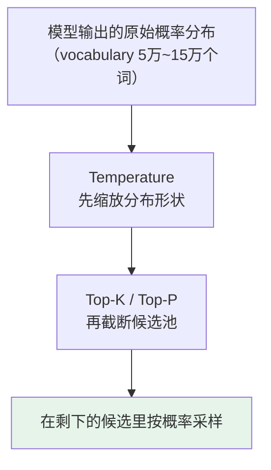

# 第十三章：Temperature、Top-P、Top-K 调参

> [第十二章](12-decoding-strategies.md) 讲的是「有哪些解码策略」；这里单看最常被调、也最常被调错的三个采样参数：Temperature、Top-P、Top-K。

## 13.1 三个参数各自控制什么维度

它们都在控制「采样的随机性」，但**切入维度完全不同**：

| 参数 | 控制的维度 | 一句话 |
|---|---|---|
| **Temperature** | **分布的松紧** | 把整个概率分布拉尖或压平 |
| **Top-K** | **候选数量（固定）** | 只保留概率最高的 $K$ 个 |
| **Top-P** | **候选数量（自适应）** | 按累积概率截断到 $P$ |



**注意顺序**：Temperature 先改变分布形状，截断在其之后作用于被改变的分布上——这也是它们会互相干扰的根源。

## 13.2 Temperature：热水和冷水的类比

这个名字不是随便取的，背后真有「热」「冷」的物理意义。

$$
p_i = \frac{\exp(z_i / T)}{\sum_j \exp(z_j / T)}
$$

每个词的 logit 除以 $T$，再做 softmax。

### 13.2.1 冷水与热水

| 温度 | 物理类比 | 效果 |
|---|---|---|
| **低（$T=0.1$）** | **冷水**：分子运动变慢，状态趋于稳定 | 分布变尖锐，高概率词更高、低概率词接近零。**几乎只选最有把握的词，稳定但单调** |
| **高（$T=1.5$）** | **热水**：分子运动加快，趋于混沌 | 分布变均匀，原本概率很低的词也有机会。**更有创意，但更可能出错或偏题** |

### 13.2.2 两个临界点

| 值 | 含义 |
|---|---|
| $T = 1$ | 概率分布完全不变，就是模型「原始」的采样 |
| $T = 0$ | **退化成贪心解码**，永远选概率最高的，相同输入永远同样输出 |

Temperature 解决的是「分布的松紧」。但还有另一个维度可以控制：**候选词的数量**。

## 13.3 Top-K：限制候选词数量

思路很直觉：采样前把分布截断到只保留概率最高的 $K$ 个词，其余全部置零，然后在这 $K$ 个词里按比例采样。

$K$ 越小越保守，越大范围越广。它能有效避免采到**长尾噪声词**。

### 13.3.1 但固定 K 有个明显问题：不自适应

**场景一：「中国的首都是____」**

模型对「北京」的概率高达 99%，剩下所有词加起来才 1%。

这时 Top-K=50 让你从前 50 个词里选，意味着**候选池里有 49 个概率极低的离谱词**，硬要从 50 个里挑并不合理。

**场景二：「写一首关于秋天的诗」**

前 50 个词概率都很分散，每个都有合理可能。这时 Top-K=50 又**显得不够**——可能第 51 个词比第 50 个更有诗意，硬截断反而错过好选项。

### 13.3.2 本质问题

**固定 $K$ 不知道当前上下文的概率分布有多尖锐或多平坦。** 要解决这个，就需要更智能的截断方式。

## 13.4 Top-P（Nucleus Sampling）：自适应截断

按概率从高到低排列，累加，**当累加值超过阈值 $P$ 时停止**，只保留这个「核」（Nucleus）里的词。

### 13.4.1 同样两个场景，看它的妙处

| 场景 | 分布特点 | Top-P = 0.9 的行为 | 是否合理 |
|---|---|---|---|
| 「中国的首都是____」 | 「北京」99% | **一个词就累加超过 0.9**，候选池只有「北京」 | 正是确定性问题该有的行为 |
| 「写一首关于秋天的诗」 | 前 30 个词才累加到 0.9 | **候选池有 30 个词**，保留足够多样性 | 正是开放任务该有的行为 |

**核心优势就是自适应**：候选池大小根据当前上下文的确定性自动调整——确定性高时池小、确定性低时池大。这比固定 $K$ 合理得多。

**这也是为什么工程上推荐用 Top-P 而不是 Top-K。**

## 13.5 实际工程怎么配

### 13.5.1 最重要的一条经验

> **绝大多数情况下，只调 Temperature 一个参数就够了，Top-P 和 Top-K 保持默认。**

**为什么？** 因为三个参数的作用**有重叠**——它们都在控制采样随机性，只是切入维度不同。**同时调多个会互相干扰**，让你搞不清到底是哪个在起作用。

OpenAI、Anthropic 等官方文档都建议**通常只调 temperature 或 top_p 其中一个**。Qwen、DeepSeek 这类开源模型要以对应推理框架和模型卡建议为准。

**总之，不要一上来三个参数一起拧。**

### 13.5.2 三档场景配置

```python
# 精确任务：代码生成 / SQL / JSON 抽取 / 信息抽取 / 数学计算
# 有标准答案或格式严格，最忌讳模型乱发挥
temperature = 0.0 ~ 0.2
top_p       = 1.0        # 不做限制

# 日常对话 / 总结摘要 / 翻译
# 希望自然流畅但不能太离谱
temperature = 0.5 ~ 0.7
top_p       = 0.9        # 或官方默认值

# 创意任务：写作 / 头脑风暴 / 角色扮演 / 营销文案
# 希望有「惊喜感」，重复保守反而不好
temperature = 0.8 ~ 1.2
top_p       = 0.95
```

$T=0$ 等价于贪心，相同输入永远同样输出，**特别适合需要可复现的场景**（回归测试、结果比对、审计）。

> **不要把某个产品某个版本的默认值当成行业固定标准**，模型更新后默认策略也会变。

## 13.6 两个常见的踩坑

### 13.6.1 温度高 + Top-P 低：两个参数打架

```python
temperature = 1.2   # 让分布变平坦
top_p       = 0.5   # 再截掉一半
```

意思是「**让分布变平坦再截掉一半**」，两个参数互相抵消，**结果完全不可预测**。

### 13.6.2 同时设置 top_k 和 top_p

两者都在做截断。先截 top_k 再截 top_p（或反过来）会让候选池变得很奇怪、难以推理。

**最佳实践**：top_k 不设置或用默认，**只用 top_p**——因为它更智能。

### 13.6.3 一句口诀

> **先只调 temperature，top_p 保持默认或 0.9~1.0，top_k 不设置。**
> **如果决定调 top_p，就先固定 temperature，不要两个一起大幅改。**

这样更容易判断输出变化到底来自哪个参数。

## 13.7 常见错误

### 13.7.1 说不清三者的作用维度

Temperature 调**分布松紧**，Top-K 是**固定截断**，Top-P 是**自适应截断**。这三个词讲不出来就是在背文档。

### 13.7.2 说不出 Top-P 为什么比 Top-K 好

关键是它能**根据分布形状自动调整候选池大小**：确定性问题池小、开放性问题池大。这也是工程上更常用 Top-P 的原因。

### 13.7.3 三个参数一起大幅调

作用重叠会互相干扰。**一次主要调一个。**

### 13.7.4 高温 + 低 Top-P 组合

先拉平再狠截，两个参数互相打架，行为不可预测。

### 13.7.5 同时设 top_k 和 top_p

两次截断叠加，候选池难以推理。只用 top_p。

### 13.7.6 死记某个产品的默认值

默认值会随模型版本变化。要说「以官方默认为基线再按任务调」。

### 13.7.7 精确任务还开高温

代码、SQL、JSON 用 $T=0 \sim 0.2$。错一个字符就报错的场景不需要任何创意。

### 13.7.8 忘了 $T=0$ 的可复现价值

回归测试、结果比对、线上问题排查都依赖确定性输出。

## 13.8 本章总结

1. **三个参数都控制随机性，但维度不同**：松紧 vs 固定截断 vs 自适应截断；
2. **作用顺序是 Temperature 先改分布形状，截断再作用于其上**——这是它们互相干扰的根源；
3. **Temperature 是 logit 除以 $T$ 再 softmax**，低温像冷水（尖锐稳定），高温像热水（平坦发散）；
4. **$T=1$ 是原始分布，$T=0$ 退化为贪心**；
5. **Top-K 固定截断的缺陷是不自适应**：确定性问题里 49 个离谱词进池，开放问题里又可能截掉好选项；
6. **Top-P 按累积概率截断，候选池大小随分布形状自动调整**——这是它胜过 Top-K 的核心；
7. **最重要的工程经验：一次只主要调一个参数**，通常调 Temperature；
8. **三档配置**：精确任务 $T=0\sim0.2$、对话 $T=0.5\sim0.7 / P=0.9$、创意 $T=0.8\sim1.2 / P=0.95$；
9. **两个典型踩坑**：高温配低 Top-P 互相打架、top_k 与 top_p 双重截断；
10. **口诀**：先只调 temperature，top_p 用默认或 0.9~1.0，top_k 不设置。


## 参考资料

- [The Curious Case of Neural Text Degeneration（Top-P / Nucleus Sampling）](https://arxiv.org/abs/1904.09751)
- [Hierarchical Neural Story Generation（Top-K Sampling）](https://arxiv.org/abs/1805.04833)
- [OpenAI API Reference: Chat Completions](https://platform.openai.com/docs/api-reference/chat)
- [Hugging Face: How to generate text](https://huggingface.co/blog/how-to-generate)
- [vLLM SamplingParams 文档](https://docs.vllm.ai/en/latest/api/vllm/sampling_params.html)
- [Locally Typical Sampling](https://arxiv.org/abs/2202.00666)
