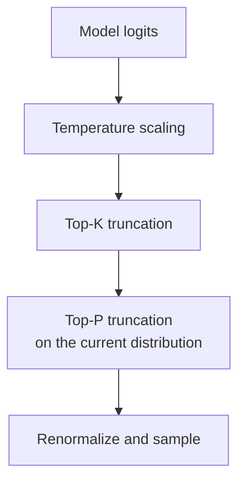

# Chapter 13: Tuning Temperature, Top-P, and Top-K

> [Chapter 12](12-decoding-strategies.md) discusses generation strategies. This chapter focuses on how logits and parameter settings produce the final sampling distribution, and how to verify that the settings actually take effect.

## 13.1 What the three parameters control

| Parameter | Operation | What it does not change or guarantee |
|---|---|---|
| Temperature | Scale logits by a positive temperature to change relative probabilities | Does not change token ranking or supply new knowledge |
| Top-K | Keep the K highest-probability tokens | Does not ensure that all remaining candidates are reasonable answers |
| Top-P | Keep the smallest high-probability set whose cumulative probability reaches at least P | Does not retain P of the token count or represent answer confidence |



This is a common order, not a cross-framework standard. Repetition penalties, grammar masks, minimum length, `min_p`, and other processors may also participate. When migrating services, inspect the actual logits processor / sampler chain rather than comparing identically named parameters alone.

```python
import torch


def sample_next(logits, temperature=1.0, top_k=0, top_p=1.0):
    # logits: (V,) raw scores for one position; apply the diagram's order.
    logits = logits / temperature  # Change relative probabilities, not ranking.
    if top_k > 0:
        kth = logits.topk(min(top_k, logits.size(-1))).values[-1]
        # With tied probabilities, this threshold can retain more than K candidates.
        logits = logits.masked_fill(logits < kth, float("-inf"))
    probs = logits.softmax(dim=-1)
    if top_p < 1.0:
        order = probs.argsort(descending=True)
        # Exclude the current item from the prefix sum to retain the threshold-crossing item.
        exclusive = probs[order].cumsum(dim=-1) - probs[order]
        probs = probs.clone()
        probs[order[exclusive >= top_p]] = 0.0
    probs = probs / probs.sum()  # Renormalize after truncation, then sample by probability.
    return torch.multinomial(probs, num_samples=1)
```


## 13.2 Temperature: how probability ratios change

Consider only positive temperature T:

$$
p_i(T)=\frac{\exp(z_i/T)}{\sum_j\exp(z_j/T)}
$$

If p is the softmax distribution before temperature scaling, this is also:

$$
p_i(T)=\frac{p_i^{1/T}}{\sum_j p_j^{1/T}}
$$

The probability ratio `p_i/p_j` therefore becomes that ratio raised to `1/T`. Temperatures below 1 amplify the difference; temperatures above 1 reduce it.

### 13.2.1 An example you can calculate by hand

Let the original distribution be `[0.6, 0.3, 0.1]`, with no other logits processing:

| Temperature | Calculation | Final distribution, approximately |
|---|---|---|
| T=1 | Unchanged | `[0.600, 0.300, 0.100]` |
| T=0.5 | Square each value and divide by 0.46 | `[0.783, 0.196, 0.022]` |
| T=2 | Take square roots and normalize | `[0.473, 0.334, 0.193]` |

Increasing temperature makes the third token more likely to be sampled, but it could represent either a useful creative choice or an error. Temperature controls a distribution, not intelligence.

### 13.2.2 T=0 and limiting behavior

T=0 causes division by zero in the formula; some APIs interpret `temperature=0` as a special request for greedy decoding. In the basic decoding settings discussed here, Transformers uses greedy decoding when `num_beams=1` and `do_sample=False`. Keeping sampling disabled but increasing beam width above 1 selects beam search. Do not pass zero to a TemperatureLogitsWarper that requires positive temperature, or equate disabling sampling with disabling search.

As positive temperature approaches 0, probability concentrates on the largest logit if it is unique. If several logits tie for the maximum, the mathematical limit distributes probability among them; that is not equivalent to an implementation's fixed tie-breaking choice.

As temperature approaches infinity, **unmasked finite logits** approach a uniform distribution. Tokens masked by grammar constraints or truncation do not reappear.

## 13.3 Top-K: sampling remains probability-weighted after truncation

For an original distribution of `[0.6, 0.3, 0.1]` and K=2, the final distribution is `[2/3, 1/3, 0]`, not `[1/2, 1/2, 0]`.

If the most probable token already holds 99% of the probability mass, K=50 may retain many low-probability candidates, but **sampling will still mostly select the top token**. It does not create a 49/50 chance of an error. These probabilities are illustrative; the Chinese text “北京” (“Beijing”) does not necessarily correspond to a single token.

A fixed K cannot adapt to the current distribution. It may truncate a flat distribution too aggressively while retaining a low-probability tail in a sharp one. Its advantage is an explicit candidate-count limit and behavior that is easy to inspect.

Check the implementation's boundary behavior:

- K=1 is equivalent to greedy decoding if differences in tie handling are ignored.
- If K exceeds the vocabulary size, the framework may clamp it or raise an error.
- Whether 0, -1, or omission disables Top-K is API-specific.
- Some threshold implementations retain more than K tokens when probabilities tie.

## 13.4 Top-P: probability mass is not a token count

Sort probabilities in descending order, retain the smallest prefix whose cumulative probability **reaches at least** P, and renormalize it. The item that takes the cumulative sum across the threshold must be retained.

Again, start with `[0.6, 0.3, 0.1]`:

| P | Retained set | After normalization |
|---|---|---|
| 0.5 | First item | `[1, 0, 0]` |
| 0.8 | First two items, totaling 0.9 | `[2/3, 1/3, 0]` |
| 0.95 | All three items | `[0.6, 0.3, 0.1]` |

`top_p=0.5` does not mean “remove half the vocabulary.” Under the mathematical definition, reaching the boundary is sufficient. Floating-point error, ties, and conventions such as `min_tokens_to_keep` can affect boundary behavior. P=1 usually disables nucleus truncation; whether P=0 is accepted, and how it behaves, depends on the API.

Top-P adapts the candidate count to the distribution's shape, but it cannot distinguish a model confidently giving a wrong answer from a genuinely unambiguous answer. It is not universally better than Top-K; official settings for some models use both.

## 13.5 How operation order affects the result

### 13.5.1 High temperature and low Top-P are not inherently unpredictable

Applying T=2 to `[0.6, 0.3, 0.1]` first gives approximately `[0.473, 0.334, 0.193]`. Applying P=0.5 then requires keeping the first two items, yielding approximately `[0.586, 0.414, 0]` after normalization.

If P=0.5 is applied first, only the first item remains; raising temperature afterward cannot bring back the others. The operations therefore do not generally commute. Once their order is known, the combination is calculable, not a case of “conflicting parameters with completely unpredictable effects.”

### 13.5.2 Top-K and Top-P can be used together

Consider `[0.4, 0.3, 0.2, 0.1]`:

- Apply K=2, then P=0.5 to the renormalized distribution `[0.571, 0.429]`: only the first item remains.
- Apply P=0.5 first: the original distribution needs the first two items to reach 0.7. Applying K=2 afterward retains both.

Positive temperature does not change the ranking used by Top-K, but it still changes the final sampling probabilities. Top-P's candidate set is directly affected by temperature and by normalization after preceding truncation.

## 13.6 Practical tuning starts with the model and interface

### 13.6.1 Avoid a universal three-level temperature table

First record the model revision, thinking/non-thinking mode, framework version, effective generation configuration, sampling status, and output-length limit. Some reasoning models do not accept every sampling parameter. A successful request does not prove that defaults or server configuration have not overridden a parameter.

The original Qwen3-30B-A3B model card provides a clear counterexample:

| Mode | Model-card configuration |
|---|---|
| thinking | Temperature=0.6, TopP=0.95, TopK=20, MinP=0; explicitly discourages greedy decoding |
| non-thinking | Temperature=0.7, TopP=0.8, TopK=20, MinP=0 |

These are not universal recommendations for other Qwen revisions or other models. They demonstrate why neither “always use T=0 for precise tasks” nor “never combine Top-K and Top-P” holds.

### 13.6.2 Designing an interpretable experiment

1. Use the model-card recommendation as the baseline, fixing prompts, templates, constraints, and output budgets.
2. Change one main variable at a time and observe accuracy, format pass rate, repetition, and average output length. Use a small joint experiment when interactions need investigation.
3. Run multiple samples or seeds for each setting and report variation. Do not infer a general conclusion from one good response.
4. Confirm improvements on the business test set, retaining model versions and failure cases. For code tasks, use execution tests rather than judging confident wording.

Changing one variable at a time is an experimental method that helps diagnosis, not an algorithmic prohibition on combining parameters.

## 13.7 Two limits beyond the parameters

### 13.7.1 Sampling cannot replace constraints and verification

When JSON processing fails, distinguish invalid syntax, truncated output, and incorrect field semantics. A grammar or schema can constrain valid token paths, but cannot guarantee factual correctness; lower temperature cannot replace these constraints either.

Stop tokens, stop strings, maximum length, and repetition penalties also change generation. If an output is unexpectedly short, check EOS and stopping settings before blaming a low temperature.

### 13.7.2 A fixed seed is not a complete reproducibility protocol

A seed controls the pseudorandom sequence; nondeterminism in model computation can still change the distribution being sampled. Greedy decoding does not use random sampling, but floating-point behavior, batching, and model versions still affect it. For reproducibility, fix the execution environment and check the framework's determinism or batch invariance support and its costs.

## 13.8 Chapter summary

Temperature changes probability ratios, Top-K limits candidate count, and Top-P limits cumulative probability mass; truncation requires renormalization. Combining them is not forbidden. What matters is operation order, boundary behavior, and model-recommended settings. Tuning conclusions should come from task evaluation, not from equating high temperature with creativity or low temperature with correctness.

## References

- [The Curious Case of Neural Text Degeneration](https://arxiv.org/abs/1904.09751)
- [Transformers: Generation Utilities, including Temperature/TopK/TopP LogitsWarper](https://huggingface.co/docs/transformers/main/en/internal/generation_utils)
- [Transformers v4.56.2: configuration conditions for greedy decoding, sampling, and beam search](https://huggingface.co/docs/transformers/v4.56.2/en/generation_strategies)
- [Qwen3-30B-A3B official model card and sampling recommendations](https://huggingface.co/Qwen/Qwen3-30B-A3B)
- [vLLM: Batch Invariance](https://docs.vllm.ai/en/stable/features/batch_invariance/)
