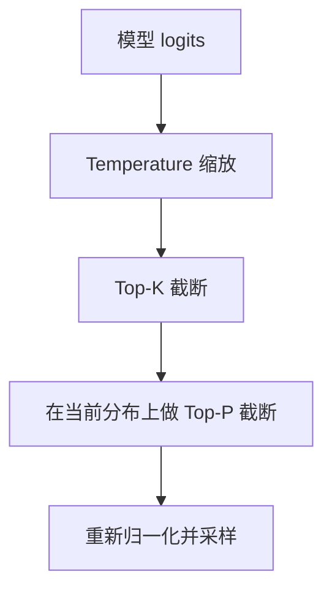

# 第十三章：Temperature、Top-P、Top-K 调参

> [第十二章](12-decoding-strategies.md)讨论生成策略。本章重点是：给出一组 logits 和参数后，最终采样分布怎样得到，怎样验证参数是否真的生效。

## 13.1 三个参数控制什么

| 参数 | 操作 | 不改变或不保证的事 |
|---|---|---|
| Temperature | 对 logits 做正温度缩放，改变相对概率 | 不改变 token 排序，不提供新知识 |
| Top-K | 保留概率最高的 K 个 token | 不保证剩下的都是合理答案 |
| Top-P | 保留累计概率至少达到 P 的最小高概率集合 | 不保证保留 P 比例的 token，也不表示答案置信度 |



这是一种常见顺序，不是跨框架标准。重复惩罚、语法掩码、最小长度、`min_p` 等处理也可能参与。迁移服务时应检查实际的 logits processor / sampler 链，而不能只比较同名参数。

```python
import torch


def sample_next(logits, temperature=1.0, top_k=0, top_p=1.0):
    # logits: (V,) 单个位置的原始分数，按上图顺序依次处理
    logits = logits / temperature  # 只改变相对概率，不改变排序
    if top_k > 0:
        kth = logits.topk(min(top_k, logits.size(-1))).values[-1]
        # 概率并列时，这种写法会保留多于 K 个候选
        logits = logits.masked_fill(logits < kth, float("-inf"))
    probs = logits.softmax(dim=-1)
    if top_p < 1.0:
        order = probs.argsort(descending=True)
        # 不含自身的前缀累计概率：以它为判据，跨过阈值的那一项会被保留
        exclusive = probs[order].cumsum(dim=-1) - probs[order]
        probs = probs.clone()
        probs[order[exclusive >= top_p]] = 0.0
    probs = probs / probs.sum()  # 截断后重新归一化，再按概率采样
    return torch.multinomial(probs, num_samples=1)
```


## 13.2 Temperature：概率比怎样变化

仅讨论正温度 T：

$$
p_i(T)=\frac{\exp(z_i/T)}{\sum_j\exp(z_j/T)}
$$

若 p 是未经温度缩放的 softmax 分布，也可以写成：

$$
p_i(T)=\frac{p_i^{1/T}}{\sum_j p_j^{1/T}}
$$

因此两个 token 的概率比由 `p_i/p_j` 变为它的 `1/T` 次方。温度低于 1 时放大差距，高于 1 时缩小差距。

### 13.2.1 一个可手算的例子

设原分布为 `[0.6, 0.3, 0.1]`，没有其他 logits 处理：

| 温度 | 计算 | 最终分布（近似） |
|---|---|---|
| T=1 | 不变 | `[0.600, 0.300, 0.100]` |
| T=0.5 | 各项平方后除以 0.46 | `[0.783, 0.196, 0.022]` |
| T=2 | 各项开平方后归一化 | `[0.473, 0.334, 0.193]` |

升温后第三项更容易被采到，但它可能是好创意，也可能是错误。温度控制的是分布，不是「聪明程度」。

### 13.2.2 T=0 与极限

T=0 会使公式除零；部分 API 将 `temperature=0` 特判为贪心。在本节讨论的基本解码设置中，Transformers 用 `num_beams=1` 且 `do_sample=False` 选择贪心；若保持不采样而将束宽设为大于 1，则使用束搜索。不要把零传给要求正温度的 TemperatureLogitsWarper，也不要把“关闭采样”直接等同于“关闭搜索”。

当正温度趋近 0 且最大 logit 唯一时，概率集中到该 token；若有多个并列最大值，数学极限会在它们之间分配概率，不等同于某个实现的固定并列值选择。

温度趋向无穷大时，**未被屏蔽的有限 logits** 趋近均匀分布。语法或截断屏蔽掉的 token 不会因此回来。

## 13.3 Top-K：截断后仍按概率采样

假设原分布为 `[0.6, 0.3, 0.1]`，K=2，则最终分布是 `[2/3, 1/3, 0]`，不是 `[1/2, 1/2, 0]`。

如果最高概率 token 已占 99%，K=50 虽然可能保留很多低概率候选，**仍会主要采到最高概率项**，不是有 49/50 的概率选错。概率数字是示例，实际的「北京」也未必对应单个 token。

固定 K 的问题是不能适应当前分布：平坦分布可能被过度截断，尖锐分布仍会保留低概率尾部。优点是候选规模有明确上限，行为容易检查。

边界需查实现：

- K=1 在不考虑并列处理差异时等价于贪心。
- K 大于词表大小时，框架可能裁剪或报错。
- 0、-1 或不传参数中，哪种表示禁用 Top-K，不能跨 API 照搬。
- 概率并列时，某些阈值实现可能保留超过 K 个 token。

## 13.4 Top-P：概率质量不等于 token 数量

把概率降序排列，取累计概率**至少达到** P 的最小前缀，并将其重新归一化。必须保留使累积值跨过阈值的那一项。

原分布仍为 `[0.6, 0.3, 0.1]`：

| P | 保留集合 | 归一化后 |
|---|---|---|
| 0.5 | 第一项 | `[1, 0, 0]` |
| 0.8 | 前两项，累计 0.9 | `[2/3, 1/3, 0]` |
| 0.95 | 三项 | `[0.6, 0.3, 0.1]` |

`top_p=0.5` 不是「截掉一半词表」。数学定义下达到边界即足够；浮点误差、并列值与 `min_tokens_to_keep` 等实现约定可能影响边界行为。P=1 通常表示不做 nucleus 截断，P=0 是否允许及如何处理由 API 决定。

Top-P 会随分布形状调整候选数，但无法区分「模型很确定地答错」和「真的有确定答案」。它不普遍优于 Top-K；一些模型的官方配置会同时使用二者。

## 13.5 顺序如何影响结果

### 13.5.1 高温与低 Top-P 并非不可预测

对 `[0.6, 0.3, 0.1]` 先做 T=2，得到约 `[0.473, 0.334, 0.193]`。再做 P=0.5，需要保留前两项，归一化后约为 `[0.586, 0.414, 0]`。

如果先做 P=0.5，只剩第一项，此后怎么升温都还是第一项。因此两个操作通常不交换；只要顺序已知，组合就是可计算的，不是「参数打架、完全不可预测」。

### 13.5.2 Top-K 与 Top-P 可以同时使用

设分布为 `[0.4, 0.3, 0.2, 0.1]`：

- 先 K=2，再在重归一化分布 `[0.571, 0.429]` 上应用 P=0.5，只留第一项。
- 先 P=0.5，原分布需要前两项累计到 0.7；再做 K=2，仍保留两项。

Temperature 与 Top-K 的候选排序在正温度下相同，但最终采样概率仍受温度影响；Top-P 的候选集合则直接受温度和前面截断后的归一化影响。

## 13.6 工程调参：先确认模型与接口

### 13.6.1 不使用跨模型的三档温度表

先记录：模型修订、thinking/non-thinking 模式、框架版本、实际生效的生成配置、是否采样和输出长度上限。有些推理模型不接受全部采样参数；发送成功也不一定意味着参数没有被默认值或服务端配置覆盖。

Qwen3-30B-A3B 原版官方模型卡提供了一个明确反例：

| 模式 | 模型卡给出的配置 |
|---|---|
| thinking | Temperature=0.6，TopP=0.95，TopK=20，MinP=0；明确不建议贪心 |
| non-thinking | Temperature=0.7，TopP=0.8，TopK=20，MinP=0 |

这不是其他 Qwen 修订或其他模型的通用推荐，而是说明「精确任务一律 T=0」「禁止同时用 Top-K/Top-P」都不成立。

### 13.6.2 怎样做一次有解释力的实验

1. 用模型卡建议作为基线，固定提示、模板、约束和输出预算。
2. 一次改变一个主要变量，观察正确率、格式通过率、重复率和平均输出长度；需要分析交互时再做小范围联合实验。
3. 每个设置跑多个样本或随机种子，报告波动，不从一次好回答推出结论。
4. 在业务测试集上确认收益，保留模型版本和失败样本；代码任务用执行测试，而不是只看文字是否自信。

「一次改一个变量」是方便诊断的实验方法，不是禁止组合参数的算法限制。

## 13.7 参数之外的两个边界

### 13.7.1 采样不能代替约束与验证

JSON 解析失败要区分语法不合法、输出被截断、字段含义错误。grammar/schema 可以限制合法 token 路径，不能保证事实正确；调低温度也不能替代它们。

同样，停止 token、stop string、最大长度、重复惩罚会改变生成结果。输出很短时不应直接认定温度过低，先查 EOS 和停止配置。

### 13.7.2 固定 seed 不是完整的复现协议

seed 控制伪随机数序列；模型计算的非确定性仍可改变被采样的分布。贪心虽然不用随机采样，但也受浮点、批次与模型版本影响。需要可复现时，固定运行环境并检查框架的确定性或 batch invariance 支持及代价。

## 13.8 本章总结

Temperature 改概率比，Top-K 限制候选数，Top-P 限制累计概率质量；截断后都要重新归一化。它们的组合不是禁忌，真正需要确认的是执行顺序、边界值与模型推荐配置。调参结论应来自任务评测，而不是把高温等同于创意、低温等同于正确。

## 参考资料

- [The Curious Case of Neural Text Degeneration](https://arxiv.org/abs/1904.09751)
- [Transformers：Generation Utilities，含 Temperature/TopK/TopP LogitsWarper](https://huggingface.co/docs/transformers/main/en/internal/generation_utils)
- [Transformers v4.56.2：贪心、采样与束搜索的配置条件](https://huggingface.co/docs/transformers/v4.56.2/en/generation_strategies)
- [Qwen3-30B-A3B 官方模型卡与采样建议](https://huggingface.co/Qwen/Qwen3-30B-A3B)
- [vLLM：Batch Invariance](https://docs.vllm.ai/en/stable/features/batch_invariance/)
