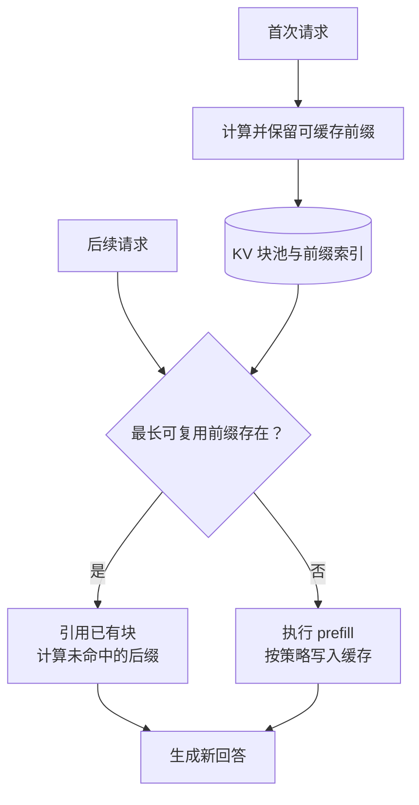

# 第十四章：KV Cache 与 Prompt Caching

## 14.1 KV Cache、Prompt Caching 与答案缓存有什么区别？

KV Cache 在生成步骤之间复用历史状态，Prompt Caching 将前缀复用扩展到不同请求，答案缓存则直接返回已有答案。三者省掉的计算不同，失效条件也不同。

| 概念 | 复用范围 | 缓存什么 |
|---|---|---|
| KV Cache | 一次自回归生成的不同步骤之间 | 各层已处理位置的 key/value 状态 |
| Prefix / Prompt Caching | 不同请求共享相同前缀时 | 可复用前缀的模型中间状态，常见实现为 KV |
| 答案缓存 | 请求命中应用缓存时 | 已生成的完整答案 |

Prompt Caching 不等于答案缓存：新请求仍要处理未命中的后缀并生成输出。厂商 API 暴露的是缓存协议和计费，不能据此断言其内部存储布局与某个开源框架完全一样。

## 14.2 为什么因果模型能够复用历史状态

不使用 KV Cache 的朴素实现会反复把完整前缀送入模型：

```text
输入 prompt             → 预测 t1
输入 prompt + t1        → 预测 t2
输入 prompt + t1 + t2   → 预测 t3
```

对**标准因果 Transformer**，某一历史位置不能看未来 token。因此，模型权重、位置编码、掩码及先前输入不变时，这个位置在各层的隐藏状态不因追加后缀而改变，其 K/V 也可复用。

这依赖因果性和固定计算语义，不只是「embedding 不变」。深层的 K/V 来自各层隐藏状态，而非全都直接来自最初的 token embedding。若前缀被编辑、位置或 RoPE 配置改变、模型/LoRA 权重改变，则相关缓存可能失效；有特殊动态位置规则的模型也需单独检查。

## 14.3 单次生成：prefill 与 decode

### 14.3.1 一次计算里发生什么

$$
\mathrm{Attention}(Q,K,V)=
\mathrm{softmax}\left(\frac{QK^\top}{\sqrt{d_k}}\right)V
$$

公式省略了掩码：prefill 的每个查询只能读取自身及更早的位置，并且要排除 padding；单 token decode 则通常已经只向该查询提供可见的历史与当前 K/V。不能因为用了缓存就省掉所有场景下的掩码检查。

- **Prefill**：并行处理整个 prompt，逐层建立 K/V，用最后位置的 logits 采样第一个输出 token。
- **Decode**：把上一步采得的 token 送入各层；计算它自己的 Q/K/V，将新 K/V 追加到缓存，Q 读取历史和**当前位置自身**的 K/V，再产生下一 token 的 logits。
- **为什么不长期缓存 Q？** 旧 Q 通常不会被未来位置的 attention 读取；不是 Q 不能缓存，而是标准自回归解码无需复用它。

下面是抽象接口的伪代码，`model` 内部包含所有层、因果 attention 和输出头：

```python
logits, cache = model.prefill(prompt_tokens)
for step in range(max_new_tokens):
    token = sample(logits[-1])
    emit(token)
    if token == eos_token_id or step + 1 == max_new_tokens:
        break
    logits, cache = model.decode(token, cache)
```

缓存按层维护；真实框架通常采用预分配或分页写入，不应每步 `concat` 复制全部历史 KV。采样针对词表 logits，不是直接对 attention 输出向量采样。

### 14.3.2 复杂度必须说明统计口径

令 prompt 长度为 P，生成长度为 G，固定层数、头数和维度，只统计**全注意力的 QK 与 AV 工作量**：

| 实现 | prompt 之后的工作 | 总 attention 工作量 |
|---|---|---|
| 每步重算完整前缀 | 长度约为 P+i 的全序列 attention | 随各步的 `(P+i)²` 求和 |
| 使用 KV Cache | 每个新 query 读取约 P+i 个位置 | `O(P² + PG + G²)`，含首次 prefill |

如果忽略固定短 prompt，只考察 G 增长，前者为 `O(G³)`，后者为 `O(G²)`。**这不是模型全部 FLOPs，也不是具体 GPU 执行次数**；投影、FFN、输出头和通信仍有自己的成本。不能把「1000 token」直接换算成「十亿次单 token 运算」。

KV Cache 避免重算历史隐藏状态，却没有消除新 Q 对长历史的读取。所以长上下文 decode 仍会受 KV 带宽限制。

## 14.4 KV Cache 显存：先数 KV 头

对普通全注意力、各层 KV 头数相同且无跨请求共享的缓存，若 K/V 的头维相同：

$$
M_{\mathrm{KV}}=2LBND_{\mathrm{head}}H_{\mathrm{KV}}s
$$

其中 L 为层数，B 为并发序列数，N 为每条序列当前缓存长度，H_KV 为 KV 头数，D_head 为头维，s 为每个元素的字节数。变长 batch 应把 BN 换成各序列长度之和；分片、复制、尾块、量化元数据和预留池需要另外核算。

### 14.4.1 相同层数，不同头数，差多少

取一个**容量估算示例**，不代表任意 7B 模型都支持该上下文：L=32、D_head=128、B=1、N=32,768，FP16/BF16 的 s=2。

| KV 设计 | H_KV | 理想 KV 大小 |
|---|---:|---:|
| MHA | 32 | 16 GiB，约 17.18 GB |
| GQA | 8 | 4 GiB |
| MQA | 1 | 0.5 GiB |

1 GiB 为 2³⁰ 字节，1 GB 为 10⁹ 字节。若另有 7B 个 FP16 权重，裸权重约 14 GB；还要加入激活、workspace 和框架开销。不能只说「7B 的 32K KV 就是 17GB」，也不能只靠权重大小决定可容纳并发。

MLA 可能缓存压缩 latent 与位置相关分量，滑动窗口层只保留窗口内状态；这些不能直接套用上述常规 KV 公式。详见[第三章](../01-foundations/03-attention-variants.md)。

## 14.5 跨请求：共享的必须是完整计算前缀

假设许多请求都以同一份长系统提示开头。第一次 prefill 产生状态后保留它，后续请求可直接从最长匹配前缀之后继续。



常见的命中条件包括：

- token 前缀一致，且模型、适配器、位置/掩码语义兼容；
- chat template、工具定义、图片等有效输入一致，而非仅用户可见文字相同；
- 缓存还在、长度达到可缓存粒度，并且请求路由到可访问该缓存的实例；
- 租户或信任域允许共享。

修改中间一个 token 会使**其后**的缓存不再匹配，但修改之前的完整块仍可能命中。重复的文本出现在不同上下文之后，也不能只凭该文本相同复用，因为其隐藏状态不同。

## 14.6 API 行为：显式和自动不是厂商的永久标签

同一厂商也可能同时提供显式边界和自动缓存。产品规则会变化，应把模型、接口和计费版本一起记录，以下仅说明参考资料所列接口的行为。

### 14.6.1 Claude：内容块断点，也有自动断点

官方 cookbook 同时演示：

- 在内容块上设置 `cache_control`，明确缓存边界。
- 在请求顶层设置 `cache_control`，由服务自动给最后一个可缓存块添加断点。

显式边界适合「固定文档 + 不同问题」。以下结构需替换成真实模型 ID 和足够长的文档；短占位文字不保证达到模型的最小缓存长度。

```python
import anthropic

client = anthropic.Anthropic()
system = [{
    "type": "text",
    "text": "[替换为真实的固定文档与说明]",
    "cache_control": {"type": "ephemeral"},
}]

response = client.messages.create(
    model="YOUR_MODEL_ID",
    max_tokens=512,
    system=system,
    messages=[{"role": "user", "content": "请概括文档中的责任划分。"}],
)
print(response.usage.cache_creation_input_tokens)
print(response.usage.cache_read_input_tokens)
```

再次请求只有满足长度、前缀、路由和存活等条件才会命中。SDK 的 `ephemeral` TTL 支持 `5m`（默认）与 `1h`，不能把所有 Claude 缓存都说成只有五分钟。

### 14.6.2 OpenAI：按模型核对缓存模式

官方文档说明支持模型默认启用 prompt caching，但最小可缓存长度、隐式/显式断点、写入计费和保留时间按模型区分。因此不再使用「只要超过约 1024 token，所有模型都自动免费写缓存」这样的统一规则。

从响应 usage 中检查缓存命中的 token 数，例如 Chat Completions 的 `prompt_tokens_details.cached_tokens`；其他端点字段可能不同。区分请求命中率与 token 命中率：一次请求只命中很短的前缀，不等于省掉大部分 prefill。

### 14.6.3 计费应该算回本条件

只看同一个可复用前缀，设普通输入成本为 C，写入倍率为 w，读取倍率为 r，写一次后命中 h 次：

$$
C_{\mathrm{cache}}=C(w+hr),\qquad
C_{\mathrm{plain}}=C(1+h)
$$

缓存划算的条件是 h(1−r) 大于 w−1。**不是固定要命中两次以上。** 例如 w=1.25、r=0.1 时，一次写入加一次读取为 1.35C，已低于两次普通输入的 2C。这是条件化算例，不是全行业报价。

还要计算失效后的重写、未缓存后缀及输出费用。缓存主要减少重复 prefill；decode 仍需逐 token 运行，首 token 也仍可能受到排队与路由影响。

## 14.7 组织 Prompt 时如何利用缓存

适合复用的内容包括稳定的工具定义、系统规则、同一长文档和固定示例。把可共用的稳定内容放在前面，动态用户问题放在后面：

```text
[稳定且有权限共享的说明、文档、示例]
← 合适的缓存边界

[本次时间、用户条件、问题]
```

这不是要求为了命中率把敏感用户资料塞进公共系统提示。权限隔离优先，缓存不能替代访问控制。

多轮对话可复用未改变的历史，但摘要压缩、消息重排、工具 schema 更新都会改变前缀。对滚动历史，先评估实际稳定长度，不要直接假设 Agent 的命中率必然高。

## 14.8 工程陷阱：缓存不是越多越好

| 情况 | 影响与处理 |
|---|---|
| 冷缓存或请求分散在不同实例 | 命中率低；压测要同时覆盖冷启动、热缓存和多副本路由 |
| 热点前缀过多 | 占用 KV 池，挤压活动请求；监控淘汰、重算与排队 |
| 低频前缀反复过期 | 写入附加费可能超过读取节省；按到达间隔和 TTL 计算 |
| 多租户共享缓存 | 需要隔离信任域，避免越权复用及命中时间侧信道 |
| 只缓存 KV、不缓存最后位置 logits | 全前缀命中时仍可能重算最后少量 token，以产生首个输出分布 |

vLLM 的前缀索引将前一块哈希、本块 token 和额外键结合；额外键可包含 LoRA ID、多模态输入哈希与缓存 salt。只对本块文字做哈希是不够的。

## 14.9 缓存优化的不同层次

### 14.9.1 KV 量化：减少每个元素的位宽

FP16 到 8-bit 或 4-bit 时，理想数据载荷分别为原来的二分之一、四分之一；scale、零点、未量化残留和对齐会增加实际容量。还要验证 attention kernel 能否直接消费该格式，避免转换开销抵消收益。

不能笼统说「KV 一定比权重更怕量化」。K 的误差会改变 attention 分数，V 的误差改变加权聚合，两者分布与误差传播不同。KIVI 的关键设计是 **K 按通道、V 按 token 的非对称分组量化**，并保留高精度残留窗口。其结果不能直接推成所有模型的低位宽质量保证。

### 14.9.2 PagedAttention：减少分配浪费

它把逻辑连续的 KV 序列映射到不必物理连续的固定大小块，通过 block table 访问。块大小是配置与后端约束，不是永远 16 token。

分页减少外部碎片和过度预留；尾块仍有内部浪费。共享块通过引用计数管理，分支写入时可采用写时复制。**分页本身不压缩一个 token 的 KV 字节数**。

### 14.9.3 APC 与 Offloading：复用和放置

APC 负责发现可复用的前缀；offloading 把状态放到 CPU 或其他存储层，减少 GPU 驻留量但增加传输。它们和分页、GQA、量化各解决不同问题，可以组合，也可能因后端支持或带宽形成限制。

## 14.10 推导与排查练习

- 缓存长度翻倍、并发不变，标准全注意力 KV 容量怎样变化？线性翻倍，但 prefill attention 工作量不是线性。
- 将 query 头保持 32、KV 头从 32 改为 8，理论缓存缩小多少？四倍；质量与结构改动不能只靠服务端开关实现。
- 命中大量前缀，为什么总响应仍慢？检查输出长度、decode、排队、缓存读取和跨机传输。
- 同一段文档为什么不命中？比较完整 token 前缀、模板、工具、多模态输入、适配器、实例路由和缓存存活状态。

## 14.11 本章总结

KV Cache 的依据是因果前缀状态不变；收益是避免历史重算，代价是容量与带宽。Prompt Caching 把可复用状态延伸到请求之间，其收益受匹配粒度、缓存生命周期、流量与计费约束。容量估算必须数 KV 头，服务评估必须分开 prefill、decode 和排队。

## 参考资料

- [PagedAttention 原论文](https://arxiv.org/abs/2309.06180)
- [MQA 原论文](https://arxiv.org/abs/1911.02150)
- [GQA 原论文](https://arxiv.org/abs/2305.13245)
- [Anthropic 官方 Prompt Caching cookbook](https://github.com/anthropics/anthropic-cookbook/blob/main/misc/prompt_caching.ipynb)
- [Anthropic 官方 SDK：缓存 TTL 类型](https://github.com/anthropics/anthropic-sdk-python/blob/main/src/anthropic/types/cache_control_ephemeral_param.py)
- [OpenAI：Prompt Caching](https://developers.openai.com/api/docs/guides/prompt-caching)
- [KIVI 原论文](https://arxiv.org/html/2402.02750v2)
- [vLLM：Automatic Prefix Caching 设计](https://docs.vllm.ai/en/stable/design/prefix_caching/)

接口资料核对范围：2026-09-08 的官方文档与 SDK；OpenAI 缓存指南另于 2026-09-15 复核。示例没有发起计费请求，不代表一次真实缓存命中结果。
