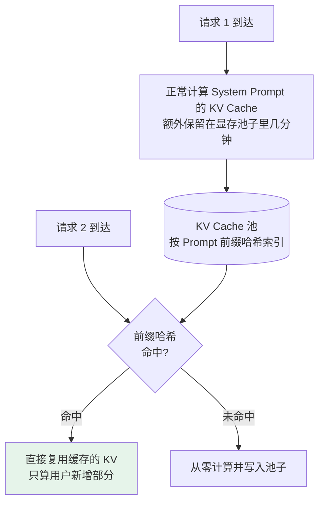

# 第十四章：KV Cache 与 Prompt Caching

## 14.1 先抓住核心关系

这两个优化其实是一套机制的两种用法：**同一个底层机制在两个时间尺度上的应用**：

| | 复用范围 | 谁和谁共享 |
|---|---|---|
| **KV Cache** | 单次推理内 | 同一次生成里，**不同 token 之间** |
| **Prompt Caching** | 跨请求 | 不同请求之间，**相同前缀** |

底层都是「**缓存 K/V 矩阵避免重复计算**」，完全一样。

## 14.2 自回归生成里隐藏的低效

LLM 每次只产出一个新 token，拼到序列末尾，再对整个新序列重新计算 attention。听起来自然，但隐藏着巨大浪费：

```
第 1 步：输入 [P]                  → 输出 token 1
第 2 步：输入 [P, t1]              → 输出 token 2
第 3 步：输入 [P, t1, t2]          → 输出 token 3
...
第 10 步：输入 [P, t1, ..., t9]    → 输出 token 10
```

**每一步都把前面所有 token 重新算一遍 attention，包括 P 这个可能几千 token 的长 Prompt。**

### 14.2.1 朴素实现是 $O(N^3)$

第 $i$ 步要对 $i$ 个 token 做 attention，复杂度 $O(i^2)$，总计算量：

$$
\sum_{i=1}^{N} i^2 \approx O(N^3)
$$

生成一个 1000 token 的回答，等于做 10 亿次单 token 量级的运算。

### 14.2.2 关键观察

**第 2 步算的 P 的 attention，和第 1 步算的完全一样**（输入和模型参数都没变）。

**每一步重算前缀，是纯粹的浪费。**

## 14.3 KV Cache：单次推理内的优化

**核心思路一句话：把前面所有 token 的 K 和 V 缓存起来，每次新 token 只算自己的部分。**

### 14.3.1 为什么可以这么做

$$
\mathrm{Attention}(Q, K, V) = \mathrm{softmax}\!\left(\frac{QK^\top}{\sqrt{d_k}}\right)V
$$

注意三件事：

1. **新 token 只贡献一个 $Q$**（它在「问」前面所有 token）；
2. 它做点积的对象 $K^\top$ 和加权求和的对象 $V$ 都来自**前面所有 token**；
3. **前面所有 token 的 $K$、$V$ 是固定的**——它们从已有 token 的 embedding 算出，新 token 不影响它们。

所以前面所有的 $K$、$V$ 完全可以缓存。

### 14.3.2 代码对比

```python
# 朴素实现（无 KV Cache）
for step in range(max_tokens):
    K_all, V_all = model.compute_KV(全部已有 token)   # 重复算前面的
    Q_new = model.compute_Q(全部已有 token)
    out = softmax(Q_new @ K_all.T / sqrt(d_k)) @ V_all
    next_token = sample(out[-1])

# 带 KV Cache 的实现
kv_cache = []
for step in range(max_tokens):
    if step == 0:
        K, V = model.compute_KV(prompt_tokens)      # 首次处理整个 Prompt
        kv_cache.append((K, V))
    else:
        K_new, V_new = model.compute_KV([new_token])  # 只算新 token
        kv_cache.append((K_new, V_new))

    Q_new = model.compute_Q([current_token])
    K_all, V_all = concat(kv_cache)                  # 缓存里取出来用
    out = softmax(Q_new @ K_all.T / sqrt(d_k)) @ V_all
    next_token = sample(out)
```

**关键变化**：每一步只算 1 个 token 的 K/V（$O(1)$ 工作量），而不是 $N$ 个（$O(N)$）。

| 实现 | 第 $i$ 步开销 | $N$ 步总开销 |
|---|---|---|
| 朴素（无 KV Cache） | $O(i^2)$ | $O(N^3)$ |
| **带 KV Cache** | $O(i)$ | $O(N^2)$ |

> **KV Cache 不是「锦上添花的优化」，是「让自回归生成可行的基本盘」。** 所有现代推理框架（vLLM、SGLang、TGI、llama.cpp）默认开启，没人会关掉它。

## 14.4 KV Cache 的显存代价

速度上去了，代价是显存——**前面所有 token 的 K/V 都要常驻显存**。

$$
M_{\mathrm{KV}} = 2 \times B \times N \times L \times H \times d_k \times 2\ \mathrm{bytes}
$$

（首个 2 是 K 和 V 各一份，末尾 2 字节是 FP16）

对一个 7B 模型（$L=32$、$H=32$、$d_k=128$），batch=1、$N=32\mathrm{K}$：

$$
2 \times 1 \times 32000 \times 32 \times 32 \times 128 \times 2 \approx 17\ \mathrm{GB}
$$

**光 KV Cache 就 17GB，加上权重 14GB 共 31GB，一张 24GB 的 4090 根本放不下。**

这就是为什么大模型部署有一整套围绕 KV Cache 的优化——MQA/GQA 共享 K/V（见 [第三章](../01-foundations/03-attention-variants.md)）、KV Cache 量化、PagedAttention。

## 14.5 Prompt Caching：把复用扩展到跨请求

KV Cache 解决的是单次生成内的重复。但还有一个更隐蔽的浪费：**不同请求之间的重复计算**。

### 14.5.1 一个真实场景

你做了一个客服 AI，System Prompt 有 3000 token 的产品知识、对话规则、Few-shot 示例。所有用户请求都用这同一个 System Prompt 开头。

**一天 10 万次对话，就重算了 10 万次这 3000 个 token 的 KV Cache。**

### 14.5.2 机制



技术上就是 **KV Cache 在时间维度的延伸**：单次内在 token 之间共享，Prompt Caching 在请求之间共享。

## 14.6 主流 API 的两种实现方式

### 14.6.1 Claude：显式标记缓存断点

要用户显式告诉 API「我希望缓存到这里」：

```python
import anthropic
client = anthropic.Anthropic()

SYSTEM_WITH_CACHE = [
    {
        "type": "text",
        "text": "你是一位专业的劳动法顾问。\n\n以下是完整的法律条文：\n\n[数千字内容...]",
        "cache_control": {"type": "ephemeral"}   # 断点：这份内容会被缓存
    }
]

# 第一次请求：建立缓存（写入有少量额外费用）
resp1 = client.messages.create(
    model="<your-model-id>", max_tokens=512,
    system=SYSTEM_WITH_CACHE,
    messages=[{"role": "user", "content": "员工试用期最长可以是多久？"}]
)

# 第二次请求：system 前缀完全一致，命中缓存
resp2 = client.messages.create(
    model="<your-model-id>", max_tokens=512,
    system=SYSTEM_WITH_CACHE,
    messages=[{"role": "user", "content": "劳动合同必须包含哪些必备条款？"}]
)
```

**好处**：用户清楚控制哪些内容缓存。**代价**：要改代码、加配置。

### 14.6.2 OpenAI：自动缓存

只要 Prompt 前缀超过一定长度（约 1024 token），系统会自动尝试缓存。命中时不需要额外操作，响应里会告诉你有多少 token 命中了。

**好处**：不改代码就能享受到。**缺点**：控制粒度不如显式标记精细。

### 14.6.3 收益

| 维度 | 说明 |
|---|---|
| **成本** | 命中缓存的 token 费用大幅低于正常输入 token（Anthropic 的 ephemeral cache 约为 10%），但**写入那次会有额外费用**（约 1.25 倍）。**要有 2 次以上命中才划算** |
| **延迟** | 命中时首 token 延迟通常下降，因为 Prompt 部分不用重算 |

> **别把某一家的价格比例说成全行业通用。** 具体能降多少延迟也要看缓存前缀长度、模型、并发和服务端调度，**工程上要用真实链路压测**。

## 14.7 适合的三类场景

Prompt Caching 最适合「**前面固定、后面变化**」的使用模式。

| 场景 | 说明 |
|---|---|
| **① 固定 System Prompt 的应用** | 客服系统、AI 助手、代码 Review 工具。System Prompt 包含大量产品知识、规则、Few-shot。**这是最常见、收益最大的场景** |
| **② 基于同一份长文档的多次问答** | 把合同文本放进 Prompt 后问 10 个问题。第一次建缓存，后续 9 次命中。法律、金融、医疗 AI 特别多 |
| **③ 大量 Few-shot 示例** | 10–20 组示例引导输出格式，每次用户问题不同但示例一样 |

## 14.8 工程陷阱

### 14.8.1 最常踩的雷：动态内容放在了前面

**前缀必须完全一致才能命中，哪怕多一个空格、改一个字符，就是 miss。**

❌ **会让缓存永远失效的结构**：

```
今天是 2026-03-07，当前用户：张三          ← 每次都不同！

[数千字的系统提示 + 产品知识库]
← cache_control 断点

用户问题：我想退换货
```

日期和用户名每次都变，**导致整个前缀每次都变，缓存永远 miss**，每次还是要从零算几千字的系统提示。

✅ **正确结构**：

```
[数千字的系统提示 + 产品知识库]
← cache_control 断点放这里

今天是 2026-03-07，当前用户：张三
用户问题：我想退换货
```

**把所有固定内容集中到断点之前，动态内容放在断点之后。**

### 14.8.2 缓存的时效性

Anthropic 的 ephemeral 缓存默认有效期约 5 分钟，超时没命中就失效。

| 流量水平 | 影响 |
|---|---|
| **高流量**（每分钟几十次以上） | 通常能自然保持缓存活跃，收益显著 |
| **低流量**（几小时一次） | 频繁失效，**反而因为写入的额外费用更贵** |

**低流量场景使用前要评估清楚。**

## 14.9 两个进阶方向

### 14.9.1 KV Cache 量化

把 KV Cache 从 FP16 量化到 INT8 甚至 INT4，显存降到 1/2 或 1/4。

**但 KV Cache 对量化误差比权重更敏感**，尤其长链路推理（数学题、代码题）。这仍是研究热点，主流方案还在演进。

#### 14.9.2 PagedAttention 与 Automatic Prefix Caching

vLLM 的核心创新，**灵感来自操作系统的虚拟内存**。

把 KV Cache 切成固定大小的 Block（典型 16 个 token 一块），每个请求拿到的是逻辑 Block 列表，由一张 Block Table 映射到物理显存。

PagedAttention 还使前缀块可被安全引用和回收。vLLM 的 **Automatic Prefix Caching（APC）** 会按已计算 token 前缀自动复用 KV block；它不是只属于 SGLang/RadixAttention 的能力。是否命中取决于 token 前缀、缓存容量、淘汰和当前版本配置，应以目标版本文档与压测为准。

## 14.10 常见错误

### 14.10.1 把两者当成不相关的优化

它们是**同一机制在两个时间尺度上的应用**。这是区分两者的关键。

### 14.10.2 说不出朴素实现为什么是 $O(N^3)$

每步 $O(i^2)$ 求和得 $O(N^3)$，加了 KV Cache 后每步 $O(i)$，总量降到 $O(N^2)$。

### 14.10.3 说不清为什么 K/V 能缓存而 Q 不能

K、V 由已有 token 的 embedding 算出、不随新 token 变化；新 token 只贡献一个新的 Q。

### 14.10.4 把 KV Cache 当成可选优化

它是让自回归生成可行的基本盘，所有推理框架默认开启。

### 14.10.5 忽略显存代价

7B 模型 32K 上下文就要 17GB。整个 MQA/GQA/PagedAttention 生态都是为压它而生的。

### 14.10.6 把动态内容放在缓存断点前

日期、用户名放前面会让缓存永远 miss。**这是最容易踩的雷。**

### 14.10.7 把某家的价格比例说成行业通用

说「能显著降低重复前缀成本和首 token 延迟」更稳。

### 14.10.8 忽略低流量场景可能反而更贵

缓存约 5 分钟时效，没有持续命中时写入费用得不偿失。

## 14.11 本章总结

1. **KV Cache 与 Prompt Caching 是同一机制的两个时间尺度**：单次推理内 vs 跨请求；
2. **朴素自回归每步重算全部前缀**，总计算量 $O(N^3)$，大模型时代根本跑不动；
3. **K/V 可缓存的原因**是它们由已有 token 算出、不随新 token 改变，新 token 只贡献一个 Q；
4. **加上 KV Cache 后总量降到 $O(N^2)$**，这是让自回归可行的基本盘而非可选优化；
5. **代价是显存**：7B 模型 32K 上下文约 17GB，加权重 31GB，单张 4090 放不下；
6. **Prompt Caching 把复用扩展到请求之间**，按前缀哈希索引 KV Cache 池；
7. **两种实现**：Claude 显式 `cache_control` 断点（可控但要改代码），OpenAI 自动缓存（省事但粒度粗）；
8. **收益是成本与首 token 延迟**，但写入有额外费用，**要 2 次以上命中才划算**；
9. **最大的工程陷阱是前缀必须完全一致**——固定内容在前、动态内容在后；
10. **低流量场景可能反而更贵**，因为缓存只有约 5 分钟时效；
11. **两个进阶方向**：KV Cache 量化（对误差比权重更敏感）与 PagedAttention/APC（降低块管理和重复前缀的开销）。


## 参考资料

- [Efficient Memory Management for Large Language Model Serving with PagedAttention（vLLM）](https://arxiv.org/abs/2309.06180)
- [Fast Transformer Decoding: One Write-Head is All You Need（MQA）](https://arxiv.org/abs/1911.02150)
- [GQA: Training Generalized Multi-Query Transformer Models from Multi-Head Checkpoints](https://arxiv.org/abs/2305.13245)
- [Anthropic: Prompt Caching](https://docs.anthropic.com/en/docs/build-with-claude/prompt-caching)
- [OpenAI: Prompt Caching](https://platform.openai.com/docs/guides/prompt-caching)
- [KIVI: A Tuning-Free Asymmetric 2bit Quantization for KV Cache](https://arxiv.org/abs/2402.02750)
- [SGLang: Efficient Execution of Structured Language Model Programs](https://arxiv.org/abs/2312.07104)
- [vLLM: Automatic Prefix Caching](https://docs.vllm.ai/en/stable/features/automatic_prefix_caching/)
