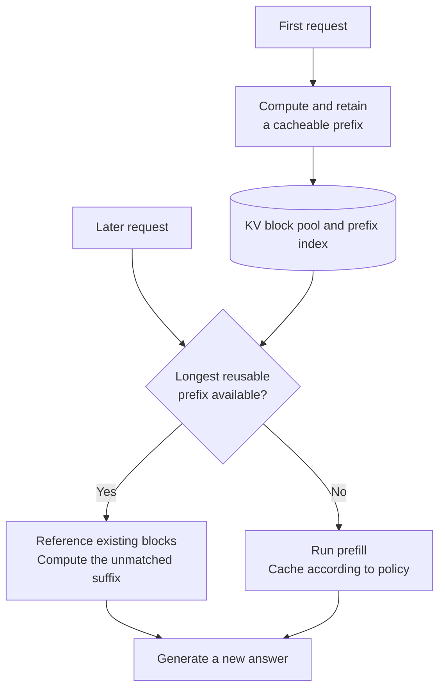

# Chapter 14: KV Cache and Prompt Caching

## 14.1 How do KV caching, prompt caching, and answer caching differ?

A KV cache reuses historical state across generation steps. Prompt caching extends prefix reuse across requests. An answer cache returns an existing answer directly. They avoid different computations and have different invalidation conditions.

| Concept | Scope of reuse | Cached content |
|---|---|---|
| KV cache | Steps within one autoregressive generation | Per-layer key/value states for processed positions |
| Prefix / prompt caching | Requests that share an identical prefix | Reusable intermediate model state for the prefix, commonly KV state |
| Answer caching | Requests that hit an application cache | A complete, previously generated answer |

Prompt caching is not answer caching: a new request still processes its unmatched suffix and generates output. A vendor API exposes a caching contract and billing rules, not proof that its internal storage layout exactly matches an open-source framework.

## 14.2 Why causal models can reuse historical state

A naive implementation without a KV cache repeatedly feeds the full prefix into the model:

```text
Input prompt             → predict t1
Input prompt + t1        → predict t2
Input prompt + t1 + t2   → predict t3
```

In a **standard causal Transformer**, a historical position cannot attend to future tokens. If the model weights, positional encoding, masks, and preceding inputs stay unchanged, appending a suffix does not change that position's hidden state at any layer. Its K/V can therefore be reused.

This depends on causality and fixed computation semantics, not merely on unchanged embeddings. Deeper-layer K/V comes from each layer's hidden states, not directly from the initial token embeddings at every layer. Editing the prefix, changing positions or RoPE settings, or changing model/LoRA weights can invalidate relevant cache entries. Models with special dynamic positional rules need separate examination.

## 14.3 A single generation: prefill and decode

### 14.3.1 What happens in one computation

$$
\mathrm{Attention}(Q,K,V)=
\mathrm{softmax}\left(\frac{QK^\top}{\sqrt{d_k}}\right)V
$$

The formula omits masking. During prefill, each query can read only its own and earlier positions, excluding padding. Single-token decode usually supplies only the historical and current K/V visible to that query. Using a cache does not remove the need to check masking in every scenario.

- **Prefill**: process the entire prompt in parallel, build K/V layer by layer, and sample the first output token from the final position's logits.
- **Decode**: pass the token sampled in the previous step through each layer, compute its own Q/K/V, and append its K/V to the cache. Its Q reads both historical K/V and **the current position's own K/V**, producing logits for the next token.
- **Why not retain Q long-term?** Future positions' attention normally does not read old Q. Q could be cached, but standard autoregressive decoding has no need to reuse it.

The following pseudocode uses an abstract interface. `model` includes all layers, causal attention, and the output head:

```python
logits, cache = model.prefill(prompt_tokens)
for step in range(max_new_tokens):
    token = sample(logits[-1])
    emit(token)
    if token == eos_token_id or step + 1 == max_new_tokens:
        break
    logits, cache = model.decode(token, cache)
```

Caches are maintained per layer. Real frameworks usually write into preallocated or paged storage rather than using `concat` to copy the entire KV history at every step. Sampling operates on vocabulary logits, not directly on the attention output vector.

### 14.3.2 Complexity requires an explicit accounting scope

Let prompt length be P and generated length be G. Fix the number of layers, heads, and dimensions, and count only **the QK and AV work of full attention**:

| Implementation | Work after the prompt | Total attention work |
|---|---|---|
| Recompute the entire prefix at each step | Full-sequence attention over approximately P+i positions | Sum of `(P+i)²` across steps |
| Use a KV cache | Each new query reads approximately P+i positions | `O(P² + PG + G²)`, including the initial prefill |

Ignoring a fixed, short prompt and considering growth in G alone, the former is `O(G³)` and the latter `O(G²)`. **These are neither total model FLOPs nor counts of GPU executions**. Projections, FFNs, the output head, and communication have their own costs. “1000 tokens” cannot be converted directly into “a billion single-token operations.”

A KV cache avoids recomputing historical hidden states, but the new Q still reads the long history. Long-context decode can therefore remain limited by KV bandwidth.

## 14.4 KV cache memory: count KV heads first

For a conventional full-attention cache with the same number of KV heads in every layer, no cross-request sharing, and equal K/V head dimensions:

$$
M_{\mathrm{KV}}=2LBND_{\mathrm{head}}H_{\mathrm{KV}}s
$$

Here L is the number of layers, B the number of concurrent sequences, N the current cached length per sequence, H_KV the number of KV heads, D_head the head dimension, and s the bytes per element. For variable-length batches, replace BN with the sum of sequence lengths. Account separately for sharding, replication, partially filled final blocks, quantization metadata, and reserved pools.

### 14.4.1 Same layer count, different head counts: how much memory changes

Consider a **capacity-estimation example**, not a claim that every 7B model supports this context: L=32, D_head=128, B=1, N=32,768, with s=2 for FP16/BF16.

| KV design | H_KV | Ideal KV size |
|---|---:|---:|
| MHA | 32 | 16 GiB, approximately 17.18 GB |
| GQA | 8 | 4 GiB |
| MQA | 1 | 0.5 GiB |

1 GiB is 2³⁰ bytes; 1 GB is 10⁹ bytes. Another 7B FP16 weights require approximately 14 GB of raw weight storage, before activations, workspace, and framework overhead. “A 7B model's 32K KV cache is 17GB” is not a universal statement, and weight size alone cannot determine supported concurrency.

MLA may cache compressed latent states and position-related components, while sliding-window layers retain only in-window state. The conventional KV formula above does not directly apply to them. See [Chapter 3](../01-foundations/03-attention-variants.md).

## 14.5 Cross-request sharing requires a complete computation prefix

Suppose many requests start with the same long system prompt. Retain the state produced by the first prefill; later requests can continue directly after their longest matching prefix.



Common hit conditions include:

- Identical token prefixes and compatible model, adapter, position, and mask semantics.
- Identical effective inputs, including chat templates, tool definitions, and images—not merely identical user-visible text.
- A live cache entry, sufficient length for the caching granularity, and routing to an instance that can access it.
- Permission to share within the tenant or trust domain.

Changing a token in the middle invalidates matching **after that point**, but complete blocks before the change may still hit. Identical text following different contexts is not enough for reuse because its hidden states differ.

## 14.6 API behavior: explicit and automatic are not permanent vendor labels

A vendor can offer both explicit cache boundaries and automatic caching. Product rules change, so record the model, interface, and billing version together. The following describes only the interfaces listed in the references.

### 14.6.1 Claude: content-block breakpoints and automatic breakpoints

The official cookbook demonstrates both:

- Setting `cache_control` on a content block to mark an explicit cache boundary.
- Setting `cache_control` at the request's top level so the service automatically places a breakpoint on the last cacheable block.

An explicit boundary suits a fixed document with different questions. Replace the model ID and document below with a real model and a sufficiently long document; a short placeholder does not guarantee the model's minimum cache length is met. The Chinese sample strings are retained: the document placeholder means “[replace with the actual fixed document and instructions],” and the question asks for a summary of how responsibilities are divided in the document.

```python
import anthropic

client = anthropic.Anthropic()
system = [{
    "type": "text",
    "text": "[替换为真实的固定文档与说明]",
    "cache_control": {"type": "ephemeral"},
}]

response = client.messages.create(
    model="YOUR_MODEL_ID",
    max_tokens=512,
    system=system,
    messages=[{"role": "user", "content": "请概括文档中的责任划分。"}],
)
print(response.usage.cache_creation_input_tokens)
print(response.usage.cache_read_input_tokens)
```

A later request hits only if length, prefix, routing, lifetime, and other conditions hold. The SDK's `ephemeral` TTL supports `5m` by default and `1h`; not every Claude cache lasts only five minutes.

### 14.6.2 OpenAI: check the model's caching mode

The official documentation states that prompt caching is enabled by default for supported models, but minimum cacheable length, implicit/explicit breakpoints, cache-write billing, and retention vary by model. A blanket rule such as “all models automatically write caches for free above roughly 1024 tokens” is therefore inappropriate.

Inspect cached-token counts in response usage, such as `prompt_tokens_details.cached_tokens` for Chat Completions; other endpoints may use different fields. Distinguish request hit rate from token hit rate: a request that hits a very short prefix has not necessarily avoided most of its prefill work.

### 14.6.3 Calculate the billing break-even point

For one reusable prefix, let ordinary input cost be C, the write multiplier w, the read multiplier r, and the number of hits after one write h:

$$
C_{\mathrm{cache}}=C(w+hr),\qquad
C_{\mathrm{plain}}=C(1+h)
$$

Caching saves money when h(1−r) exceeds w−1. **It does not always require more than two hits.** For example, with w=1.25 and r=0.1, one write plus one read costs 1.35C, already less than 2C for two ordinary inputs. This is a conditional calculation, not an industry-wide price quote.

Also include rewrites after invalidation, uncached suffixes, and output charges. Caching primarily reduces repeated prefill; decode still runs token by token, and queuing or routing may still delay the first token.

## 14.7 Organizing prompts for cache reuse

Reusable content includes stable tool definitions, system rules, a shared long document, and fixed examples. Put stable, shareable content first and dynamic user questions afterward:

```text
[Stable instructions, documents, and examples authorized for sharing]
← Appropriate cache boundary

[Current time, user-specific conditions, question]
```

This is not a reason to move sensitive user information into a public system prompt just to improve hit rate. Authorization boundaries come first; caching cannot replace access control.

Multi-turn conversations can reuse unchanged history, but summarization, message reordering, and tool schema updates change the prefix. For rolling histories, evaluate the actual stable prefix length instead of assuming agent workloads always have high hit rates.

## 14.8 Engineering pitfalls: more caching is not always better

| Situation | Effect and response |
|---|---|
| Cold cache or requests spread across instances | Low hit rate; test cold starts, warm caches, and multi-replica routing |
| Too many popular prefixes | Occupy the KV pool and displace active requests; monitor eviction, recomputation, and queuing |
| Infrequent prefixes repeatedly expire | Write premiums may exceed read savings; calculate using arrival intervals and TTL |
| Multi-tenant cache sharing | Isolate trust domains to prevent unauthorized reuse and cache-hit timing side channels |
| KV cached without final-position logits | Even a full-prefix hit may require recomputing a few final tokens to produce the first output distribution |

vLLM's prefix index combines the previous block's hash, the current block's tokens, and extra keys. Extra keys can include LoRA IDs, multimodal input hashes, and cache salts. Hashing only the current block's text is insufficient.

## 14.9 Different layers of cache optimization

### 14.9.1 KV quantization: reducing bits per element

Moving from FP16 to 8-bit or 4-bit ideally reduces the data payload to one-half or one-quarter. Scales, zero points, unquantized residuals, and alignment increase actual storage. Check whether the attention kernel can directly consume the format; conversion overhead can erase the benefit.

It is not generally true that KV state is always more sensitive to quantization than weights. K errors change attention scores; V errors change the weighted aggregation, and their distributions and error propagation differ. KIVI's key design is **asymmetric grouping: per-channel for K and per-token for V**, with a high-precision residual window. Its results do not guarantee low-bit quality for every model.

### 14.9.2 PagedAttention: reducing allocation waste

PagedAttention maps logically contiguous KV sequences to fixed-size blocks that need not be physically contiguous, using a block table for access. Block size is a configuration and backend constraint, not always 16 tokens.

Paging reduces external fragmentation and over-reservation; the final block can still waste space internally. Reference counts manage shared blocks, and branches can use copy-on-write. **Paging itself does not reduce the number of KV bytes per token**.

### 14.9.3 APC and offloading: reuse and placement

APC discovers reusable prefixes. Offloading places state in CPU memory or another storage tier, reducing GPU residency at the cost of transfers. They solve different problems from paging, GQA, and quantization. These techniques can be combined, but backend support and bandwidth can constrain the combination.

## 14.10 Derivation and troubleshooting exercises

- If cached length doubles at fixed concurrency, how does conventional full-attention KV capacity change? It doubles linearly, but prefill attention work is not linear.
- Keeping 32 query heads while reducing KV heads from 32 to 8 shrinks the theoretical cache by how much? Fourfold; the architecture and quality implications cannot be addressed by a serving-side switch alone.
- Why can total response time remain high despite a large prefix hit? Check output length, decode, queuing, cache reads, and cross-machine transfers.
- Why does the same document miss the cache? Compare full token prefixes, templates, tools, multimodal inputs, adapters, instance routing, and cache lifetime.

## 14.11 Chapter summary

KV caching relies on unchanged causal-prefix state. It avoids historical recomputation but costs capacity and bandwidth. Prompt caching extends state reuse across requests, with benefits constrained by matching granularity, cache lifetime, traffic, and billing. Capacity estimates must count KV heads; serving evaluations must separate prefill, decode, and queuing.

## References

- [PagedAttention paper](https://arxiv.org/abs/2309.06180)
- [MQA paper](https://arxiv.org/abs/1911.02150)
- [GQA paper](https://arxiv.org/abs/2305.13245)
- [Anthropic official prompt caching cookbook](https://github.com/anthropics/anthropic-cookbook/blob/main/misc/prompt_caching.ipynb)
- [Anthropic official SDK: cache TTL type](https://github.com/anthropics/anthropic-sdk-python/blob/main/src/anthropic/types/cache_control_ephemeral_param.py)
- [OpenAI: Prompt Caching](https://developers.openai.com/api/docs/guides/prompt-caching)
- [KIVI paper](https://arxiv.org/html/2402.02750v2)
- [vLLM: Automatic Prefix Caching design](https://docs.vllm.ai/en/stable/design/prefix_caching/)

Interface review scope in the source manuscript: official documentation and SDK as of 2026-09-08, with the OpenAI caching guide checked again on 2026-09-15. The example did not make a billable request and does not report a real cache hit.
