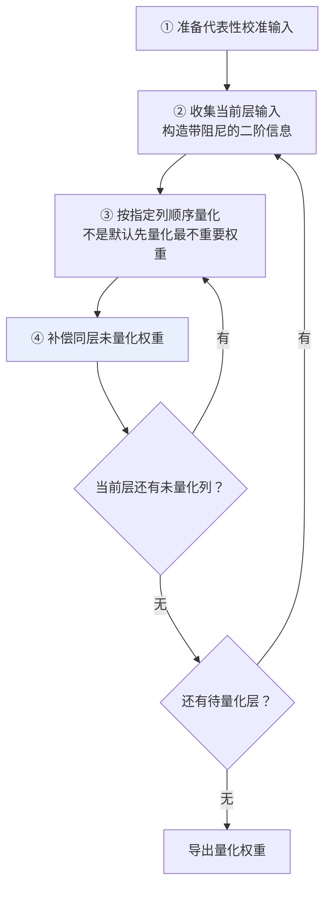

# 第十五章：模型量化

## 15.1 量化是什么，何时值得做

量化用更少的位表示权重或中间状态。训练通常采用混合精度，可能组合 BF16/FP16、FP32 主权重或优化器状态，也有针对特定硬件的低精度训练；不能把训练中的所有张量都当作同一格式。

只看权重的理想裸存储，使用十进制 GB：

| 模型 | FP16 权重 | INT4 权重 |
|---|---|---|
| 7B | $7 \times 10^9 \times 2 = 14$ GB | $7 \times 10^9 \times 0.5 = 3.5$ GB |
| 70B | $70 \times 10^9 \times 2 = 140$ GB | $70 \times 10^9 \times 0.5 = 35$ GB |

70B 的 FP16 裸权重约 140 GB，并不能推出「至少四张 A100 80GB」：两张卡的总容量已有可能容纳权重，但能否运行目标上下文与并发，要加上 KV、激活、通信缓冲、workspace 及分片/复制开销。

INT4 的实际存储还包含 scale、zero point、对齐和未量化层，通常大于表中数字。单卡可装下某个量化模型，不代表目标负载的延迟和并发可接受。

### 15.1.1 第二个收益：速度

低比特权重可降低权重访存量（4-bit 相对 16-bit 为四分之一），但端到端速度取决于硬件是否有匹配 kernel、反量化开销、batch 与是否受 KV Cache 限制，不能从位宽直接推导固定加速比。

### 15.1.2 但不是免费午餐

把连续权重映射到有限表示会引入表示误差；端到端任务质量是否下降、下降多少，取决于格式、校准、模型和任务。整个量化算法要回答的核心问题是：

> **如何在最小的精度损失下，把高精度数压到低精度数？**

## 15.2 核心机制：连续到离散的映射

量化应先明确整数范围。以**非对称 4-bit 无符号量化**为例， $q_{\min}=0$、 $q_{\max}=15$，对校准范围 $[x_{\min},x_{\max}]$：

$$
s = \frac{x_{\max}-x_{\min}}{q_{\max}-q_{\min}},\qquad
z = \mathrm{clip}\left(q_{\min}-\mathrm{round}\left(\frac{x_{\min}}s\right),q_{\min},q_{\max}\right)
$$

$$
q=\mathrm{clip}\left(\mathrm{round}\left(\frac{x}{s}\right)+z,q_{\min},q_{\max}\right),\qquad
\hat{x}=s(q-z)
$$

若范围为 $[-2.5,2.5]$，采用 ties-to-even 舍入，则 $s=5/15=1/3$、 $z=8$。对 $x=0.7$，得到 q=10，反量化值为 2/3，约 0.667，绝对误差约 0.033。计算时不应先把 scale 截短到 0.333。

常见的**对称有符号 INT4**则取 $q\in[-8,7]$，通常令 $s=\max(|x_{\min}|,|x_{\max}|)/7$、 $q=\mathrm{clip}(\mathrm{round}(x/s),-8,7)$、 $\hat{x}=sq$。具体范围、分组粒度和舍入规则由格式与 kernel 决定。

**不同算法的差别在于**：怎么算 scale 和 zero_point、怎么处理 outlier、怎么补偿量化误差。

上述非对称公式假设非零范围且需要让零可表示；实践通常把 0 纳入校准范围。退化的常量范围须单独处理，不能让 scale 为零。量化误差有两类：范围内的舍入误差，以及超出范围后被截断的 clipping 误差。缩小范围能细化刻度，却可能增加截断误差。

### 15.2.1 对称与非对称

| 风格 | 假设 | 适合 |
|---|---|---|
| **对称量化** | 用 0 为中心的整数范围，通常令 $z=0$，公式更简单 | 常见于权重 |
| **非对称量化** | 用 scale 与 zero point 对齐非对称范围 | 常见于激活值，也可用于权重 |

### 15.2.2 粒度与训练方式是另外两条轴

| 维度 | 选择与代价 |
|---|---|
| per-tensor / per-channel / per-group | 粒度越细，通常越能适应局部分布，但 scale/零点元数据更多，kernel 布局更复杂 |
| 静态 / 动态激活量化 | 静态范围来自校准，运行开销较小但怕分布漂移；动态范围在运行时估计，增加归约和缩放开销 |
| PTQ | 在训练后量化，常用少量校准数据，不进行完整量化感知训练 |
| QAT | 训练时模拟或引入目标量化误差，常用近似梯度，使权重适应低精度；需要训练数据和额外优化成本 |

W4A16 表示 4-bit 权重、16-bit 激活，不等于所有矩阵乘法都用 INT4 算术，也不包含 KV 精度。W8A8、FP8、NF4 的数值编码与计算路径不同，不能只按「几 bit」认定可互换。

例如每 128 个 4-bit 权重共用一个 16-bit scale，仅这一项元数据就使平均位宽变为 `4 + 16/128 = 4.125` bit；再加零点、对齐和保留高精度的层，实际文件会更大。这是存储示例，不指定某个 checkpoint 的布局。

## 15.3 各位数的精度边界

| 量化位数 | 7B 权重的理想裸存储 | 质量风险 | 实用性 |
|---|---|---|---|
| FP16 | 14 GB | 相对基线 | 训练与推理均可使用 |
| **INT8** | 7 GB | 通常较低，仍需验证 | 常见折中 |
| **INT4** | 3.5 GB | 对格式和任务更敏感 | 常见部署选择 |
| INT3 | 2.6 GB | 风险更高 | 资源受限时评估 |
| INT2 | 1.75 GB | 风险很高 | 仅在专门验证后使用 |

### 15.3.1 不存在固定的位宽断崖

位宽降低通常使误差控制更难，但不存在统一的「INT4 到 INT3 必然陡降、INT2 不能用」。模型大小、group size、量化算法、校准数据和任务都会改变曲线；GPTQ 原论文及作者实现就包含 2/3/4-bit 实验。

> 即使 INT8 也不是绝对无损。需要检查数学、代码、长上下文和工具调用，不能只看一项困惑度。

### 15.3.2 平均精度损失掩盖了任务差异

**精度损失不是均匀分布的。**

| 任务类型 | 常见风险 |
|---|---|
| 简单分类、抽取 | 可能较小，但与校准集相关 |
| 通用对话 | 需要质量与风格回归测试 |
| **数学推理** | 对误差、格式和长链推理可能更敏感 |
| **长链路代码生成** | 应测编译、测试通过率与长上下文退化 |

GPTQ 和 AWQ 分别通过输出重构与激活感知缩放改善低比特权重量化，不能只用任务难度概括其机制。

## 15.4 GPTQ：基于误差补偿的逐层量化

直接逐元素 round-to-nearest（RTN）不考虑输入通道相关性，相同大小的权重误差可能产生很不相同的输出误差。

GPTQ 逐层近似最小化校准集上的输出重构误差：

$$
\min_{\widehat W}\left\Vert WX-\widehat WX\right\Vert_F^2
$$

其中量化后的权重必须受目标量化网格约束，否则直接取原权重即可使误差为零。X 是当前线性层的校准输入。该二次目标的 Hessian 与 `XXᵀ` 有关，不是对完整语言模型训练损失计算精确 Hessian。量化一列后，用二阶信息修正**同一层剩余未量化的权重**，通常配合阻尼和分块更新以提高稳定性与效率。

### 15.4.1 流程

### 15.4.2 优缺点

| 优点 | 缺点 |
|---|---|
| 利用输入相关性补偿输出误差 | 二阶矩阵、分解与更新带来校准时间和内存开销 |
| 可评估 2/3/4-bit 与不同分组 | 低位宽能否满足质量要求需实测 |
| 经典方案为 weight-only，不需要全模型重训练 | 激活常保持高精度；能否加速取决于 kernel，不必然慢于 AWQ |

原算法可用固定列顺序；作者后来加入的 `act-order` 是按激活大小降序量化，不是「优先量化不重要权重」。工具是否仍维护与 GPTQ 算法是否可用是两回事，新部署需检查当前模型支持和输出格式。

## 15.5 AWQ：激活感知的权重保护

MIT 提出的思路很直接：先找出真正需要保护的权重。

### 15.5.1 洞见：保护激活敏感的通道

AWQ 论文用「保留约 1% 显著权重为高精度」的对照实验说明，不同权重的量化敏感度差异很大。**论文没有给出“1% 权重贡献 99% 输出”的定律**，实际 AWQ 也不是必须将这 1% 存成 FP16。

### 15.5.2 怎么保护：依据输入激活做缩放

对线性层 Y=WX，权重误差引起的输出变化为 ΔY=ΔW·X，因此输入通道的幅度和相关性都重要。

若某些输入通道的激活幅度较大，同样的权重误差会更强地影响层输出。AWQ 使用校准输入的逐通道幅度，而不是只按权重绝对值排序。

设 S 是正的对角缩放矩阵，量化前有等价关系：

$$
WX=(WS)(S^{-1}X)
$$

对 WS 量化、同时反向缩放输入，可减小部分显著通道的输出误差；输入缩放通常可合并到前序算子。缩放也可能扩大所在 group 的量化范围，损害其他通道，因此 AWQ 搜索缩放强度并进行裁剪，而非简单无限放大重要权重。

> **等价的是量化前的缩放变换；量化后的模型仍有误差**，不能据此声称 AWQ 与原模型输出完全相同。

### 15.5.3 优缺点

| 优点 | 缺点 |
|---|---|
| **可使用高效 kernel**：权重布局可针对目标硬件优化 | **极端低位的表现要实测**；不同模型与实现结论可能相反 |
| **激活感知缩放**：可改善部分模型的低比特质量 | 同样需要校准数据 |
| 不需要 GPTQ 式的二阶矩阵分解 | 缩放搜索、裁剪和校准仍有耗时，不能按参数量给固定分钟数 |

AWQ 与 GPTQ 都需比较质量和实际执行路径。W4A16 在低批量、权重带宽受限时可能有效；大批量 prefill 中，反量化和 GEMM 效率可能改变结论。

> 不混淆层次：GPTQ/AWQ 是算法，FP8/NF4 是数值格式，Marlin/CUTLASS 属于执行内核或内核库，GGUF 是容器。AutoAWQ 官方仓库已声明弃用并指向 `llm-compressor`；不要把旧工具安装教程当作算法的当前支持矩阵。

## 15.6 QLoRA 与 NF4：让消费级 GPU 微调成为可能

GPTQ 和 AWQ 解决的是**部署时**的量化。QLoRA 回答的是更激进的问题：**4-bit 量化的模型能不能继续微调？**

### 15.6.1 NF4 是非均匀量化

普通 INT4 是**均匀分隔**（16 个值平均分布）。

NF4 针对近似正态分布的权重设计非均匀 codebook，零附近刻度更密，尾部更稀。实际权重不必严格正态，分块归一化也会改变分布；该假设不是所有张量的保证。

它在 QLoRA 论文的设置中优于所比较的均匀整数或浮点 4-bit 格式，不代表对任意模型和指标均最优。

### 15.6.2 另外两个优化

| 优化 | 作用 |
|---|---|
| **双重量化** | 连量化用的 scale 常数也再量化一次，进一步省显存 |
| **分页优化器** | 用统一内存在 CPU/GPU 间迁移优化器状态，缓解部分显存峰值；迁移有性能成本，也不能消除所有 OOM |

QLoRA 论文报告过在单张 48 GB GPU 上微调 65B 的配置，这是特定序列长度、batch、优化器与检查点设置下的结果，不能变成按显存选模型的通用表。长上下文激活仍可能主导峰值。详见[第八章](../02-training-alignment/08-finetuning.md)。

关键是**冻结 4-bit 基座，只训练高精度 LoRA 适配器**；计算时按需反量化，让梯度通过基座计算路径传给适配器。它不是直接用梯度更新离散 INT4/NF4 编码，也不等同于全参数 QAT。

## 15.7 怎么选

| 场景 | 推荐方案 | 理由 |
|---|---|---|
| **生产部署，看重速度** | AWQ / GPTQ / FP8 / 框架原生 INT4 | **看目标框架和 GPU kernel 支持，不能只背一个名字** |
| **部署质量优先** | 高精度基线，再比较 INT8 / INT4 | 以业务允许的退化为门槛，不承诺量化无损 |
| **显存受限的适配器微调** | QLoRA NF4 | 先估算激活、适配器和优化器峰值 |
| **边缘部署（手机 / 笔记本）** | 设备运行时支持的低比特格式，如 GGUF 的 Q4_K_M | 检查内存、带宽、功耗与算子支持 |
| **CPU 部署** | llama.cpp + GGUF | 无 GPU 也能跑 |

### 15.7.1 三个关键提示

**① AWQ vs GPTQ 怎么选**

先查目标模型、GPU 与框架支持的量化格式，再在相同位宽、分组、校准集和业务评测下比较。已有权重文件及转换成本也影响选择，不预设 AWQ 速度更快或 GPTQ 精度更高。

> **不要脱离框架支持谈算法好坏。** 最后跑得快不快，取决于**量化格式和推理 kernel 是否匹配**。

**② INT4 vs INT8 怎么选**

显存够时用高精度作为质量基线；容量或权重带宽紧张时评估低位宽。若瓶颈是长上下文 KV 而非权重，仅降低权重位宽可能不够；若瓶颈是大批量计算，要看 W8A8/FP8 等算术路径，而不只是压缩率。

**③ GGUF 是什么**

> **GGUF 不是量化算法，是 llama.cpp 用的文件格式。**

它内部可以存各种量化方案的权重（Q4_K_M、Q5_K_M、Q8_0 等），**是一个容器**。这跟 AWQ/GPTQ 这种「算法」不是一个层级——**混淆这两者是很常见的错误**。

## 15.8 四个副作用与陷阱

### 15.8.1 Outlier 异常值问题

当一组权重中出现幅度很大的异常值，按最大值定范围会拉宽量化刻度，使该组普通权重的分辨率下降；影响程度取决于分布与分组。

**应对**：分组缩小受异常值影响的范围，裁剪在尾部误差与主体分辨率间取舍。AWQ 依据激活敏感度缩放，GPTQ 依据输入相关性补偿，都不是简单「找出最大权重优先保护」。SmoothQuant 则通过等价缩放把激活量化难度转移到权重，服务于 W8A8；不要与 AWQ 的权重量化目标混淆。

### 15.8.2 KV Cache 量化的挑战

KV Cache 已有研究与框架实现，不能用「才刚起步」判断可用性；支持情况取决于模型架构、attention 后端和目标位宽。

在部分长上下文或高并发负载中，KV 可超过权重（见[第十四章](14-kv-cache.md)）。K 的误差影响注意力分数，V 的误差影响聚合结果；实际收益还要计入 scale、残留窗口和转换成本，测长文检索及推理质量。

### 15.8.3 不同任务的敏感度差异巨大

不存在可迁移的“INT4 平均损失”。**部署量化模型前必须在自己的业务场景下做评测，不能直接套用论文或他人的平均数。**

### 15.8.4 与其他优化的兼容性

量化要和 Flash Attention、KV Cache、Speculative Decoding 同时使用，**不同框架支持度差别很大**。

**选量化方案前先看部署框架支持哪些，再用自己的业务集压测质量和吞吐。**

## 15.9 常见错误

### 15.9.1 说不出量化的基本机制

线性整数格式常用 scale + zero point，NF4 则通过非均匀 codebook 表示；先确定格式再解释映射。

### 15.9.2 认为精度损失是线性的

损失未必线性，也不存在统一断崖；更换 group size、校准或算法可以改变曲线。

### 15.9.3 给 INT4 套用统一精度损失

数学推理与长链代码等任务可能更敏感；必须在自己的业务集实测。

### 15.9.4 说不出 GPTQ 和 AWQ 的核心创新

GPTQ 用校准输入的二阶信息补偿同层未量化权重；AWQ 用激活感知缩放与裁剪保护敏感通道，两者通常都属于 PTQ。

### 15.9.5 把 GGUF 当成量化算法

它是文件格式、是容器，跟 AWQ/GPTQ 不是一个层级；扩展名也不能说明具体量化精度。

### 15.9.6 脱离框架和 GPU 谈算法好坏

跑得快不快取决于量化格式与推理 kernel 是否匹配。

### 15.9.7 忽略 outlier 问题

异常值会放宽所在量化组的范围；权重异常值、激活异常值与输出敏感性并非同一概念。

### 15.9.8 认为量化模型不能再训练

QLoRA 训练的是适配器，冻结的低比特基座参与前向和梯度传播路径，不是直接更新整数编码。

## 15.10 本章总结

1. **线性整数均匀量化**常用 scale + zero point 映射；NF4 等非均匀格式使用 codebook，不能一概而论；
2. **两个潜在收益**：4-bit 权重裸存储与权重访存量可降至 FP16 的四分之一；端到端速度取决于 kernel 和工作负载；
3. **对称量化常用于权重，非对称量化常用于激活，但不是硬规则**；应以格式、kernel、校准数据和任务评测为准；
4. **位宽越低通常越需谨慎评测**；INT8、INT4、INT3 的实际边界不能脱离模型、格式与任务；
5. **平均指标掩盖任务差异**，应分别测试数学、代码、长上下文和结构化输出；
6. **GPTQ 使用逐层重构目标的二阶信息补偿量化误差**，不是默认先量化低重要性权重；
7. **AWQ 用激活感知缩放与裁剪改善权重量化**，等价变换不代表量化无损；
8. **QLoRA 使用冻结 NF4 基座与可训练适配器**，配合双重量化和分页优化器降低微调显存；
9. **GGUF 是文件格式不是算法**，是最容易混淆的一点；
10. **选型不能脱离框架和 GPU kernel**，最终性能取决于格式与 kernel 是否匹配；
11. **四个陷阱**：异常值、KV 精度与后端限制、校准/任务分布差异、与其他优化的兼容性。

## 参考资料

- [GPTQ: Accurate Post-Training Quantization for Generative Pre-trained Transformers](https://arxiv.org/abs/2210.17323)
- [AWQ: Activation-aware Weight Quantization for LLM Compression and Acceleration](https://arxiv.org/abs/2306.00978)
- [QLoRA: Efficient Finetuning of Quantized LLMs（NF4）](https://arxiv.org/abs/2305.14314)
- [LLM.int8(): 8-bit Matrix Multiplication for Transformers at Scale](https://arxiv.org/abs/2208.07339)
- [SmoothQuant: Accurate and Efficient Post-Training Quantization for Large Language Models](https://arxiv.org/abs/2211.10438)
- [Optimal Brain Compression: A Framework for Accurate Post-Training Quantization and Pruning](https://arxiv.org/abs/2208.11580)
- [llama.cpp / GGUF](https://github.com/ggml-org/llama.cpp)
- [AutoAWQ](https://github.com/casper-hansen/AutoAWQ)
- [GPTQ 作者实现：列顺序、act-order 与分组](https://github.com/IST-DASLab/gptq)
- [AWQ 原论文：逐通道缩放与搜索](https://arxiv.org/html/2306.00978v5)
- [PyTorch AO：Quantization-Aware Training](https://docs.pytorch.org/ao/main/workflows/qat.html)

本文原创讲解与示意图：Polo Li，采用 CC BY 4.0。
