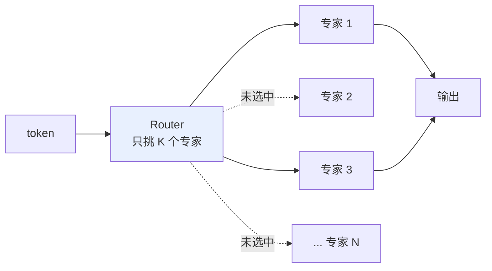
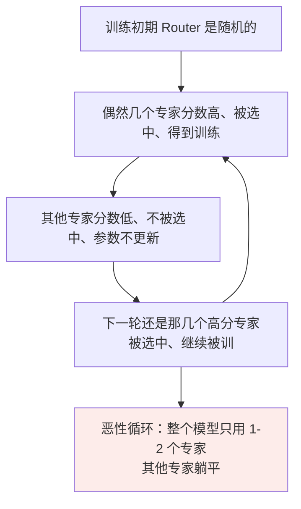
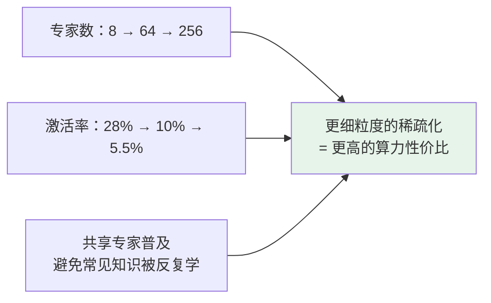

# 第十九章：MoE 混合专家模型

## 19.1 Dense 模型的瓶颈

**Dense（标准 Transformer）的特点**：每个 token 推理时，都要走一遍模型的**全部参数**。一个 175B 的模型，每生成一个 token 都要让 175B 个参数全部参与计算。

**这带来一个棘手的权衡**：

- 想提升能力 → 得加参数；
- 但参数加倍 → **推理成本（计算量 + 显存 + 延迟）也加倍**；
- 一台 8 卡服务器跑得动 70B Dense，但跑不动 175B。

## 19.2 MoE 的核心创新：打破「知识量」和「推理成本」的绑定



| | 计算方式 |
|---|---|
| **总参数量** | $N \times$ 单专家参数量 → **知识量很大** |
| **激活参数量** | $K \times$ 单专家参数量 → **推理成本只有总参数的 $K/N$** |

### 19.2.1 直观类比

> **Dense 像一本厚厚的百科全书**——你查一个词要把整本书过一遍。
>
> **MoE 像一个图书馆**——前台咨询员（Router）听到你的问题，告诉你去 3 楼的「数学专家区」就好，不用整个图书馆都搜索。

**这让 MoE 在「同样推理成本下，参数量可以做到 Dense 的几倍甚至几十倍」。**

## 19.3 三个核心组件

### 19.3.1 多个专家

MoE 把 Transformer 每一层的 FFN 替换成 $N$ 个**并行的 FFN**。**结构完全一样，但参数独立**，训练中各自学会不同的擅长方向。

**$N$ 的选择是工程权衡**：

| $N$ | 问题 |
|---|---|
| 太小（如 4） | 专家不够细分，**效果接近 Dense** |
| 太大（如 512） | 每个专家太小太专门，**难以学到通用能力** |

业界主流：8（Mixtral）、64（早期 GShard）、256（DeepSeek V3）。

> **关键：专家的「擅长方向」不是预先指定的，是训练中自然涌现的。** 研究者发现训练后的专家会自发分化——有的偏数学符号、有的偏代码语法、有的偏常用语言、有的偏稀有词汇。

### 19.3.2 Router：最关键的组件

结构通常就是**一个简单的线性层**：

```python
gate_logits = token_embedding @ W_router      # 每个专家的路由分数
gate_probs  = softmax(gate_logits)            # 全部专家上的概率分布
weights, indices = topk(gate_probs, k=2)      # torch.topk 返回 (values, indices)
weights = weights / weights.sum()             # 通常在已选专家内重新归一化
output = sum(
    weights[i] * expert[indices[i]](token_embedding)
    for i in range(len(indices))
)
```

**最常见的 $K$ 值**：

| $K$ | 代表 | 特点 |
|---|---|---|
| 1 | Switch Transformer 风格 | 最稀疏，效率最高 |
| 2 | Mixtral 风格 | 效果和效率折中 |
| 8 | DeepSeek V3 | 配合 256 个细粒度专家 |

### 19.3.3 负载均衡损失

**朴素 Router 训练有个著名问题：专家不平衡。**



**解决办法**是加一个负载均衡损失：

```python
expert_load  = mean(expert_probability_distribution)  # 每个专家的平均使用率
balance_loss = variance(expert_load)                  # 使用率的方差（越大越不平衡）

total_loss = main_loss + α × balance_loss
```

把「使用率不均」的方差作为惩罚加进总损失，**迫使 Router 把任务均匀分配**。$\alpha$ 是平衡主任务和均衡性的超参。

> **DeepSeek V3 更进一步提出 Auxiliary-Loss-Free 负载均衡**：不用额外辅助损失，而是**动态调整每个专家的偏置项**让负载自然均衡，进一步降低对主任务的干扰。

## 19.4 总参数 vs 激活参数：最容易踩坑的概念

```
Dense 模型 70B：
  推理一个 token 要算 70B 参数
  显存（FP16）：140 GB
  推理速度：以 70B 参数的延迟为基准

MoE 模型 671B / 37B（DeepSeek V3）：
  推理一个 token 只算 37B 参数（attention + 激活的专家 FFN）
  显存（FP16）：约 1.3 TB —— 所有专家都要加载
  推理速度：接近 37B Dense 的延迟
```

**三个必须记住的反差**：

| 维度 | 按什么走 | 说明 |
|---|---|---|
| **知识量** | **总参数**（671B） | 专家分化，覆盖各种领域 |
| **显存占用** | **总参数**（1.3TB FP16，INT4 约 350GB） | **所有专家都要常驻显存**，否则 Router 路到没加载的专家就没法算 |
| **推理速度** | **激活参数**（37B） | 每个 token 只算 37B，latency 接近 37B Dense |

> **「显存按总参数走，但推理速度按激活参数走」——这一句反直觉但精确的话，是理解 MoE 工程取舍的核心。**

**这种「学得多 + 跑得快」的组合，是 MoE 爆发的根本原因**：Dense 走到 70B 已是推理成本极限，MoE 把激活参数控制在 37B–100B，就能把总参数推到 600B、1T 甚至更多。

## 19.5 主流 MoE 模型对比

| 模型 | 总参数 / 激活 | 激活率 | 专家配置 | 设计哲学 |
|---|---|---|---|---|
| **DeepSeek V3 / R1** | 671B / 37B | **5.5%** | 每层 256 routed + 1 shared，每 token 选 Top-8 routed + 1 shared = 9 个 | **专家越多越细分**；创新点是 MLA + Auxiliary-Loss-Free 均衡 |
| **Mixtral 8x7B** | 约 47B / 13B | 28% | 每层 8 experts，Top-2 | **专家少而精**，激活率较高保质量。开源 MoE 的早期标杆 |
| **Qwen MoE 30B-A3B** | 30B / 3B | 10% | 细粒度专家路线 | 注重小激活参数下的性能 |
| **Grok 1** | 314B / 78.5B | 25% | — | 设计相对保守 |

### 19.5.1 三个明确趋势



## 19.6 三大训练挑战

### 19.6.1 专家不平衡

除了负载均衡损失，业界还有几种应对：

| 方案 | 机制 |
|---|---|
| **Expert Choice Routing** | **反过来让专家挑 token**，每个专家固定吃 $N$ 个 token，自然平衡 |
| **Auxiliary-Loss-Free** | 动态调整专家偏置项，不引入额外损失（DeepSeek V3） |
| **温度退火** | 训练初期 Router 用高温采样（更随机），让所有专家都有机会被探索 |

### 19.6.2 Router 训练不稳定

Router 的优化确实敏感，但表述要精确：softmax 是可微的；`topk` 的**索引选择**是离散操作，梯度通常只流向被选中的 gate 值与专家，未选专家收不到该 token 的任务梯度。这会放大早期负载失衡，而不是「梯度穿过两个不可微操作」。

| 稳定化技巧 | 说明 |
|---|---|
| **Noisy Top-K Gating** | 训练时给 Router 输出加噪声，鼓励探索 |
| **Z-loss** | 限制 Router logits 的范数，防止极端化 |
| **Soft / Hard 路由切换** | 训练时用 soft（加权所有专家），推理时用 hard（只激活 Top-K） |

### 19.6.3 分布式并行复杂

Dense 只用 Tensor Parallel + Pipeline Parallel 就够了，MoE 还要考虑：

- **Expert Parallel**：不同专家分配到不同 GPU，token 在 GPU 之间路由；
- **All-to-All 通信**：token 选了专家后要发送到对应专家所在的 GPU，处理完再发回来——**这是 MoE 训练通信开销最大的环节**。

> DeepSeek V3 的工程优化里有大量篇幅讲怎么把 All-to-All 通信和计算重叠（DualPipe），是工程实力的体现。

## 19.7 三大部署挑战

| 挑战 | 说明 |
|---|---|
| **显存按总参数走** | 每 token 只激活 37B，**但 671B 全部要加载**。至少 8 卡 H100，对很多企业是不小的硬件投入 |
| **批量推理通信开销大** | 一次处理几十个请求时，不同 token 选不同专家，**导致大量跨卡通信**。所以 **MoE 的吞吐量往往不如同等激活参数的 Dense** |
| **热门专家负载不均** | 某个专家被很多 token 路由到，它所在的 GPU 过载而其他 GPU 空闲。需要动态负载均衡（专家迁移、复制热门专家） |

业界有一系列工具优化（vLLM 的 MoE 并行、SGLang 的专家亲和性调度、TensorRT-LLM 的 MoE 优化），**但成熟度还在快速演进**。

> **这也是为什么很多公司喜欢 MoE 的训练性价比，但部署时还是选 Dense。**

## 19.8 MoE 不是新东西，为什么现在才火

MoE 的思想 1991 年就有，2020 年前后 GShard 就用它训过 600B 模型。**为什么直到最近才让整个圈子开始用？**

| 原因 | 说明 |
|---|---|
| **① 训练经验积累到位** | 早期 MoE 训练极不稳定（专家不平衡、Router 崩溃、loss 震荡）。这些年里业界累积了一整套 know-how（负载均衡、噪声路由、专家容量），成熟到**开源社区也能复现** |
| **② 推理框架支持完善** | 之前主流框架对 MoE 支持很差，部署困难。vLLM、SGLang、TensorRT-LLM 陆续加入 MoE 优化（专家并行、All-to-All 通信优化） |
| **③ DeepSeek V3 把成本打下来了** | 公开了 671B/37B 的 MoE 模型，报告了非常低的训练成本和很强的效果——**让大家看到 MoE 不只是论文里的好方法** |

### 19.8.1 MoE 是主流方向之一

MoE 已是主流方向**之一**，但**不能说「几乎所有新模型都用 MoE」**。

| | 适合 |
|---|---|
| **MoE** | 把总容量做大、把激活成本压低 |
| **Dense** | 部署简单、负载稳定、延迟可控——**尤其 1B–70B 这类延迟敏感、工程复杂度要低的场景** |

## 19.9 常见错误

### 19.9.1 把 MoE 的显存需求按激活参数算

**显存按总参数走**——所有专家都要常驻，否则 Router 路到没加载的专家就没法算。**这是最典型的错误。**

### 19.9.2 认为专家是按领域人工指定的

**专家分化是训练中自然涌现的**，没人告诉它「你负责数学」。

### 19.9.3 说不出专家不平衡问题

Router 随机初始化会陷入「少数专家被反复训练、其余躺平」的恶性循环，**这是 MoE 训练最著名的难题**。

### 19.9.4 认为专家越多越好

太少接近 Dense，太多则每个专家学不到通用能力。是个权衡。

### 19.9.5 忽略 MoE 的吞吐量劣势

批量推理时 All-to-All 通信开销大，**吞吐往往不如同等激活参数的 Dense**。

### 19.9.6 把 MoE 说成必然取代 Dense

Dense 在延迟敏感、部署简单的场景仍有很强生命力。

### 19.9.7 说不出 Router 为什么训练不稳定

softmax 本身可微；Top-K 的离散索引选择使未选专家收不到该 token 的任务梯度，因此需要负载均衡、容量管理等稳定化设计。

## 19.10 本章总结

1. **Dense 的瓶颈是知识量和推理成本强绑定**，参数加倍则成本加倍；
2. **MoE 把 FFN 复制成 $N$ 份专家 + 一个 Router 选 Top-K**，实现总参数与激活参数解耦；
3. **三个组件**：多专家（分化自然涌现）、Router（一个线性层算分 + Top-K）、负载均衡损失；
4. **专家不平衡是最著名的训练难题**，Auxiliary-Loss-Free 用动态偏置项替代辅助损失；
5. **最核心的认知：显存按总参数走，推理速度按激活参数走**；
6. **趋势是专家越来越多、激活率越来越低、共享专家越来越普及**；
7. **训练三挑战**：专家不平衡、离散 Top-K 路由造成的优化与容量管理问题、All-to-All 通信复杂；
8. **部署三挑战**：显存按总参数、批量推理通信开销大导致吞吐不占优、热门专家负载不均；
9. **MoE 是老想法**，因训练 know-how 成熟 + 推理框架完善 + 成本被打下来才真正爆发；
10. **MoE 与 Dense 各有边界**：前者适合把容量做大、成本压低，后者适合部署简单、延迟可控。


## 参考资料

- [Outrageously Large Neural Networks: The Sparsely-Gated Mixture-of-Experts Layer](https://arxiv.org/abs/1701.06538)
- [GShard: Scaling Giant Models with Conditional Computation and Automatic Sharding](https://arxiv.org/abs/2006.16668)
- [Switch Transformers: Scaling to Trillion Parameter Models with Simple and Efficient Sparsity](https://arxiv.org/abs/2101.03961)
- [Mixtral of Experts](https://arxiv.org/abs/2401.04088)
- [DeepSeek-V3 Technical Report](https://arxiv.org/abs/2412.19437)
- [DeepSeekMoE: Towards Ultimate Expert Specialization in Mixture-of-Experts Language Models](https://arxiv.org/abs/2401.06066)
- [Auxiliary-Loss-Free Load Balancing Strategy for Mixture-of-Experts](https://arxiv.org/abs/2408.15664)
- [Mixture-of-Experts with Expert Choice Routing](https://arxiv.org/abs/2202.09368)
- [Qwen3 Technical Report](https://arxiv.org/abs/2505.09388)
