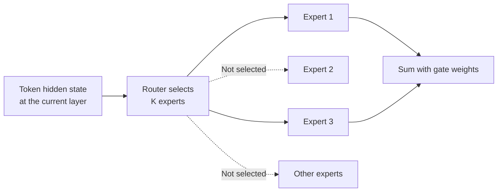
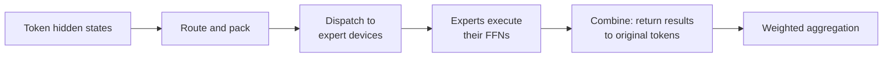

# Chapter 19: Mixture-of-Experts Models

## 19.1 Why dense-model cost relates to parameter count, but is not simply proportional

Each token in a dense Transformer typically passes through every layer's attention and FFN without sparse expert selection. This does not literally mean every parameter performs the same amount of computation: input embeddings use lookup, attention cost varies with context length, and the output head has its own overhead.

Scaling a dense model generally increases computation and weight storage, but end-to-end latency also depends on bandwidth, batch size, parallelism, precision, and KV state. **Doubling parameters does not exactly double latency, memory, and training cost alike.** Whether a model fits on one server also depends on per-GPU capacity, not merely on having “8 GPUs.”

## 19.2 MoE separates total capacity from part of the per-token computation

This chapter discusses sparse, token-choice FFN MoE: selected Transformer layers contain N routed experts, and each token's hidden state goes to only K of them. Other layers and shared experts still execute.



Let P_shared denote all non-routed parameters that always participate, and P_experts the total routed-expert parameters across layers. Assuming equally sized experts across layers and a selection ratio K/N, approximately:

$$
P_{\mathrm{total}}=P_{\mathrm{shared}}+P_{\mathrm{experts}}
$$

$$
P_{\mathrm{active}}\approx P_{\mathrm{shared}}+\frac{K}{N}P_{\mathrm{experts}}
$$

These are parameter counts, not exact FLOP or latency formulas. **K/N describes the selection ratio only for the routed component**; it does not imply that total inference cost falls to K/N. Total parameters are not a directly measurable quantity of knowledge either. Capability still depends on training data, optimization, and architecture.

## 19.3 Experts, routers, and load balancing

### 19.3.1 Experts are not independent domain-specific chat models

A typical expert is an FFN with the same structure as its peers but independent parameters; attention is not necessarily replicated. MoE may appear in only some layers rather than every layer.

Selection happens **per token, per layer**. Tokens in the same sentence—and even the same token at different layers—can select different experts. The router reads a contextual hidden state; it does not first understand the entire question and choose a “math model.”

Experts may develop preferences for syntax, position, token type, or domain, but they need not specialize neatly along human academic categories. Mixtral's routing analysis found clear locality and syntactic patterns; expert names should not be treated as capability labels.

Increasing N while fixing K and expert size mainly increases parameter capacity and storage, along with routing, communication, and training-coverage pressure. Increasing N at fixed total parameters makes experts smaller, which is a different experiment. State which budget is fixed before comparing expert counts.

### 19.3.2 A concrete router computation

The following illustrates Mixtral-style Top-2 routing for one token; it does not imply that every MoE uses softmax:

```python
gate_logits = hidden_state @ W_router
values, indices = topk(gate_logits, k=2)
weights = softmax(values)
output = sum(
    weights[i] * experts[indices[i]](hidden_state)
    for i in range(2)
)
```

Applying softmax to the selected logits is equivalent to applying softmax to all logits, selecting Top-K, and renormalizing. Switch's Top-1 gating and DeepSeek-V3's sigmoid affinity have their own definitions; this code is not universal.

A larger K usually increases expert computation and token dispatch volume. K=1 is not guaranteed to be fastest in every implementation and may not meet quality requirements. Consider K, expert width, and the shared component together.

### 19.3.3 Why probability variance alone cannot describe load balancing

Early router preferences can send more tokens and task gradients to a few experts, leaving others undertrained. Popular experts may also overload their devices. **Average routing probability is not the same as actual Top-K assignment count**.

For example, Switch's Top-1 auxiliary loss for T tokens and N experts is:

$$
L_{\mathrm{aux}}=\alpha N\sum_{i=1}^{N}f_iP_i
$$

Here f_i is the fraction of tokens actually routed to expert i, and P_i is the batch's average routing probability for that expert. The discrete assignment fraction normally does not receive backpropagation; gradients reach the router through the probability term. Uniform distributions balance these quantities, but an excessively large α can interfere with the main task. This is not a constraint that guarantees perfect balance in every batch.

### 19.3.4 Explaining DeepSeek-V3's “auxiliary-loss-free” approach completely

V3 uses expert biases to adjust **the scores used for Top-K selection**: lower the bias for overloaded experts and raise it for underloaded ones. Output mixing weights still come from the original affinities; the balancing bias does not directly multiply expert outputs.

This reduces reliance on a conventional global auxiliary balancing loss. However, **V3 retains a small sequence-wise auxiliary balancing loss** to prevent extreme imbalance within an individual sequence. Saying that V3 has no auxiliary loss whatsoever omits this term from the technical report.

## 19.4 Total parameters, active parameters, resident capacity, and latency

The original DeepSeek-V3 technical report gives 671B total parameters and 37B active parameters per token. Bit width alone establishes only raw storage:

| Assumed format | Ideal raw storage for all 671B weights |
|---|---:|
| All 16-bit | 1.342 TB, decimal |
| All 8-bit | 671 GB |
| All 4-bit | 335.5 GB |

Real mixed-precision files, scales, unquantized tensors, KV state, activations, communication, and temporary buffers change capacity requirements. These are not measurements of an existing checkpoint and cannot establish one universal minimum number of H100 GPUs.

| Question | Appropriate accounting |
|---|---|
| Where must all experts be stored? | All weights must be accessible; typically resident across GPUs, or placed in CPU/other memory for on-demand computation or transfer |
| How much expert computation does each token require? | Examine active experts per layer, expert width, and shared layers, not just total parameters |
| What determines low-batch latency? | Weight and KV bandwidth, routing, communication, kernel launches, and small-matrix utilization |
| What determines large-batch throughput? | Actual expert token distributions, compute utilization, inter-device topology, and communication overlap |

Offloading can reduce GPU residency but adds host-bandwidth, transfer, or CPU-computation costs. **“37B active” does not imply the latency of a 37B dense model**, nor does it mean only 37B weights need storage.

## 19.5 Structural differences in released models

The following are architecture examples from specific historical versions, not a model-performance leaderboard as of a particular date:

| Model | Total / active parameters per token | Routed-expert configuration | Important scope |
|---|---|---|---|
| Original DeepSeek-V3 | 671B / 37B | 256 per MoE layer, Top-8, plus 1 shared expert | The first three FFN layers are dense, followed by MoE; uses MLA |
| Mixtral 8x7B | Approximately 47B / 13B | 8 per layer, Top-2 | “8x7B” does not mean 56B total parameters; attention and other components are not replicated eight times |
| Original Qwen3-30B-A3B | 30.5B / 3.3B | 128, Top-8 | The name is an approximate size category, not an exact parameter count; uses GQA |

The table gives V3 an activation ratio of approximately 5.5%, but a lower activation ratio does not mean better capability or performance. Expert width, depth, attention, and training differ across these models; they are not a controlled experiment proving that more experts are better.

Shared experts can handle computation needed by every token, leaving more room for routed experts to specialize. They also add a fixed per-token cost, and not every MoE must use them.

## 19.6 Training: capacity, gradients, and communication

### 19.6.1 Expert capacity: where do overflow tokens go?

For a batch of T tokens, each assigned to K experts, the ideal average is TK/N assignments per expert. A common capacity budget is:

$$
C=\left\lceil c\frac{TK}{N}\right\rceil
$$

Here c is the capacity factor. It controls reserved headroom, not whether routing is actually balanced.

- **Capacity-limited**: overflow assignments may be dropped, rerouted, or otherwise handled. Dropping one expert branch usually does not delete the entire token; its residual path may remain.
- **Dropless**: dynamic or block-sparse computation processes all assignments without dropping, but still incurs skewed-load, buffer, and scheduling costs.
- **Expert Choice**: each expert selects a fixed number of tokens, controlling expert load. The number of experts processing each token varies, requiring care with token coverage and batch dependencies in causal serving.

Balanced average load during training does not guarantee balance in every production request window. Dynamic workloads require observing actual gate distributions and device load.

### 19.6.2 How discrete router choices are trained

Softmax is differentiable, but `topk` index selection is discrete. Main-task gradients can flow through selected gates and experts; unselected experts usually receive no task gradient from that token. Auxiliary losses and noisy routing can support exploration and balancing.

| Technique | Mechanism and limitation |
|---|---|
| Noisy Top-K | Add noise to routing scores during training to encourage exploration; does not require sampling during inference |
| Router z-loss | Penalize the square of logits' `logsumexp` to control unstable scale; not the same as directly penalizing the logits' L2 norm |
| Higher-precision router | Reduce sensitivity to routing numerics; the mixed-precision policy depends on the model |

“Compute every expert during training and only Top-K during inference” is not the standard sparse-MoE procedure. That would change training compute and the training/inference distribution.

### 19.6.3 How expert parallelism dispatches tokens

Expert parallelism places different experts on different devices. A common path is:



Cross-device implementations commonly use All-to-All or specialized dispatch/combine communication. Traffic depends on token count, hidden dimension, routing multiplicity, data type, and placement—not directly on total parameters. A single-GPU MoE does not require cross-GPU All-to-All.

Dense and MoE models can both combine data, tensor, pipeline, and other parallelism. V3's DualPipe demonstrates computation–communication overlap in its training setup; it does not establish that communication can be hidden for free on any cluster.

## 19.7 Deployment: equal active parameters do not mean equal serving costs

### 19.7.1 The tension between small expert batches and communication

At low concurrency, each expert receives few tokens, and small GEMMs may underutilize the GPU. Larger batches can improve expert utilization but also increase KV capacity, queuing, and cross-GPU communication. Throughput may improve without improving individual request latency.

MoE does not universally have lower throughput than a dense model with the same active parameter count. Comparisons must fix hardware, precision, input/output lengths, concurrency, quality, and latency requirements.

### 19.7.2 Popular experts can slow down an entire step

An overloaded device can become a bottleneck that other tokens must wait for at synchronization points. Common responses include redistributing experts across devices, replicating popular experts, load-aware scheduling, and topology-aware routing. Replication uses more memory, while relocation requires transfers; average token count alone is insufficient.

### 19.7.3 Evidence needed before deployment

- Capacity budgets for weights, KV state, and communication workspace, plus bandwidth budgets for CPU offload.
- Per-expert token counts, dispatch/combine time, cross-node traffic, and hotspot devices.
- TTFT, per-token latency, and SLO-compliant throughput under cold/warm starts and low/high concurrency.
- Business-task quality after changes to quantization, parallelism, or routing capacity, especially when token dropping occurs.

## 19.8 Why MoE is valuable without automatically replacing dense models

Sparse experts are not a recent invention. The 2017 Sparsely-Gated MoE, 2020 GShard, Switch, Mixtral, and DeepSeekMoE progressively explored sparse scaling, routing stability, and systems implementation.

Their value is **increasing trainable capacity while controlling part of the per-token computation**, not proving that dense models hit a hard limit at 70B. Dense deployment and workloads are often simpler; MoE pays extra costs in storage, communication, and scheduling. Quality goals and serving budgets determine the choice.

Any citation of V3's training costs must retain the technical report's accounting scope. Its GPU-hour cost estimate excludes all the prior research and architecture/data ablations; it is not the full cost of reproducing the model or of an organization's research and development.

## 19.9 Common follow-up questions

- **If expert count doubles while active count stays fixed, does cost stay fixed?** Expert FFN arithmetic may remain approximately unchanged; storage, routing, and systems overhead do not.
- **Why can uniform average probabilities still lead to overload?** Top-K assignment is discrete and also depends on batch composition, capacity, and device mapping.
- **How does V3 balance routing without an auxiliary loss?** Selection-bias feedback provides balancing, while a small sequence-level auxiliary term remains.
- **Why are experts not simply domain specialists?** They are layer-wise FFNs; routing preferences do not equal human-defined knowledge domains.
- **After low-bit quantization, can memory be purchased based only on active parameters?** All experts still need to be stored or accessed, alongside quantization metadata and runtime state.

## 19.10 Chapter summary

Separate four aspects of MoE: total parameter capacity, active computation per token, placement of all weights, and communication and latency under actual load. Routing, auxiliary balancing, expert capacity, and systems scheduling jointly determine the benefit. Neither expert count nor activation ratio substitutes for quality and serving evaluation.

## References

- [Sparsely-Gated Mixture-of-Experts Layer](https://arxiv.org/abs/1701.06538)
- [GShard](https://arxiv.org/abs/2006.16668)
- [Switch Transformers](https://arxiv.org/abs/2101.03961)
- [Mixtral of Experts](https://arxiv.org/html/2401.04088v1)
- [DeepSeek-V3 Technical Report](https://arxiv.org/html/2412.19437v2)
- [Auxiliary-Loss-Free Load Balancing](https://arxiv.org/abs/2408.15664)
- [Expert Choice Routing](https://arxiv.org/abs/2202.09368)
- [ST-MoE: router z-loss](https://arxiv.org/abs/2202.08906)
- [Qwen3-30B-A3B official model card](https://huggingface.co/Qwen/Qwen3-30B-A3B)
