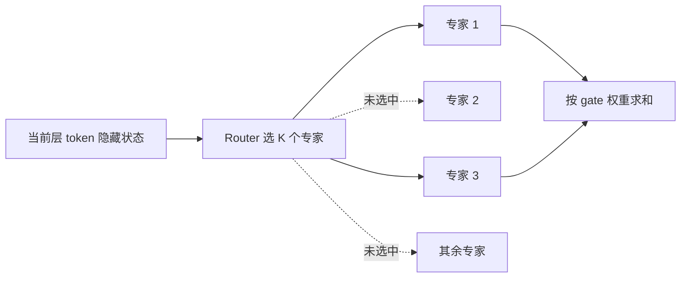

# 第十九章：MoE 混合专家模型

## 19.1 Dense 的成本为何与参数有关，但不成简单正比

Dense Transformer 的每个 token 通常经过各层 attention 与 FFN，不进行稀疏专家选择。不能字面理解成「所有参数都参与相同数量的运算」：输入 embedding 是查表，attention 成本随上下文变化，输出头也有单独的开销。

扩大 Dense 模型往往增加计算和权重存储，但端到端延迟还受带宽、batch、并行、精度和 KV 影响，**参数加倍不意味着延迟、显存和训练费用全部严格加倍**。能否放入一台服务器也取决于每卡容量，不能只按「8 卡」判断。

## 19.2 MoE 解耦总容量与每 token 的部分计算

本章讨论稀疏、token-choice 的 FFN MoE：在选定的 Transformer 层中设置 N 个 routed experts，每个 token 的隐藏状态只送往其中 K 个。其他层或共享专家仍然计算。



设 P_shared 是整个模型始终参与的非路由部分，P_experts 是所有层的 routed expert 总参数，且各层专家大小相同、选取比例为 K/N，则可粗略写成：

$$
P_{\mathrm{total}}=P_{\mathrm{shared}}+P_{\mathrm{experts}}
$$

$$
P_{\mathrm{active}}\approx P_{\mathrm{shared}}+\frac{K}{N}P_{\mathrm{experts}}
$$

这些是参数统计，不是精确 FLOPs 或延迟公式。**K/N 只描述 routed 部分的选取比例**，不能直接说整个模型推理成本只剩 K/N。总参数也不是可直接测量的「知识量」；能力仍依赖训练数据、优化和架构。

## 19.3 专家、Router 与负载均衡

### 19.3.1 专家不是独立的领域聊天模型

常见 expert 是结构相同、参数独立的 FFN；attention 不一定复制。MoE 可以只出现在部分层，而不是每层必然都是 MoE。

选择在**每层、每 token**进行，同一句话甚至同一 token 在不同层都可选择不同专家。Router 看的是上下文化隐藏状态，不是先读懂整道问题再挑一个「数学模型」。

专家可能表现出语法、位置、token 类型或领域上的偏好，但不保证按人工学科整齐分工。Mixtral 论文的路由分析发现明显的局部和句法特征，不能把专家名称当作其能力标签。

固定 K 和单专家大小而增加 N，主要增加参数容量与存储，也增加路由、通信和训练覆盖压力；若固定总参数而增加 N，则专家会变小，是另一种实验。比较专家数之前必须先说清固定什么预算。

### 19.3.2 Router 的一条实际计算路径

以下是单 token、Mixtral 风格 Top-2 的示意，不代表所有 MoE 都用 softmax：

```python
gate_logits = hidden_state @ W_router
values, indices = topk(gate_logits, k=2)
weights = softmax(values)
output = sum(
    weights[i] * experts[indices[i]](hidden_state)
    for i in range(2)
)
```

对所选 logits 做 softmax，等价于对全部 logits 做 softmax 后取 Top-K 再重新归一化。Switch 的 Top-1 gating 和 DeepSeek-V3 的 sigmoid affinity 有各自定义，不能把这段代码套给所有模型。

K 越大通常增加专家计算与 token 分发量；K=1 并不保证任何实现上都最快，也未必达到所需质量。K、专家宽度和共享部分要共同考虑。

### 19.3.3 负载均衡为何不能只看概率方差

Router 早期的偏好可能让少数专家收到更多 token、得到更多任务梯度，其余专家训练不足；热门专家还会使设备过载。**平均路由概率与实际 Top-K 分配量并不是一回事**。

以 Switch 的 Top-1 辅助损失为例，T 个 token、N 个专家：

$$
L_{\mathrm{aux}}=\alpha N\sum_{i=1}^{N}f_iP_i
$$

f_i 是实际路由到专家 i 的 token 比例，P_i 是整个 batch 对专家 i 的平均路由概率。离散分配比例通常不反传，梯度通过概率项作用于 Router。均匀时各项分布均衡，但系数 α 过大会干扰主任务；它不是保证每个 batch 严格均匀的约束。

### 19.3.4 DeepSeek-V3 的 “Auxiliary-Loss-Free” 要完整解释

V3 用专家偏置修正**用于 Top-K 选择的分数**：过载专家的偏置调低，低载专家调高。输出混合权重仍来自原始 affinity，不直接把均衡偏置乘进专家输出。

这减少了对传统全局辅助均衡损失的依赖；**V3 仍保留小权重的 sequence-wise 辅助均衡损失**，防止单序列内极端失衡。说「V3 完全没有任何辅助损失」会遗漏技术报告中的这一项。

## 19.4 总参数、激活参数、常驻容量与延迟

DeepSeek-V3 原版技术报告给出 671B 总参数、每 token 37B 激活参数。由位宽只能推导裸存储：

| 格式假设 | 671B 全部权重的理想裸存储 |
|---|---:|
| 全部 16-bit | 1.342 TB（十进制） |
| 全部 8-bit | 671 GB |
| 全部 4-bit | 335.5 GB |

真实混合精度文件、scale、未量化张量、KV、激活、通信与临时缓冲会改变容量。表中不是任何现成 checkpoint 的实测值，也不能据此给出统一的最低 H100 卡数。

| 问题 | 正确统计口径 |
|---|---|
| 所有专家需要存在哪里？ | 所有权重必须可访问；通常跨 GPU 常驻，也可放 CPU/其他内存并按需计算或搬运 |
| 每个 token 做多少专家计算？ | 看各层激活专家、专家宽度和共享层，不仅看模型总参数 |
| 低 batch 的延迟？ | 权重与 KV 带宽、路由、通信、kernel 启动和小矩阵利用率 |
| 大 batch 的吞吐？ | 专家实际 token 分布、计算利用率、跨设备拓扑与通信重叠 |

Offloading 可以降低 GPU 常驻需求，但会增加主机带宽、传输或 CPU 计算成本。**“37B 激活”不能推出与 37B Dense 相同的延迟**，也不意味着只需要存 37B 权重。

## 19.5 用已发布实例理解结构差异

以下是指定历史版本的架构样例，不是截至某日的模型性能榜单：

| 模型 | 总参数 / 每 token 激活参数 | routed 专家配置 | 要注意的范围 |
|---|---|---|---|
| DeepSeek-V3 原版 | 671B / 37B | 每个 MoE 层 256 个，Top-8，另有 1 个 shared expert | 前三层 FFN 为 Dense，后续才是 MoE；使用 MLA |
| Mixtral 8x7B | 约 47B / 13B | 每层 8 个，Top-2 | “8x7B”不是总参数 56B；attention 等部分不复制八份 |
| Qwen3-30B-A3B 原版 | 30.5B / 3.3B | 128 个，Top-8 | 模型名称是近似档位，不是精确参数数；采用 GQA |

由表可计算 V3 激活率约 5.5%，但激活率更低不等于能力或性能更高。三者专家宽度、层数、attention 和训练不同，不能当成「专家越多越好」的受控实验。

共享专家可承接每个 token 都需要的计算，让 routed 部分有更多专门化空间；它同时增加每 token 的固定成本，并非所有 MoE 都必须采用。

## 19.6 训练：容量、梯度与通信

### 19.6.1 Expert capacity：溢出的 token 去哪里

若一个 batch 有 T 个 token，每个分配给 K 个专家，理想平均每专家接收 TK/N 个分配。常见容量预算为：

$$
C=\left\lceil c\frac{TK}{N}\right\rceil
$$

c 是 capacity factor。它控制预留余量，不保证 Router 实际均匀。

- **有容量上限**：溢出分配可被丢弃、重路由等；丢弃某个专家分支通常不等于删掉整个 token，残差路径仍可能保留。
- **Dropless**：通过动态或块稀疏计算处理全部分配，避免丢弃，但仍要承担负载偏斜、缓冲区和调度成本。
- **Expert Choice**：专家各自选固定数量 token，控制专家负载；每个 token 被多少专家处理会变化，需要处理覆盖和因果服务中的批次依赖。

训练的平均负载均衡不能保证线上每个请求窗口均衡。动态场景要看实际 gate 分布和设备负载。

### 19.6.2 Router 的离散选择怎样训练

softmax 可微，`topk` 的索引选择是离散的；主任务梯度可经所选 gate 和专家传播，未选专家通常收不到该 token 的任务梯度。辅助损失、噪声路由等可帮助探索与均衡。

| 技巧 | 机制和边界 |
|---|---|
| Noisy Top-K | 训练时给路由分数加噪声，增加探索；不是推理时必须采样 |
| Router z-loss | 惩罚 logits 的 `logsumexp` 的平方，抑制不稳定尺度；不等同于直接惩罚 logits 的 L2 范数 |
| Router 较高精度 | 缓解路由数值敏感性，具体混合精度策略依模型而定 |

不能把「训练时计算所有专家、推理时只选 Top-K」当作标准稀疏 MoE 流程，那会改变训练计算成本与训练/推理分布。

### 19.6.3 专家并行怎样分发 token

Expert Parallel 将不同专家放到不同设备。常见路径是：


跨设备实现常使用 All-to-All 或专门的 dispatch/combine 通信。流量随 token 数、隐藏维度、路由份数、数据类型及放置方式变化，不直接按总参数量传输。单 GPU MoE 不需要跨 GPU All-to-All。

Dense 和 MoE 都可组合数据、张量、流水线等并行。V3 的 DualPipe 展示了在其训练设置中重叠计算与通信的做法，不代表任意集群的通信都能免费隐藏。

## 19.7 部署：同等激活量不等于同等服务成本

### 19.7.1 专家小 batch 与通信的拉扯

低并发时，各专家只收到少量 token，GEMM 太小可能吃不满 GPU。增加 batch 可能提高专家利用率，却也增加 KV 容量、排队和跨卡通信。吞吐可能改善，单请求延迟未必改善。

不能统一说 MoE 吞吐低于同等激活参数 Dense；比较必须固定硬件、精度、输入/输出长度、并发、质量和延迟要求。

### 19.7.2 热门专家会拖慢整步

一个过载设备可能成为所有 token 同步等待的瓶颈。常见手段包括专家重新放置、复制热门专家、负载均衡调度和拓扑感知路由；复制会增加显存，迁移会产生搬运成本，不能只看平均 token 数。

### 19.7.3 上线前需要哪些证据

- 权重、KV 与通信 workspace 的容量预算，及 CPU offload 的带宽预算。
- 各专家 token 数、dispatch/combine 耗时、跨节点流量和热点设备。
- 冷/热启动、低/高并发下的 TTFT、逐 token 延迟和满足 SLO 的吞吐。
- 量化、并行、路由容量变化后的业务质量，特别是是否发生 token dropping。

## 19.8 为什么 MoE 有价值，但不会自动替代 Dense

稀疏专家并非近期才出现。2017 年 Sparsely-Gated MoE、2020 年 GShard、Switch、Mixtral 和 DeepSeekMoE 等工作逐步探索了稀疏扩容、路由稳定性与系统实现。

其价值是**在控制部分每 token 计算的同时增加可训练容量**，而不是宣称 Dense 在 70B 遇到了硬性极限。Dense 的部署和负载往往更简单；MoE 在存储、通信与调度上付出额外代价。最终选择取决于质量目标与服务预算。

如果引用 V3 训练费用，也必须保留技术报告的统计范围：其 GPU 小时费用估算不含此前研究、架构/数据消融等全部研发成本，不能直接等同于复制模型或企业研发的总成本。

## 19.9 常见追问

- **专家数加倍，激活数不变，成本是否不变？** 专家 FFN 算术量可能近似不变，存储、路由及系统开销并非不变。
- **为什么平均概率均匀仍可能过载？** Top-K 分配是离散决策，还受 batch 组成、容量和设备映射影响。
- **V3 没辅助损失，Router 如何均衡？** 用选择偏置反馈控制，同时保留小的序列级辅助项。
- **为什么不能把专家看成领域专家？** 专家是逐层 FFN，路由偏好不等于人工定义的知识领域。
- **低位宽后是否只需按激活参数买显存？** 仍需存储或访问全部专家，并加上量化元数据和运行状态。

## 19.10 本章总结

MoE 要分开讨论四件事：总参数容量、每 token 的激活计算、全部权重的放置方式、实际负载下的通信与延迟。路由、辅助均衡、专家容量和系统调度共同决定收益；专家数量或激活率本身都不能替代质量与服务评测。

## 参考资料

- [Sparsely-Gated Mixture-of-Experts Layer](https://arxiv.org/abs/1701.06538)
- [GShard](https://arxiv.org/abs/2006.16668)
- [Switch Transformers](https://arxiv.org/abs/2101.03961)
- [Mixtral of Experts](https://arxiv.org/html/2401.04088v1)
- [DeepSeek-V3 Technical Report](https://arxiv.org/html/2412.19437v2)
- [Auxiliary-Loss-Free Load Balancing](https://arxiv.org/abs/2408.15664)
- [Expert Choice Routing](https://arxiv.org/abs/2202.09368)
- [ST-MoE：Router z-loss](https://arxiv.org/abs/2202.08906)
- [Qwen3-30B-A3B 官方模型卡](https://huggingface.co/Qwen/Qwen3-30B-A3B)
