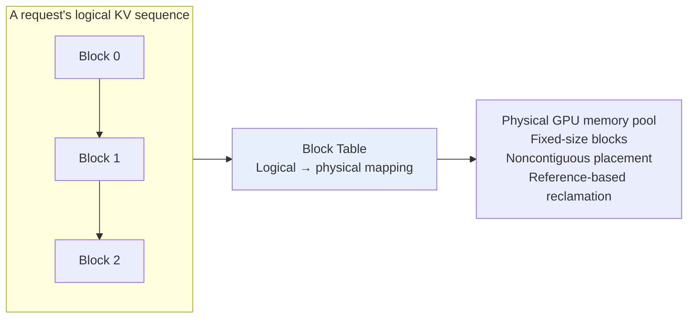
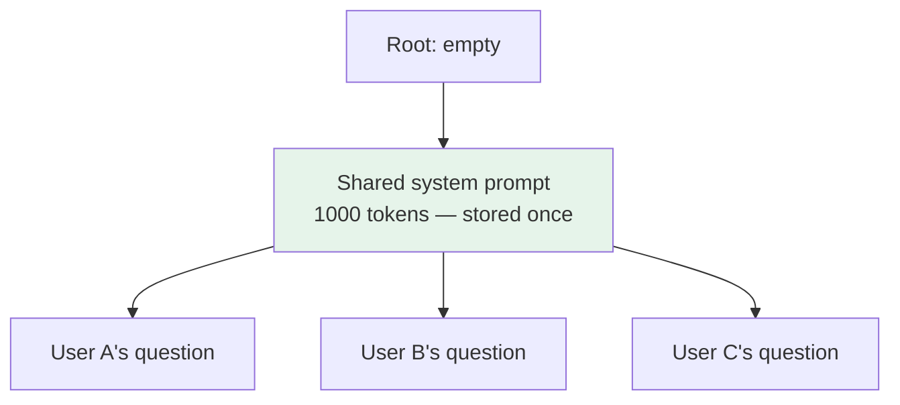

# Chapter 20: Choosing a Serving Framework

## 20.1 What problems does a serving framework solve?

The `transformers` method `model.generate()` can serve as a correctness baseline and supports various cache and attention optimizations. By itself, it is not a complete multi-tenant online scheduling service. The following bottlenecks concern naive serving wrappers, not inherent defects in every Transformers configuration.

### 20.1.1 Three major pain points

| Pain point | Symptoms |
|---|---|
| **① Severe KV cache memory fragmentation** | A naive implementation may reserve contiguous space near the maximum request length even when actual sequences are much shorter, reducing available concurrency |
| **② Inefficient batch scheduling** | Static batches usually keep the same members; completed short requests may leave empty slots or padding that cannot immediately accept new requests, reducing utilization when lengths vary |
| **③ Repeated computation** | Users may share the same system prompt, but without cross-request caching, the service recomputes the prefix's KV state every time |

**Common optimization directions are therefore** memory efficiency to reduce fragmentation, batch scheduling to improve utilization, and cache reuse to avoid redundant computation. Each framework's coverage and implementation change over time.

Also distinguish **prefill** from **decode**. Prefill processes input in bulk and usually has higher arithmetic intensity; low-batch decode is often limited by weight or KV bandwidth. High concurrency, long contexts, and different architectures change the bottleneck, so not all inference is memory-bound.

Framework selection must ultimately satisfy service-level objectives (SLOs), such as limits on time to first token (TTFT) and inter-token latency (ITL). When comparing caching and scheduling below, consider not only aggregate throughput but also user waiting time and stalls in streamed output.

## 20.2 vLLM: PagedAttention and continuous batching

### 20.2.1 PagedAttention takes inspiration from operating-system virtual memory

**How does an operating system manage memory?** Rather than preallocating a large contiguous physical region for every process, which would create substantial fragmentation, it divides physical memory into fixed-size pages. Processes use logical addresses mapped to physical pages through page tables.

**PagedAttention applies that idea to KV caching**:



With a block size of 16 tokens, a 200-token request needs `ceil(200/16)=13` blocks, providing capacity for 208 tokens with 8 unused positions in the last block. This avoids reserving a contiguous 4096-token region for the request. Actual block sizes depend on the backend and configuration.

When a request finishes, blocks with zero references can return to the pool or remain available for prefix caching until eviction. Reclamation does not necessarily return memory to CUDA immediately, so unchanged `nvidia-smi` usage is not by itself evidence of a leak.

> Actual gains depend on request-length distribution, block size, model, concurrency limits, and KV-cache budget. Use production-like traces for load testing rather than assuming a fixed percentage improvement.

### 20.2.2 Continuous batching: regrouping at iteration boundaries

**Static batching**: batch membership remains largely fixed during execution. Short requests may return early, but new requests cannot necessarily reuse the vacated execution slots.

**Continuous batching**: completed requests leave and new requests enter at scheduling iteration boundaries—not halfway through an arbitrary GPU kernel. An iteration may contain decode tokens, prefill chunks, or speculative verification.

```
t1: requests A, B, and C are running
t5: A finishes and leaves → new request D joins immediately
t8: B finishes and leaves → new request E joins
```

This can reduce idle slot time caused by uneven sequence lengths. Throughput gains depend on arrival rate, output lengths, and scheduling policy.

vLLM provides KV management, scheduling, APC, and other capabilities. PagedAttention alone is not enough to predict performance. The maximum batch-token budget, concurrency limit, and KV capacity jointly determine schedulable work.

### 20.2.3 Can a long prefill block requests that are already streaming?

Yes. If a long prompt monopolizes a scheduling iteration, the next token of an existing request can be delayed. **Chunked prefill** splits long inputs into chunks and interleaves them with decode work, adjusting the tradeoff between TTFT and per-token latency.

**Prefill/decode disaggregation** instead places the phases on different execution instances or device pools so they can scale separately. It requires KV transfer and cross-instance routing. Unsuitable transfer costs, bandwidth, or load can make disaggregation slower; it is not the same as continuous batching or prefix caching.

## 20.3 SGLang: prefix reuse with RadixAttention

SGLang's RadixAttention is one implementation of cross-request prefix reuse. SGLang also includes scheduling, quantization, and distributed execution. Shared-prefix presence alone cannot determine whether it outperforms another framework.

### 20.3.1 Where repeated prefixes are common

- **Shared system prompts**: all users call the same API with an identical system prompt.
- **Shared few-shot examples**: prompts contain 5–10 fixed examples.
- **Multi-turn conversation history**: each turn includes the full history of the preceding N turns.
- **Agent workflows**: an agent repeatedly calls an LLM with context beginning with the same system prompt.

vLLM offers not only PagedAttention but also **Automatic Prefix Caching (APC)** to reuse KV blocks for identical token prefixes. Enablement, hits, and benefits depend on version, configuration, and cache pressure. Cross-request prefix reuse is not exclusive to SGLang.

### 20.3.2 RadixAttention: organizing the KV cache with a radix tree



**Requests reuse the same token-prefix path and branch at the first differing token**. A radix-tree edge can compactly represent a sequence of tokens; a separate tree level per token is unnecessary.

> A prefix tree can retain one copy of the shared portion. Actual savings depend on prefix overlap, eviction policy, and concurrency.

### 20.3.3 Automatically reusing earlier requests

Later requests can reuse KV blocks for an identical prefix while those blocks remain unevicted. Cache residency and TTFT benefits both depend on deployment settings and load.

SGLang's RadixAttention is particularly worth evaluating for workloads with high prefix reuse. Compare vLLM APC, SGLang, and other runtimes using the same model, hardware, concurrency, and trace.

With no shared prefixes, prefix caching itself provides no benefit; other kernels, scheduling policies, and model implementations can still differ. SGLang and vLLM can be alternative runtimes for the same service. They are not necessarily complementary components that must be deployed together, nor do they have a fixed ranking independent of workload.

## 20.4 TGI: Hugging Face serving in maintenance mode

Hugging Face's official documentation states that TGI is in **maintenance mode**, accepting minor fixes, documentation, and lightweight maintenance, and recommends evaluating vLLM, SGLang, or compatible local runtimes going forward. Existing TGI users should continue to maintain deployments against their version's support matrix; maintenance mode does not make a running service immediately unusable.

| Dimension | Details |
|---|---|
| **Ecosystem integration** | Load supported models by HF Hub ID; verify architecture, weight format, quantization configuration, tokenizer, and chat template |
| **Serving and observability** | HTTP serving, SSE streaming, Prometheus metrics, and OpenTelemetry tracing; internal gRPC communication does not imply a general external dual-protocol API |
| **Capabilities** | Continuous batching, quantization, and SSE streaming; new projects must include maintenance status and target-model support in their decision |

Existing deployments should compare ongoing maintenance with migration costs. HF Hub integration and metrics are not exclusive to TGI, and a new project should not choose it just because its model is on the Hub. Confirm the runtime and gateway responsibilities for authentication, JWT, quotas, TLS, and auditing separately; “enterprise-grade” does not mean all are provided out of the box.

## 20.5 llama.cpp: a common choice for CPUs and edge devices

llama.cpp is a lightweight C/C++ inference stack supporting CPU, Metal, CUDA, and other backends, plus hybrid CPU/GPU execution. It is commonly used locally, on Apple Silicon, and at the edge—not only on CPUs.

Memory, bandwidth, power, and deployment environments differ widely on these devices. Lightweight dependencies and multiple backends can matter more than maximizing throughput on one server GPU.

### 20.5.1 Three key technologies

**① The GGUF file format**

GGUF stores tensors and metadata such as tokenizer information, and can use sharded files. Common quantization presets include:

| Preset | Description |
|---|---|
| Q8_0 | 8-bit; usually retains more quality than lower-bit formats |
| Q5_K_M | A mostly 5-bit mixed-quantization preset; actual average bit width includes metadata and different tensor formats |
| **Q4_K_M** | A mostly 4-bit mixed-quantization preset, not exactly 4 bits for every parameter in the file |
| Q3_K_S | 3-bit, aggressive compression with quality loss |

> **GGUF is a file format, not a quantization algorithm**; see [Chapter 15](15-quantization.md).

**② SIMD optimization**

Optimized kernels target instruction sets such as AVX2, AVX512, and ARM NEON. CPU/GPU speed comparisons depend heavily on model, quantization, memory bandwidth, and batch size; no fixed ratio applies.

**③ The Metal backend on Apple Silicon**

Metal uses the Apple GPU. Unified memory avoids some explicit CPU/GPU copies but does not eliminate bandwidth limits. Whether a 70B model can run depends on quantization, available memory, KV state, and system reserves. Unified memory alone promises no particular speed.

### 20.5.2 Suitable uses and their limits

| Common use | Additional validation needed |
|---|---|
| Local or embedded inference | Queuing, KV capacity, and target-device throughput at high concurrency |
| Metal on a Mac | Model format, quantization, and hardware bandwidth |
| Resource-constrained hybrid CPU/GPU execution | Latency from offload and cross-device transfers |
| Offline or privacy-sensitive applications | Check model downloads, telemetry, logs, and external tool calls; local inference alone does not keep all application data on-device |

The official `llama-server` documents multi-user parallel decoding and continuous batching, along with multi-GPU allocation options. Claims that it cannot batch or use multiple GPUs are therefore inaccurate. Distributed scale and operational capabilities still need version-specific validation; an available option does not prove suitability for every cluster.

## 20.6 TensorRT-LLM: an NVIDIA-focused inference stack

TensorRT-LLM optimizes kernels, runtime execution, and serving schedules for NVIDIA GPUs. Distinguish its traditional TensorRT engine workflow from the PyTorch backend and high-level LLM API. It is no longer accurate to say that every model requires a manually compiled engine first.

| Feature | Cost or constraint |
|---|---|
| Hardware- and model-specific kernels, quantization, and parallelism optimizations | Verify the CUDA, GPU, model, precision, and backend support matrix |
| Integration with NVIDIA's kernel libraries | **NVIDIA GPUs only** |
| Several FP8, INT4, and other paths, depending on model and GPU | Hardware support for a format does not mean every operator and model supports it |
| `trtllm-serve` and the LLM API simplify loading and deployment | Engine workflows still have build and compatibility requirements; high-level APIs also incur loading and optimization costs |

It is worth evaluating in NVIDIA environments, not only large clusters. Adoption depends on model support, measured SLO benefits, and operational costs the team can sustain—not on an assumption of maximum performance implied by the name.

## 20.7 How should a workload guide runtime selection?

First eliminate unsupported combinations using model, hardware, and maintenance requirements. Then compare SLO-compliant throughput on real requests. The following are candidate directions, not performance rankings:

| Framework | Mechanisms to evaluate | Common evaluation scenarios and limits |
|---|---|---|
| **vLLM** | PagedAttention, continuous batching, APC | High-throughput LLM APIs and repeated-prefix workloads |
| **SGLang** | RadixAttention and serving schedules | Agents, multi-turn conversations, and few-shot prompts; especially worth evaluating with high prefix reuse |
| **TGI** | HF serving ecosystem | Maintaining and migrating existing deployments; now in maintenance mode |
| **llama.cpp** | C/C++ multi-backend inference and GGUF | CPUs, Macs, and edge devices; performance is device-dependent |
| **TensorRT-LLM** | NVIDIA runtime optimizations | NVIDIA environments; select against backend and model support matrices |

All these runtimes have public implementations, but ecosystem affiliation or activity level cannot replace the support matrix for the target version. Measure performance with the same hardware, quality, and load.

### 20.7.1 Four common mistakes

| Mistake | Consequence | Better approach |
|---|---|---|
| **Assuming vLLM has no prefix reuse** | Overlooking APC leads to an incorrect architectural judgment | Check target-version APC settings and compare vLLM and SGLang with real traces |
| **Treating llama.cpp as a CPU tool without batching** | Missing GPU backends and server capabilities | Load-test the target device and concurrency instead of excluding it by label |
| **Ignoring TGI maintenance mode for a new deployment** | New-model or feature support may fall short of expectations | Compare maintenance costs and alternatives, retaining migration and fallback plans |
| **Assuming TensorRT-LLM requires manual engine building** | Misestimating proof-of-concept and maintenance costs | Specify the backend, LLM API, or engine workflow being used |

## 20.8 Three less obvious pitfalls

### 20.8.1 Paging does not solve every capacity problem

Fixed-block allocation mainly reduces external fragmentation and over-reservation. Each sequence may leave a partly empty final block. Long contexts also genuinely require more KV storage; not every OOM is fragmentation.

**Response**: monitor active KV blocks, cache residency, reserved pools, preemption/recomputation, peak GPU memory, and queuing latency separately. Use traces to adjust context limits, batch-token budgets, and concurrency. Total memory utilization is not the same as useful work.

### 20.8.2 KV cache quantization support varies widely

Many frameworks support weight quantization, **but KV cache quantization support differs considerably and changes rapidly between versions**.

> **If long-context KV memory is your bottleneck, check current version documentation before choosing a runtime. A generic claim of “support” is not enough.**

### 20.8.3 MoE deployment support differs

Cross-device MoE deployment requires checking expert parallelism and dispatch/combine communication; see [Chapter 19](19-moe.md). Single-device MoE does not necessarily require cross-GPU All-to-All:

- Is the target model's exact routing, shared-expert, and attention structure supported?
- Can the quantization format, expert-parallel topology, and communication backend be used together?
- What happens to performance with hot experts, offload, and changing batches?

There is no cross-model verdict that TensorRT-LLM always has the best support or llama.cpp has mediocre performance. Functional execution and compliance with serving SLOs are separate validations.

## 20.9 Designing load tests that support a selection decision

### 20.9.1 Standardize the conditions first

Fix model/tokenizer revisions, chat template, quantization precision, input/output length distributions, sampling, hardware topology, and actual concurrency. Record framework version, attention backend, batch-token budget, KV settings, and speculative-decoding status. Do not rank results obtained at different quality levels or output lengths as though they were directly comparable.

### 20.9.2 Separate latency and throughput metrics

| Metric | Meaning and interpretation |
|---|---|
| TTFT | Time from sending a request to its first output token; specify whether network, queuing, and prefill are included |
| ITL | Time between adjacent output tokens; reveals streaming stalls |
| TPOT | Commonly elapsed time after the first token divided by remaining output tokens; the mean can hide pauses |
| End-to-end latency | Time for the complete request, strongly affected by output length |
| Output tokens/s | Aggregate output throughput, not the same as one user's generation speed |
| SLO goodput | Useful request or token throughput completed within TTFT, ITL/TPOT, and other constraints |

### 20.9.3 Cover real arrival patterns and cache states

A closed-loop test at fixed concurrency automatically lowers its arrival rate when the service slows down, potentially hiding overload-induced queues. Also use timestamped traces or open-loop loads, covering cold/warm caches, mixed short/long inputs and outputs, multiple tenants, and bursts. Report p50/p95/p99 and failure rates.

### 20.9.4 Why one optimization can worsen another metric

Larger batches often raise throughput but may increase TTFT and ITL. Retaining more prefixes reduces recomputation but may displace active KV state. Prefill/decode disaggregation reduces interference but adds KV transfers. Find acceptable configurations within SLO constraints rather than maximizing one offline tokens/s figure.

### 20.9.5 What is still needed between an experiment and production?

Verify resource release on cancellation and timeout, overload rate limiting and backpressure, model readiness probes, multi-replica routing, tenant quotas, and version rollback. An “OpenAI-compatible” API usually covers only part of the interface semantics. Test stream termination, tool calls, error codes, and usage fields—not just whether a request returns 200.

## 20.10 Chapter summary

1. **Serving frameworks address three major pain points**: KV memory fragmentation, inefficient batch scheduling, and redundant shared-prefix computation.
2. **vLLM's PagedAttention borrows from operating-system virtual memory**, using block tables for logical-to-physical mapping; APC reuses KV blocks for matching prefixes.
3. **Continuous batching allows requests to enter and leave asynchronously**, improving utilization for workloads with uneven lengths.
4. **SGLang's RadixAttention shares prefixes through a radix tree**, reducing cache storage and prefill recomputation when reuse is high.
5. **Evaluate vLLM APC and SGLang with actual traces**; there is no fixed winner independent of versions and workloads.
6. **TGI is in maintenance mode**. New projects should first check current target-model and runtime support.
7. **llama.cpp combines a C/C++ multi-backend inference stack with GGUF**, including continuous batching and multi-GPU options. Measure its suitable operating scale.
8. **TensorRT-LLM optimizes for NVIDIA hardware**. Distinguish PyTorch/LLM API workflows from engine workflows; manual precompilation is not always required.
9. **Three less obvious pitfalls**: long contexts still incur fragmentation and scheduling overhead, KV quantization support varies, and MoE deployment is usually more complex than dense deployment.


## References

- [Efficient Memory Management for Large Language Model Serving with PagedAttention (vLLM)](https://arxiv.org/abs/2309.06180)
- [SGLang: Efficient Execution of Structured Language Model Programs (RadixAttention)](https://arxiv.org/abs/2312.07104)
- [Orca: A Distributed Serving System for Transformer-Based Generative Models (continuous batching)](https://www.usenix.org/conference/osdi22/presentation/yu)
- [vLLM documentation](https://docs.vllm.ai/)
- [vLLM: Automatic Prefix Caching](https://docs.vllm.ai/en/stable/features/automatic_prefix_caching/)
- [SGLang repository](https://github.com/sgl-project/sglang)
- [Text Generation Inference repository](https://github.com/huggingface/text-generation-inference)
- [TGI official documentation: maintenance-mode notice, checked in the source manuscript on 2026-09-15](https://huggingface.co/docs/text-generation-inference/main/en/index)
- [llama.cpp repository](https://github.com/ggml-org/llama.cpp)
- [TensorRT-LLM repository](https://github.com/NVIDIA/TensorRT-LLM)
- [llama.cpp: HTTP server capabilities and parameters](https://github.com/ggml-org/llama.cpp/blob/master/tools/server/README.md)
- [TensorRT-LLM: Quick Start](https://nvidia.github.io/TensorRT-LLM/quick-start-guide.html)
- [vLLM: Chunked Prefill and configuration tuning](https://docs.vllm.ai/en/stable/configuration/optimization/)
- [vLLM: Disaggregated Prefilling](https://docs.vllm.ai/en/stable/features/disagg_prefill/)
- [TGI: components and HTTP/gRPC boundaries](https://huggingface.co/docs/text-generation-inference/main/en/architecture)
- [TensorRT-LLM: LLM API and PyTorch backend](https://github.com/NVIDIA/TensorRT-LLM/blob/main/docs/source/llm-api/index.md)
