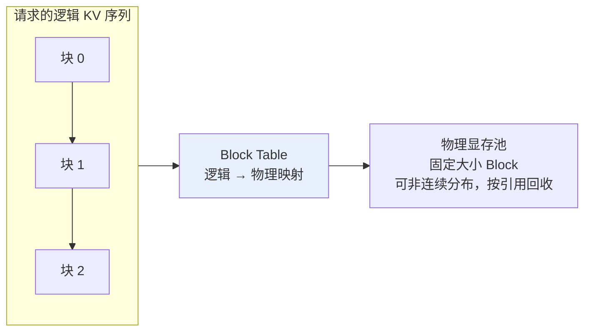
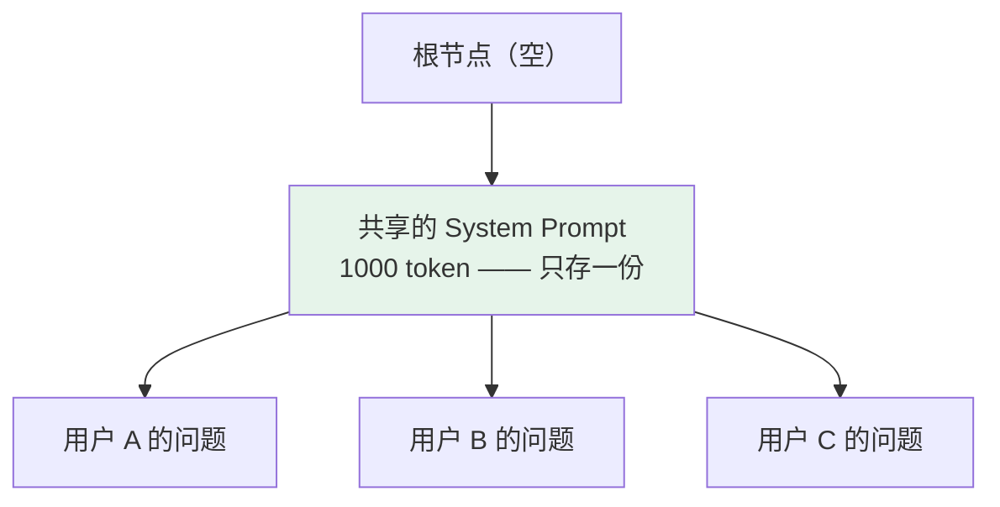

# 第二十章：部署框架选型

## 20.1 部署框架到底解决什么问题

`transformers` 的 `model.generate()` 可以作为正确性基线，也支持多种缓存与 attention 优化；它本身不是一个完整的多租户在线调度服务。下面讨论朴素服务封装可能遇到的瓶颈，而不是把它们当成 Transformers 所有配置的固有缺陷。

### 20.1.1 三大痛点

| 痛点 | 表现 |
|---|---|
| **① KV Cache 显存碎片严重** | 朴素实现可能为请求预留接近最大长度的连续空间，而实际长度短得多，导致可用并发下降 |
| **② 批量推理调度低效** | 静态 batch 的成员通常保持不变；短请求完成后可能留下空槽或 padding，无法立刻纳入新请求，长度不均时利用率下降 |
| **③ 重复计算** | 例如用户共享同一段系统提示，但服务没有跨请求缓存，每次仍需计算相同前缀的 KV |

**因此常见优化方向是**：内存高效（缓解碎片）+ 批量调度（提高利用率）+ 缓存复用（避免重复计算）。各框架的覆盖与实现随版本变化。

还要区分 **prefill** 与 **decode**：前者批量处理输入，通常有较高算术强度；低批量 decode 常受权重或 KV 带宽限制。高并发、长上下文和不同架构会改变瓶颈，不能把全部推理都称为 memory-bound。

## 20.2 vLLM：PagedAttention + Continuous Batching

### 20.2.1 PagedAttention 的灵感来自操作系统虚拟内存

**操作系统怎么管内存**？不是给每个进程预分配大块连续物理内存（那会有大量碎片），而是把物理内存切成固定大小的「页」，进程拿到「逻辑地址」，通过页表映射到真实物理页。

**PagedAttention 把这个思路搬到 KV Cache 上**：



假设块大小为 16 token，一个请求的 200 token 需要 `ceil(200/16)=13` 块，总容量为 208 token，尾块空 8 个位置。它避免了为该请求预留整段 4096-token 连续空间；真实块大小受后端和配置约束。

请求结束后，引用计数为零的块可以回收到池中，也可能为前缀缓存保留到被逐出。回收不等于立刻将显存归还 CUDA，所以 `nvidia-smi` 占用不下降未必是泄漏。

> 实际收益取决于请求长度分布、block 大小、模型、并发限制和 KV-cache 预算；应使用生产形态的 trace 压测，而非套用固定百分比。

### 20.2.2 Continuous Batching：在迭代边界重组

**Static batching**：一批请求的成员在执行期间基本固定；短请求可以提前返回，但空出的执行槽未必能被新请求复用。

**Continuous Batching**：在调度迭代边界让已完成请求退出、让新请求加入。不是在任意 GPU kernel 执行到一半时插入请求；每轮可包含 decode token、prefill chunk 或推测验证等工作。

```
t1: 请求 A、B、C 同时在跑
t5: A 生成完退出 → 新请求 D 立刻加入
t8: B 生成完退出 → 新请求 E 加入
```

它可减少由长度不均造成的空槽时间；吞吐增益取决于到达率、输出长度和调度策略。

vLLM 同时提供 KV 管理、调度和 APC 等能力，不能只凭 PagedAttention 一个术语判定性能。最大 batch token 预算、并发限制和 KV 容量共同决定可调度的工作量。

### 20.2.3 长 prefill 会不会阻塞正在输出的请求

会，若长 prompt 独占一次调度迭代，现有请求的下一 token 可能被延后。**Chunked prefill** 把长输入拆成若干块，与 decode 工作交错，调节 TTFT 与逐 token 延迟之间的取舍。

**Prefill/decode 分离**则将两阶段放在不同执行实例或设备池，分别扩缩容，但需要传输 KV 并管理跨实例路由。传输成本、带宽和负载规模不合适时，分离反而更慢；它不等于连续批处理或前缀缓存。

## 20.3 SGLang：用 RadixAttention 复用前缀

SGLang 的 RadixAttention 是解释跨请求前缀复用的一个实现实例。SGLang 也包含调度、量化、分布式等能力，不能仅凭是否有共享前缀判定它与其他框架的胜负。

### 20.3.1 哪些场景前缀重复率高

- **System Prompt 共享**：所有用户调同一个 API，System Prompt 完全一样；
- **Few-shot 示例共享**：Prompt 里有 5–10 个固定示例；
- **多轮对话历史**：每轮都包含前 N 轮的完整历史；
- **Agent 工作流**：Agent 多次调用 LLM，每次上下文都从同一个 System Prompt 开始。

vLLM 不只有 PagedAttention，也提供 **Automatic Prefix Caching（APC）**，可复用相同 token 前缀的 KV block。是否开启、命中和收益依版本、配置及缓存压力而定；不能把「跨请求前缀复用」说成 SGLang 独有。

### 20.3.2 RadixAttention：用基数树组织 KV Cache



**多个请求可复用相同的 token 前缀路径，在第一个不同 token 处分叉**。Radix tree 的一条边可压缩存储一段 token，不必一个 token 对应树的一层。

> 前缀树可让共享部分只保留一份；实际节省由前缀重合、驱逐策略和并发共同决定。

### 20.3.3 自动复用历史请求

若相同前缀的 KV block 尚未被逐出，后来的请求可复用它们；缓存驻留时长和首 token 延迟收益都由部署配置与负载决定。

SGLang 的 RadixAttention 对高前缀复用工作负载尤其值得评估；vLLM APC、SGLang 与其他运行时都应在同一模型、硬件、并发和 trace 下比较。

无共享前缀时，只能说前缀缓存这一项不能带来收益；其他 kernel、调度和模型实现仍可能产生差异。SGLang 与 vLLM 可以作为同一服务的候选运行时，既不是必须一起部署的互补组件，也没有脱离负载的固定排序。

## 20.4 TGI：处于维护模式的 HuggingFace 服务方案

截至 2026-09-08 核对的官方文档，Hugging Face 已声明 TGI 进入**维护模式**：接受小型修复、文档和轻量维护工作，并推荐后续评估 vLLM、SGLang 或本地兼容运行时。现有 TGI 用户仍应按自身版本的支持矩阵维护部署；维护模式不等于既有服务立即不可用。

| 维度 | 说明 |
|---|---|
| **生态集成** | 可通过 HF Hub 模型 ID 加载支持的模型；需核对架构、权重格式、量化配置、tokenizer 和 chat template |
| **服务与观测** | HTTP 服务与 SSE 流式输出、Prometheus 指标、OpenTelemetry tracing；内部组件的 gRPC 通信不等于通用的外部双协议 API |
| **能力** | 提供连续批处理、量化和 SSE 流式输出；新项目需将维护状态和目标模型支持纳入选型 |

既有部署应评估继续维护与迁移成本。HF Hub 集成和指标能力不是 TGI 独有，新项目不应只因为模型来自 Hub 就选 TGI。鉴权、JWT、配额、TLS 和审计需要分别确认运行时与网关的职责，不能用「企业级」一词概括为开箱即用。

## 20.5 llama.cpp：CPU / 边缘设备的常用方案

使用 C/C++ 实现轻量推理栈，支持 CPU、Metal、CUDA 等后端及 CPU/GPU 混合执行，常用于本地、Apple Silicon 和边缘场景；并非只支持 CPU。

这类设备的内存、带宽、功耗与部署环境差异很大，轻量依赖和多后端支持比单一服务器 GPU 的最优吞吐更重要。

### 20.5.1 三个关键技术

**① GGUF 文件格式**

把张量及 tokenizer 等元数据存入 GGUF，也可分片存储。常见量化预设：

| 档位 | 说明 |
|---|---|
| Q8_0 | 8-bit，通常比更低比特格式保留更多质量 |
| Q5_K_M | 以 5-bit 为主的混合量化预设，实际平均位宽包含元数据和不同张量格式 |
| **Q4_K_M** | 以 4-bit 为主的混合量化预设，不表示文件中每个参数恰好占 4 bit |
| Q3_K_S | 3-bit，极端压缩，精度有损 |

> **再强调一次：GGUF 是文件格式不是量化算法**（见 [第十五章](15-quantization.md)）。

**② SIMD 优化**

针对 AVX2、AVX512、ARM NEON 等指令集提供优化 kernel。CPU 与 GPU 的速度比较高度依赖模型、量化、内存带宽和批量大小，不应使用固定比例。

**③ Metal 后端（Apple Silicon）**

Metal 可利用 Apple GPU；统一内存减少部分 CPU/GPU 间显式复制，但不消除带宽限制。能否运行 70B 要结合量化、可用内存、KV 与系统预留判断，不能用「统一内存」承诺速度。

### 20.5.2 适用边界

| 常见用途 | 需要额外验证 |
|---|---|
| 本地或嵌入式推理 | 高并发时的排队、KV 容量和目标设备吞吐 |
| Mac 上使用 Metal | 模型格式、量化与硬件带宽 |
| 资源受限的 CPU/GPU 混合运行 | offload 与跨设备传输的延迟代价 |
| 离线场景、隐私敏感场景（数据不出设备） | |

官方 `llama-server` 已列出多用户并行解码和 continuous batching，也提供多 GPU 分配选项。因此「不支持 batch」「不能多卡」都不准确。分布式规模和运维能力仍要按具体版本验证，不能从支持某个选项推成适合所有集群。

## 20.6 TensorRT-LLM：针对 NVIDIA 的推理栈

TensorRT-LLM 针对 NVIDIA GPU 的 kernel、运行时与服务调度进行优化。要区分传统 TensorRT engine 路线与 PyTorch backend / 高层 LLM API，不能继续概括成「所有模型都必须先手动编译 engine」。

| 特点 | 代价 |
|---|---|
| 提供针对硬件和模型的 kernel、量化及并行优化 | 需核对 CUDA、GPU、模型、精度与后端支持矩阵 |
| 集成 NVIDIA 自家内核库 | **只支持 NVIDIA GPU** |
| 支持若干 FP8、INT4 等路径，依模型与 GPU 而异 | 硬件支持某格式不意味着所有算子和模型都支持 |
| `trtllm-serve` 和 LLM API 可简化加载与部署 | engine 路线仍需考虑构建配置与兼容性，高层 API 也有加载和优化成本 |

适合在 NVIDIA 环境中评估，不限于大集群。是否值得采用，取决于模型支持、实际 SLO 收益和团队承担的运维成本，而不是框架名称暗示的「极致性能」。

## 20.7 选型决策矩阵

| 框架 | 可重点评估的机制 | 常见评估场景 | 性能 | 生态 |
|---|---|---|---|---|
| **vLLM** | PagedAttention、Continuous Batching、APC | 高吞吐 LLM API 与重复前缀工作负载 | 需实测 | 开源活跃 |
| **SGLang** | RadixAttention（共享前缀） | Agent / 多轮 / Few-shot | 高前缀复用时值得评估 | 快速演进 |
| **TGI** | HF 服务生态 | 既有 TGI 部署 | 已进入维护模式 | HF 生态 |
| **llama.cpp** | C/C++ 推理 + GGUF | CPU / Mac / 边缘 | 需按设备实测 | 个人 / 边缘 |
| **TensorRT-LLM** | NVIDIA 运行时优化 | NVIDIA 部署 | 需按后端与负载实测 | NVIDIA 官方开源 |

### 20.7.1 四个常见误用

| 误用 | 后果 | 正确做法 |
|---|---|---|
| **认为 vLLM 没有前缀复用** | 忽略 APC，导致错误的架构判断 | 查目标版本 APC 配置，并用真实 trace 比较 vLLM 与 SGLang |
| **把 llama.cpp 当成没有批处理的 CPU 工具** | 漏掉 GPU 后端与服务器能力 | 用目标设备和并发压测，而非按标签排除 |
| **新部署忽略 TGI 维护模式** | 新模型或功能支持不符合预期 | 比较维护成本和替代运行时，保留迁移与回退方案 |
| **假设 TensorRT-LLM 必须手工构建 engine** | 错估 POC 与维护成本 | 明确使用的后端、LLM API 或 engine 工作流 |

## 20.8 三大隐藏陷阱

### 20.8.1 分页没有解决所有容量问题

固定块分配主要缓解外部碎片和过度预留；每条序列可能留下未填满的尾块。长上下文还会真实增加 KV 容量，不能把所有 OOM 都叫「碎片」。

**应对**：分别监控活动 KV 块、缓存驻留、预留池、抢占/重算、GPU 峰值和排队延迟。再结合 trace 调整上下文限制、batch token 预算与并发；不要把总显存利用率等同于有效工作量。

### 20.8.2 KV Cache 量化的支持差异大

权重量化很多框架都支持，**但 KV Cache 量化的支持差异很大，而且版本迭代很快**。

> **如果你的瓶颈是长上下文 KV Cache 显存，选型前一定要查当前版本文档，别只听别人说「支持」。**

### 20.8.3 MoE 模型的部署支持差异

跨设备 MoE 部署需检查专家并行与 dispatch/combine 通信（见[第十九章](19-moe.md)）；单设备 MoE 不一定需要跨卡 All-to-All：

- 目标模型的具体路由、共享专家与 attention 结构是否支持；
- 量化格式、专家并行拓扑、通信后端能否一起使用；
- 热点专家、offload 与 batch 变化下的实际性能。

没有「TensorRT-LLM 支持最好」或「llama.cpp 性能一般」的跨模型结论；功能能运行与符合服务 SLO 是两项不同验证。

## 20.9 如何设计能用于选型的压测

### 20.9.1 先统一条件

固定模型/tokenizer 修订、chat template、量化精度、输入输出长度分布、采样、硬件拓扑与实际并发。记录框架版本、attention 后端、batch token 预算、KV 配置和是否开启推测解码，不能把不同质量或不同输出长度的结果直接排榜。

### 20.9.2 分清延迟与吞吐指标

| 指标 | 含义与读法 |
|---|---|
| TTFT | 从发出请求到第一个输出 token；需说明是否含网络、排队和 prefill |
| ITL | 相邻输出 token 的时间间隔；可反映流式输出卡顿 |
| TPOT | 常按首 token 后耗时除以其余输出 token 数计算；均值会掩盖停顿 |
| 端到端延迟 | 完整请求耗时，受输出长度显著影响 |
| 输出 tokens/s | 总输出吞吐，与单用户生成速度不是同一个数 |
| SLO goodput | 在 TTFT、ITL/TPOT 等约束内完成的有效请求或 token 吞吐 |

### 20.9.3 覆盖真实到达流量与缓存状态

只固定并发的闭环压测，会在服务变慢时自动降低请求到达率，可能掩盖过载排队。还应使用带到达时间的 trace 或开放式负载，覆盖冷/热缓存、长短混合输入输出、多租户和突发流量，并报告 p50/p95/p99 与失败率。

### 20.9.4 为什么优化可能让另一项指标变差

增加 batch 往往提高吞吐，但可能增大 TTFT 和 ITL；保留更多前缀能减少重算，却可能挤压活动 KV；分离 prefill/decode 可以减少干扰，却会增加 KV 传输。需要沿 SLO 约束寻找可接受配置，而不是最大化一个离线 tokens/s 数字。

### 20.9.5 从实验走向上线还缺什么

验证取消与超时能否释放资源、过载限流与背压、模型加载就绪探针、多副本路由、租户配额及版本回滚。API “OpenAI-compatible” 通常只覆盖部分接口语义，还要测试流式结束、工具调用、错误码和 usage 字段，而不是仅测请求返回 200。

## 20.10 本章总结

1. **部署框架解决三大痛点**：KV Cache 显存碎片、批量调度低效、共享前缀重复计算；
2. **vLLM 的 PagedAttention 借鉴操作系统虚拟内存**，Block Table 映射逻辑到物理；APC 可自动复用匹配前缀的 KV block；
3. **Continuous Batching 让请求异步进出**，可改善长度不均工作负载的利用率；
4. **SGLang 的 RadixAttention 用基数树共享前缀**，高前缀复用时可减少缓存和 prefill 重算；
5. **vLLM APC 与 SGLang 都应按实际 trace 评估**，不存在脱离版本与负载的固定胜负；
6. **TGI 已进入维护模式**；新项目需优先检查目标模型与运行时的当前支持；
7. **llama.cpp 是 C/C++ 多后端推理栈 + GGUF**，包含连续批处理与多 GPU 选项；适用规模应实测；
8. **TensorRT-LLM 针对 NVIDIA 硬件优化**，应区分 PyTorch/LLM API 与 engine 工作流；并非都要手工预编译；
9. **三大隐藏陷阱**：长上下文仍有碎片与调度开销、KV Cache 量化支持差异大、MoE 部署复杂度通常高于 Dense。


## 参考资料

- [Efficient Memory Management for Large Language Model Serving with PagedAttention（vLLM）](https://arxiv.org/abs/2309.06180)
- [SGLang: Efficient Execution of Structured Language Model Programs（RadixAttention）](https://arxiv.org/abs/2312.07104)
- [Orca: A Distributed Serving System for Transformer-Based Generative Models（Continuous Batching）](https://www.usenix.org/conference/osdi22/presentation/yu)
- [vLLM 文档](https://docs.vllm.ai/)
- [vLLM: Automatic Prefix Caching](https://docs.vllm.ai/en/stable/features/automatic_prefix_caching/)
- [SGLang 仓库](https://github.com/sgl-project/sglang)
- [Text Generation Inference 仓库](https://github.com/huggingface/text-generation-inference)
- [TGI 官方文档（维护模式说明）](https://huggingface.co/docs/text-generation-inference/main/en/index)
- [llama.cpp 仓库](https://github.com/ggml-org/llama.cpp)
- [TensorRT-LLM 仓库](https://github.com/NVIDIA/TensorRT-LLM)
- [llama.cpp：HTTP Server 能力与参数](https://github.com/ggml-org/llama.cpp/blob/master/tools/server/README.md)
- [TensorRT-LLM：Quick Start](https://nvidia.github.io/TensorRT-LLM/quick-start-guide.html)
- [vLLM：Chunked Prefill 与配置调优](https://docs.vllm.ai/en/stable/configuration/optimization/)
- [vLLM：Disaggregated Prefilling](https://docs.vllm.ai/en/stable/features/disagg_prefill/)
- [TGI：组件与 HTTP/gRPC 边界](https://huggingface.co/docs/text-generation-inference/main/en/architecture)
- [TensorRT-LLM：LLM API 与 PyTorch backend](https://github.com/NVIDIA/TensorRT-LLM/blob/main/docs/source/llm-api/index.md)

本文原创讲解与示意图：Polo Li，采用 CC BY 4.0。
