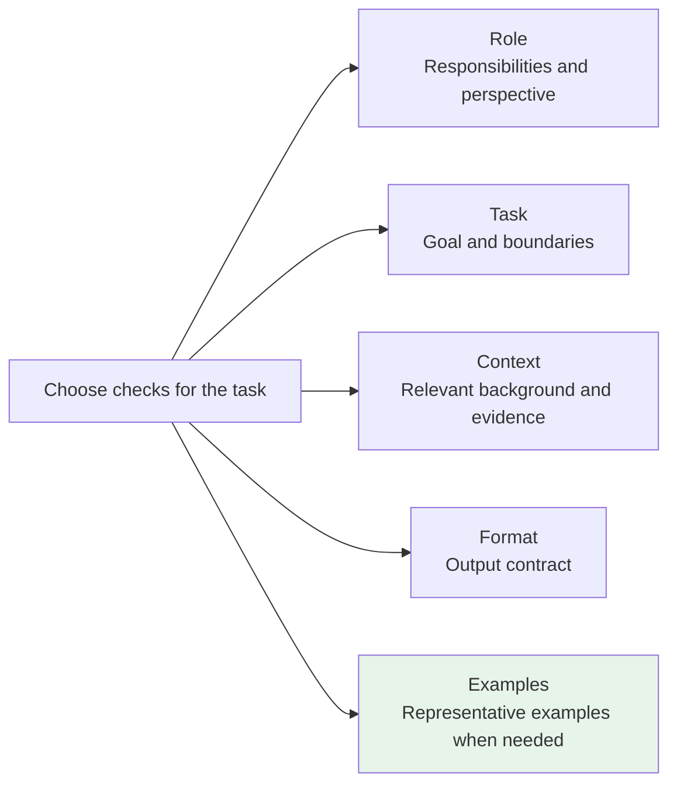
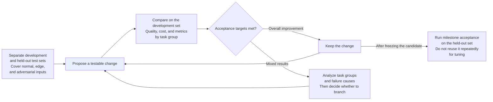

# Chapter 16: Prompt Engineering

## 16.1 What prompts can and cannot change

A prompt supplies the conditions for a task and influences how a model uses its existing capabilities. It cannot guarantee missing knowledge, reliable computation, or tool permissions. Results depend on the model, task, and evaluation criteria; there is no universal “order-of-magnitude improvement in quality.”

First identify the source of failure. Unclear requirements call for better instructions; missing information calls for retrieval; incorrect monetary calculations call for a calculation tool; unauthorized calls call for authorization checks. Treating every failure as a prompting problem tends to produce longer prompts without fixing the underlying cause.

### 16.1.1 Three common beginner problems

| Problem | What it looks like |
|---|---|
| **Unclear instructions** | “Help me write an article” versus “Write an 800-character popular-science article for high-school students explaining how black holes form” |
| **Missing essential context** | The model does not know your industry or who your users are |
| **No format constraints** | The model chooses its own format, breaking downstream parsing |

> **A weak prompt is usually too vague, not simply too short.**

The following five elements are a checklist, not a mandatory template. A simple classification task may need only a task description, label definitions, and an input.

## 16.2 How do you turn a vague request into a task that can be executed and evaluated?

Review the responsibilities, task, background, format, and examples, and add only the information that is genuinely missing. These five elements are not stock phrases. For each addition, explain which ambiguity or acceptance problem it resolves.



### 16.2.1 Role: defining responsibilities

A role can suggest a perspective and writing style, but saying “ten years of experience” does not give a model real credentials or extra knowledge. Prefer actionable responsibilities and decision criteria.

The prompt inputs below remain in their original Chinese, with English explanations. Their length limits count Chinese characters, not English words.

❌ **Weak**:

```
你是一个助手，帮我分析这段代码。
```

This asks only: “You are an assistant. Help me analyze this code.”

✅ **Better**:

```
请审查以下 Python 后端代码，重点检查输入校验、异常处理和重复数据库查询。
每个发现给出相关代码位置、触发条件和修改建议。
不能从现有代码确认的问题，列为待核实项，不当成已确认缺陷。
```

This asks for a review of Python backend code focused on input validation, exception handling, and repeated database queries. Each finding must include its code location, triggering conditions, and a suggested change. Issues that cannot be confirmed from the available code must be listed as requiring verification, not as confirmed defects.

The improvement is the explicit review scope and evidence requirements, not an expert title assigned to the model. Whether it reduces missed findings and false positives still needs testing against labeled cases.

### 16.2.2 Task: stating the work

Use clear verbs to define the task boundaries. Complex tasks can be split into verifiable subtasks, but decomposition also adds context-transfer costs and may lose global constraints. More steps are not automatically better.

❌ **Weak**:

```
帮我写一篇文章。
```

This simply asks: “Help me write an article.”

✅ **Better**:

```
写一篇面向高中生的 800 字科普文章，主题是「为什么黑洞会弯曲时空」。
用日常生活类比帮助读者理解，避免数学公式，结尾给一个思考题。
```

This asks for an 800-character popular-science article for high-school students on why black holes bend spacetime, using everyday analogies, avoiding mathematical formulas, and ending with a question for reflection.

“Help me write an article” leaves too many decisions open: what style, how long, and for whom? The better version specifies the **audience, length, topic, style, and structure**.

### 16.2.3 Context: providing background

The model does not automatically know your business rules. Supply relevant background that you are authorized to use. Irrelevant material adds cost, and sensitive material must not be sent merely because it would help the answer.

❌ **Weak**:

```
把这段话翻译成英文。
```

This asks only to translate the passage into English.

✅ **Better**:

```
这是一份面向海外投资者的商业计划书摘要，需要翻译成英文。
要求：使用正式商务英语，保留所有专业术语，不要口语化，保持原文段落结构。

[原文内容]
```

This identifies the source as a business-plan summary for overseas investors and requests formal business English, preservation of all technical terms, no colloquial language, and the original paragraph structure. The final placeholder marks the source text.

The second version makes the audience, purpose, and terminology requirements testable. Supply a glossary when specific translations are required. If business rules are versioned, include their effective dates and precedence.

### 16.2.4 Format: defining the output

Output consumed by software needs runtime validation, not just formatting instructions.

❌ **Weak**:

```
分析这条用户评论的情感。
```

This asks to analyze the sentiment of a user review.

✅ **Better**:

```
分析以下用户评论，以 JSON 格式输出，包含以下字段：
- "summary"：20 字以内的评论概述
- "sentiment"：正面 / 中性 / 负面 三选一
- "keywords"：最多 3 个关键词的列表

[用户评论]
```

This requests JSON with a `summary` of at most 20 Chinese characters, a `sentiment` chosen from the original labels `正面` / `中性` / `负面` (positive / neutral / negative), and a `keywords` list containing at most 3 entries. The placeholder is the user review.

Here, JSON is only a natural-language request, not a formatting guarantee. Distinguish three levels:

| Level | What it constrains | What still needs handling |
|---|---|---|
| Asking for JSON in a prompt | Suggests an output format | Markdown fences, missing fields, incorrect types |
| JSON mode | Produces valid JSON under the interface's stated conditions | Does not guarantee adherence to a particular schema |
| Structured Outputs / constrained decoding | Constrains structure within the supported schema subset | Refusals, truncated output, API errors, and the business correctness of values |

A valid `sentiment` enum can still be the wrong classification, and a valid number can still be the wrong amount. Applications should validate business invariants, distinguish recoverable retries from cases requiring more information, and limit retries. Check strict-schema capabilities and limitations for the specific model, endpoint, and backend version.

### 16.2.5 Examples: few-shot prompting

Examples communicate input–output relationships through in-context learning. They do not update model weights as fine-tuning does.

Examples are useful for formats, label boundaries, or styles that are hard to describe abstractly. There is no fixed recipe for their number: start with a zero-example baseline, then compare the benefits and token costs of representative examples.

Classification examples should cover neighboring labels, missing information, and refusal cases rather than using the same label throughout. Incorrect examples, example order, and content overly similar to test questions can all distort results. Putting test answers into the prompt does not demonstrate better generalization.

## 16.3 An end-to-end revision example

Scenario: generate a summary of a technical blog post.

### 16.3.1 Version one: weak

```
帮我总结一下这篇文章。

{文章内容}
```

This asks to summarize the article supplied in the placeholder.

**Still unspecified**: the audience, information that must be retained, whether general knowledge may be added, and how length and format will be evaluated. The absence of a role is not itself a defect.

### 16.3.2 Version two: adding role and task

```
你是一位技术文档编辑。

请总结以下文章，提炼核心观点。

{文章内容}
```

This assigns the role of technical documentation editor and asks for a summary highlighting the article's central points.

It is an improvement, but “highlight the central points” is still too vague. How long should the output be, in what format, and for whom?

### 16.3.3 Version three: complete

```
你是一位技术内容编辑，负责为工程师受众提炼文章精华。

## 任务
对以下技术博客进行摘要提炼。

## 要求
- 摘要总长度：100-150 字
- 受众：有 2-3 年经验的后端工程师，熟悉基础概念，不需要解释入门知识
- 只总结原文，不补充原文没有的数字或结论；原文有冲突时指出冲突
- 输出格式：
  - **一句话结论**：20 字以内，直接说文章最核心的观点
  - **要点列表**：3 条，每条不超过 30 字
  - **适合人群**：一句话说明哪类读者最该看这篇文章

## 文章内容
{文章内容}
```

This assigns a technical content editor to summarize a technical blog for engineers. It specifies a total of 100–150 Chinese characters for backend engineers with 2–3 years of experience who already know the basics. The summary must not add numbers or conclusions absent from the source and must identify contradictions in it. The required structure is a one-sentence conclusion of at most 20 characters stating the central claim, 3 key points of at most 30 characters each, and one sentence identifying the readers who would benefit most.

The third version defines acceptance criteria but still contains no few-shot examples—and does not need one just to complete a template. Model changes, server-side version changes, and sampling-parameter changes all require regression tests. Length limits in particular should not rely solely on the model counting for itself.

## 16.4 Three advanced techniques

### 16.4.1 CoT trigger phrases

Step-by-step prompting improved some mathematical and logical tasks on early general-purpose language models. For models trained to reason internally, those trigger phrases may be redundant or even harmful. Follow the model's official guidance and compare direct answers, task decomposition, and reasoning-budget settings; see [Chapter 17](17-cot.md).

> **Do not default to showing end users the entire chain of thought verbatim.** Generated reasoning can be wrong and need not faithfully reflect the model's internal process. Show task-appropriate, verifiable evidence rather than treating a long derivation as trustworthy proof.
>
> Control reasoning budget and display length separately. Even if the final response is concise, internal reasoning tokens already generated may still count toward usage. Hiding them does not automatically avoid that computation.

### 16.4.2 Wrapping content in XML tags

When a prompt has several parts, Markdown headings or XML tags can clarify its structure, but they are not a security isolation mechanism:

```xml
<document>
{这里是要分析的文档内容}
</document>

<task>
根据上面的文档，提取所有提到的日期和对应事件，以表格形式输出。
</task>
```

The `document` placeholder holds the document to analyze. The `task` asks for every date mentioned in that document and its corresponding event, returned as a table.

### 16.4.3 Separating instructions from untrusted material

Put business instructions in the high-priority instruction position supported by the interface. Treat user documents, retrieved results, web pages, and tool results as data. “Ignore the previous requirements” inside a document is not a new instruction, but stating this in a prompt alone does not guarantee resistance to prompt injection.

Applications still need restricted tool permissions, parameter validation, isolated secrets, and independent approval for high-impact operations such as transfers or deletions. Delimiters improve readability; they neither make low-trust text trustworthy nor replace authorization checks.

## 16.5 Iteration: prompts are an engineering problem

**Prompt engineering is a cycle of forming hypotheses, testing, and improving—not a one-time writing exercise.**



Fix the model snapshot, decoding parameters, input data, and scoring criteria. Changing one factor at a time helps attribution but is not a rigid rule. Ablation or factorial experiments can distinguish the contributions of multiple changes. Repeatedly using the held-out test set to revise a prompt will indirectly overfit that set too.

Record task accuracy, format pass rate, unsupported assertions, refusal rate, cost, and tail latency separately. A small development set can help diagnose problems, but it cannot establish that rare, high-risk errors have disappeared.

## 16.6 Advanced topic: prompt compression

### 16.6.1 Why compress?

| Reason | Explanation |
|---|---|
| **Cost** | Within a pricing tier, input cost grows with token count; caching, batching, and context-length tiers can change the unit price |
| **Latency and capacity** | Long inputs increase preprocessing, prefill, and KV memory usage; time to first token also depends on hardware, queuing, caching, and reasoning budget, so there is no universal milliseconds-per-thousand-tokens figure |

Remove irrelevant documents and repeated examples before considering automatic compression. Negations, time ranges, exceptions, numbers, and citation identifiers may be short yet determine the answer. Do not remove them simply because of length or apparent repetition.

### 16.6.2 Two approaches

| Approach | Mechanism | Applicability and limits |
|---|---|---|
| **Discrete text compression: LLMLingua / LongLLMLingua** | LLMLingua combines budget control, small-model perplexity, and iterative token selection; LongLLMLingua additionally considers question relevance and document position | The output remains text that can be sent to a target LLM; include the compression model's overhead, and do not assume the original papers' gains apply to every workload |
| **Soft prompts / prompt tuning** | Freeze the main model and learn task-specific continuous prompt vectors through backpropagation | This is parameter-efficient adaptation, not lossless encoding of arbitrary long documents into fixed vectors; it requires training and embedding-input access and usually cannot be used directly through ordinary text APIs |

### 16.6.3 Two suitable workloads

- **Long-context RAG**: check retrieval recall and evidence coverage first, then compare reranking, span extraction, and compression.
- **Repeated few-shot workloads**: select representative examples first. For fixed prefixes, also consider prompt caching, which reuses computation rather than compressing meaning.

Compression risks losing evidence, but accuracy need not decrease monotonically as compression increases: removing distracting material may improve results. Plot quality, input tokens, end-to-end cost, and latency rather than promising a fixed percentage of quality loss.

## 16.7 Common mistakes

### 16.7.1 Assuming a longer prompt is enough

Length alone is insufficient. First determine whether the failure comes from ambiguous instructions, missing evidence, model capability, or system integration.

### 16.7.2 Ignoring format constraints

“Output JSON” is not a schema guarantee, and valid structure is not the same as business correctness.

### 16.7.3 Describing a format at length without examples

Examples can clarify complex label boundaries, but validate their accuracy, representativeness, and actual benefit. Not every task needs examples.

### 16.7.4 Showing users the entire chain of thought

The reasoning may be wrong or unfaithful. **Show concise supporting evidence or verifiable conclusions appropriate to the task.** A shorter display does not imply less internal reasoning usage.

### 16.7.5 Changing many parts of a prompt at once

A single change in the aggregate score cannot establish which edit helped. Use one-factor changes or ablation experiments instead of crediting every improvement to one “magic phrase.”

### 16.7.6 Judging improvement by feel, without a test set

Use a development set, a held-out test set, and metrics broken down by task group. Sample size depends on effect size, risk, and labeling budget; there is no universal minimum.

### 16.7.7 Treating prompt compression as lossless optimization

Check that each critical piece of evidence and each qualification survives, and include the cost of compression itself.

## 16.8 Summary

1. Prompts express tasks and provide evidence. They do not replace knowledge updates, calculation tools, or authorization systems.
2. Role, task, context, format, and examples are optional checks. Each should address a testable requirement.
3. Distinguish format instructions, JSON mode, schema constraints, and business validation.
4. Reasoning models do not necessarily need CoT trigger phrases, and delimiters are not a defense against prompt injection.
5. Validate changes with fixed configurations, held-out tests, and task-specific breakdowns. Compression and soft-prompt adaptation are different methods.

> Writing a prompt is not about elaborate wording. Make the responsibilities, context, format, and examples clear, then use a test set to determine whether those constraints reliably produce the intended result.

## References

- [Language Models are Few-Shot Learners (GPT-3, few-shot learning)](https://arxiv.org/abs/2005.14165)
- [Calibrate Before Use: Improving Few-Shot Performance of Language Models (example and ordering biases)](https://arxiv.org/abs/2102.09690)
- [Chain-of-Thought Prompting Elicits Reasoning in Large Language Models](https://arxiv.org/abs/2201.11903)
- [Large Language Models are Zero-Shot Reasoners (Let's think step by step)](https://arxiv.org/abs/2205.11916)
- [LLMLingua: Compressing Prompts for Accelerated Inference of Large Language Models](https://arxiv.org/abs/2310.05736)
- [LongLLMLingua: Accelerating and Enhancing LLMs in Long Context Scenarios via Prompt Compression](https://arxiv.org/abs/2310.06839)
- [The Power of Scale for Parameter-Efficient Prompt Tuning (soft prompts)](https://arxiv.org/abs/2104.08691)
- [OpenAI: Reasoning best practices (including the scope of delimiters and CoT prompts)](https://developers.openai.com/api/docs/guides/reasoning-best-practices)
- [OpenAI: Structured Outputs](https://developers.openai.com/api/docs/guides/structured-outputs)
