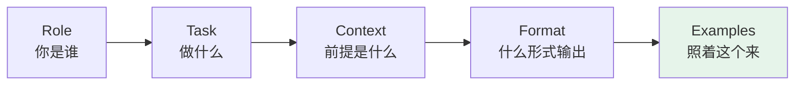
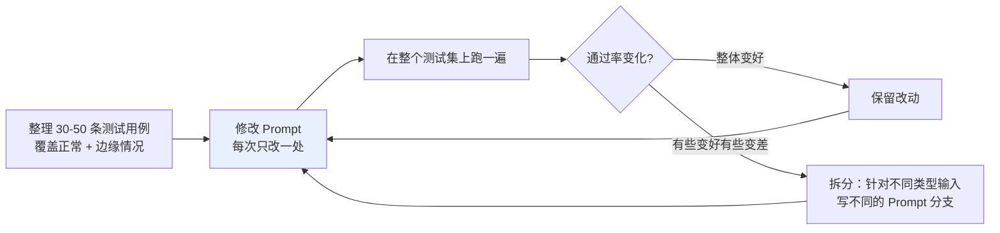

# 第十六章：Prompt 工程

## 16.1 为什么 Prompt 能决定效果的上限

同一个模型、同一个任务，好 Prompt 和差 Prompt 的输出质量差距可以有一个数量级。

**原因很简单：模型没有读心术，它只能根据你给的信息推断你想要什么。你的 Prompt 越模糊，模型的理解空间就越大，输出就越随机。**

### 16.1.1 新手最常见的三个问题

| 问题 | 表现 |
|---|---|
| **指令不清晰** | 「帮我写一篇文章」 vs 「写一篇面向高中生的 800 字科普文章，解释黑洞是如何形成的」 |
| **缺少关键上下文** | 模型不知道你是什么行业、你的用户是谁 |
| **没有格式约束** | 模型自由发挥格式，导致下游解析出错 |

> **Prompt 写不好通常不是因为太短，而是因为「模糊」。**

这三类问题正好对应下面的五个要素。

## 16.2 五要素拆解



### 16.2.1 Role：角色设定

设定角色能让模型采用对应的知识框架和表达风格。**角色越具体，人设越稳定，专业程度越高。**

❌ **差**：

```
你是一个助手，帮我分析这段代码。
```

✅ **好**：

```
你是一位有 10 年经验的 Python 后端工程师，专注代码 Review 和性能优化，
熟悉常见的安全漏洞。
回答时直接指出问题，解释原因，给出具体的修改方案。
```

**区别**：第一版只说「助手」，什么背景都没有，模型只能泛泛而谈。第二版明确了专业方向、经验年限、关注点，输出深度和针对性明显提升。

### 16.2.2 Task：任务描述

用**清晰的动词**把任务边界说明白。**复杂任务要拆成子步骤，不要让模型一步做完所有事。**

❌ **差**：

```
帮我写一篇文章。
```

✅ **好**：

```
写一篇面向高中生的 800 字科普文章，主题是「为什么黑洞会弯曲时空」。
用日常生活类比帮助读者理解，避免数学公式，结尾给一个思考题。
```

「帮我写一篇文章」给了模型太多自由度——写什么风格？多长？给谁看？好的写法把**受众、字数、主题、风格、结构**都点清楚。

### 16.2.3 Context：背景信息

模型不了解你的业务场景，**关键背景要主动塞进 Prompt**。

❌ **差**：

```
把这段话翻译成英文。
```

✅ **好**：

```
这是一份面向海外投资者的商业计划书摘要，需要翻译成英文。
要求：使用正式商务英语，保留所有专业术语，不要口语化，保持原文段落结构。

[原文内容]
```

第一版没交代用途，翻出来可能是很日常的英文。第二版给了**受众 + 用途 + 具体要求**，输出质量本质不同。

### 16.2.4 Format：输出格式

**很多人忽略但最影响实用性**，尤其当输出要被程序解析时。

❌ **差**：

```
分析这条用户评论的情感。
```

✅ **好**：

```
分析以下用户评论，以 JSON 格式输出，包含以下字段：
- "summary"：20 字以内的评论概述
- "sentiment"：正面 / 中性 / 负面 三选一
- "keywords"：最多 3 个关键词的列表

[用户评论]
```

没有格式约束时，模型可能输出一大段叙述性文字，**程序根本没法解析**。

### 16.2.5 Examples：Few-shot 示例

**提升效果最明显的技巧之一。**

与其花很多时间描述你想要什么风格，**不如直接给 1–3 个输入/输出的例子**，模型会自动对齐你的期望。

对于格式复杂或风格特殊的任务，Few-shot 几乎是必备的。比如让模型生成特定格式的 SQL 注释——**模型看懂范例比看懂一大段描述要快得多，也准确得多**。

## 16.3 端到端改造示例

场景：给一篇技术博客生成摘要。

### 16.3.1 第一版（差）

```
帮我总结一下这篇文章。

{文章内容}
```

**问题**：没有角色（什么视角？）、没有字数限制、没有受众定义、没有格式要求。**结果就是每次输出都不稳定。**

### 16.3.2 第二版（加了 Role + Task）

```
你是一位技术文档编辑。

请总结以下文章，提炼核心观点。

{文章内容}
```

有进步，但「提炼核心观点」还是太模糊——输出多长？格式是什么？给谁看？

### 16.3.3 第三版（完整）

```
你是一位技术内容编辑，负责为工程师受众提炼文章精华。

## 任务
对以下技术博客进行摘要提炼。

## 要求
- 摘要总长度：100-150 字
- 受众：有 2-3 年经验的后端工程师，熟悉基础概念，不需要解释入门知识
- 输出格式：
  - **一句话结论**：20 字以内，直接说文章最核心的观点
  - **要点列表**：3 条，每条不超过 30 字
  - **适合人群**：一句话说明哪类读者最该看这篇文章

## 文章内容
{文章内容}
```

五要素补全后，**交给不同模型、在不同时间执行，输出格式和质量都会高度稳定**。

> 五要素补全后，同一类任务换模型、换时间再跑，输出也更容易保持在可用范围，后续迭代时还能明确知道该改哪一项约束。

## 16.4 三个进阶技巧

### 16.4.1 CoT 触发词

在 Prompt 末尾加「请先分步分析，再给出结论」，往往能提升逻辑推理和计算类任务的准确率（详见 [第十七章](17-cot.md)）。

> **但不建议默认把完整推理链原样展示给最终用户**：一方面多花 token，另一方面完整思考链里可能有不稳定或不该暴露的内容。
>
> 更常见的做法是让模型内部先分析，最终只输出简洁依据、关键步骤或可核查的结论。

### 16.4.2 XML 标签包裹内容

当 Prompt 包含多个部分时，用 XML 标签明确区分，模型理解更准确。**这是 Anthropic 特别推荐的做法**：

```xml
<document>
{这里是要分析的文档内容}
</document>

<task>
根据上面的文档，提取所有提到的日期和对应事件，以表格形式输出。
</task>
```

### 16.4.3 「先思考后回答」的结构

对需要多步推理的任务效果很好。**内部链路里让模型先分析、再把最终答案单独放出来**；对外展示时给「简要理由」或「检查清单」，而不是完整的隐式推理过程。

## 16.5 迭代方法论：Prompt 是工程问题

**Prompt 工程更像「提出假设 → 测试 → 优化」的循环，不是一次写完就完事。**



> **「每次只改一处」是硬性原则**——否则无法判断是哪个改动起了作用，多个变量互相干扰。

## 16.6 进阶：Prompt 压缩

### 16.6.1 为什么要压

| 原因 | 说明 |
|---|---|
| **贵** | token 费用直接和长度成正比 |
| **慢** | 每多 1000 token，首 token 延迟可能多几十毫秒 |

而你写好的 Prompt 里其实有大量冗余：「请你认真仔细地一步一步分析这个问题」可以压成「认真分步分析」；20 个 Few-shot 里很多重复模式挑几个代表就够；反复强调「不要做 X」的句子也是浪费。

### 16.6.2 两类方案

| 方案 | 机制 | 成熟度 |
|---|---|---|
| **LLMLingua**（微软） | 用一个小模型评估每个 token 的信息含量，删掉信息量低的 token。5000 token 可压到 1000，效果损失约 1–3% | **当前最主流的工程方案**，HuggingFace 有现成实现 |
| **Soft Prompt / Embedding 表示** | 把整段 Prompt（特别是 Few-shot）编码成固定长度的 embedding 向量，模型直接读向量而非 token 序列 | 需要模型支持软 Prompt 输入，**还在研究阶段** |

### 16.6.3 适合的两类场景

- **长上下文 RAG**：检索到的文档很长，压一压能省大量 token 成本；
- **大量 Few-shot 示例**：示例池 50+ 个时，压缩对延迟改善特别明显。

> **压缩对效果有损失，压得越狠损失越大。** 要在自己的测试集上评测，找到「压到多少 token 效果还能接受」的甜蜜点。

## 16.7 常见错误

### 16.7.1 认为「Prompt 写长一点就行」

问题不是短，是**模糊**。缺角色、任务边界、上下文、格式约束才是真正的原因。

### 16.7.2 忽略 Format 约束

输出要被程序解析时，没有 JSON/结构约束几乎必然导致下游解析失败。

### 16.7.3 用大段文字描述格式而不给示例

**Few-shot 比纯描述有效得多**，尤其是格式复杂或风格特殊的任务。

### 16.7.4 把完整推理链直接展示给用户

多花 token 且可能暴露不稳定内容。**只展示简要依据或可核查结论。**

### 16.7.5 一次改多处 Prompt

无法归因是哪个改动起作用。**每次只改一处。**

### 16.7.6 没有测试集，靠「感觉变好了」判断

这是最典型的非工程化做法。**要建 30–50 条覆盖正常和边缘情况的用例，每次改动全跑一遍看通过率。**

### 16.7.7 把 Prompt 压缩当成无损优化

有损失，且压得越狠越明显，必须在自己的测试集上找甜蜜点。

## 16.8 本章总结

1. **Prompt 好坏能带来一个数量级的质量差距**，因为模型只能靠你给的信息推断意图；
2. **新手的问题不是写太短，是模糊**：指令不清、缺上下文、无格式约束；
3. **五要素**：Role（角色越具体人设越稳）、Task（清晰动词 + 边界，复杂任务拆步骤）、Context（主动塞入业务背景）、Format（程序解析场景必须强约束）、Examples（Few-shot 比描述有效得多）；
4. **改造是渐进的**：加角色 → 加任务边界 → 补全受众、格式、长度，每加一层约束效果跳一个台阶；
5. **CoT 触发词有效，但完整推理链不该原样展示给用户**；
6. **XML 标签包裹多段内容**能让模型更准确地理解结构，Anthropic 特别推荐；
7. **Prompt 是工程问题**：建测试集、每次只改一处、跑全集看通过率、必要时拆分支；
8. **Prompt 压缩解决长 Prompt 的成本和延迟**，LLMLingua 是主流方案，Soft Prompt 还在研究阶段；
9. **压缩有损**，要在自己的测试集上找平衡点。

> 写 Prompt 不是堆辞藻，而是把角色、上下文、格式和示例交代清楚，再用测试集验证这些约束能不能稳定产出想要的结果。

## 参考资料

- [Language Models are Few-Shot Learners（GPT-3，Few-shot）](https://arxiv.org/abs/2005.14165)
- [Chain-of-Thought Prompting Elicits Reasoning in Large Language Models](https://arxiv.org/abs/2201.11903)
- [Large Language Models are Zero-Shot Reasoners（Let's think step by step）](https://arxiv.org/abs/2205.11916)
- [LLMLingua: Compressing Prompts for Accelerated Inference of Large Language Models](https://arxiv.org/abs/2310.05736)
- [LongLLMLingua: Accelerating and Enhancing LLMs in Long Context Scenarios via Prompt Compression](https://arxiv.org/abs/2310.06839)
- [The Power of Scale for Parameter-Efficient Prompt Tuning（Soft Prompt）](https://arxiv.org/abs/2104.08691)
- [Anthropic: Use XML tags to structure your prompts](https://docs.anthropic.com/en/docs/build-with-claude/prompt-engineering/use-xml-tags)
- [OpenAI: Prompt engineering guide](https://platform.openai.com/docs/guides/prompt-engineering)
