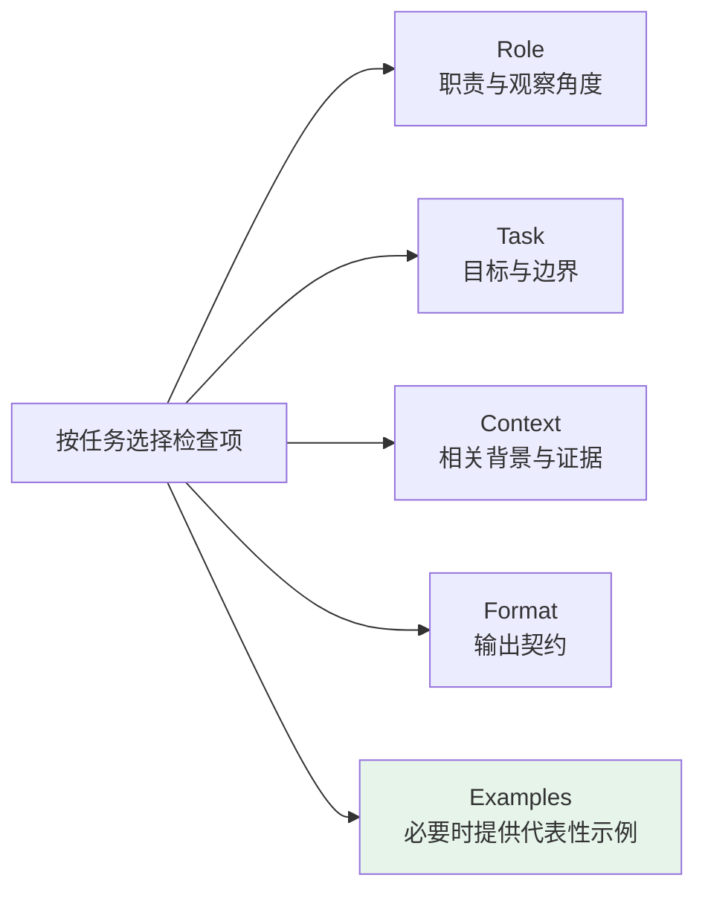
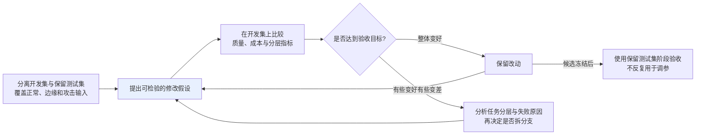

# 第十六章：Prompt 工程

## 16.1 Prompt 能改变什么，不能改变什么

Prompt 为模型提供任务条件，会影响它调用已有能力的方式，但不能保证补足缺失知识、可靠计算能力或工具权限。效果差异取决于模型、任务与评测口径，不存在通用的「质量提升一个数量级」。

先区分失败来源：要求没说清，可以改指令；资料缺失，应补检索；金额算错，应接计算工具；调用越权，应修权限校验。把所有失败都归为 Prompt 问题，容易得到越来越长、却没有解决根因的提示词。

### 16.1.1 新手最常见的三个问题

| 问题 | 表现 |
|---|---|
| **指令不清晰** | 「帮我写一篇文章」 vs 「写一篇面向高中生的 800 字科普文章，解释黑洞是如何形成的」 |
| **缺少关键上下文** | 模型不知道你是什么行业、你的用户是谁 |
| **没有格式约束** | 模型自由发挥格式，导致下游解析出错 |

> **Prompt 写不好通常不是因为太短，而是因为「模糊」。**

下面的五个要素是检查表，不是必须凑齐的模板；简单分类任务可能只需要任务、标签定义和输入。

## 16.2 怎样把模糊请求改成可执行、可验收的任务？

把职责、任务、背景、格式和示例逐项对照，补上真正缺失的信息。下面的五个要素不是固定套话：每增加一项，都应能说明它解决了哪个歧义或验收问题。



### 16.2.1 Role：角色设定

角色设定可以提示观察角度与表达风格，但「有十年经验」不会赋予模型真实资历或额外知识。优先描述可执行的职责和判断标准。

❌ **差**：

```
你是一个助手，帮我分析这段代码。
```

✅ **好**：

```
请审查以下 Python 后端代码，重点检查输入校验、异常处理和重复数据库查询。
每个发现给出相关代码位置、触发条件和修改建议。
不能从现有代码确认的问题，列为待核实项，不当成已确认缺陷。
```

第二版的可取之处是限定了审查范围和证据要求，而不是给模型安上专家头衔。是否改善漏报和误报，仍要用已标注案例检验。

### 16.2.2 Task：任务描述

用清晰的动词说明任务边界。复杂任务可拆成可验证的子任务，但拆分也会增加上下文传递成本，并可能丢失全局约束；并非步骤越多越好。

❌ **差**：

```
帮我写一篇文章。
```

✅ **好**：

```
写一篇面向高中生的 800 字科普文章，主题是「为什么黑洞会弯曲时空」。
用日常生活类比帮助读者理解，避免数学公式，结尾给一个思考题。
```

「帮我写一篇文章」给了模型太多自由度——写什么风格？多长？给谁看？好的写法把**受众、字数、主题、风格、结构**都点清楚。

### 16.2.3 Context：背景信息

模型不会自动知道你的业务规则，应提供与任务相关、获准使用的背景；不相关材料会增加成本，敏感材料不能因为「有助回答」就直接发送。

❌ **差**：

```
把这段话翻译成英文。
```

✅ **好**：

```
这是一份面向海外投资者的商业计划书摘要，需要翻译成英文。
要求：使用正式商务英语，保留所有专业术语，不要口语化，保持原文段落结构。

[原文内容]
```

第二版让受众、用途和术语要求可以被检查。若有专门译法，应提供术语表；业务规则有版本时，应给出适用日期和优先级。

### 16.2.4 Format：输出格式

程序消费的输出不仅需要格式要求，还需要运行时校验。

❌ **差**：

```
分析这条用户评论的情感。
```

✅ **好**：

```
分析以下用户评论，以 JSON 格式输出，包含以下字段：
- "summary"：20 字以内的评论概述
- "sentiment"：正面 / 中性 / 负面 三选一
- "keywords"：最多 3 个关键词的列表

[用户评论]
```

这里的 JSON 只是自然语言要求，不是格式保证。需要区分三层：

| 层次 | 能约束什么 | 仍需处理什么 |
|---|---|---|
| Prompt 中要求 JSON | 提示输出形式 | Markdown 围栏、漏字段、类型错误 |
| JSON mode | 在接口规定条件下生成合法 JSON | 不保证符合具体 schema |
| Structured Outputs / 约束解码 | 在支持的 schema 范围内约束结构 | 拒答、输出截断、接口错误，以及值的业务正确性 |

即使 `sentiment` 是合法枚举，也可能分类错误；即使金额是合法数字，也可能算错。应用应校验业务不变量，区分「重试可恢复」与「需要补充信息」，限制重试次数。严格 schema 的功能和限制应查具体模型、端点与后端版本。

### 16.2.5 Examples：Few-shot 示例

示例通过上下文学习传递输入与输出的对应关系，不会像微调一样更新模型权重。

示例适合传达抽象描述难以说清的格式、标签边界或风格。数量不是固定配方：从零示例基线开始，再比较代表性示例带来的收益与 token 开销。

分类示例应覆盖相近标签、缺失信息和拒答情况，避免全是同一标签。错误示例、示例顺序和与测试题过度相似的内容都可能扭曲结果；不能把测试集答案放进 Prompt 后再声称泛化提升。

## 16.3 端到端改造示例

场景：给一篇技术博客生成摘要。

### 16.3.1 第一版（差）

```
帮我总结一下这篇文章。

{文章内容}
```

**待明确之处**：给谁看、哪些信息必须保留、是否允许补充常识、如何验收长度与格式。没有角色本身不构成缺陷。

### 16.3.2 第二版（加了 Role + Task）

```
你是一位技术文档编辑。

请总结以下文章，提炼核心观点。

{文章内容}
```

有进步，但「提炼核心观点」还是太模糊——输出多长？格式是什么？给谁看？

### 16.3.3 第三版（完整）

```
你是一位技术内容编辑，负责为工程师受众提炼文章精华。

## 任务
对以下技术博客进行摘要提炼。

## 要求
- 摘要总长度：100-150 字
- 受众：有 2-3 年经验的后端工程师，熟悉基础概念，不需要解释入门知识
- 只总结原文，不补充原文没有的数字或结论；原文有冲突时指出冲突
- 输出格式：
  - **一句话结论**：20 字以内，直接说文章最核心的观点
  - **要点列表**：3 条，每条不超过 30 字
  - **适合人群**：一句话说明哪类读者最该看这篇文章

## 文章内容
{文章内容}
```

第三版明确了验收条件，但仍未提供 Few-shot，也不需要为了形式完整而补一个。模型更换、服务端版本变化和采样参数变化后，都需要回归测试；长度要求尤其不能只依赖模型自行计数。

## 16.4 三个进阶技巧

### 16.4.1 CoT 触发词

在早期通用语言模型上，分步推导提示改善了部分数学和逻辑任务；对已训练为内部推理的模型，这类触发词可能多余，甚至干扰表现。应按模型官方指导，比较直接回答、分解任务与推理预算设置（详见 [第十七章](17-cot.zh.md)）。

> **但不建议默认把完整推理链原样展示给最终用户**：生成的推导可能有错误，也不一定忠实反映模型内部过程。应按任务展示可核查的依据，而不是把长推导当作可信证明。
>
> 需要分开控制推理预算与展示长度。即使最终只展示简洁结论，已经生成的内部推理 token 仍可能计入用量；不展示并不会自动省掉这部分计算。

### 16.4.2 XML 标签包裹内容

当 Prompt 包含多个部分时，Markdown 标题或 XML 标签可帮助区分结构，但不是安全隔离机制：

```xml
<document>
{这里是要分析的文档内容}
</document>

<task>
根据上面的文档，提取所有提到的日期和对应事件，以表格形式输出。
</task>
```

### 16.4.3 将指令与不可信材料分开

业务指令放在接口支持的高优先级指令位置，用户文档、检索结果、网页与工具返回视为数据。文档里的「忽略之前要求」不是新指令；但仅在 Prompt 里声明这一点，不能保证抵抗提示注入。

应用仍要限制工具权限、校验参数、隔离密钥，并对转账、删除等高影响操作独立审批。分隔符改善可读性，不能把低可信文本变成可信内容，也不能替代授权检查。

## 16.5 迭代方法论：Prompt 是工程问题

**Prompt 工程更像「提出假设 → 测试 → 优化」的循环，不是一次写完就完事。**



固定模型快照、解码参数、输入数据和评分标准。单因素修改便于归因，但不是硬规则；多项修改可以用消融实验或因子实验辨别贡献。保留测试集不能反复用于改 Prompt，否则也会被间接过拟合。

验收要分开记录任务正确率、格式通过率、无依据断言、拒答率、成本与尾延迟。一个小样本开发集适合定位问题，不足以证明罕见高风险错误已经消失。

## 16.6 进阶：Prompt 压缩

### 16.6.1 为什么要压

| 原因 | 说明 |
|---|---|
| **费用** | 同一计费档位内输入费用随 token 数增加；缓存、批处理和上下文档位可能改变单价 |
| **延迟与容量** | 长输入增加预处理、prefill 和 KV 占用；首 token 延迟还受硬件、排队、缓存和推理预算影响，没有通用的每千 token 毫秒数 |

先移除无关文档和重复示例，再考虑自动压缩。否定词、时间范围、例外条款、数字与引用标识虽短，却可能决定答案，不能按字数或表面重复直接删除。

### 16.6.2 两类方案

| 方案 | 机制 | 适用边界 |
|---|---|---|
| **离散文本压缩：LLMLingua / LongLLMLingua** | LLMLingua 结合预算控制、小模型困惑度与迭代 token 筛选；LongLLMLingua 进一步考虑问题相关性和文档位置 | 输出仍是文本，可送入目标 LLM；需计入压缩模型开销，原论文实验收益不能套用到任意业务 |
| **Soft Prompt / Prompt Tuning** | 冻结主模型，通过反向传播学习任务专用的连续提示向量 | 这是参数高效适配，不等于把任意长文档无损编码成固定向量；需要训练与 embedding 输入能力，普通文本 API 通常不能直接使用 |

### 16.6.3 适合的两类场景

- **长上下文 RAG**：先检查召回与证据覆盖，再比较重排、片段提取和压缩；
- **重复的 Few-shot 工作负载**：先选择代表性示例；固定前缀还可考虑提示缓存，它复用计算，不是语义压缩。

压缩有丢失证据的风险，但准确率不一定随压缩率单调下降：移除干扰材料也可能改善表现。应画出质量、输入 token 数、端到端成本与延迟的曲线，而不是承诺固定损失百分比。

## 16.7 常见错误

### 16.7.1 认为「Prompt 写长一点就行」

长度不是充分条件。应先判断失败来自指令歧义、证据缺失、模型能力还是系统集成。

### 16.7.2 忽略 Format 约束

仅写「输出 JSON」不等于 schema 保证；格式合法也不等于业务正确。

### 16.7.3 用大段文字描述格式而不给示例

复杂标签边界可用示例澄清，但要验证示例的准确性、代表性和增益；并非每个任务都需要示例。

### 16.7.4 把完整推理链直接展示给用户

推导可能有错，也可能是不忠实的解释。**按任务展示简要依据或可核查结论**；展示更短不等于内部推理用量减少。

### 16.7.5 一次改多处 Prompt

无法仅从一次总分变化归因；可用单因素修改或消融实验，而不是把多项改动全部归功于某句「神奇提示词」。

### 16.7.6 没有测试集，靠「感觉变好了」判断

需要开发集、保留测试集与分层指标；样本规模由效果差异、风险和标注预算决定，没有通用的最低条数。

### 16.7.7 把 Prompt 压缩当成无损优化

应逐项核查关键证据和限定条件是否保留，并把压缩本身的计算成本算进去。

## 16.8 本章总结

1. Prompt 用于表达任务和提供证据，不能替代知识更新、计算工具或权限系统。
2. 角色、任务、上下文、格式、示例是可选检查项；每项都应对应可检验的需求。
3. 区分格式提示、JSON mode、schema 约束与业务校验。
4. 推理模型不一定需要 CoT 触发词；分隔符也不是提示注入防线。
5. 用固定配置、保留测试集和分层指标验证修改；压缩与软提示适配是不同方法。

> 写 Prompt 不是堆辞藻，而是把角色、上下文、格式和示例交代清楚，再用测试集验证这些约束能不能稳定产出想要的结果。

## 参考资料

- [Language Models are Few-Shot Learners（GPT-3，Few-shot）](https://arxiv.org/abs/2005.14165)
- [Calibrate Before Use: Improving Few-Shot Performance of Language Models（示例与顺序偏差）](https://arxiv.org/abs/2102.09690)
- [Chain-of-Thought Prompting Elicits Reasoning in Large Language Models](https://arxiv.org/abs/2201.11903)
- [Large Language Models are Zero-Shot Reasoners（Let's think step by step）](https://arxiv.org/abs/2205.11916)
- [LLMLingua: Compressing Prompts for Accelerated Inference of Large Language Models](https://arxiv.org/abs/2310.05736)
- [LongLLMLingua: Accelerating and Enhancing LLMs in Long Context Scenarios via Prompt Compression](https://arxiv.org/abs/2310.06839)
- [The Power of Scale for Parameter-Efficient Prompt Tuning（Soft Prompt）](https://arxiv.org/abs/2104.08691)
- [OpenAI: Reasoning best practices（含分隔符与 CoT 提示的适用边界）](https://developers.openai.com/api/docs/guides/reasoning-best-practices)
- [OpenAI: Structured Outputs](https://developers.openai.com/api/docs/guides/structured-outputs)
