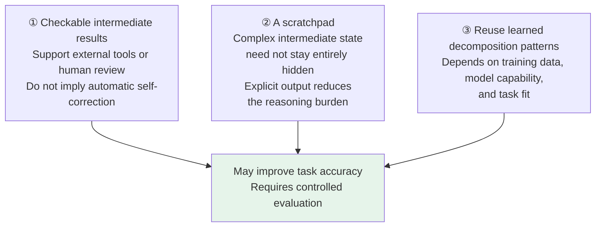
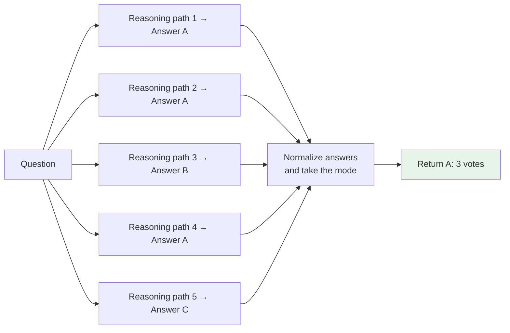

# Chapter 17: Chain of Thought

## 17.1 What does a model do without CoT?

A direct answer usually means that the model does not explicitly generate intermediate reasoning—not that it performs no internal computation or reasoning. A short response alone does not show that the model is “guessing by intuition.” Some reasoning models also use reasoning tokens that are not shown directly to the user.

Chain-of-thought (CoT) prompting asks a model to generate intermediate steps before its final answer. The original research found benefits on arithmetic, commonsense, and symbolic reasoning tasks. Not every model or task benefits, however, and generating steps does not automatically check them.

### 17.1.1 A classic example

> 小明有 5 个苹果，他给了小红 2 个，然后又买了 3 个，最后还剩几个？

The original Chinese question asks: Xiaoming has 5 apples, gives Xiaohong 2, and buys another 3. How many does he have at the end?

This simple problem illustrates an output format; it is not a claim that a model would get a direct answer wrong:

```
小明初始 5 个
给出 2 个后剩 3 个
再买 3 个后变成 6 个
```

The steps say that Xiaoming starts with 5, has 3 after giving away 2, and reaches 6 after buying 3 more.

Each step can be checked arithmetically. **Checkable does not mean checked**: without a calculator, rule-based check, or human review, the text merely creates an opportunity for verification.

## 17.2 The core idea of CoT

CoT places intermediate results into the context for subsequent generation. This lets a multistep task explicitly maintain state and break down calculations before producing an answer.

When a task combines several known conditions, intermediate steps can retain calculated results for later reasoning. But a “complex problem” is not proof that its answer never appeared in training, nor a guarantee that step-by-step generation will solve it. Each step's basis and the final result still need checking.

### 17.2.1 How intermediate tokens affect the answer

The mechanism follows from a language model's token-by-token generation.

Within the context window available to an autoregressive model, later tokens can be conditioned on earlier intermediate steps. Extra generation provides readable and writable intermediate state and more opportunities for sequential computation. Yet having access to earlier text does not guarantee using it correctly. Context truncation, attention structure, and training also affect the actual dependencies.

Let `r` denote intermediate reasoning, `a` the answer, and `x` the question:

$$
p(a\mid x)=\sum_r p(r\mid x)p(a\mid x,r)
$$

This is a marginalization identity for the same process of generating reasoning followed by an answer. It does not say that the answer distribution must stay unchanged when a CoT prompt is added. A single chain explores only one path; it does not enumerate or sum over all possible reasoning. This also explains why intermediate steps can help computation while propagating mistaken premises.

### 17.2.2 An essential distinction

> **Having a model reason is not the same as showing the user its entire chain of thought.**

Some products and APIs separate internal reasoning from final output, returning a concise answer or a reasoning summary. A shorter final answer does not make internal reasoning tokens free, nor does it establish that the summary faithfully records all internal computation. Measure usage according to the interface's accounting, pricing, and reasoning-budget documentation.

## 17.3 Two forms of CoT

| | Method | What to validate | Cost |
|---|---|---|---|
| **Few-shot CoT** | Examples contain a question, step-by-step reasoning, and an answer | Whether examples are correct and task-relevant, and whether the model can reuse their reasoning patterns | Longer inputs and possible example bias |
| **Zero-shot CoT** | A step-by-step instruction elicits intermediate steps without examples | Success in the original research does not imply success on every modern model | Shorter inputs, but reasoning output still costs tokens |

### 17.3.1 Why zero-shot CoT was surprising

The 2022 zero-shot CoT study showed that “Let's think step by step” could improve results on the models and tasks it tested. The original method also included a step to extract the final answer from the generated reasoning. Its conclusion was not that a trigger phrase makes any model smarter.

For models already trained to reason, start with clear tasks and constraints, then test reasoning budgets. OpenAI's guidance for reasoning models explicitly says that asking them to “think step by step” may be unnecessary or even detrimental. Early prompting techniques should not become defaults for every model.

## 17.4 Why CoT can work

Intermediate steps provide an explicit workspace in which the model can reuse learned decomposition patterns through additional sequential computation. Benefits depend on the fit between the task and those computational patterns. External verification can use the steps, but it is not a built-in capability of CoT. The diagram separates these effects:



## 17.5 Self-consistency: aggregating answers across paths

**Method**: stochastically sample several reasoning paths for the same question, normalize their final answers, and select the most frequent answer. Sufficient path diversity is important, but higher temperature is not always better. Strictly speaking, the method takes the mode; the winning answer need not receive more than half the votes.

### 17.5.1 The intuition

Aggregation may help when several paths lead to the correct answer while errors are dispersed. However, samples from the same model share knowledge and biases. They can all misunderstand the question and repeatedly produce the same wrong answer. Agreement is a signal, not proof of truth.



### 17.5.2 Benefits and costs

| | |
|---|---|
| **Benefits** | The original paper reported improvements on several reasoning benchmarks, with gains varying by model, problem, and sampling budget; there is no universal 5–15% gain |
| **Costs** | Sampling `n` paths increases total generated tokens and verification overhead; sequential times accumulate, while parallel execution can reduce wall-clock latency but remains subject to rate limits, queuing, and slow tail requests |

See [Chapter 13](../03-inference-serving/13-temperature-top-p-top-k.md) for temperature sampling.

Before aggregation, handle equivalent answers such as `0.5` and `1/2`, units, invalid outputs, and ties. Direct string comparison is unsuitable for open-ended reports, code, or tasks with several valid answers. Unit tests, rule-based verification, or an explicit selector may be more appropriate; include the selector's errors in the final evaluation.

When a task has a reliable verifier, “generate candidates → verify → select” is a different method from majority voting. The former depends on verifiability; the latter depends on the answer distribution. Compare them under equal total budgets, not merely one request each.

## 17.6 Limitations of CoT

These limitations determine whether CoT belongs in a production workflow.

### 17.6.1 High token usage

Explicit steps and internal reasoning can both increase tokens, computation, and response time. The increase depends on the model, problem, and budget. Measure total usage, time to the first visible answer, and end-to-end tail latency rather than estimating every task with a fixed number of extra tokens.

### 17.6.2 Counterproductive on simple problems

For simple arithmetic or clearly defined classification, lengthy reasoning may add only overhead—or introduce irrelevant branches. Controlled experiments should determine whether to retain reasoning.

### 17.6.3 The reasoning chain can itself be wrong

If later steps depend on a mistaken premise, the error may propagate. A model may also happen to correct a mistake or ignore some steps. Fluent reasoning alone therefore does not establish a correct answer.

> **CoT can sometimes reduce errors caused by skipped steps, but it does not automatically correct false premises.** Once an earlier step is wrong, later steps may simply elaborate that error.

### 17.6.4 It cannot invent missing facts

Finding the price of a newly released product requires current official information, not a longer derivation based on an old price. CoT may help resolve ambiguity or synthesize evidence, but it does not replace retrieval or knowledge updates.

### 17.6.5 A correct explanation need not be faithful

*Measuring Faithfulness in Chain-of-Thought Reasoning* used interventions such as inserting mistakes and paraphrasing. It found that models' dependence on CoT varies by task and that they sometimes ignore the reasoning text. Distinguish:

- **Answer correctness**: does the final result satisfy the question?
- **Step validity**: is each written step valid?
- **Explanation faithfulness**: did those steps actually influence the process that generated the answer?

A correct answer accompanied by a plausible explanation does not, by itself, establish the latter two properties. Audits should prioritize replayable tool results, tests, and external evidence rather than treating a chain of thought as a complete execution log.

### 17.6.6 Where it applies

| Worth comparing step-by-step reasoning | Usually start with a simple baseline |
|---|---|
| Mathematics, logic, and code debugging | Simple question answering, clearly bounded classification and extraction |
| Multistep reasoning grounded in evidence | Factual recall and current-information queries |
| Situations requiring checkable intermediate conclusions | Highly latency-sensitive situations |

### 17.6.7 Who controls the reasoning budget?

To let a model spend more time thinking, first examine the controls it exposes. Reasoning budget is not a single shared parameter across all models:

| Control | Form | Meaning |
|---|---|---|
| Reasoning effort, such as OpenAI `reasoning.effort` | Discrete levels whose supported values depend on the model | Guides how much the model thinks; not an exact token cap |
| Manual numerical budget, such as Claude `thinking.budget_tokens` | A token count on models/interfaces supporting manual extended thinking | Sets a thinking budget, not the total output limit for the entire call |
| Budget forcing, from the s1 paper | Force thinking to end during decoding, or delay termination and append `Wait` | A post-training decoding intervention, not an ordinary effort level |

Claude's standard manual mode requires `budget_tokens` to be at least 1024 and smaller than `max_tokens`, leaving room for the answer. Do not apply that rule to every mode: Amazon Bedrock documentation explicitly states that the thinking budget can exceed `max_tokens` in supported interleaved-thinking tool-use modes. For other access paths, check the requirements for the relevant model and mode.

Some Claude models support adaptive thinking, in which the model decides how much to think, with adjustments through the effort options it supports. Consult the target model's documentation instead of transferring manual-budget parameters unchanged.

Budget and temperature are also different. Effort guides reasoning investment; temperature changes the sampling distribution over candidate tokens, and reasoning models may not allow temperature adjustments. Raising effort neither increases sampling diversity by definition nor guarantees a better answer. A simple problem may merely consume more tokens. Compare accuracy, usage, and latency on the same task set before raising the effort level.

Separate effort guidance from the overall output limit as well. In the OpenAI Responses API, `max_output_tokens` includes reasoning tokens, visible output, and non-visible formatting tokens; do not size it solely for the final answer. If this allowance is exhausted during reasoning, the response may contain no visible tokens, have status `incomplete`, and report `incomplete_details.reason` as `max_output_tokens`. Input and already generated reasoning tokens are still billed. Lowering effort is not the same as truncating reasoning halfway through.

## 17.7 Common mistakes

### 17.7.1 Being unable to explain why CoT works

Start with autoregressive conditional generation: explain how intermediate state enters the context for later generation, then explain why extra steps do not guarantee greater accuracy.

### 17.7.2 Assuming CoT eliminates reasoning errors

Intermediate steps can help computation, but mistaken premises may still propagate. Use calculators, tests, or evidence checks rather than simply asking the model to “think again.”

### 17.7.3 Adding CoT to every task indiscriminately

Establish a direct-answer baseline for each task, then compare budgets and benefits for tasks that genuinely need multistep processing.

### 17.7.4 Showing end users the entire chain of thought

Key evidence and verifiable steps are sufficient. Do not treat a generated explanation as a reliable record of the model's internal process.

### 17.7.5 Ignoring CoT's cost

Even a short final answer may incur internal reasoning, candidate-sampling, and verifier usage.

### 17.7.6 Describing self-consistency as a free improvement

The sample count is a budget parameter, not a fixed required number of calls. More total computation does not imply a strictly linear increase in parallel wall-clock latency.

### 17.7.7 Equating CoT with planning capability

CoT generates intermediate steps linearly. Planning also involves state, action constraints, search, and execution feedback. Explicit search can invoke CoT, but writing down a plan does not confer reliable planning. See [Agent Chapter 11](../../agent/02-reasoning-planning/11-llm-agent-planning.md) for structures such as ToT and GoT.

## 17.8 Summary

1. CoT lets intermediate steps participate in later generation, but direct answers also involve internal model computation.
2. Evaluate few-shot prompting, zero-shot prompting, and trained internal reasoning separately; there is no fixed ranking.
3. Self-consistency aggregates answers across paths. Correlated errors, multiple valid answers, and budget constraints determine its benefits.
4. Answer correctness, step validity, and explanation faithfulness are three separate questions, not interchangeable properties.
5. Ultimately, compare task success under equal budgets and verify key conclusions with tools and evidence.

> CoT does not create knowledge from nothing. Its value is in laying out intermediate reasoning so that later steps can use earlier results and people have an opportunity to check each step.

## References

- [Chain-of-Thought Prompting Elicits Reasoning in Large Language Models](https://arxiv.org/abs/2201.11903)
- [Large Language Models are Zero-Shot Reasoners (Let's think step by step)](https://arxiv.org/abs/2205.11916)
- [Self-Consistency Improves Chain of Thought Reasoning in Language Models](https://arxiv.org/abs/2203.11171)
- [Least-to-Most Prompting Enables Complex Reasoning in Large Language Models](https://arxiv.org/abs/2205.10625)
- [Tree of Thoughts: Deliberate Problem Solving with Large Language Models](https://arxiv.org/abs/2305.10601)
- [Towards Understanding Chain-of-Thought Prompting: An Empirical Study of What Matters](https://arxiv.org/abs/2212.10001)
- [Measuring Faithfulness in Chain-of-Thought Reasoning](https://arxiv.org/abs/2307.13702)
- [s1: Simple test-time scaling](https://arxiv.org/abs/2501.19393)
- [Do NOT Think That Much for 2+3=? On the Overthinking of o1-Like LLMs](https://arxiv.org/abs/2412.21187)
- [OpenAI: Reasoning best practices](https://developers.openai.com/api/docs/guides/reasoning-best-practices)
- [OpenAI: Reasoning models](https://developers.openai.com/api/docs/guides/reasoning)
- [Anthropic Python SDK: manual thinking configuration](https://github.com/anthropics/anthropic-sdk-python/blob/main/src/anthropic/types/thinking_config_enabled_param.py)
- [Amazon Bedrock: Extended thinking](https://docs.aws.amazon.com/bedrock/latest/userguide/claude-messages-extended-thinking.html) (covers Bedrock's manual-budget rules, the interleaved-thinking exception, and model differences; it does not imply identical behavior across every Claude access path)
