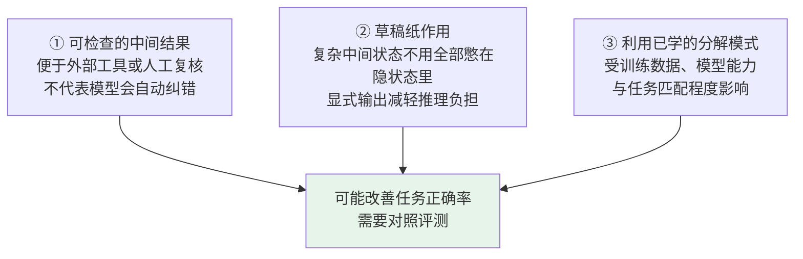
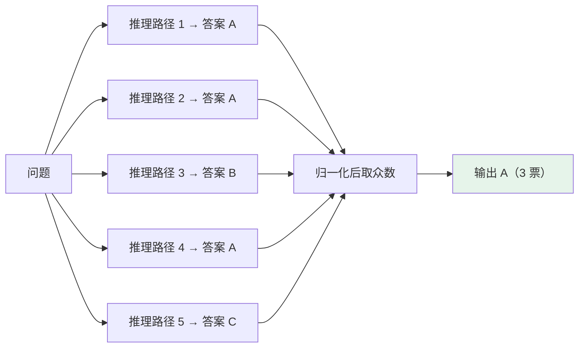

# 第十七章：CoT 思维链

## 17.1 没有 CoT 时模型在做什么

直接回答通常指不显式生成中间推导，而不是模型内部完全没有计算或推理。不能仅根据输出短，就判断它在「凭直觉猜答案」；有些推理模型还会使用不直接展示给用户的推理 token。

CoT（Chain-of-Thought）提示让模型在最终答案前生成中间步骤。原始研究在算术、常识和符号推理任务上观察到收益，但不是所有模型和任务都受益，也不等于自动检查每一步。

### 17.1.1 一个经典例子

> 小明有 5 个苹果，他给了小红 2 个，然后又买了 3 个，最后还剩几个？

用这道简单题说明输出形式，而不是声称模型直接回答就会出错：

```
小明初始 5 个
给出 2 个后剩 3 个
再买 3 个后变成 6 个
```

这里每一步可用算术核查。**可检查不等于已检查**：如果系统没有运行计算器、规则检查或人工复核，文本只是提供了检查机会。

## 17.2 CoT 的核心思路

CoT 将中间结果放入后续生成的上下文，使多步任务可以显式维护状态、分解计算，再生成答案。

对复杂问题，答案无法直接从训练数据里召回，但可以通过一步步推理得到——每一步都基于上一步的结论。

### 17.2.1 中间 token 怎样影响答案

原因在于语言模型本来就是逐 token 生成的。

在自回归模型可用的上下文窗口内，后续 token 可以条件于前面的中间步骤。额外生成提供了可读写的中间状态和更多顺序计算机会，但「看到前文」不保证正确利用前文；窗口裁剪、注意力结构和训练方式也会影响实际依赖。

若用 `r` 表示中间推导、`a` 表示答案、`x` 表示问题，可写成：

$$
p(a\mid x)=\sum_r p(r\mid x)p(a\mid x,r)
$$

单条 CoT 只探索其中一条路径，并没有真的枚举或求和所有推导。这也解释了为什么中间步骤既能帮助计算，也能传播错误前提。

### 17.2.2 一个必须区分的点

> **「让模型推理」和「把完整推理链展示给用户」不是一回事。**

部分产品和 API 将内部推理与最终输出分离，提供简洁答案或推理摘要。让最终答案更短不代表内部推理 token 免费，也不代表摘要忠实记录了全部内部计算；需按接口的用量、计费与推理预算说明测量。

## 17.3 两种 CoT 形式

| | 做法 | 需要验证的条件 | 代价 |
|---|---|---|---|
| **Few-shot CoT** | 示例包含问题、逐步推导和答案 | 示例是否正确、与任务匹配；模型能否复用推导模式 | 增加输入长度，可能引入示例偏差 |
| **Zero-shot CoT** | 不给示例，用分步推导指令引出中间步骤 | 原研究中有效不代表所有现代模型都有效 | 输入较短，但仍有推导输出成本 |

### 17.3.1 Zero-shot CoT 为什么令人惊讶

2022 年的 Zero-shot CoT 研究表明，一句「Let's think step by step」在其测试模型和任务上能改善结果；原方法还包括从生成推导中提取最终答案的步骤。这个结论不是「任意模型加触发词就更聪明」。

对已经接受推理训练的模型，应先使用清晰的任务与约束，再测试推理预算。OpenAI 的推理模型指导明确指出，要求「think step by step」可能不必要甚至干扰表现，不能把早期提示技巧当作所有模型的默认设置。

## 17.4 CoT 为什么有效



## 17.5 Self-Consistency：对多条路径聚合答案

**做法**：对同一个问题用随机采样生成多条推导，将最终答案归一化，再选出现频次最高的答案。需要足够的路径多样性，但不等于温度越高越好；严格说是取众数，获胜答案不一定超过半数。

### 17.5.1 直觉

如果正确答案能由多条路径得到，而错误比较分散，聚合可能改善结果。但同一模型的样本共享知识与偏差，完全可能一致地误解题意，反复得到同一个错误答案。一致性是信号，不是真实性的证明。



### 17.5.2 收益与代价

| | |
|---|---|
| **收益** | 原论文在多个推理基准上报告改善，幅度随模型、题目与采样预算变化；不存在通用的 5–15% 收益 |
| **代价** | 采样 `n` 条路径增加总生成 token 和验证开销；串行耗时会累加，并行可降低墙钟延迟，但受限流、排队和尾部慢请求影响 |

温度采样的机制见 [第十三章](../03-inference-serving/13-temperature-top-p-top-k.md)。

聚合前要处理 `0.5` 与 `1/2` 等等价答案、单位、非法输出和平票。开放式报告、代码或有多个有效答案的任务，不宜直接比较字符串；可改用单元测试、规则验证或明确的选择器，并把选择器误差算入最终效果。

若任务有可靠验证器，「生成多候选 → 验证 → 选择」与「多数投票」是不同方案。前者依赖可验证性，后者依赖答案分布；比较时应给相同总预算，而不是只比单次请求。

## 17.6 CoT 的局限

这些局限决定了 CoT 适不适合进生产链路。

### 17.6.1 token 消耗大

显式步骤和内部推理都可能增加 token、计算与响应时间，具体增量取决于模型、题目和预算。应测量总用量、首个可见答案的延迟与端到端尾延迟，而不是用固定额外 token 数估算所有任务。

### 17.6.2 对简单问题适得其反

对简单算术、明确分类等任务，长推导可能只增加开销，甚至引入无关分支。是否保留推理应由对照实验决定。

### 17.6.3 推理链本身也会出错

如果后续步骤依赖错误前提，错误可能沿链传播；模型也可能偶然纠正错误或忽略部分步骤。因此不能仅凭推导流畅，推断答案正确。

> **CoT 能减少跳跃性错误，但不会自动纠正错误前提。** 如果前面某一步已经错了，后面往往只是在把这个错误展开。

### 17.6.4 不能凭空补齐事实

例如查询一个新发布产品的价格，需要当前官方资料，而不是围绕旧价格写更长推导。CoT 可能帮助解析歧义或综合证据，但不替代检索和知识更新。

### 17.6.5 正确解释也不一定忠实

《Measuring Faithfulness in Chain-of-Thought Reasoning》通过插入错误、改写等干预发现，模型对 CoT 的依赖程度随任务而变，有时甚至忽略推导文本。由此要区分：

- **答案正确性**：最终结果是否满足题目；
- **步骤有效性**：写出的每一步是否成立；
- **解释忠实性**：这些步骤是否真的影响了模型生成答案的过程。

正确答案配上一段合理解释，不能单独证明后两者。审计应优先依靠可重放的工具结果、测试和外部证据，而不是把思维链当作完整运行日志。

### 17.6.6 适用边界

| 值得比较分步推导 | 通常先用简单基线 |
|---|---|
| 数学题、逻辑题、代码调试 | 简单问答、边界明确的分类与提取 |
| 有证据约束的多步推导 | 事实召回与当前信息查询 |
| 需要中间结论可核查的场景 | 对延迟极敏感的场景 |

## 17.7 常见错误

### 17.7.1 说不出 CoT 为什么有效的底层机制

可从自回归条件生成解释中间状态如何进入后续上下文，再说明为什么增加步骤不保证增加正确率。

### 17.7.2 认为 CoT 能消除推理错误

中间步骤可以辅助计算，但错误前提仍可能传播；需要计算器、测试或证据核查，不能只要求模型「再想一遍」。

### 17.7.3 无差别地对所有任务加 CoT

先按任务建立直接回答基线，对确实需要多步处理的任务再比较预算与收益。

### 17.7.4 把完整推理链直接展示给最终用户

展示关键依据和可核查步骤即可；不要把模型生成的解释当作可靠的内部过程记录。

### 17.7.5 忽略 CoT 的成本

即使最终回答很短，也要计入内部推理、候选采样和验证器的用量。

### 17.7.6 把 Self-Consistency 说成免费提升

样本数是预算参数，不是固定的调用次数；总计算量增加不等于并行墙钟延迟严格线性增加。

### 17.7.7 把 CoT 等同于「规划能力」

CoT 是线性生成中间步骤；规划还涉及状态、行动约束、搜索与执行反馈。显式搜索可以调用 CoT，但不是写出一段计划就具备可靠规划能力。ToT、GoT 等结构见 [Agent 主题第十一章](../../agent/02-reasoning-planning/11-llm-agent-planning.md)。

## 17.8 本章总结

1. CoT 使中间步骤参与后续生成，但直接回答也包含模型内部计算。
2. Few-shot、Zero-shot 与已训练的内部推理机制需要分别评测，没有固定的优劣排序。
3. Self-Consistency 聚合多条路径的答案；相关错误、多解任务和预算限制决定它的收益。
4. 答案正确、步骤有效与解释忠实是三个不同问题，不能相互替代。
5. 最终应比较相同预算下的任务成功率，并用工具和证据验证关键结论。

> CoT 的价值，不是凭空增加知识，而是把中间推导摊出来，让后续步骤能利用前文，也让人有机会检查每一步。

## 参考资料

- [Chain-of-Thought Prompting Elicits Reasoning in Large Language Models](https://arxiv.org/abs/2201.11903)
- [Large Language Models are Zero-Shot Reasoners（Let's think step by step）](https://arxiv.org/abs/2205.11916)
- [Self-Consistency Improves Chain of Thought Reasoning in Language Models](https://arxiv.org/abs/2203.11171)
- [Least-to-Most Prompting Enables Complex Reasoning in Large Language Models](https://arxiv.org/abs/2205.10625)
- [Tree of Thoughts: Deliberate Problem Solving with Large Language Models](https://arxiv.org/abs/2305.10601)
- [Towards Understanding Chain-of-Thought Prompting: An Empirical Study of What Matters](https://arxiv.org/abs/2212.10001)
- [Measuring Faithfulness in Chain-of-Thought Reasoning](https://arxiv.org/abs/2307.13702)
- [OpenAI: Reasoning best practices](https://developers.openai.com/api/docs/guides/reasoning-best-practices)
