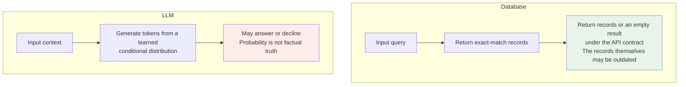
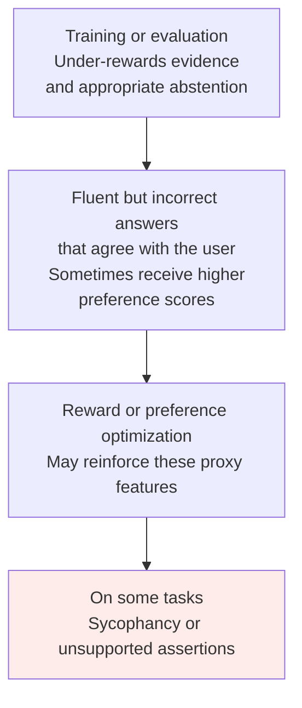
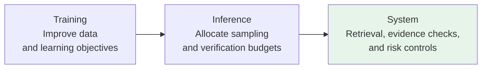

# Chapter 18: Hallucinations—Causes and Mitigation

## 18.1 What is a hallucination?

A hallucination usually means generated content that is unsupported by a supplied source or inconsistent with verifiable facts. Research does not use a single boundary for the term. Before evaluating, specify whether you are checking correctness against external facts or faithfulness to the input material.

These properties can diverge:

1. A summary faithfully restates an outdated report whose conclusions no longer match current facts.
2. An answer adds true general knowledge, but the task requires using only the supplied material, which does not support that addition.

Fluency can make an error more convincing, but it is not a necessary condition for hallucination. Appearing in training data does not make a statement true either. This chapter treats arithmetic and logical errors as separate reliability problems rather than calling every output error a hallucination.

### 18.1.1 Typical examples

- A book recommendation gives a plausible title and author, but that author never wrote the book.
- Asked to describe the events in a competition that never took place, the model confidently lists more than a dozen.
- A medical review cites “Smith et al., 2018,” but no such reference exists in PubMed.

## 18.2 Generation probability is not fact verification



Autoregressive generation has no built-in proof of external facts. Yet a model can learn to say “I don't know” or call tools, and an application can block generation when evidence is insufficient. “Predicts the next token” does not imply “always makes up an answer.”

Distinguish three stages: what the model knows, what the generation objective encourages, and which unverified conclusions the system allows to reach the user. Training data or sampling mechanisms alone cannot explain every failure.

## 18.3 Root cause one: errors in training data

Training data may come from web pages, books, code, or purpose-built collections; scale and composition vary by model. Common problems include:

- Outdated, incorrect, or vandalized encyclopedia versions.
- Rumors, false reporting, and biased accounts in news.
- Unverified inferences or common misconceptions in forums and blogs.
- **Conflicting sources**, such as different accounts of one event or different versions of the same data.
- **Stale information**, such as “the latest research” from ten years ago.

Pretraining optimizes text prediction; it does not verify every source. Models may learn to distinguish facts, but they do not store the entire corpus verbatim in their parameters, nor are they guaranteed to learn the correct account from conflicting material.

Even careful cleaning leaves limited coverage, finite model capacity, generalization error, and ambiguous questions that can produce unsupported answers. Cleaning the training set is not a sufficient solution.

## 18.4 Root cause two: generation continues text rather than querying records

The model must generate a specific answer from distributed representations. Predicting a common, plausible continuation is a different objective from proving a fact.

### 18.4.1 Uncertainty signals may exist without being calibrated

For the question “鲁迅是谁的笔名” (“Whose pen name is Lu Xun?”), a purely parametric answer usually does not query an explicit table of names. Instead, the context and model weights jointly determine the output distribution.

- Information frequency, context, conflicting sources, and training all affect the answer. Seeing a fact “once or twice” does not establish that the model must fail to retain it.
- Token probability measures the likelihood of a local continuation, not directly the probability that an entire factual claim is correct.
- A model's self-reported “90% confidence” also needs calibration on comparable tasks before it can be treated as a trustworthy probability.

### 18.4.2 A counterintuitive consequence: Temperature=0 can still hallucinate

In decoding implementations where zero temperature means greedy selection, Temperature=0 selects the highest-probability token. **Highest probability does not mean factual correctness.** Probabilities also depend on post-training, the current context, and constraints—not just training frequencies. Some reasoning interfaces do not accept a temperature setting; follow the actual API.

The following hypothetical distribution illustrates the mechanism. It is not a model measurement and does not represent the segmentation of a real tokenizer. The original Chinese character candidates are retained:

```
茅 35%  |  周 32%  |  鲁 18%  |  巴 15%
```

If these were the candidates and probabilities, greedy decoding would select `茅`. The point is that the highest local probability can still be wrong, not that the model experiences human-like confidence.

Lowering temperature changes the candidate distribution. It may reduce some errors or reproduce an error more consistently, but it is not fact-checking. Even at zero temperature, server-side model versions, batching, and numerical implementations can affect reproducibility.

### 18.4.3 Parametric knowledge versus retrieved knowledge

| | Parametric knowledge: LLM weights | Retrieved knowledge: RAG |
|---|---|---|
| **Accuracy** | May recall facts correctly, confuse them, or be outdated; accuracy is not determined solely by frequency | May retrieve irrelevant, outdated, or incorrect documents, and the generator may misread them |
| **Updates** | Usually requires training or another model-update method | Documents and indexes can be updated, but need version and permission management |
| **Verifiability** | External sources can verify answers, but output alone generally cannot identify the training source | Retrieved passages and versions can be retained to check whether claims are supported |
| **Insufficient evidence** | May answer, express uncertainty, or decline, depending on training and system policy | Top-k search may still return several weakly relevant results; evidence sufficiency needs a separate check |

RAG adds updatable, traceable evidence to generation; it does not completely replace parametric memory. A model may still prioritize internal knowledge, so assess both retrieval recall and answer faithfulness to the evidence.

## 18.5 Root cause three: side effects of alignment objectives

Alignment training can improve truthfulness and refusals, or amplify undesirable preferences, depending on examples, rewards, and evaluation. It is inaccurate to claim that SFT or RLHF necessarily increases hallucinations.



*Towards Understanding Sycophancy in Language Models* observed that humans and preference models sometimes prefer answers that agree with users' views even when those answers are wrong. This supports the existence of a risk—not the claim that cautious answers almost always score poorly, or that a particular optimization algorithm inevitably causes hallucinations.

### 18.5.1 Calibration and selective answering

*Language Models (Mostly) Know What They Know* studied `P(True)`, the probability that a candidate answer is correct, and `P(IK)`, the probability of knowing the answer independently of a specific candidate. Useful self-evaluation signals appeared in some settings, but calibration on new tasks remained difficult. The paper does not define a universal production workflow specifically named “Calibrated Refusal.”

Selective answering chooses thresholds on a validation set and abstains, asks for clarification, or hands off to a person when evidence or confidence is insufficient. Report both **answer coverage** and **error rate among answered questions**. Refusing everything produces few erroneous answers but little practical value. Track abstention due to insufficient knowledge separately from safety-policy refusals.

## 18.6 Distinguishing factuality, faithfulness, and other errors

| Type | Characteristic | Examples |
|---|---|---|
| **Factuality problem** | Conflicts with verifiable external facts | Fabricated papers; incorrect authors, dates, or places |
| **Faithfulness problem** | Contradicts the input or adds unsupported content | The source says “may grow,” but the summary says “has grown”; the document gives no price, yet the answer supplies one |
| **Reasoning, instruction-following, and safety errors** | Not necessarily the same kind of hallucination; require separate acceptance checks | Verify arithmetic with computation, missing fields with schema checks, and information leaks with authorization and information-flow controls |

## 18.7 Mitigation at three levels



### 18.7.1 Training level

| Approach | Explanation |
|---|---|
| **Improve training data** | Correct conflicting sources and stale information; include answerable cases, cases needing clarification, and cases with insufficient evidence to avoid blanket refusal |
| **Truthfulness and calibration objectives** | Use verified labels and distinguish correct answers, false assertions, and appropriate abstention; calibration still needs validation on the target distribution |
| **Filtering and preference training** | Build feedback from retrieval, rules, or human checks; a standard reward-model score is not itself proof of a fact |

These methods change model behavior but cannot guarantee the elimination of knowledge gaps. Cost, label quality, and distribution shifts all limit their benefits.

### 18.7.2 Inference level: without changing the model

| Approach | Target | Explanation |
|---|---|---|
| **Stepwise processing plus external verification** | Multistep reasoning or calculation | Intermediate results make tool checks easier; CoT text does not itself guarantee correctness or faithfulness; see [Chapter 17](17-cot.md) |
| **Adjust decoding parameters** | Some errors introduced by sampling | Compare temperature and truncation settings on task-specific data; there is no universal temperature range for factual question answering; see [Chapter 13](../03-inference-serving/13-temperature-top-p-top-k.md) |
| **Self-consistency** | Reasoning tasks whose answers can be aggregated | Aggregating paths may improve results, but correlated errors can also win many votes |
| **Constrained decoding** | Syntax and structure errors | Dynamically restrict valid tokens according to a grammar or schema; only supported structures are constrained, values are not guaranteed correct, and refusals and truncation still need handling |

These methods do not directly update parametric knowledge. If factual evidence is missing, add evidence before merely increasing the sample count.

### 18.7.3 System level: guardrails around a fallible component

| Approach | Explanation |
|---|---|
| **RAG** | Supply traceable evidence; separately assess whether retrieval covers the answer, whether the material is reliable, and whether generation is faithful; see the [RAG topic](../../rag/README.md) |
| **Tools and fact-checking** | Use calculators for numbers and authoritative business APIs for state; split text into atomic claims and check their evidence individually. A checking model may share the same errors, so switching to another LLM is not independent proof |
| **Binding citations to evidence** | Verify that the source exists, the passage can be located, the version applies, and the passage actually supports the claim; a valid citation number does not establish support |
| **Selective answering** | When evidence is insufficient, return the answerable part, ask for clarification, or hand off to a person instead of forcing a complete answer |

System measures add observability and control points, but also introduce retrieval noise, latency, access-control concerns, and prompt-injection risks. SelfCheckGPT's agreement across samples can serve as a screening signal. CoVe's independent verification questions can reduce the draft's influence on checking. Neither supplies external ground truth.

For example, a report claiming that a company's revenue grew 12% last year should be checked against the company entity, fiscal year, currency, growth definition, and relevant table, followed by recalculation. A genuine link to the same company's report for a different year does not make the claim verified.

## 18.8 Why zero errors cannot be promised for open-domain answers

Open-domain questions involve unknown facts, conflicting sources, changing information, and blind spots in evaluation. Finite tests cannot prove correctness for every future input. This is a question of the scope of a guarantee; probabilistic generation alone is not proof that every conceivable system must fail.

Restricted tasks can provide stronger guarantees: return only verified database records, supply checkable proofs of formal statements, or decline to produce unverifiable output. Such guarantees still depend on the database, verifier, and specification being correct. They cannot be extended to every natural-language fact.

### 18.8.1 Realistic engineering goals

| Goal | Explanation |
|---|---|
| **Measure and reduce risk** | Specify whether errors are counted per answer or per atomic claim; report the denominator, sample size, severity, and confidence intervals |
| **Retain verifiable evidence** | Check that citations support claims; uncalibrated confidence labels are not guarantees |
| **Limit high-impact actions** | In medical, legal, financial, and similar settings, set professional review and action permissions according to risk and applicable rules; human review itself also needs quality control |

> A more practical engineering goal is to reduce the hallucination rate, make it clear which content needs checking, and add human review in high-risk situations.

## 18.9 Common mistakes

### 18.9.1 Defining hallucination as any model error

Specify the criteria for factuality and source faithfulness first. Do not use fluency as the sole boundary or merge information leaks, format errors, and arithmetic errors into one metric.

### 18.9.2 Blaming only noisy training data

Also consider knowledge coverage, objectives, generalization, input evidence, and whether the system permits unsupported output.

### 18.9.3 Assuming Temperature=0 solves the problem

The most probable token need not be the correct one. If the highest-probability path is wrong, Temperature=0 may reproduce that error consistently.

### 18.9.4 Ignoring side effects of alignment training

Preference feedback can encourage sycophancy, but it can also reward truthfulness and appropriate abstention. Explain the relevant data and reward conditions instead of claiming that RLHF is inherently harmful.

### 18.9.5 Assuming RAG eliminates hallucinations

RAG may retrieve incorrect material, and the generator may contradict it. Check citation existence, citation support, and answer coverage separately.

### 18.9.6 Discussing mitigation at only one level

Choose measures based on the failure type. Teams using hosted APIs may improve only inference and system behavior; they need not train a model just to complete a three-level template.

### 18.9.7 Claiming a closed model uses a specific unpublished process

Do not infer undisclosed processes. Claims of “better refusal calibration” also require evaluations under comparable conditions; rephrasing speculation does not make it evidence.

### 18.9.8 Promising to eliminate hallucinations completely

Guarantees can be discussed after defining the task, output space, and verification conditions. A zero-error promise for all open-domain facts is unsupported.

## 18.10 Summary

1. Define the boundaries between factuality, source faithfulness, and other reliability errors.
2. Generation probability is not proof of a fact, but models may have uncertainty signals and can learn to abstain.
3. Data, learning objectives, and the system's evidence chain all affect hallucinations. Low temperature, RLHF, and RAG offer no unconditional conclusions.
4. Citations and self-checks require verification of evidential support. Agreement across samples does not establish truth.
5. Measure answer coverage, error rate, and severity together, and offer auditable guarantees within explicit task boundaries.

> When an answer is wrong, identify the unsupported claim and the point where evidence was lost before deciding whether to change the data, reasoning process, or system checks.

## References

- [On Faithfulness and Factuality in Abstractive Summarization](https://arxiv.org/abs/2005.00661)
- [Survey of Hallucination in Natural Language Generation](https://arxiv.org/abs/2202.03629)
- [A Survey on Hallucination in Large Language Models: Principles, Taxonomy, Challenges, and Open Questions](https://arxiv.org/abs/2311.05232)
- [Language Models (Mostly) Know What They Know](https://arxiv.org/abs/2207.05221)
- [TruthfulQA: Measuring How Models Mimic Human Falsehoods](https://arxiv.org/abs/2109.07958)
- [Retrieval-Augmented Generation for Knowledge-Intensive NLP Tasks](https://arxiv.org/abs/2005.11401)
- [SelfCheckGPT: Zero-Resource Black-Box Hallucination Detection for Generative Large Language Models](https://arxiv.org/abs/2303.08896)
- [Chain-of-Verification Reduces Hallucination in Large Language Models](https://arxiv.org/abs/2309.11495)
- [Constitutional AI: Harmlessness from AI Feedback](https://arxiv.org/abs/2212.08073)
- [Towards Understanding Sycophancy in Language Models](https://arxiv.org/abs/2310.13548)
- [OpenAI: Structured Outputs (structural guarantees versus content errors)](https://developers.openai.com/api/docs/guides/structured-outputs)
