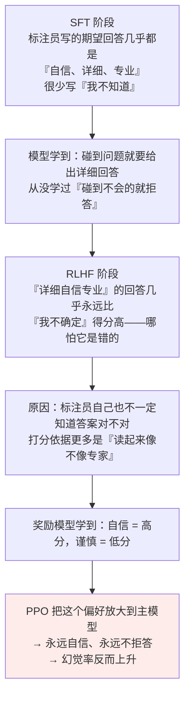

# 第十八章：幻觉的成因与缓解

## 18.1 幻觉到底是什么

**定义**：模型生成了与训练事实、用户输入或已知世界不一致的内容，**但语言上看起来很流畅合理**。

**两个关键特征缺一不可**：

1. **内容错**；
2. **听起来对**。

> 如果只是错但一眼看出来错（比如语法错乱），那是普通的生成质量问题，**不算幻觉**。幻觉特指那种「读起来很顺、引用看起来很专业、但仔细查证发现是编的」的输出。

### 18.1.1 几个典型例子

- 推荐一本书，给出书名和作者，听起来像那么回事，但那位作者从没写过这本书；
- 让模型解释某个从未举办过的赛事有哪些项目，模型一本正经列出十几项；
- 写医学综述时引用「Smith et al., 2018」，去 PubMed 查根本不存在。

## 18.2 元根源：模型不是数据库


> **模型从来没有「查询失败」这个状态，它永远会输出点什么——因为它的全部使命就是「续写」。**

模型会幻觉，先要从这里理解：它不会像数据库那样返回「查无此项」，只会继续往下生成。后面的三类成因，都是这个机制在不同环节的放大。

## 18.3 根因一：训练数据本身就有错

训练数据来自互联网语料 + 公开语料 + 书籍 + 代码仓库，TB 级别，里面什么都有：

- 百科里有过时的、错误的、被破坏的版本；
- 新闻里有谣言、虚假报道、带立场的扭曲叙述；
- 论坛博客里满是民科、阴谋论、错误常识；
- **不同来源互相矛盾**（同一事件的不同说法、同一数据的不同版本）；
- **时间过期的信息**（十年前的「最新研究」）。

模型在预训练时把这些全学进了参数里，**没有「真假区分」机制**。

> **但训练数据只是冰山一角——即使数据 100% 正确干净，模型还是会幻觉。**

## 18.4 根因二：生成机制是「续写」不是「查询」

最难处理的是这一层：生成过程不会先判断「知道/不知道」，只会继续选下一个 token。

### 18.4.1 模型对「自己知不知道」没有显式信号

你问「鲁迅是谁的笔名？」，模型的处理流程**不是**「查知识库 → 找到周树人 → 输出」，**而是**「在我的参数里，给定这个上下文，下一个 token 最高概率是什么？」

- 训练时见过很多次「鲁迅是周树人的笔名」→「周」的概率很高，答对；
- **训练时只见过 1–2 次** → 概率没那么高，模型会**按概率挑一个看起来合理的名字续上去**。

### 18.4.2 反直觉的推论：Temperature=0 也会幻觉

Temperature=0 等价于贪心解码，每步选概率最高的 token。**但「概率最高的 token」不等于「正确的 token」**，只是「按训练数据统计最可能出现在这个上下文之后的 token」。

如果模型对某个事实记忆模糊，分布可能是：

```
茅 35%  |  周 32%  |  鲁 18%  |  巴 15%
```

**Temperature=0 会铁定选「茅」，错得很自信。**

> **温度只能减少「同一个错误重复出现的随机性」，不能修正「错误本身」。** 模型记错了就是记错了——**温度调低反而让错误答案更稳定地输出**。

### 18.4.3 参数化知识 vs 检索式知识

| | 参数化知识（LLM 权重） | 检索式知识（RAG） |
|---|---|---|
| **精确度** | **模糊**——不是 key-value 存的，是分布式编码在权重里，记得多准取决于训练时见过多少次 | 精确，找到就是找到 |
| **可检索性** | **不可检索**——模型自己不知道某条知识在哪几个权重里 | 有明确出处 |
| **可验证性** | **不可验证**——输出事实时没法标注「这条来自训练数据的某段」 | 可追溯到具体文档 |
| **未命中** | 仍然会编一个出来 | **明确返回空** |

**这就是为什么 RAG 能显著缓解幻觉**——它把模糊的参数化记忆换成了精确的检索结果。

## 18.5 根因三：对齐目标的副作用

**更隐蔽的一层：对齐训练反而会鼓励模型「自信地回答」，加剧幻觉。**



### 18.5.1 Calibrated Refusal

Anthropic 的《Language Models (Mostly) Know What They Know》专门研究过这个问题，提出「**校准的拒答**」概念：**让模型的「自信度」和「实际正确率」对齐**——该说不知道的时候就说不知道。

> **注意措辞**：闭源模型的具体训练配方公开资料不会讲完。可以说「某类模型体现了更强的拒答校准倾向」，**不要断言某个产品一定就是某一套论文流程的直接结果**。

## 18.6 三类幻觉的典型表现

| 类型 | 特征 | 例子 |
|---|---|---|
| **① 事实性幻觉** | 编造不存在的事实，或张冠李戴。**最常见、最容易识破** | 编造不存在的人物 / 论文；时间错误；地理错误 |
| **② 推理性幻觉** | 事实层面没问题，但**推理过程错乱、前后矛盾、逻辑跳跃** | 数学题前面算对后面算错；代码里引用从未定义的变量；推理链断一步强行得结论 |
| **③ 上下文不一致** | **最隐蔽**。不违反客观事实，但**违反用户在 Prompt 里给的明确条件** | 用户说「只根据下面的资料回答」，模型答的却是自己脑袋里的知识；系统 Prompt 说不要泄露内部信息，模型还是复述了出来 |

## 18.7 缓解方案：三层组合


### 18.7.1 训练层

| 做法 | 说明 |
|---|---|
| **加入大量拒答样例** | 主动往 SFT 数据里塞「我不确定」「这个我没把握」「建议查专业资料」，**让模型学到拒答也是合格回答** |
| **校准训练** | 用专门的偏好数据，让「**错误且自信**」被严厉扣分，模型就会主动避免自信地说错话 |
| **用奖励模型筛掉幻觉回答** | 对生成的回答做事实核查，把有幻觉的标记为低分作为负样本 |

**优点是治本，代价是训练成本高、效果上限受训练数据质量限制。**

### 18.7.2 推理层（不改模型）

| 做法 | 针对 | 说明 |
|---|---|---|
| **CoT 分步分析** | 推理性幻觉 | 更不容易跳步，错的时候也更容易追溯（见 [第十七章](17-cot.md)）。**但不保证一定正确** |
| **Temperature 调低** | 随机偏差型幻觉 | 只能解决「模型本来知道但随机抽到了低概率错答案」。**事实性问答用 0–0.3 是工程标配**（见 [第十三章](../03-inference-serving/13-temperature-top-p-top-k.md)） |
| **Self-Consistency** | 推理性幻觉 | 采样 5–10 次多数投票。**提升幅度取决于模型、题目和采样次数，不要当成固定收益** |
| **约束解码** | 格式类幻觉 | 限制每步只能从合法 vocabulary 里选 token，**能根除「输出格式错误」这一类**。vLLM、TGI 都支持 |

**优点是即插即用，缺点是对「模型记忆模糊」这个根本问题没办法。**

### 18.7.3 系统层（把 LLM 当成会犯错的组件，外面加防护栏）

| 做法 | 说明 |
|---|---|
| **RAG** | **最有效的系统层方案之一**。把「靠模糊参数记忆」换成「靠可追溯的检索结果」。**但不是固定能降一个数量级**——效果取决于检索召回、文档质量、Rerank、Prompt 约束和引用校验（详见 [RAG 主题](../../rag/README.md)） |
| **后处理事实核查** | 输出后用另一个 LLM 或检索系统核查其中的事实声明，核查不过就标红或删掉 |
| **强制带引用来源** | 要求每条事实声明后跟引用编号，对应到检索返回的具体文档。**即使有幻觉，用户也能识别出来** |

**优点是最有效、可观测、可追溯；缺点是引入额外延迟和系统复杂度。对企业级应用几乎是必选项。**

## 18.8 为什么幻觉不可能完全消除

原因还是前面那条：LLM 按概率续写下一个 token，**这个机制天然就带着「会编」的可能性**。

无论怎么对齐、怎么 RAG、怎么核查，**只要模型还是按概率生成的，就一定有概率生成错误内容**。

### 18.8.1 现实的工程目标

| 目标 | 说明 |
|---|---|
| **降低发生率** | 从 30% 降到 5% 就是巨大的胜利 |
| **让用户能识别** | 带引用、加可信度标记、对不确定回答主动声明 |
| **限定使用场景** | 医疗、法律等高风险场景**必须有人类把关** |

> 工程上更实际的目标是：把幻觉率压低，让用户看得出哪些内容需要核查，并在高风险场景加人工复核。

## 18.9 常见错误

### 18.9.1 把幻觉说成「模型出错」

幻觉特指**流畅合理但实际错误**。语法错乱那是生成质量问题。

### 18.9.2 只说训练数据有噪声

那只是第一层。**即使数据 100% 干净，续写机制本身就会产生幻觉。**

### 18.9.3 认为把 Temperature 调到 0 就能解决

概率最高的 token 不等于正确的 token。**记忆模糊时，Temperature=0 只会让错误答案更稳定地输出。**

### 18.9.4 忽略对齐训练的副作用

RLHF 中「自信 = 高分、谨慎 = 低分」的偏好被放大，反而推高了幻觉率。**这是第三层根因，最能拉开差距。**

### 18.9.5 认为 RAG 能根除幻觉

RAG 显著缓解事实性幻觉，**但不是固定降一个数量级**，效果取决于召回、文档质量、Rerank 和引用校验，而且对上下文不一致型幻觉帮助有限。

### 18.9.6 只讲一层缓解方案

工业级应用是**训练层 + 推理层 + 系统层组合使用**，没有单一银弹。

### 18.9.7 断言某闭源模型用了某套具体流程

公开资料没写的保持谨慎，说「体现了更强的拒答校准倾向」就好。

### 18.9.8 承诺「能彻底消除幻觉」

这是概率生成机制的固有产物，只能降低发生率和提升可识别性。

## 18.10 本章总结

1. **幻觉 = 流畅合理 + 实际错误**，两个特征缺一不可；
2. **元根源是「模型不是数据库是续写器」**，它没有「查询失败」这个状态；
3. **根因一：训练数据有噪声、矛盾、过时信息**，模型没有真假区分机制；
4. **根因二：生成机制是按概率续写**，模型对「自己知不知道」没有显式信号——**所以 Temperature=0 也会幻觉**；
5. **参数化知识是模糊、不可检索、不可验证的**，这是 RAG 能缓解幻觉的根本原因；
6. **根因三：对齐训练的副作用**——SFT 数据缺拒答样例，RLHF 偏好「自信」，奖励模型学到「自信 = 高分」；
7. **三类幻觉**：事实性（最常见）、推理性（逻辑错乱）、上下文不一致（最隐蔽）；
8. **训练层**：拒答数据增强、校准训练、用 RM 筛幻觉——治本但贵；
9. **推理层**：CoT、低温、Self-Consistency、约束解码——即插即用但上限有限；
10. **系统层**：RAG、后处理事实核查、强制带引用——最有效但增加延迟和复杂度；
11. **幻觉不可能被彻底消除**，工程目标是降低发生率、让用户能识别、限定高风险场景。

> 幻觉不是一个补丁就能修掉的 bug，更像概率生成系统的长期噪声；工程上要做的是检索、校准和核查，把它控制在业务能承受的范围内。

## 参考资料

- [Survey of Hallucination in Natural Language Generation](https://arxiv.org/abs/2202.03629)
- [A Survey on Hallucination in Large Language Models: Principles, Taxonomy, Challenges, and Open Questions](https://arxiv.org/abs/2311.05232)
- [Language Models (Mostly) Know What They Know](https://arxiv.org/abs/2207.05221)
- [TruthfulQA: Measuring How Models Mimic Human Falsehoods](https://arxiv.org/abs/2109.07958)
- [Retrieval-Augmented Generation for Knowledge-Intensive NLP Tasks](https://arxiv.org/abs/2005.11401)
- [SelfCheckGPT: Zero-Resource Black-Box Hallucination Detection for Generative Large Language Models](https://arxiv.org/abs/2303.08896)
- [Chain-of-Verification Reduces Hallucination in Large Language Models](https://arxiv.org/abs/2309.11495)
- [Constitutional AI: Harmlessness from AI Feedback](https://arxiv.org/abs/2212.08073)
