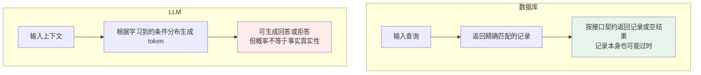
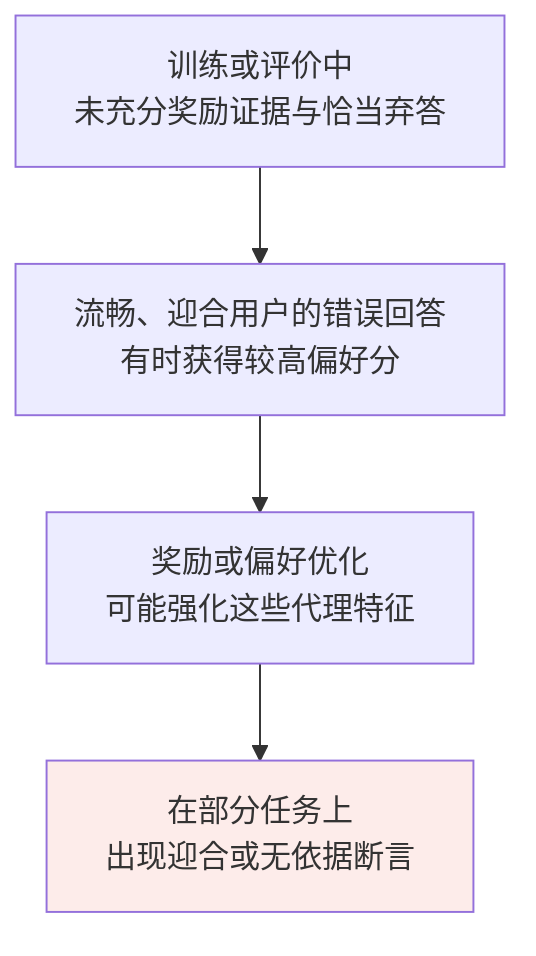

# 第十八章：幻觉的成因与缓解

## 18.1 幻觉到底是什么

幻觉通常指生成内容不受给定来源支持，或与可核实事实不符。不同研究对边界的划分不完全一致；评测前要明确是检查「对外部事实正确」，还是「忠实于输入材料」。

两者可能分离：

1. 摘要忠实转述了一份过时报告，但该报告的结论已不符合当前事实；
2. 回答补充了真实的常识，但任务要求「只根据给定资料」，资料并不支持这条补充。

语言流畅会增加误信风险，但不是判定幻觉的必要条件。「训练数据里写过」也不等于事实正确。本文将算术和逻辑错误单独列为可靠性问题，不把所有输出错误都统称为幻觉。

### 18.1.1 几个典型例子

- 推荐一本书，给出书名和作者，听起来像那么回事，但那位作者从没写过这本书；
- 让模型解释某个从未举办过的赛事有哪些项目，模型一本正经列出十几项；
- 写医学综述时引用「Smith et al., 2018」，去 PubMed 查根本不存在。

## 18.2 生成概率不是事实验证



自回归生成没有内置的外部事实证明；但模型可以学会输出「不知道」、调用工具，应用也可以在证据不足时阻止生成。不能由「预测下一个 token」推出「永远会编一个答案」。

需要区分三个环节：模型掌握了什么、生成目标鼓励什么、系统允许哪些未经验证的结论到达用户。单独解释训练数据或采样机制，都不足以覆盖所有失败。

## 18.3 根因一：训练数据本身就有错

训练数据可能来自网页、书籍、代码或专门采集的数据，具体规模与配方因模型而异。常见问题包括：

- 百科里有过时的、错误的、被破坏的版本；
- 新闻里有谣言、虚假报道、带立场的扭曲叙述；
- 论坛和博客可能包含未经验证的推断或常见误解；
- **不同来源互相矛盾**（同一事件的不同说法、同一数据的不同版本）；
- **时间过期的信息**（十年前的「最新研究」）。

预训练优化文本预测，不会逐条验证来源。模型也可能学到事实辨别能力，但没有把所有语料原样存入参数，更不保证从冲突材料中学到正确版本。

即使数据经过认真清洗，有限覆盖、有限模型容量、泛化误差和问题歧义仍会造成无依据回答。不能把「清洗训练集」当成充分解决方案。

## 18.4 根因二：生成机制是「续写」不是「查询」

模型需要从分布式表示中生成具体答案。预测一个常见、合理的续接，与证明某条事实成立是不同目标。

### 18.4.1 不确定性信号存在，但未必校准

问「鲁迅是谁的笔名」时，纯参数化回答通常不是在一个显式人名表里做数据库查询，而是由上下文与模型权重共同决定输出分布。

- 信息频次、语境、来源冲突和训练方式都会影响答案，不能用「出现一两次」推断必然记不住；
- token 概率衡量局部续接可能性，不直接等于整条事实正确的概率；
- 模型自报的「90% 把握」也要在同类任务上做校准，不能直接当可信概率。

### 18.4.2 反直觉的推论：Temperature=0 也会幻觉

在采用贪心语义的解码实现中，Temperature=0 取最高概率 token。**概率最高不等于事实正确**；概率还受后训练、当前上下文和约束影响，不只是训练词频。部分推理接口不接受温度设置，应以实际 API 为准。

下面是仅用于解释机制的假设分布，不是模型实测值，也不代表真实 tokenizer 的切分：

```
茅 35%  |  周 32%  |  鲁 18%  |  巴 15%
```

若候选与分布确实如此，贪心会选「茅」。这说明局部概率最大仍可出错，而不是证明模型有人的「自信」体验。

降低温度会改变候选分布，可能减少某些错误，也可能稳定复现错误，不是事实核查。即使温度为零，服务端模型版本、批处理和数值实现也可能影响可复现性。

### 18.4.3 参数化知识 vs 检索式知识

| | 参数化知识（LLM 权重） | 检索式知识（RAG） |
|---|---|---|
| **精确度** | 可以准确回忆，也可能混淆、过时；精度不是只由频次决定 | 可能召回无关、过时或错误文档，生成器也可能误读 |
| **更新方式** | 通常依赖训练或其他模型更新方法 | 可更新文档和索引，但需要版本与权限管理 |
| **可验证性** | 可用外部来源验证答案，但一般无法仅凭输出确定训练出处 | 可保存检索片段及版本，进一步验证声明是否被支持 |
| **证据不足** | 可以回答、表达不确定或拒答，取决于训练与系统策略 | Top-k 搜索仍可能返回若干低相关结果；需额外判定证据是否足够 |

RAG 为生成增加可更新、可追溯的证据，不是把参数记忆完全「换掉」。模型仍可能优先使用内部知识，因此要同时检查检索召回与回答对证据的忠实性。

## 18.5 根因三：对齐目标的副作用

对齐训练可以改善真实性与拒答，也可能放大不良偏好，取决于示例、奖励与评估方式。不能笼统地说 SFT 或 RLHF 必然使幻觉增加。



《Towards Understanding Sycophancy in Language Models》观察到，人类与偏好模型有时偏爱迎合用户观点的回答，即便回答错误。它支持「存在此风险」，并不支持「谨慎回答几乎永远得低分」或某种优化算法必然造成幻觉。

### 18.5.1 校准与选择性回答

《Language Models (Mostly) Know What They Know》研究了对候选答案正确性的 `P(True)`，以及不依赖特定候选的 `P(IK)`（知道答案的概率）。结果显示某些设置下存在有用的自评信号，但跨新任务的校准仍困难；它不是一个直接命名为「Calibrated Refusal」的通用生产流程。

选择性回答是在验证集上选定阈值，证据或置信不足时弃答、澄清或转人工。要同时报告**回答覆盖率**与**已回答部分的错误率**：全部拒答可以让错误输出很少，却没有实用价值。知识不足的弃答与安全政策拒答，也应分开统计。

## 18.6 区分事实、忠实性与其他错误

| 类型 | 特征 | 例子 |
|---|---|---|
| **事实性问题** | 与可核实的外部事实冲突 | 编造论文；错写作者、时间或地点 |
| **忠实性问题** | 与输入矛盾，或加入来源不支持的内容 | 原文说「可能增长」，摘要写成「已增长」；文档未提价格却补出数字 |
| **推理、指令与安全错误** | 不一定属于同一种幻觉，需要单独验收 | 算术错误用计算核查；字段缺失用 schema 检查；泄密用权限与信息流控制 |

## 18.7 缓解方案：三层组合


### 18.7.1 训练层

| 做法 | 说明 |
|---|---|
| **改进训练数据** | 修正来源冲突和过时信息；同时提供可回答、应澄清与证据不足的案例，防止一味拒答 |
| **真实性与校准目标** | 使用经核实的标签，区分正确回答、错误断言与恰当弃答；仍需在目标分布验证校准 |
| **筛选与偏好训练** | 以检索、规则或人工核查形成反馈；普通奖励模型分数本身不是事实证明 |

这些方法改变模型行为，但不能保证消除知识盲区；成本、标签质量与分布变化都会限制收益。

### 18.7.2 推理层（不改模型）

| 做法 | 针对 | 说明 |
|---|---|---|
| **分步处理 + 外部验证** | 多步推导或计算 | 中间结果便于工具核查；CoT 文本本身不保证正确或忠实（见 [第十七章](17-cot.zh.md)） |
| **解码参数调整** | 采样引入的部分错误 | 用业务集比较温度和截断参数；没有通用的事实问答温度区间（见 [第十三章](../03-inference-serving/13-temperature-top-p-top-k.zh.md)） |
| **Self-Consistency** | 有可聚合答案的推理任务 | 多路径聚合可能改善结果，但相关错误也会得到高票 |
| **约束解码** | 语法与结构错误 | 按语法或 schema 动态限制合法 token；只能约束支持范围内的结构，不能保证值正确，并需处理拒答和截断 |

这些做法不直接更新参数知识；若缺少事实依据，优先补充证据，而不是仅增加采样次数。

### 18.7.3 系统层（把 LLM 当成会犯错的组件，外面加防护栏）

| 做法 | 说明 |
|---|---|
| **RAG** | 提供可追溯证据；分别评估检索是否覆盖答案、材料是否可靠、生成是否忠实（详见 [RAG 主题](../../rag/README.zh.md)） |
| **工具与事实核查** | 数值用计算器、状态用权威业务 API；将文本拆成原子声明，逐条检查证据。核查模型可能共享同样的错误，不能只换一个 LLM 就视为独立证明 |
| **引用与证据绑定** | 校验来源存在、片段可定位、版本适用、片段确实支持声明；引用编号合法不等于内容被支持 |
| **选择性回答** | 找不到充分证据时给出可回答部分、请求澄清或转人工，避免强行补全 |

系统措施能增加可观测性和控制点，但也引入检索噪声、延迟、访问控制与提示注入风险。SelfCheckGPT 的多次采样一致性适合用作筛查信号；CoVe 的独立验证问题可减少草稿对核查的影响，但两者都不是外部事实真值。

例如报告声称「公司去年营收增长 12%」，应检查公司主体、财年、币种、增长口径和对应表格，再复算数字。如果只找到同公司另一个年度的文档，即使模型附上了真实链接，也不算验证通过。

## 18.8 为什么不能对开放域回答承诺零错误

开放域问题涉及未知事实、资料冲突、时间变化和评估盲区，有限测试无法证明所有未来输入都正确。这里是保证范围的问题，而不是仅凭「概率生成」就证明任何系统必然出错。

受限任务可以提供更强保证：只允许输出经过验证的数据库记录、对形式化命题给出可检查证明，或在无法验证时拒绝输出。保证仍取决于数据库、验证器与规格是否正确，不能扩展成对所有自然语言事实的承诺。

### 18.8.1 现实的工程目标

| 目标 | 说明 |
|---|---|
| **测量并降低风险** | 明确按回答还是按原子声明计错，报告分母、样本量、严重性与置信区间 |
| **保留可核查证据** | 引用需验证支持关系；未经校准的可信度标记不能当保证 |
| **限制高影响动作** | 医疗、法律、财务等场景按风险与适用规则设置专业复核和操作权限，人工复核本身也需质量控制 |

> 工程上更实际的目标是：把幻觉率压低，让用户看得出哪些内容需要核查，并在高风险场景加人工复核。

## 18.9 常见错误

### 18.9.1 把幻觉说成「模型出错」

先说明事实性与来源忠实性的判定口径；不要用流畅与否作为唯一边界，也不要把泄密、格式和算术问题混成一个指标。

### 18.9.2 只说训练数据有噪声

还要考虑知识覆盖、目标函数、泛化、输入证据和系统是否允许无依据输出。

### 18.9.3 认为把 Temperature 调到 0 就能解决

概率最高的 token 不等于正确的 token。最高概率路径本身错误时，Temperature=0 也可能稳定复现该错误。

### 18.9.4 忽略对齐训练的副作用

偏好反馈可能鼓励迎合，也可以奖励真实性和恰当弃答；应说明数据与奖励条件，而不是断言 RLHF 必然有害。

### 18.9.5 认为 RAG 能根除幻觉

RAG 可能召回错误资料，生成器也可能违背资料；引用存在、引用支持与回答覆盖要分别检查。

### 18.9.6 只讲一层缓解方案

按失败类型选措施；使用托管 API 的团队也可只在推理和系统层改进，不必为了形式完整而训练模型。

### 18.9.7 断言某闭源模型用了某套具体流程

未公开的流程不推断；「更强的拒答校准」也需要同条件的评测证据，不能换一种措辞继续猜测。

### 18.9.8 承诺「能彻底消除幻觉」

限定任务、输出空间和验证条件后可以讨论保证；对开放域所有事实承诺零错误则缺乏依据。

## 18.10 本章总结

1. 先确定事实性、来源忠实性与其他可靠性错误的边界。
2. 生成概率不是事实证明，但模型可以具备不确定性信号并学会弃答。
3. 数据、学习目标与系统证据链都会影响幻觉；低温、RLHF 或 RAG 都没有无条件结论。
4. 引用与自我核查必须验证支持关系，样本一致不等于真实。
5. 同时衡量回答覆盖率、错误率和严重性，在明确任务边界内提供可审计的保证。

> 面对一个错误回答，先找出是哪条声明缺证据、证据在哪一步丢失，再决定修改数据、推理流程还是系统校验。

## 参考资料

- [On Faithfulness and Factuality in Abstractive Summarization](https://arxiv.org/abs/2005.00661)
- [Survey of Hallucination in Natural Language Generation](https://arxiv.org/abs/2202.03629)
- [A Survey on Hallucination in Large Language Models: Principles, Taxonomy, Challenges, and Open Questions](https://arxiv.org/abs/2311.05232)
- [Language Models (Mostly) Know What They Know](https://arxiv.org/abs/2207.05221)
- [TruthfulQA: Measuring How Models Mimic Human Falsehoods](https://arxiv.org/abs/2109.07958)
- [Retrieval-Augmented Generation for Knowledge-Intensive NLP Tasks](https://arxiv.org/abs/2005.11401)
- [SelfCheckGPT: Zero-Resource Black-Box Hallucination Detection for Generative Large Language Models](https://arxiv.org/abs/2303.08896)
- [Chain-of-Verification Reduces Hallucination in Large Language Models](https://arxiv.org/abs/2309.11495)
- [Constitutional AI: Harmlessness from AI Feedback](https://arxiv.org/abs/2212.08073)
- [Towards Understanding Sycophancy in Language Models](https://arxiv.org/abs/2310.13548)
- [OpenAI: Structured Outputs（结构保证与内容错误的区别）](https://developers.openai.com/api/docs/guides/structured-outputs)
