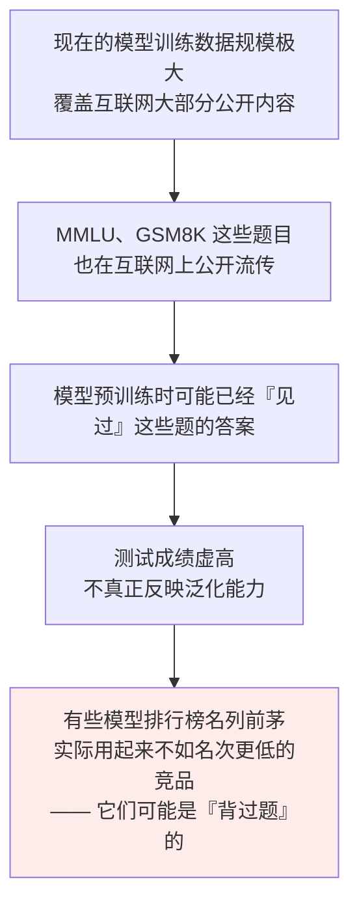
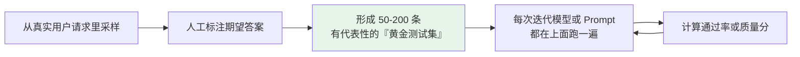

# 第二十一章：能力评测指标

## 21.1 为什么需要评测指标

大模型的能力是多维度的，「**感觉用起来还不错**」不足以支撑工程决策。

当你要从一个模型换到另一个、决定是否微调、衡量 Prompt 优化的效果，都需要量化指标。

> **评测指标的价值在于把「主观感受」转化成「可比较的数字」。**

但**评测模型远比评测传统软件难**——语言生成是开放性任务，「正确答案」的边界往往是模糊的。这也是为什么这个领域同时存在多种不同侧重的 Benchmark。

## 21.2 主流学术 Benchmark

| 维度 | Benchmark | 考查什么 |
|---|---|---|
| **综合知识与推理** | **MMLU / MMLU-Pro** | 57 个学科（高中数学、历史、法律、医学、CS），四选一单选。**一套超全面的「文化水平考试」**。MMLU-Pro 难度更高、选项更多、更强调推理 |
| **代码能力** | **HumanEval / MBPP** | HumanEval 有 164 道题，给函数签名和 docstring，生成实现后用隐藏测试用例验证 |
| | **SWE-bench Verified** | **更接近真实软件工程**——让模型修真实 GitHub issue，评估代码理解、修改和测试能力 |
| **数学与科学推理** | **GSM8K** | 小学数学应用题，考基础四则运算和逻辑推理 |
| | **MATH** | 竞赛数学：代数、几何、组合数学 |
| | **GPQA** | 研究生级别科学问答，需要物理/化学/生物专业知识和多步推理 |
| **对话与 Agent** | **MT-Bench** | 多轮交互场景，用 **LLM-as-Judge** 打分 |
| | **Chatbot Arena** | 用户真实偏好投票 |
| | **τ-bench** | 工具调用、多轮状态管理、业务流程表现，**更贴近 Agent 应用** |
| **综合 / 新型** | **HELM** | 覆盖准确率、鲁棒性、公平性、有害性等多个维度 |
| | **LiveBench** | **持续更新题目，降低数据污染** |
| | **Humanity's Last Exam** | 主打更难、更广的综合知识和推理 |

### 21.2.1 Pass@k

代码评测的常见指标：**生成 $k$ 个候选代码，至少 1 个能通过所有测试的比例**。

$k=1$ 衡量一次就对的能力，$k=10$ 衡量「多试几次能不能做出来」。

## 21.3 Benchmark 的系统性缺陷：数据污染

> **这是不能完全相信学术 Benchmark 的根本原因。**

### 21.3.1 三个应对方向

1. **避免用公开 Benchmark 直接当训练集**；
2. **用 LiveBench 这类持续更新题库的评测**；
3. **用业务真实数据做评测**——这是最可靠的一条。

## 21.4 建自己的业务评估集

**面对 Benchmark 的局限，最务实的做法是建任务特定测试集。**

### 21.4.1 两类任务的评分方式

| 任务类型 | 评分方式 |
|---|---|
| **客观任务**（信息提取、分类、代码） | **程序自动验证**——有确定的正确答案 |
| **主观任务**（摘要、问答质量） | **LLM-as-Judge**——让一个更强的模型按给定标准打分 |

> **关键一步：人工抽查 10–20% 的样本来校准 LLM-Judge 是否可信。** 不校准就无法判断裁判本身是不是在乱打分。

**这套方法是工业界做 LLM 项目的标配。**

## 21.5 离线评估 + 线上指标的闭环

**只有离线测试集还不够**，生产环境还要监控实际的用户体验指标。

| 层次 | 指标 | 作用 |
|---|---|---|
| **离线评估** | 黄金测试集通过率、质量分 | **帮你找问题、快速迭代** |
| **线上指标** | 用户满意度（明确的点赞/踩、隐式的追问行为） 任务完成率（用户是否实现目标） 会话放弃率（中途退出说明体验差） | **告诉你优化是否真正改善了用户体验** |

> 离线评估用来筛方案、定位问题，线上指标才说明用户体验有没有真的变好；两边少一边都容易误判。

## 21.6 常见错误

### 21.6.1 只会报 Benchmark 名字说不出它测什么

MMLU 测知识广度、HumanEval 测代码、GSM8K 测数学推理、MT-Bench 测多轮对话、τ-bench 测工具调用。**各一句话就能区分。**

### 21.6.2 完全相信学术排行榜

**数据污染让分数虚高**，排名高的模型实际体验未必更好。

### 21.6.3 不建业务测试集，靠「感觉变好了」判断

50–200 条黄金测试集是最低成本、最高收益的工程投入。

### 21.6.4 对主观任务硬套自动指标

摘要、问答质量这类任务用 LLM-as-Judge 更合适。

### 21.6.5 用了 LLM-as-Judge 但不做人工校准

**必须抽查 10–20% 的样本**，否则不知道裁判本身准不准。

### 21.6.6 只做离线评估不看线上指标

离线通过率提升不等于用户体验改善。**要看满意度、任务完成率、会话放弃率。**

### 21.6.7 把公开 Benchmark 直接拿来当训练数据

这会直接制造数据污染，让自己的评测彻底失效。

## 21.7 本章总结

1. **评测的价值是把主观感受变成可比较的数字**，但语言生成是开放任务，评测天然比传统软件难；
2. **MMLU / MMLU-Pro** 测综合知识广度与推理；
3. **HumanEval / MBPP / SWE-bench Verified** 测代码，SWE-bench 最接近真实工程；
4. **GSM8K / MATH / GPQA** 分别对应小学应用题、竞赛数学、研究生级科学推理；
5. **MT-Bench / Arena / τ-bench** 测对话、真实偏好和工具调用；
6. **HELM / LiveBench / Humanity's Last Exam** 是更综合或更新型的评测；
7. **Pass@k 是代码评测的常见指标**：生成 $k$ 个候选至少 1 个通过的比例；
8. **数据污染是学术 Benchmark 的系统性缺陷**，导致排行榜与实际体验脱节；
9. **最务实的做法是建 50–200 条黄金业务测试集**，每次迭代都跑一遍；
10. **客观任务程序验证，主观任务用 LLM-as-Judge，但必须人工抽查 10–20% 校准**；
11. **完整体系 = 离线评估找问题 + 线上指标验证真实收益**。

> 公开 Benchmark 适合看模型大致区间，真正决定上线的还是你自己的测试集和线上指标。

## 参考资料

- [Measuring Massive Multitask Language Understanding（MMLU）](https://arxiv.org/abs/2009.03300)
- [MMLU-Pro: A More Robust and Challenging Multi-Task Language Understanding Benchmark](https://arxiv.org/abs/2406.01574)
- [Evaluating Large Language Models Trained on Code（HumanEval / Pass@k）](https://arxiv.org/abs/2107.03374)
- [SWE-bench: Can Language Models Resolve Real-World GitHub Issues?](https://arxiv.org/abs/2310.06770)
- [Training Verifiers to Solve Math Word Problems（GSM8K）](https://arxiv.org/abs/2110.14168)
- [Measuring Mathematical Problem Solving With the MATH Dataset](https://arxiv.org/abs/2103.03874)
- [GPQA: A Graduate-Level Google-Proof Q&A Benchmark](https://arxiv.org/abs/2311.12022)
- [Judging LLM-as-a-Judge with MT-Bench and Chatbot Arena](https://arxiv.org/abs/2306.05685)
- [Holistic Evaluation of Language Models（HELM）](https://arxiv.org/abs/2211.09110)
- [LiveBench: A Challenging, Contamination-Limited LLM Benchmark](https://arxiv.org/abs/2406.19314)
- [tau-bench: A Benchmark for Tool-Agent-User Interaction in Real-World Domains](https://arxiv.org/abs/2406.12045)
