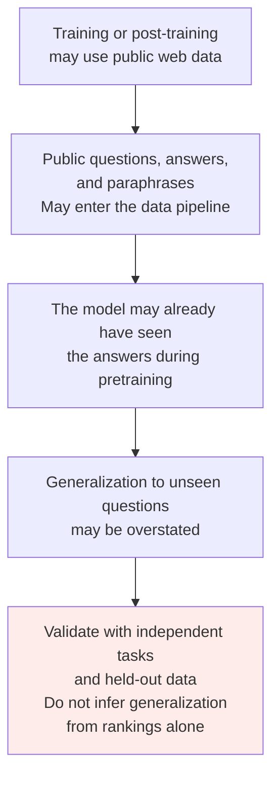
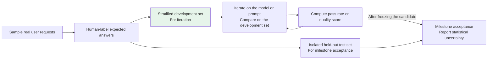

# Chapter 21: Capability Evaluation Metrics

## 21.1 Why evaluation metrics matter

LLM capability has many dimensions. “**It feels pretty good to use**” is not enough to support an engineering decision.

Switching models, deciding whether to fine-tune, and measuring a prompt change all require quantitative metrics.

> **Evaluation metrics turn subjective impressions into comparable numbers.**

Open-ended language tasks often admit several valid answers, making exact string matching inadequate. Restricted tasks such as classification or calculation may have explicit correctness criteria. Different tasks need benchmarks with different priorities; a single aggregate score cannot replace all acceptance criteria.

## 21.2 Common public benchmarks

The table describes tasks and what is scored, not model rankings as of a particular date. Before comparing results, fix the dataset version, subset, prompt, tool availability, sample count, and reasoning budget.

| Dimension | Benchmark | What it measures and where it stops |
|---|---|---|
| **Broad knowledge and reasoning** | **MMLU** | Four-option questions across 57 subjects; primarily tests knowledge and problem solving on closed questions, not reliability on open-ended tasks |
| | **MMLU-Pro** | Cleans and expands the questions, emphasizes reasoning, and increases the number of options to as many as ten; its scores are not direct comparisons on exactly the same question set as MMLU |
| **Coding** | **HumanEval / MBPP** | Function-level programming tasks; the original HumanEval has 164 problems with function signatures and docstrings as inputs and tests for functional correctness. The tests are public; omitting them from model input does not make them unpublished |
| | **SWE-bench Verified** | 500 human-verified repository issue-resolution tasks; scores measure a combination of model, agent harness, environment, tools, and budget—not the bare model |
| **Mathematical and scientific reasoning** | **GSM8K** | Grade-school word problems testing basic arithmetic and logical reasoning |
| | **MATH** | Competition mathematics, including algebra, geometry, and combinatorics |
| | **GPQA** | Expert-written multiple-choice questions in physics, chemistry, and biology; specify the full set or a subset such as Diamond rather than comparing them interchangeably |
| **Conversation and agents** | **MT-Bench** | Multiturn interactions scored by an **LLM-as-judge** |
| | **Chatbot Arena** | Crowdsourced preferences between anonymous pairs of answers; user and question distributions, style preferences, and statistical uncertainty affect rankings. It is not factual accuracy |
| | **τ-bench** | Interactions between simulated users and tool-using agents; checks goal completion using conditions such as the final database state and separately measures consistent success across repeated runs |
| **Broad / newer evaluations** | **HELM** | Multiple dimensions including accuracy, robustness, fairness, and harmfulness |
| | **LiveBench** | Regularly updated questions scored against objective answers to reduce contamination risk; the release version still needs to be fixed, and leakage cannot be ruled out entirely |
| | **Humanity's Last Exam** | Difficult academic questions across disciplines, including multiple choice, short answers, and multimodal content; not sufficient proof of general workplace competence or autonomous research ability |

SWE-bench Verified needs an additional validity caveat. OpenAI identified test-design flaws and training-data contamination, stopped reporting its score, and recommended SWE-bench Pro instead; see [OpenAI's statement](https://openai.com/index/why-we-no-longer-evaluate-swe-bench-verified/). This is that organization's evaluation decision, not a claim that every user has stopped using the benchmark. Historical scores should retain their version and limitations and must not be compared directly with scores on a different question set.

### 21.2.1 Pass@k

A common coding metric is the **proportion of problems for which at least 1 of $k$ generated candidates passes every test**.

$k=1$ measures success from one sample. Larger `k` measures the chance that repeated attempts contain a successful solution, not the probability that a deployed system actually selects the correct one.

HumanEval commonly estimates this by independently sampling `n` candidates per problem under a fixed generation configuration. If `c` pass the tests and `n ≥ k`, compute:

$$
\widehat{\mathrm{pass@}k}
=1-\frac{\binom{n-c}{k}}{\binom{n}{k}}
$$

Then average across problems. If fewer than `k` candidates fail, treat the numerator's binomial coefficient as zero. The estimator uses sampled candidates to estimate “at least one passes”; it does not require a production system to have an oracle that knows which candidate is correct.

Passing code tests can still miss edge cases, security defects, or ambiguities in the specification. Isolate the execution environment and give generated code neither production secrets nor permission to write to external systems.

**Do not confuse `pass@k` with τ-bench's `pass^k`.** The former concerns at least one success in `k` attempts; the latter concerns success in all `k` attempts. Under the ideal assumptions of independent attempts with the same success probability `p`, these are `1-(1-p)^k` and `p^k`, respectively. Real tasks differ in difficulty, so the whole dataset's average success rate cannot simply be substituted into the latter.

### 21.2.2 Choose metrics from the task definition

| Evaluation goal | Possible metrics | Definitions that must be specified |
|---|---|---|
| Classification and extraction | Accuracy, precision, recall, F1, exact field match | Distinguish micro and macro averaging for imbalanced classes; define normalization for nulls and equivalent text |
| Summarization and question answering | Key-point coverage, claim correctness, source support; overlap metrics such as ROUGE where useful | Text similarity is not truth; a correct paraphrase can have low overlap with the reference |
| Probability calibration and abstention | Brier score, reliability bins, coverage–error curves | Validate self-reported confidence; reporting only accuracy among answered questions hides excessive refusal |
| Agents | End-to-end goal success, policy-violation rate, success across repeated runs | Correct tool names and arguments are intermediate metrics, not substitutes for task completion |
| Serving efficiency | Input/output usage, cost per successful task, p50/p95 latency, throughput | Fix concurrency, output length, cache state, and resource configuration |

Perplexity (PPL) measures the average difficulty of predicting reference text under the model, not directly whether an answer is true or useful. Comparing PPL across different tokenizers, corpora, or normalization conventions can also mislead.

## 21.3 A systemic benchmark problem: data contamination

Contamination is one risk; mismatched task distributions, saturated tests, scoring errors, and unequal reasoning budgets are others. Disagreement between leaderboard scores and business results does not prove that a model memorized the questions. Confirming contamination requires data or experimental evidence.

### 21.3.1 Three responses

1. Deduplicate training and test data at the level of both questions and close paraphrases. Public training splits may be used for training; held-out evaluation data must not participate in optimization.
2. Record release dates and versions when using continually updated question banks, and still check whether they entered fine-tuning, examples, or tuning workflows.
3. Separate real data by time, customer, or business entity and retain a set that never participated in tuning. Private data can also be overfit if repeatedly used to select prompts.

## 21.4 Build a task-specific evaluation set

**The most practical response to benchmark limitations is a test set specific to your tasks.**

### 21.4.1 Scoring two types of task

| Task type | Scoring method |
|---|---|
| **Verifiable tasks**: extraction, classification, code | Prefer field validation, labels, rules, and tests; specifications may allow equivalent answers, and tests themselves may be incomplete |
| **Open-ended tasks**: summaries, reports, complex question answering | Combine fact-checking, coverage annotations, human assessment, and LLM-as-judge; do not delegate factuality entirely to a subjective overall score |

### 21.4.2 Validate the judge, not just its model strength

An LLM judge may favor longer answers, particular positions, or familiar styles, and may be influenced by instructions inside the text being evaluated. Fix the judge version, rubric, and context; hide candidate model identities; swap the order of paired answers; and compare against human decisions by subtask. Important disagreements need independent review. A judge's stated rationale does not replace verification.

Human review volume depends on error rate, risk, and coverage across task groups—not a fixed 10–20%. Alongside random samples, prioritize judge disagreements, low-confidence cases, rare categories, and high-impact errors. Report human–model agreement and the types of misjudgment.

### 21.4.3 Is the improvement more than sampling noise?

Compare two methods on the same questions and record which changed from wrong to right and from right to wrong, rather than looking only at mean scores. For binary outcomes, use paired tests or a paired bootstrap. Cluster repeated runs by question or session; repeated samples of one question are not independent users.

For example, assuming independent samples, 80 correct answers out of 100 have a rough standard error of 4 percentage points. A one-percentage-point increase cannot simply be declared a real improvement. With fewer samples, rarer risks, or strongly correlated samples from the same source, collect more data or make the uncertainty explicit. Use development data for tuning, held-out data for milestone acceptance, and new production failures for subsequent dataset versions.

## 21.5 Connecting offline evaluation with production metrics

**An offline test set is not enough.** Monitor actual user-experience metrics in production too.

| Level | Metrics | Purpose |
|---|---|---|
| **Offline evaluation** | Gold-standard test-set pass rate and quality scores | **Find problems and iterate quickly** |
| **Production metrics** | Task completion, user feedback, human-takeover rate, session abandonment, failure retries, and latency | Observe real experience; a follow-up may indicate interest and an exit may mean the issue is resolved, so neither is automatically a positive or negative label |

> Offline evaluation helps screen approaches and diagnose failures; production metrics show whether the user experience actually improved. Either side alone can mislead.

Where feasible, randomize users or sessions into A/B groups to avoid mistaking traffic-composition changes for model gains. Monitor guardrail metrics for unauthorized actions, privacy, and serious factual errors at the same time. Higher average satisfaction cannot compensate for high-impact violations. When randomization is unavailable, acknowledge the limits of causal interpretation.

## 21.6 Common mistakes

### 21.6.1 Naming benchmarks without explaining what they measure

Describe the task, inputs, scoring rules, and budget. For example, SWE-bench evaluates a repair system, while τ-bench also checks business state after interaction.

### 21.6.2 Trusting academic leaderboards completely

Check versions, tools, candidate counts, judges, and confidence intervals. Differences may not come from the model alone, and contamination should not be blamed without evidence.

### 21.6.3 Relying on “it feels better” without task-specific tests

Start with representative cases, then expand according to task frequency, risk, and required statistical precision. A fixed sample count is not a release criterion.

### 21.6.4 Forcing automatic metrics onto subjective tasks

Lexical overlap is not a sufficient measure of meaning or factuality. Still, numbers, citations, and permission conditions in open-ended answers can be checked programmatically.

### 21.6.5 Using LLM-as-judge without human calibration

Compare against human standards and check position, length, and style biases, as well as missed serious errors. Sampling rates need a risk-based and statistical rationale.

### 21.6.6 Evaluating offline without looking at production

A higher offline pass rate does not establish a better user experience. **Check satisfaction, task completion, and session abandonment.**

### 21.6.7 Using public benchmarks directly as training data

Clearly defined training splits are usable. But after training or optimizing prompts on test questions, answers, or equivalent paraphrases, their scores cannot still be presented as generalization to unseen tasks.

## 21.7 Summary

1. Define the task and acceptance criteria before choosing benchmarks and metrics. Even benchmarks with the same name need fixed versions, subsets, and budgets.
2. `pass@k` measures at least one success; `pass^k` measures success across all repeated runs. Neither is the same as a selector's actual performance.
3. Contamination, distribution shift, judge bias, and sampling error can all affect conclusions.
4. Separate development and held-out sets, assigning suitable roles to programmatic checks, model judges, and human review.
5. Support offline conclusions with paired comparisons and uncertainty estimates, then test real benefits through production experiments and risk guardrails.

> Public benchmarks indicate roughly where a model stands. Your own test set and production metrics should determine whether it is ready to deploy.

## References

- [Measuring Massive Multitask Language Understanding (MMLU)](https://arxiv.org/abs/2009.03300)
- [MMLU-Pro: A More Robust and Challenging Multi-Task Language Understanding Benchmark](https://arxiv.org/abs/2406.01574)
- [Evaluating Large Language Models Trained on Code (HumanEval / Pass@k)](https://arxiv.org/abs/2107.03374)
- [SWE-bench: Can Language Models Resolve Real-World GitHub Issues?](https://arxiv.org/abs/2310.06770)
- [OpenAI: Why SWE-bench Verified no longer measures frontier coding capabilities](https://openai.com/index/why-we-no-longer-evaluate-swe-bench-verified/)
- [Training Verifiers to Solve Math Word Problems (GSM8K)](https://arxiv.org/abs/2110.14168)
- [Measuring Mathematical Problem Solving With the MATH Dataset](https://arxiv.org/abs/2103.03874)
- [GPQA: A Graduate-Level Google-Proof Q&A Benchmark](https://arxiv.org/abs/2311.12022)
- [Judging LLM-as-a-Judge with MT-Bench and Chatbot Arena](https://arxiv.org/abs/2306.05685)
- [Holistic Evaluation of Language Models (HELM)](https://arxiv.org/abs/2211.09110)
- [LiveBench: A Challenging, Contamination-Limited LLM Benchmark](https://arxiv.org/abs/2406.19314)
- [tau-bench: A Benchmark for Tool-Agent-User Interaction in Real-World Domains](https://arxiv.org/abs/2406.12045)
- [HumanEval's official Pass@k implementation](https://github.com/openai/human-eval/blob/master/human_eval/evaluation.py)
- [Official SWE-bench documentation: Verified subset](https://www.swebench.com/SWE-bench/)
- [Humanity's Last Exam](https://arxiv.org/abs/2501.14249)
- [On Faithfulness and Factuality in Abstractive Summarization (lexical metrics versus faithfulness)](https://arxiv.org/abs/2005.00661)
