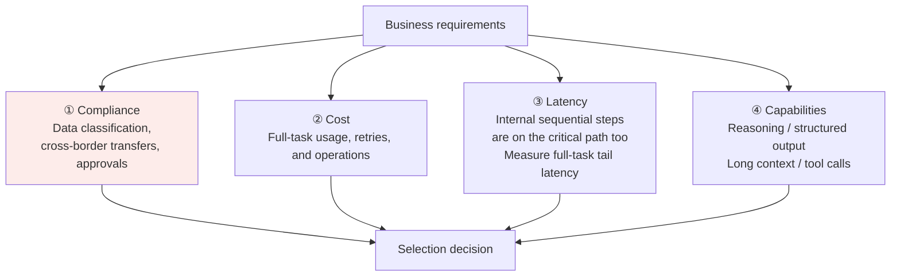
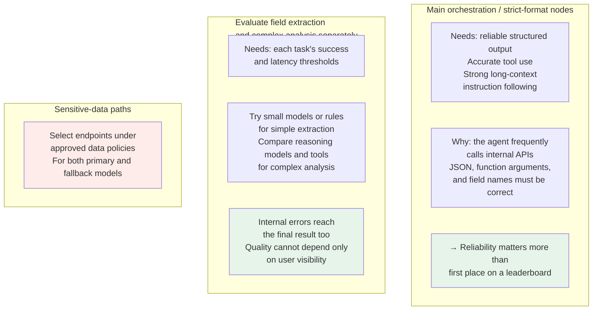

# Chapter 22: Practical Model Selection

## 22.1 Why leaderboards cannot decide for you

Public scores can shortlist candidates, but they do not establish that a model satisfies specific business constraints. Common failures include:

| Problem | Explanation |
|---|---|
| **Noncompliant data processing** | Requests, logs, vector indexes, tool results, and backups all carry data; verify deployment regions, retention periods, access parties, and contractual restrictions individually |
| **Poor fit for the task** | Strong leaderboard scores do not guarantee reliable handling of your **financial-report formats, industry jargon, or internal API calls** |
| **Excessive cost or latency** | Agent loops, retries, long outputs, reasoning tokens, and tool calls multiply usage; per-token pricing alone cannot predict task cost |

> **Model selection matches business requirements against four dimensions—compliance, cost, latency, and capability—not just benchmark scores.**



Apply hard constraints first, then make tradeoffs among feasible candidates. Beyond data and licensing requirements, minimum accuracy, safety rules, and response deadlines can also be hard constraints. Low cost cannot compensate for unauthorized actions or critical-task failures.

## 22.2 Build a comparable candidate list

A brand does not guarantee capability. Snapshots, parameter sizes, reasoning modes, and deployment endpoints can vary substantially within a family. The following dimensions and published technical approaches are not a ranking of which vendor is strongest today.

### 22.2.1 Separate the model from its service arrangement

| Arrangement | What to verify | Typical tradeoffs |
|---|---|---|
| **Hosted API** | Available regions, exact snapshot, rate limits, schema/tool support, retention, and terms of service | Less integration and operational work, but subject to vendor changes, network issues, and quotas |
| **Dedicated cloud or private deployment** | Isolation boundaries, operator access, keys and auditing, resource capacity, and upgrade policy | More control, but not an automatic guarantee that data will never be logged or remotely accessed |
| **Self-hosted open-weight model** | License, task performance after quantization, GPU memory, concurrency capacity, and the team's operational capability | Control over deployment and versions, but responsibility for GPUs, recovery, security patches, and idle capacity |

“Open weights” does not automatically mean open training data or unrestricted commercial use. The same weights served with different quantization, inference backends, chat templates, or tool parsers should be treated as different candidate configurations.

### 22.2.2 Use public reports to understand designs, not label brands permanently

| Published material | What it establishes | What it does not establish |
|---|---|---|
| **DeepSeek-V3 Technical Report** | This version uses designs such as MoE and MLA; the report describes its training and evaluation | That every later version or hosted endpoint is cheapest, or that active parameter count represents the memory needed for all weights |
| **Qwen3 Technical Report** | The reported release includes dense and MoE models and discusses thinking/non-thinking behavior and budget control | That all later family members support identical switching, or that Chinese-language performance and tool use necessarily fit your tasks |
| **Official API documentation and model cards** | Modalities, context limits, structured output, tool capabilities, and restrictions of particular endpoints | That function-calling support means reliable execution, or that product labels reveal unpublished architecture |

DeepSeek, Qwen, Doubao, GPT, Claude, and others may enter the candidate pool according to need, but national origin and brand cannot replace deployment and contract review. At minimum, a candidate record should include model ID/snapshot, date accessed, deployment region, precision/quantization, reasoning mode, context limit, output limit, tool capabilities, and license or service terms.

For multimodal requirements, a “supports images/audio” label is not enough. Evaluate OCR, small objects, charts, video timing, ASR, latency, and safety separately. See [Multimodal Models](../06-multimodal/23-multimodal-models.md) for architecture and evaluation dimensions.

## 22.3 Putting selection into practice: model routing

First establish a baseline using one model or fixed models at each workflow node. Introduce multiple models only if tasks differ enough and routing benefits outweigh added evaluation and operational costs. Not every application needs routing.

### 22.3.1 A concrete scenario

Consider question answering over corporate financial reports. The following workflow decomposition does not imply that multiple agents are required:

```
Parse a long corporate financial report
  → Extract fields and decide whether retrieval or calculation is needed
    → Frequently call internal company databases and search engines
      → Synthesize a report in Chinese
```

### 22.3.2 Assigning models by node



### 22.3.3 Routing, cascades, and failure fallback are different

| Mechanism | When the decision occurs | Main risk |
|---|---|---|
| **Up-front routing** | Before generation, select a model from task features, rules, or a learned router | Misjudge difficulty and send a high-risk problem to an unsuitable model |
| **Cascaded escalation** | Use a low-cost model first, then escalate if validation fails | An incorrect answer mistakenly accepted as valid never triggers escalation; sequential latency increases |
| **Failure fallback** | Switch after a timeout, rate limit, or unavailable service | The backup endpoint may not satisfy the same data, tool, and quality constraints |

RouteLLM studies learning to route between strong and weak models using preference data; FrugalGPT demonstrates learned cascades. They offer design ideas, not a guarantee of savings for every model pair and task distribution.

Routing signals can come from task categories, input length, rule-based checks, or independent evaluators. Do not rely only on a model's self-reported confidence. Evaluate the end-to-end **router + selected model + escalation path**, and monitor distribution drift. Hard data policies must precede cost optimization in routing too.

### 22.3.4 Data boundaries apply to offline evaluation as well

First establish data classification, authorized purposes, processing regions, retention and deletion mechanisms, vendor access, and customer contracts. The responsible teams should then review applicable regulations. “Only an offline evaluation” is not a reason to send unapproved internal data to a prohibited endpoint. Offline evaluation is still data processing.

“Not used for training” does not mean “not stored.” Logs, files, conversation state, caches, and third-party tools may follow different retention rules. Official API data-control documentation also distinguishes endpoints and approved configurations; do not extrapolate one setting to an entire vendor's product line.

## 22.4 A practical selection checklist

| Step | Work to do |
|---|---|
| **① Define hard constraints** | Data processing, licensing, authorization, safety, critical-task success, and response deadlines |
| **② Decompose the workflow** | Identify the sequential critical path, parallelizable steps, and work that rules or tools can perform |
| **③ Specify acceptance criteria** | Separately measure structural validity, argument semantics, successful tool execution, use of contextual evidence, and final task success |
| **④ Evaluate candidate configurations** | Shortlist with public benchmarks, then compare on held-out task data as described in [Chapter 21](21-evaluation-metrics.md); record configurations and uncertainty |
| **⑤ Calculate full-task cost** | Include cache hits/misses, outputs and internal reasoning, tools, retries, routing, infrastructure, and human rework |
| **⑥ Validate fallback and changes** | Test timeouts, rate limits, incorrect schemas, model upgrades, and rollbacks—not only the happy path |

### 22.4.1 Measure cost per successful task, not just token prices

Within the same evaluation window, the following definition makes API and self-hosted options comparable:

$$
C_{\mathrm{success}}
=\frac{C_{\mathrm{model}}+C_{\mathrm{tool}}+C_{\mathrm{infra}}+C_{\mathrm{review}}}
{N_{\mathrm{success}}}
$$

The numerator includes both successful and failed attempts; the denominator counts actually completed tasks. With no successful tasks, the metric is unavailable and failure should be reported directly. Check the current endpoint's accounting for input, cached input, output, and reasoning tokens to avoid charging reasoning tokens twice when already included in output usage. Self-hosting also requires accounting for weight and KV memory, utilization, redundancy, and operations—not merely comparing GPU rental with API unit prices.

Report overall success rate as well, so a low cost per successful task does not hide large numbers of refusals. An expensive model that reduces loops and rework can cost less overall than a cheap model that repeatedly fails.

### 22.4.2 Tail latency, versions, and retries with side effects

Internal sequential nodes are on the user's waiting path too. Under representative concurrency, measure time to first token, full-task p50/p95, tool waiting time, and timeout rate. Parallel sampling saves wall-clock time but can exhaust quotas. An advertised long context is merely an accepted input length; test whether the model uses evidence correctly across different positions, distracting documents, and lengths.

Pin model snapshots where available and version prompts and tool schemas. Regression-test alias updates, roll them out to a small share of traffic, and retain a rollback plan. Before retrying a payment, message, or database write, confirm the action's state and use idempotency keys. A timeout in the primary model must not cause a fallback model to repeat the action. If failure leaves no option satisfying hard constraints, pausing or handing off to a person may be safer than switching automatically to any available model.

## 22.5 Common mistakes

### 22.5.1 Choosing the leaderboard winner

Benchmark performance does not guarantee good results on your tasks, and contamination is another concern; see [Chapter 21](21-evaluation-metrics.md).

### 22.5.2 Forgetting that compliance can disqualify a candidate

Data-processing requirements depend on the actual data, regions, contracts, and endpoint configuration—not a simple domestic-versus-foreign brand distinction. Evaluate data handling in tests, logs, and backup paths alike.

### 22.5.3 Introducing multiple models before verifying the benefit

A single model is easier to operate and diagnose. Multiple models may reduce cost but add routing errors, compatibility issues, and regression combinations. Show where the baseline falls short before comparing end-to-end benefits.

### 22.5.4 Using the most expensive model inside every agent loop

Price is not the only issue. Errors and sequential delays at internal nodes reach the final result. Compare full-task costs at the same required success rate.

### 22.5.5 Looking only at reasoning scores for strict-format orchestration nodes

Structural validity, correct business semantics of arguments, authorization, and task success are different layers. Valid JSON can still request the wrong account or the wrong action.

### 22.5.6 Having no fallback plan

Fallback must preserve data and authorization boundaries and account for idempotency, conversation compatibility, refusals, and human takeover. It is not merely a change of model name.

### 22.5.7 Treating a specific model name as the standard answer

Versions change quickly. **Explaining the selection logic is much more valuable than memorizing model names.**

## 22.6 Summary

1. Establish hard data, licensing, safety, and business constraints before comparing quality, latency, and cost among feasible configurations.
2. A model family is not a specific service capability. Record versions, quantization, endpoints, and templates.
3. Public evaluations support shortlisting; held-out task data and production guardrails support acceptance.
4. Routing and cascades must beat a simple baseline and must not bypass data boundaries.
5. Calculate total cost per successful task, measure tail latency, and validate upgrades, idempotent retries, and safe fallback.

> Usually, selection starts by excluding noncompliant candidates, then comparing capability, latency, and cost by workflow node, and finally deciding with your own tests. A leaderboard is only a reference.

## References

- [Holistic Evaluation of Language Models (HELM)](https://arxiv.org/abs/2211.09110)
- [Judging LLM-as-a-Judge with MT-Bench and Chatbot Arena](https://arxiv.org/abs/2306.05685)
- [DeepSeek-V3 Technical Report](https://arxiv.org/abs/2412.19437)
- [Qwen3 Technical Report](https://arxiv.org/abs/2505.09388)
- [tau-bench: A Benchmark for Tool-Agent-User Interaction in Real-World Domains](https://arxiv.org/abs/2406.12045)
- [RouteLLM: Learning to Route LLMs with Preference Data](https://arxiv.org/abs/2406.18665)
- [FrugalGPT: How to Use Large Language Models While Reducing Cost and Improving Performance](https://arxiv.org/abs/2305.05176)
- [OpenAI: Data controls in the OpenAI platform](https://developers.openai.com/api/docs/guides/your-data)
- [OpenAI: Structured Outputs](https://developers.openai.com/api/docs/guides/structured-outputs)
