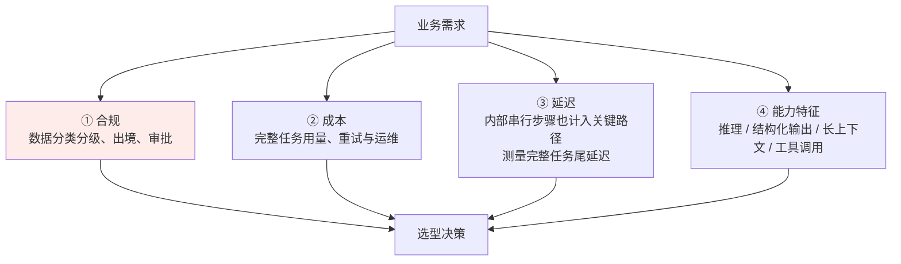
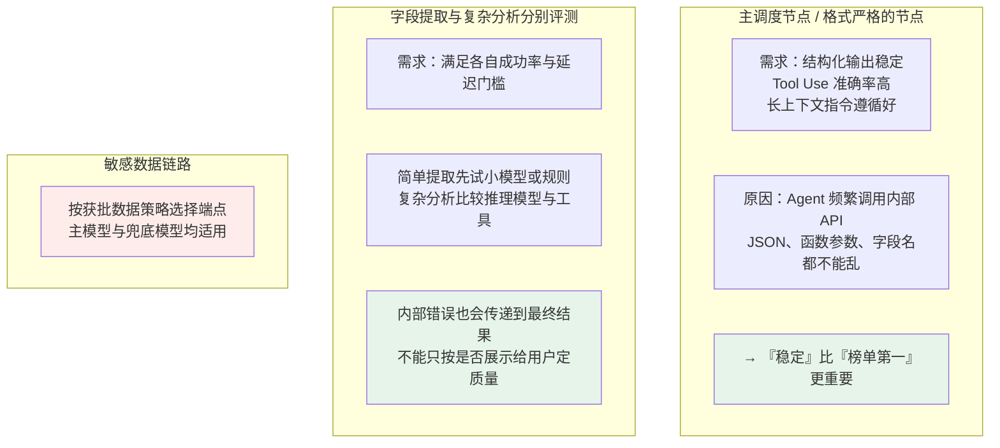

# 第二十二章：模型选型实践

## 22.1 为什么排行榜不足以决定选型

公开分数可以筛选候选，但不代表模型满足特定业务约束。常见失败包括：

| 问题 | 说明 |
|---|---|
| **数据处理不符合要求** | 请求内容、日志、向量索引、工具结果和备份都有数据流；部署区域、保留期限、访问方和合同限制需逐项核实 |
| **业务场景不匹配** | 榜单漂亮，但在你的**财报格式、行业黑话、内部接口调用**上不一定稳定 |
| **成本或时延超预算** | Agent 循环、重试、长输出、推理 token 与工具调用会放大用量；单次 token 单价不足以预测任务成本 |

> **选型看的是「合规、成本、延迟、能力特征」四个维度和业务需求的匹配，不是跑分。**



先筛选硬约束，再在可行候选中权衡。除了数据与许可要求，必须达到的正确率、安全规则和响应时限也可能是硬约束；不能用低成本补偿越权或关键任务失败。

## 22.2 建立可比较的候选清单

品牌不是能力保证，同一系列不同快照、参数规模、推理模式和部署端点可能差异很大。以下介绍选型维度与已公开技术路线，不给出「截至今日某家最强」的排行榜。

### 22.2.1 先区分模型与服务形态

| 形态 | 需要验证 | 典型取舍 |
|---|---|---|
| **托管 API** | 可用区域、具体快照、限流、schema/工具支持、数据保留及服务条款 | 接入与运维负担较低，但受供应商变更、网络与配额影响 |
| **云上专属或私有化服务** | 隔离边界、运维访问、密钥与审计、资源容量、升级策略 | 可增加控制力，但不自动意味着数据不会被记录或远程访问 |
| **自托管开放权重模型** | 许可证、量化后的任务表现、显存、并发容量和团队运维能力 | 可控制部署与版本，但 GPU、故障恢复、安全补丁和闲置成本由自己承担 |

「开放权重」不自动等于开放全部训练数据或没有商业限制。相同权重经不同量化、推理后端、chat template 和工具解析器部署，也应视为不同候选配置。

### 22.2.2 用公开报告理解路线，不给品牌贴固定标签

| 已公开资料 | 能确认什么 | 不能据此推出什么 |
|---|---|---|
| **DeepSeek-V3 技术报告** | 该版本使用 MoE、MLA 等设计；报告描述其训练与评测 | 不能推出所有后续版本或托管端点都最便宜，也不能用激活参数量代替全部权重的显存需求 |
| **Qwen3 技术报告** | 报告发布批次包含 Dense/MoE 路线，并讨论 thinking/non-thinking 与预算控制 | 不能推出同系列任意后续版本都支持相同切换方式，或中文、工具调用必然适合本业务 |
| **API 官方文档与模型卡** | 核对具体端点的模态、上下文、结构化输出、工具能力及限制 | 不能把「支持 function calling」等同于可靠执行，也不能从产品标签推断未公开架构 |

DeepSeek、Qwen、豆包、GPT、Claude 等可按需求进入候选池，但国别和品牌不能替代部署与合同审查。候选卡至少记录：模型 ID/快照、获取日期、部署区域、精度/量化、推理模式、上下文限制、输出限制、工具能力、许可证或服务条款。

多模态需求不能只看“支持图片/音频”的产品标签。应按 OCR、小目标、图表、视频时序、ASR、延迟和安全分别评测；底层架构与评测维度见 [多模态模型](../06-multimodal/23-multimodal-models.zh.md)。

## 22.3 落地思路：模型路由（Model Routing）

先建立单模型或固定节点配置的基线。只有当任务差异足够大、路由收益超过额外评测与运维成本时，再引入多模型；不是所有应用都需要路由。

### 22.3.1 一个具体场景

以企业财报问答为例，以下是工作流拆分示意，不表示必须使用多智能体：

```
解析长篇企业财报
  → 提取字段并判断是否需要检索或计算
    → 频繁调用公司内部数据库与搜索引擎
      → 汇总生成中文报告
```

### 22.3.2 按节点分配



### 22.3.3 路由、级联与降级不是一回事

| 机制 | 决策时机 | 主要风险 |
|---|---|---|
| **预先路由** | 生成前按任务特征、规则或学习到的路由器选模型 | 误判难度，把高风险问题发给不合适模型 |
| **级联升级** | 先用低成本模型，未通过校验时升级 | 错误答案若被误判为合格，不会触发升级；串行延迟增加 |
| **故障降级** | 超时、限流或服务不可用时切换 | 备用端点可能不满足相同数据、工具和质量约束 |

RouteLLM 研究的是用偏好数据学习强弱模型之间的路由；FrugalGPT 展示了学习式级联。它们提供设计思路，不保证在任意模型组合与业务分布下都省钱。

路由信号可来自任务类别、输入长度、规则校验或独立评估器，不宜只信模型自报置信度。评测须覆盖**路由器 + 被选模型 + 升级路径**的端到端结果，并监控分布漂移。路由也要先执行硬性数据策略，再做成本优化。

### 22.3.4 数据边界对离线评测同样有效

先明确数据分类、授权目的、处理区域、保留与删除机制、供应商访问和客户合同，再由负责团队审核适用法规。不能以「只做离线评测」为理由，把未获准的内部数据发到不允许的端点；离线评测仍然是数据处理。

「不用于训练」不等于「不存储」，日志、文件、会话状态、缓存与第三方工具可能有不同保留规则。官方 API 数据控制文档也会按端点和获批配置区分行为，不能把一个设置外推到整个供应商产品线。

## 22.4 选型的落地检查清单

| 步骤 | 要做的事 |
|---|---|
| **① 定义硬约束** | 数据处理、许可、权限、安全、关键任务成功率和响应时限 |
| **② 拆解链路节点** | 找出串行关键路径、可并行步骤和能由规则/工具完成的部分 |
| **③ 明确验收条件** | 分别测结构合法、参数语义正确、工具执行成功、上下文证据利用和最终任务成功 |
| **④ 评测候选配置** | 用公开榜单初筛，再用 [第二十一章](21-evaluation-metrics.zh.md) 的保留业务集对照；记录配置与不确定性 |
| **⑤ 计算完整任务成本** | 包括缓存命中/未命中、输出与内部推理、工具、重试、路由、基础设施和人工返工 |
| **⑥ 验证降级与变更** | 实测超时、限流、错误 schema、模型升级与回滚，不仅验证正常路径 |

### 22.4.1 算的是成功任务成本，不只是 token 单价

同一评测窗口内，可用下式统一 API 与自托管方案的口径：

$$
C_{\mathrm{success}}
=\frac{C_{\mathrm{model}}+C_{\mathrm{tool}}+C_{\mathrm{infra}}+C_{\mathrm{review}}}
{N_{\mathrm{success}}}
$$

分子包含成功和失败尝试的开销，分母是实际完成任务数；无成功任务时该指标不可用，应直接报告失败。API 的输入、缓存输入、输出和推理 token 计费应按当前端点规则核对，避免把已包含在输出用量内的推理 token 重复计费。自托管还要纳入权重与 KV 显存、利用率、冗余和运维，不能只比较 GPU 租金与 API 单价。

同时报告总体成功率，避免仅用低成功任务成本掩盖大量拒答。一个贵但减少循环和返工的模型，可能比便宜却反复失败的模型总成本更低。

### 22.4.2 尾延迟、版本与有副作用的重试

内部串行节点同样位于用户等待路径上。按代表性并发测首 token、完整任务 p50/p95、工具等待与超时比例；并发采样节省墙钟时间，却可能吃满配额。标称长上下文只是可接收长度，还要在不同证据位置、干扰文档和长度下测试是否正确利用内容。

固定可用的模型快照与 Prompt/工具 schema 版本，对别名更新做回归与小流量发布，保留回滚方案。重试支付、发消息或写数据库前要确认动作状态并使用幂等键，不能因主模型超时就让备用模型重复执行。对硬约束不满足的故障场景，安全做法可能是暂停或转人工，而非自动切到任意可用模型。

## 22.5 常见错误

### 22.5.1 盯着排行榜第一名选

跑分不等于在你的业务里表现好，还存在数据污染（见 [第二十一章](21-evaluation-metrics.zh.md)）。

### 22.5.2 忽略合规是一票否决项

数据处理要求取决于实际数据、地区、合同和端点配置，不是简单的国内/海外品牌二分；评测、日志与备用链路都要审查。

### 22.5.3 未验证收益就引入多模型

单模型更易运维和归因；多模型可能降低成本，却增加路由错误、兼容性和回归组合。先证明基线不足，再比较端到端收益。

### 22.5.4 在 Agent 内部循环节点用最贵的模型

价格不是唯一问题。内部节点的错误与串行延迟会传递到最终结果，应比较同一成功率要求下的完整任务成本。

### 22.5.5 在格式严格的调度节点只看推理分数

结构合法、参数业务含义正确、权限允许与任务成功是不同层次；合法 JSON 也可能请求错误账户或执行错误动作。

### 22.5.6 没有兜底方案

降级需保留数据与权限边界，并考虑幂等、会话兼容、拒答与人工接管，不是只换模型名称。

### 22.5.7 把具体模型型号当成标准答案

版本迭代很快，**能讲清选型逻辑比背型号有价值得多**。

## 22.6 本章总结

1. 先确定数据、许可、安全与业务硬约束，再在可行配置中比较质量、延迟与成本。
2. 模型系列不等于具体服务能力，版本、量化、端点和模板都要记录。
3. 公开评测用于初筛，保留业务集与线上护栏用于验收。
4. 路由和级联必须优于简单基线，且不能绕过数据边界。
5. 算成功任务总成本，测尾延迟，验证版本升级、幂等重试与安全降级。

> 选型通常先排掉不合规的候选，再按链路节点比能力、延迟和成本，最后用自己的测试集做决定；排行榜最多只能当参考。

## 参考资料

- [Holistic Evaluation of Language Models（HELM）](https://arxiv.org/abs/2211.09110)
- [Judging LLM-as-a-Judge with MT-Bench and Chatbot Arena](https://arxiv.org/abs/2306.05685)
- [DeepSeek-V3 Technical Report](https://arxiv.org/abs/2412.19437)
- [Qwen3 Technical Report](https://arxiv.org/abs/2505.09388)
- [tau-bench: A Benchmark for Tool-Agent-User Interaction in Real-World Domains](https://arxiv.org/abs/2406.12045)
- [RouteLLM: Learning to Route LLMs with Preference Data](https://arxiv.org/abs/2406.18665)
- [FrugalGPT: How to Use Large Language Models While Reducing Cost and Improving Performance](https://arxiv.org/abs/2305.05176)
- [OpenAI: Data controls in the OpenAI platform](https://developers.openai.com/api/docs/guides/your-data)
- [OpenAI: Structured Outputs](https://developers.openai.com/api/docs/guides/structured-outputs)
