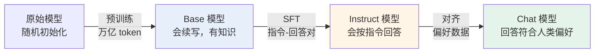
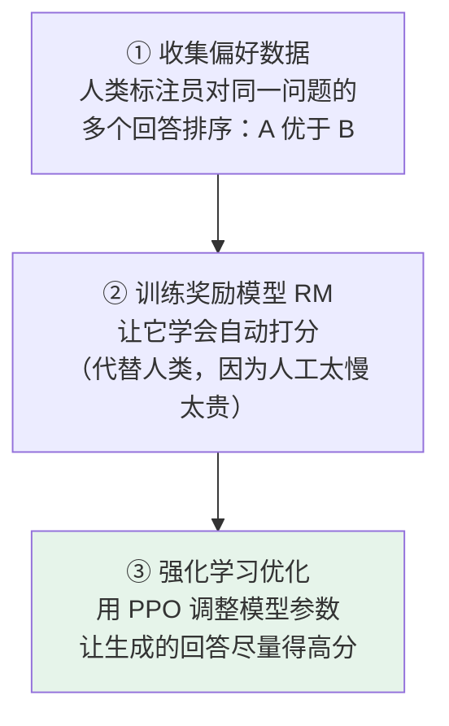

# 第六章：大模型的三阶段训练流程

## 6.1 为什么训练要分阶段

很多人第一次听说「大模型训练分三个阶段」会困惑：为什么不能一次训完？

做个类比。培养一个能在公司独当一面的员工，至少要经过三件事：

| 阶段 | 员工类比 | 解决的问题 |
|---|---|---|
| **预训练** | 从小学读到大学，掌握语言、数学、逻辑与各科常识 | 有没有**基础知识** |
| **SFT** | 进公司学流程：怎么写汇报邮件、怎么和客户对话 | 会不会**适配工作场景** |
| **对齐** | 职业素养：该说什么、不该说什么、什么时候拒绝 | 有没有**价值观和分寸感** |

**每个阶段解决的是完全不同层面的问题**，所以缺一不可。



## 6.2 第一阶段：预训练，读万卷书

预训练是大模型能力的根基，**所有上层能力都从这里来**。

### 6.2.1 数据从哪来

规模大到夸张：

| 模型 | 预训练数据量 |
|---|---|
| GPT-3 | 3000 亿 token |
| Llama 2 | 2 万亿 token |
| Llama 3 | 15 万亿 token |

来源可以理解成「能爬到的所有公开文本」：互联网网页（Common Crawl）、GitHub 代码、维基百科、扫描图书、学术论文、新闻。

**但原始爬到的数据不能直接用**，里面充满重复内容、机器生成的乱码、论坛灌水、广告页。预训练前要做大量清洗：去重、过滤低质量、识别语言、剔除有害信息。

> 一个高质量训练集的清洗成本可能**比模型训练本身还贵**，这是大模型公司之间的核心竞争力之一。

### 6.2.2 训练目标：预测下一个 token

这一点很反直觉。训练目标不是「回答正确率」也不是「写得通不通顺」，而是**预测下一个 token**（CLM，Causal Language Modeling）。

$$
\mathcal{L} = -\sum_{t} \log P(x_t \mid x_1, \dots, x_{t-1})
$$

每条训练样本就是「给前 $N$ 个 token，预测第 $N+1$ 个」，对整个语料库反复做这件事。

**就这么简单？** 没错。但威力大到吓人——因为**要在不同上下文里准确预测下一个词，模型必须真的理解语法、记住事实、会推理**：

| 要预测的内容 | 被逼着学会的能力 |
|---|---|
| 「北京是中国的____」 | 记住世界知识 |
| 「如果 $x=2$，那么 $x^2=$____」 | 算术推理 |
| 一段代码的下一行 | 编程逻辑 |
| 一首诗的下一句 | 韵律与意境 |

**简单的目标 + 海量数据 = 涌现的智能。** 这也是 [第一章](01-what-is-llm.md) 讲的「任务统一」为什么成立。

### 6.2.3 计算开销

训练 GPT-3 据估算花了约 $3.14 \times 10^{23}$ 次浮点运算。

用一张 A100 算需要**约 36 万年**。OpenAI 实际用了几百到几千张 GPU 并行训练几个月，算力成本上千万美元。

这就是为什么早期只有少数巨头玩得起预训练。

### 6.2.4 预训练之后的问题

模型有了一个塞满语言能力和世界知识的「大脑」，**但它不会回答问题，只会续写**。

## 6.3 第二阶段：SFT，从续写机器变对话机器

### 6.3.1 续写机器是什么样

你问「天空为什么是蓝色的？」，Base 模型可能续写成：

```
天空为什么是蓝色的？这是个有趣的科学问题。今天天气不错，
让我们看看其他几个常见的自然现象问题……
```

**它一直在发散，根本没在回答你。** 因为预训练语料里，一个问句后面接的经常就是更多问句。

### 6.3.2 SFT 怎么做

训练数据格式变了，从「连续文本」变成 **(指令, 期望回答) 对**：

```
指令：请用简单易懂的语言解释为什么天空是蓝色的
回答：天空呈现蓝色是因为大气中的散射现象。太阳光包含所有颜色，
      当光进入大气层时，氮气和氧气分子会将短波长的蓝光散射到
      各个方向，而长波长的红光穿透能力更强、散射较少。所以我们
      从任何方向看天空，都能看到散射来的蓝光。
```

模型在这种数据上继续训练，慢慢学会「**看到这种格式我就该给一个完整答案，不要无限续写下去**」。

注意：**训练算法本身没变**，还是预测下一个 token，只是通常只在「回答」部分计算损失。变的是数据分布。

### 6.3.3 质量远比数量重要

Llama 2 用了大约 100 万条 SFT 数据，但每条都是精心标注的。

一个反直觉的结论（LIMA 等研究）：**几千条高质量数据训出来的效果，比几十万条低质量数据要好。**

所以工业界做 SFT 不会盲目堆数量，而是花大量人力打磨数据质量。

### 6.3.4 多样性同样关键

不能只覆盖一种任务。一份合格的 SFT 数据集会涵盖问答、写作、代码、角色扮演、数学推理、翻译等各种场景。

**覆盖面不够，模型在没见过的任务上就会明显拉胯。**

## 6.4 第三阶段：对齐，学会好好说话

### 6.4.1 SFT 没解决的问题

同一个问题「怎么学好 Python」，有很多种「合格」的回答：简洁的、详细的、带代码的、纯文字的、承认不熟悉的、硬装专家胡说的。

**SFT 只教会了模型「这种格式叫合格回答」，但没告诉它「哪种回答用户更喜欢」。** 对齐就是补这一课。

### 6.4.2 RLHF 的三步流程

RLHF（Reinforcement Learning from Human Feedback）由 OpenAI 在 InstructGPT 里首次系统引入。



### 6.4.3 RLHF 工程上很难

| 难点 | 说明 |
|---|---|
| **流程长** | 要同时维护策略模型、奖励模型、参考模型、Critic 好几个模型 |
| **训练不稳定** | PPO 对超参数敏感，容易崩 |
| **奖励 Hacking** | 模型学会**讨好奖励模型而不是真的变好**，比如疯狂堆字数、加免责声明 |

能稳定驾驭 RLHF 的团队在业界凤毛麟角。

### 6.4.4 DPO：把对齐大幅简化

斯坦福提出的 DPO（Direct Preference Optimization）发现：**RLHF 的优化目标可以用数学等价的方式改写成纯监督学习**。

不需要奖励模型，也不需要 PPO。直接拿 (问题, 好回答, 差回答) 三元组训练，让模型学会「好回答的相对概率要提升」。

DPO 训练简单、稳定、容易实现，是很多开源 Instruct 模型的偏好对齐方案之一。

> **但别把所有模型都说成 DPO 训出来的。** Llama 2-Chat 公开论文里的主线是 SFT + 拒绝采样 + PPO/RLHF，不是 DPO；Llama 3 系列则使用了更复杂的多阶段 post-training。说「DPO 是开源社区常见方案」没问题，说「Llama 2 是 DPO 训的」就不严谨了。

两者的详细对比见 [第十一章](11-dpo-vs-ppo.md)，更完整的 post-training 方法谱系见 [第十章](10-post-training.md)。

## 6.5 三阶段为什么缺一不可

| 缺哪一步 | 后果 |
|---|---|
| **只预训练，不 SFT** | 只会续写，问它问题它给你接着写文章。**只能当智能补全工具，做不了对话产品** |
| **预训练 + SFT，不对齐** | 会对话了但质量参差不齐：可能生成有害内容、歧视性言论，或者过于啰嗦、自信地胡说。**上线后体验差，还可能招来监管麻烦** |
| **跳过预训练，只做 SFT + 对齐** | 在「空壳」上优化。**没有底层知识，给再多对话数据也学不出真正的智能** |

### 6.5.1 一句话概括三者关系

**预训练定天花板，SFT 给格式，对齐给价值观。**

SFT 和对齐都是**在预训练划定的天花板内做优化**，决定能不能把潜力发挥出来，但抬不高天花板。

### 6.5.2 产业视角：真正的护城河在哪

理解了这一点，再看大模型公司之间的竞争就清楚了。

OpenAI、Anthropic、DeepSeek 领先的最大护城河**不是 SFT 或对齐技巧**（这些公开材料都有，方法论相对透明），而是**预训练阶段的「数据 + 算力 + 工程经验」**。

这些东西要么靠时间积累，要么靠真金白银，是后来者最难追赶的部分。

## 6.6 常见错误

### 6.6.1 只会背三个阶段的名字

关键是讲清楚**为什么缺一不可**，以及每个阶段解决的是哪个层面的问题。

### 6.6.2 认为 SFT 换了训练算法

没有。还是预测下一个 token，变的是**数据分布**（连续文本 → 指令-回答对）和损失计算范围。

### 6.6.3 认为 SFT 数据越多越好

质量远比数量重要。几千条精心标注能赢几十万条粗糙数据。同时要保证任务多样性。

### 6.6.4 说「Llama 2 是 DPO 训的」

Llama 2-Chat 主线是 SFT + 拒绝采样 + PPO。DPO 是开源社区的常见方案，但不能张冠李戴。

### 6.6.5 不知道奖励 Hacking

这是 RLHF 最典型的工程陷阱：模型讨好奖励模型而不是真的变好。不提这一点说明没实际跑过。

### 6.6.6 认为对齐能补预训练的短板

对齐只在天花板内优化。预训练没学到的知识，靠对齐补不回来。

### 6.6.7 忽略数据清洗的成本

清洗成本可能比训练本身还贵，是核心竞争力之一。只说「爬了很多数据」是不够的。

## 6.7 本章总结

1. **三阶段对应三个不同层面的问题**：基础知识、场景适配、价值观分寸；
2. **预训练规模惊人**：GPT-3 3000 亿 token，Llama 3 15 万亿 token，算力成本上千万美元；
3. **数据清洗可能比训练还贵**，是大模型公司的核心竞争力；
4. **训练目标只是「预测下一个 token」**，但为了预测准，模型被逼着学会了事实、推理、代码和韵律；
5. **Base 模型只会续写不会回答**，SFT 通过 (指令, 回答) 对把它改造成对话机器；
6. **SFT 质量远比数量重要**，且必须覆盖多样任务；
7. **对齐解决「哪种回答用户更喜欢」**，RLHF 三步：偏好排序 → 训奖励模型 → PPO 优化；
8. **RLHF 工程难点**是流程长、不稳定、容易奖励 Hacking；
9. **DPO 把对齐改写成纯监督学习**，简单稳定，但不要张冠李戴到所有模型上；
10. **预训练定天花板，SFT 给格式，对齐给价值观**——真正的护城河在预训练。

> **一句话概括：三阶段训练就是「读万卷书 → 学公司流程 → 修职业素养」，其中只有第一步能抬高上限，后两步都是在既定上限内把潜力兑现出来。**

## 参考资料

- [Language Models are Few-Shot Learners（GPT-3）](https://arxiv.org/abs/2005.14165)
- [Training language models to follow instructions with human feedback（InstructGPT）](https://arxiv.org/abs/2203.02155)
- [Direct Preference Optimization: Your Language Model is Secretly a Reward Model](https://arxiv.org/abs/2305.18290)
- [Llama 2: Open Foundation and Fine-Tuned Chat Models](https://arxiv.org/abs/2307.09288)
- [The Llama 3 Herd of Models](https://arxiv.org/abs/2407.21783)
- [LIMA: Less Is More for Alignment](https://arxiv.org/abs/2305.11206)
- [Deep Reinforcement Learning from Human Preferences](https://arxiv.org/abs/1706.03741)
- [The RefinedWeb Dataset for Falcon LLM](https://arxiv.org/abs/2306.01116)
