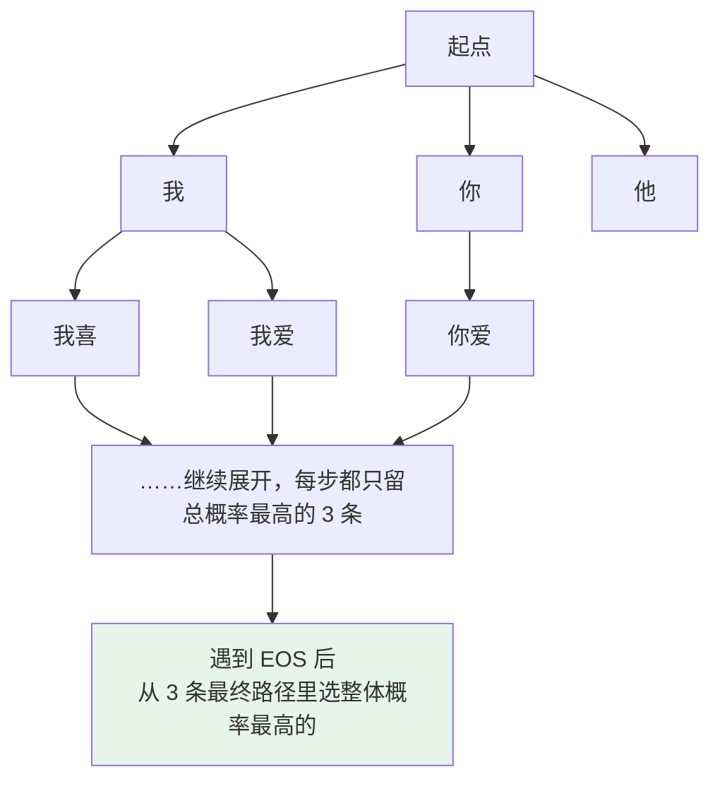

# 第十二章：解码策略

## 12.1 本质：从概率分布里选下一个 token

LLM 是自回归生成的。每生成一个新 token，模型输出一个 vocabulary 大小（典型 5 万到 15 万）的概率分布：

```
下一个 token 是「苹」的概率 30%
                「香」的概率 25%
                「桃」的概率 20%
                ...（后面还有几万个词）
```

**所谓解码策略，就是回答「怎么从这个分布里选一个 token 出来」。**

### 12.1.1 更深层：两种对任务本质的假设

不同策略的差异不只是「选哪个」，而是对生成任务的**根本假设不同**：

| 策略族 | 隐含假设 | 目标 |
|---|---|---|
| 贪心 / Beam Search | **存在一个唯一最优答案** | 找到它 |
| Temperature / Top-K / Top-P | **答案有多种合理可能** | 从可能空间里采样 |

理解了这个差异，下面五种策略的取舍就都好理解了。

## 12.2 贪心解码：最简单也最容易踩坑

每一步无脑选概率最高的 token，拼到序列后面，进入下一步。

### 12.2.1 优点

| 优点 | 说明 |
|---|---|
| **极简** | 每步只挑最大值，时间复杂度 $O(V)$，几乎没开销 |
| **完全确定** | 相同输入永远得到相同输出，便于调试和复现 |
| **对工程友好** | 单元测试、批处理、结果比对都稳定 |

### 12.2.2 臭名昭著的复读机问题

让模型用贪心续写「I love my dog because」，常见输出：

```
I love my dog because he is so cute. He is so cute. He is so cute. He is so cute. ...
```

**为什么？** 模型某一步生成了「He is so cute」，下一步在概率分布里发现这个模式刚出现过、上下文里概率很高，又选了它；再下一步又选一遍。

**贪心一旦走进这种自我加强的循环，就出不来了。**

### 12.2.3 更隐蔽的问题：乏味

每步都选最稳的路，最终生成的是「最大众化的表达」，读起来很 boring。对代码生成、信息抽取可能没问题，但对创意写作、对话场景太单调。

### 12.2.4 但它有最佳战场

**输出有标准答案的精确任务**：代码生成、SQL 生成、JSON 抽取。贪心反而是首选——**确定、不会乱写**。

## 12.3 Beam Search：翻译时代的王者

贪心的扩展版：每一步不只保留一条路径，而是**保留 $B$ 条最高概率的路径同时推进**（$B$ 叫束宽，典型 4 或 8）。

### 12.3.1 流程（以 B=3 为例）



每步把 $B$ 个前缀各自展开得到 $B \times V$ 个候选，从中挑总概率最高的 $B$ 条。

### 12.3.2 优点

- **全局视野更好**：某一步贪心选错了，Beam Search 还有 $B-1$ 条备份路径；
- **更接近全局最优**：总体概率比贪心高得多，输出更「合理」。

2014–2018 年的机器翻译时代它是绝对主流（Google NMT、fairseq、OpenNMT）。原因是**翻译任务有独特属性：给定源句，存在一个或几个「最优译文」**，Beam Search 的目标和任务本质高度匹配。

## 12.4 为什么 LLM 时代 Beam Search 失宠了

这是高频追问点。表面理由是「慢」（$B$ 倍计算量），**但深层原因是任务本质与算法目标不匹配**。

### 12.4.1 根本原因：开放式生成没有最优答案

Beam Search 优化的是「找到整体概率最高的那条序列」。

翻译时代合理，因为「I love you → 我爱你」确实有最优答案。但在**写故事、对话、回答开放问题**里，根本不存在最优答案，存在的只是**一个广阔的合理回答空间**。

### 12.4.2 反直觉的失效模式：Beam Search Curse

更糟的是，它在长序列上会**输出最 boring、最重复的内容**。

因果链是这样的：


实测过的人会发现：**$B$ 越大输出越保守乏味，$B=8$ 比 $B=4$ 还差**。这就是有名的「Beam Search 困境」。

### 12.4.3 工程上的硬伤：与现代推理优化不兼容

| 优化 | 冲突点 |
|---|---|
| **KV Cache** | 假设序列是「单一前缀往下生成」，Beam Search 要同时维护 $B$ 条不同前缀，**KV Cache 要复制 $B$ 份，显存爆炸** |
| **Flash Attention / PagedAttention** | 都是为单序列设计的，改起来很麻烦 |

所以主流推理框架（vLLM、SGLang、TGI）虽然大多支持 Beam Search，**但默认通常不开**。

> **更准确的说法**：Beam Search 不是彻底没用，而是从「默认主角」退回了「特定任务工具」——某些翻译、受约束生成、候选重排场景仍会用到。

## 12.5 采样族：用随机性换多样性

LLM 时代的主流，核心思路从「找最优」变成「**按概率分布掷骰子**」。

### 12.5.1 普通采样的新问题：长尾噪声

直接按模型输出的概率分布随机抽，多样性是有了，但模型的分布往往有一条**长长的尾巴**：

```
前 20 个词概率合起来   90%
后面几万个词分摊       10%（每个都极小）
```

普通采样有概率从这堆极小概率的词里抽到一个完全不合理的词（生成中文时突然冒出 `@$%`），**让整段输出毁掉**。

### 12.5.2 三种调节器

| 调节器 | 机制 | 效果 |
|---|---|---|
| **Temperature** | 每个 logit 除以 $T$ 再 softmax，**控制分布锐度** | $T<1$ 分布变尖（保守）；$T>1$ 变平（发散）；$T \to 0$ 等价贪心 |
| **Top-K** | **固定截断**：只从概率最高的 $K$ 个 token 里采样 | 候选集大小固定，不随分布形状变化 |
| **Top-P（Nucleus）** | **自适应截断**：从高到低累加概率，超过阈值 $P$ 就停 | **候选集大小自动适应分布形状**：分布尖锐时候选少，平坦时候选多 |

$$
p_i = \frac{\exp(z_i / T)}{\sum_j \exp(z_j / T)}
$$

三者的详细调参见 [第十三章](13-temperature-top-p-top-k.md)。本章只需记住：**采样族通过「引入随机性 + 截断长尾」，在多样性和质量之间找平衡。**

## 12.6 实际选型

本质是看任务对「确定性」和「多样性」的需求：

| 任务类型 | 推荐策略 | 典型参数 | 为什么 |
|---|---|---|---|
| **SQL 生成 / JSON 抽取** | 贪心 | $T=0$ | 结构严格，**错一个字符就报错** |
| **代码生成** | 贪心 / 低温采样 | $T=0 \sim 0.2$ | 有标准结构，要稳定可复现 |
| **数学推理** | 贪心，或 Self-Consistency 多次采样 | $T=0$，或 $T=0.7$ 投票 | 单次贪心稳，多次采样投票更准 |
| **机器翻译** | 贪心 / 低温采样 | $T=0 \sim 0.3$ | 有相对标准答案 |
| **日常对话** | Top-P 采样 | $T=0.7$，$P=0.9$ | 既要自然又不能太离谱 |
| **创意写作** | Top-P 采样 | $T=1.0 \sim 1.2$，$P=0.95$ | 鼓励多样性和惊喜 |
| **头脑风暴** | 高温 Top-P | $T=1.2$，$P=0.95$ | 越发散越好 |

### 12.6.1 一个简单口诀

```
任务有标准答案            →  贪心 / T=0
有多种合理答案，要稳一些   →  Top-P=0.9 + T=0.7
鼓励多样性                →  Top-P=0.95 + T=1.0 以上
```

> **别死记固定配置。** 各家 API 的默认值会随模型版本和产品形态变化。可靠做法是：**先用官方默认值当基线，再按任务是「精确」还是「开放」去调**，并用测试集观察跑偏率。

## 12.7 两个进阶策略

它们是「在主流采样基础上的加速 / 加强」，**不替代基础解码策略，而是叠加使用**。

### 12.7.1 推测解码（Speculative Decoding）：推理加速

用一个小的草稿模型（比如 1B）快速生成多个 token，再用大的目标模型（比如 70B）**一次性验证**这几个 token。一致就直接用，不一致就以大模型为准。

**为什么能加速？** 大模型推理的瓶颈是**访存**——每次只生成一个 token，却要把整个权重从显存搬到计算单元（详见 [第三章](03-attention-variants.md) 的 memory-bound 分析）。如果一次能验证 5 个 token，**访存次数就少了 5 倍**。

实测能提速 2–3 倍，**且结果与原模型完全等价**（不是近似）。

### 12.7.2 Self-Consistency：推理任务增强

对同一个数学题，用较高 Temperature 采样生成 $N$ 条独立推理路径，最后取**最终答案出现最多次的那个**（多数投票）。

**直觉**：正确答案往往可以通过多种推理路径得到，而错误答案是随机的——**多条路径不太可能收敛到同一个错误**。

在 GSM8K 等数学推理任务上能比单次贪心提升 5–15 个百分点，**代价是 $N$ 倍调用成本**。

## 12.8 常见错误

### 12.8.1 说不出解码策略的本质

每步都有一个 vocabulary 大小的概率分布，解码策略就是从中挑 token 的规则。这是整道题的地基。

### 12.8.2 只说「Beam Search 慢」

**深层原因是任务本质与算法目标不匹配**——开放式生成没有唯一最优答案。说出这一句才算答到点上。

### 12.8.3 认为 Beam 越大越好

$B=8$ 常常比 $B=4$ 还差。这是 Beam Search Curse 的直接体现。

### 12.8.4 不知道 Beam Search 与 KV Cache 冲突

$B$ 条前缀要复制 $B$ 份 KV Cache，显存爆炸。这是它在 LLM 推理栈里被边缘化的工程原因。

### 12.8.5 说 Beam Search「已经彻底没用了」

它退回了特定任务工具的定位，翻译、受约束生成、候选重排仍然会用。

### 12.8.6 认为贪心一无是处

SQL、JSON、代码这类结构严格的任务，贪心是首选。

### 12.8.7 死记温度默认值

各家默认值随版本变化。该说的是「用官方默认当基线，按任务精确 / 开放去调」。

### 12.8.8 把推测解码当成近似加速

它是**完全等价**的——大模型验证不通过就回退，输出分布不变。

## 12.9 本章总结

1. **解码策略 = 从每步的概率分布里挑 token 的规则**；
2. **两族策略隐含两种任务假设**：确定性族假设有唯一最优解，采样族假设有多种合理可能；
3. **贪心极简、完全可复现**，但会陷入自我加强的复读循环，且输出乏味；
4. **贪心的最佳战场是 SQL / JSON / 代码**这类结构严格任务；
5. **Beam Search 保留 $B$ 条路径**，在翻译时代称王因为翻译确有最优译文；
6. **LLM 时代失宠的根本原因是目标不匹配**：开放式生成没有最优答案；
7. **Beam Search Curse**：整体概率最高等价于每步选最稳的词，反而更容易复读，$B$ 越大越乏味；
8. **工程硬伤**：与 KV Cache、Flash Attention 等单序列优化不兼容；
9. **采样族用随机性换多样性**，靠 Temperature 调锐度、Top-K 固定截断、Top-P 自适应截断压住长尾噪声；
10. **选型看任务需要确定性还是多样性**，精确任务 $T=0$，对话 $T=0.7/P=0.9$，创意 $T=1.0+$；
11. **推测解码提速 2–3 倍且结果等价**，**Self-Consistency 在推理任务上提升 5–15 个点**，两者都是叠加而非替代。

> **一句话概括：Beam Search 不是被更快的算法淘汰的，而是被任务本身淘汰的——当问题从「找唯一正确译文」变成「写一段好回答」，「概率最高」就不再等于「最好」了。**

## 参考资料

- [The Curious Case of Neural Text Degeneration（Top-P / Nucleus Sampling）](https://arxiv.org/abs/1904.09751)
- [Hierarchical Neural Story Generation（Top-K Sampling）](https://arxiv.org/abs/1805.04833)
- [Self-Consistency Improves Chain of Thought Reasoning in Language Models](https://arxiv.org/abs/2203.11171)
- [Fast Inference from Transformers via Speculative Decoding](https://arxiv.org/abs/2211.17192)
- [Accelerating Large Language Model Decoding with Speculative Sampling](https://arxiv.org/abs/2302.01318)
- [If Beam Search Is the Answer, What Was the Question?](https://arxiv.org/abs/2010.02650)
- [Sequence to Sequence Learning with Neural Networks](https://arxiv.org/abs/1409.3215)
- [vLLM 文档](https://docs.vllm.ai/)
