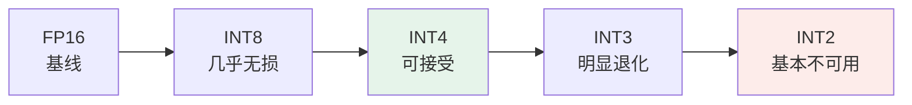
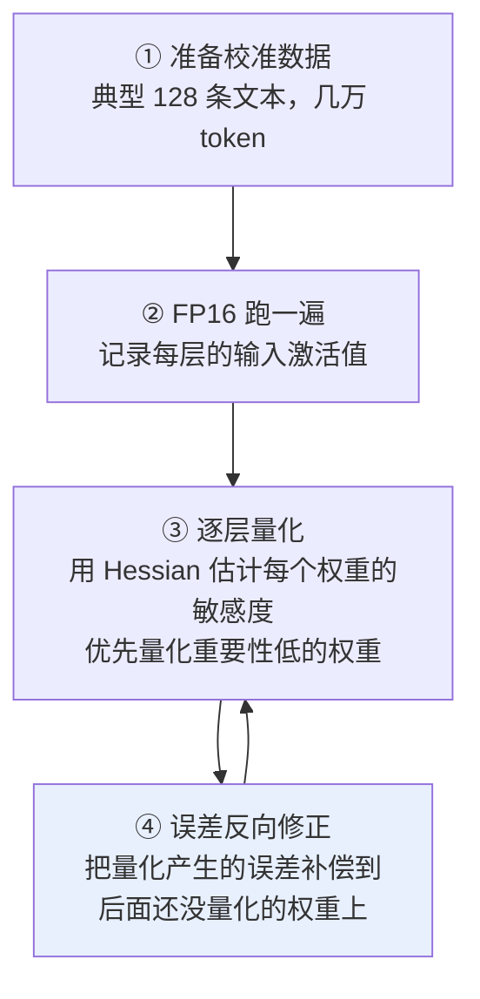

# 第十五章：模型量化

## 15.1 量化是什么，为什么必须做

模型参数本质就是一堆数字。训练时用 FP32 或 FP16 存储，因为浮点数值范围广、精度高，对梯度计算友好。

**但部署时 FP16 就显得很奢侈了：**

| 模型 | FP16 显存 | INT4 显存 |
|---|---|---|
| 7B | $7 \times 10^9 \times 2 = 14$ GB | $7 \times 10^9 \times 0.5 = 3.5$ GB |
| 70B | $70 \times 10^9 \times 2 = 140$ GB | $70 \times 10^9 \times 0.5 = 35$ GB |

70B 光权重就要 140GB，加上 KV Cache 和激活值，至少 4 张 A100 80GB 才跑得起来。

**降到 INT4 后**：7B 一张 4090 就能轻松跑，70B 一张 A100 80GB 也够用了。

### 15.1.1 第二个收益：速度

INT4 计算的硬件吞吐通常比 FP16 高 2–4 倍（取决于 GPU 是否有专门的低精度计算单元），**而且访存量也是 1/4**——对 [第三章](03-attention-variants.md) 讲的 memory-bound 推理过程是极大加速。

### 15.1.2 但不是免费午餐

把 16 位的连续浮点压到 4 位的 16 个离散级，**必然损失精度**。整个量化算法要回答的核心问题是：

> **如何在最小的精度损失下，把高精度数压到低精度数？**

## 15.2 核心机制：连续到离散的映射

假设一组 FP16 权重范围在 $[-2.5, 2.5]$，要量化到 INT4（16 个离散值）：

```
scale      = (max - min) / (2^bits - 1) = 5.0 / 15 ≈ 0.333
zero_point = round(-min / scale)        ≈ 8

量化:    int_val = round(fp_val / scale) + zero_point - 8
反量化:  fp_val ≈ (int_val - zero_point + 8) × scale
```

对权重值 0.7：量化得 $\text{round}(0.7/0.333) \approx 2$，反量化回 $2 \times 0.333 \approx 0.666$，**损失 0.034**。

**不同算法的差别在于**：怎么算 scale 和 zero_point、怎么处理 outlier、怎么补偿量化误差。

### 15.2.1 对称与非对称

| 风格 | 假设 | 适合 |
|---|---|---|
| **对称量化** | 数值对称分布在 0 周围（$\min = -\max$），不需要 zero_point，公式更简单 | **权重**（通常对称分布） |
| **非对称量化** | 数值不对称，需要 zero_point 把范围对齐 | **激活值**（如 ReLU 之后全是正数） |

## 15.3 各位数的精度边界

| 量化位数 | 7B 模型体积 | 平均精度损失 | 实用性 |
|---|---|---|---|
| FP16 | 14 GB | 基线 | 训练用 |
| **INT8** | 7 GB | 很小 | **几乎无损** |
| **INT4** | 3.5 GB | 约 1–3% | **主流部署甜蜜点** |
| INT3 | 2.6 GB | 5–10% | 边缘设备 |
| INT2 | 1.75 GB | 20%+ | 一般不用 |

### 15.3.1 损失曲线是「先平后陡」

**不是线性的**：INT8 → INT4 损失增加不大，但 **INT4 → INT3 突然增加很多**，再到 INT2 基本不能用。



> INT8 常被叫做「接近免费的午餐」，**但别说成绝对无损**——涉及数学、代码、长上下文、工具调用时，还是要在自己的业务集上评测。

### 15.3.2 那个「1–3%」背后藏着的魔鬼

**精度损失不是均匀分布的。**

| 任务类型 | INT4 损失 |
|---|---|
| 简单分类、抽取 | 几乎无损 |
| 通用对话 | 1–2% |
| **数学推理** | **5–10%** |
| **长链路代码生成** | **10%+** |

**这就是为什么后来出现了 GPTQ 和 AWQ 这种更精细的算法。**

## 15.4 GPTQ：基于误差补偿的逐层量化

朴素量化的问题是：**每层独立量化，误差逐层累积**，最终输出偏离原模型很远。

GPTQ 的洞见是——**量化误差可以被补偿到后面还没量化的权重里**。

### 15.4.1 流程



### 15.4.2 优缺点

| 优点 | 缺点 |
|---|---|
| **数学严谨**：基于 Optimal Brain Surgeon 的二阶优化理论 | **量化耗时长**：7B 要几个小时（算 Hessian + 逐层补偿） |
| **支持极端低位**：能做 INT3 甚至 INT2，靠误差补偿消化损失 | **依赖校准数据**：选错效果变差 |
| 不依赖模型结构，纯权重量化 | **激活值仍是 FP16**，推理时混合精度计算，速度提升不如 AWQ |

主要用在**追求精度的离线量化场景**。AutoGPTQ、Optimum 都集成了它，是开源社区最早普及的量化方案。

## 15.5 AWQ：激活感知的权重保护

MIT 提出，核心洞见特别巧妙。

### 15.5.1 洞见：1% 的权重承担 99% 的输出贡献

研究者观察到模型里约 **1% 的权重是 Salient Weights（显著权重）**。**保护好这 1%，其他 99% 激进量化到 INT4，效果几乎不掉。**

### 15.5.2 怎么找到这 1%：看激活值

**直觉**：权重 $W$ 的输出贡献 $= W \times$ 激活值 $X$。

如果某些输入位置的 $X$ 特别大（比如是其他位置的 100 倍），**对应的权重列就是重要权重**，量化时要小心保护。

**技术上**：AWQ 通过一个**逐通道缩放**操作，把重要权重通道的数值扩大——这样量化时它们占据更宽的整数范围，损失更小；不重要的不动。

> **关键**：这个缩放是**数学等价变换**，不改变模型输出，只是让量化更友好。

### 15.5.3 优缺点

| 优点 | 缺点 |
|---|---|
| **推理速度快**：针对 GPU 计算特性优化，权重布局对 kernel 友好，比 GPTQ 快 1.5–2 倍 | **极端低位（INT3）效果不如 GPTQ**，误差补偿在极端位数下更稳 |
| **效果稳**：INT4 下精度略优于 GPTQ（约 0.5–1%） | 同样需要校准数据 |
| **量化耗时短**：不用算 Hessian，7B 只要几十分钟 | |

AWQ 在「精度 + 速度 + 量化耗时」三维上比较均衡，是很常见的生产选择。

> **但现在框架支持的量化路线越来越多**（GPTQ、bitsandbytes、FP8、Marlin/CUTLASS kernel、GGUF），**选型时一定要看目标框架和目标 GPU 上哪条路径最成熟**。

## 15.6 QLoRA 与 NF4：让消费级 GPU 微调成为可能

GPTQ 和 AWQ 解决的是**部署时**的量化。QLoRA 回答的是更激进的问题：**4-bit 量化的模型能不能继续微调？**

### 15.6.1 NF4 是非均匀量化

普通 INT4 是**均匀分隔**（16 个值平均分布）。

NF4 利用了一个事实：**模型权重的分布近似均值为 0 的正态分布**。所以它把 16 个量化值的分布也设计成正态分布形状——**密集区域（0 附近）刻度多，稀疏区域刻度少**。

这样量化误差更小。

### 15.6.2 另外两个优化

| 优化 | 作用 |
|---|---|
| **双重量化** | 连量化用的 scale 常数也再量化一次，进一步省显存 |
| **分页优化器** | 用统一内存把优化器状态溢出到 CPU，避免显存峰值溢出 |

**最终效果**：一张 24GB 4090 可以微调 7B，48GB 卡能微调 13B、33B。详见 [第八章](08-finetuning.md)。

QLoRA 也证明了「**INT4 量化的模型不是死模型，还能继续学习**」。

## 15.7 怎么选

| 场景 | 推荐方案 | 理由 |
|---|---|---|
| **生产部署，看重速度** | AWQ / GPTQ / FP8 / 框架原生 INT4 | **看目标框架和 GPU kernel 支持，不能只背一个名字** |
| **生产部署，追求最高精度** | FP16 / INT8 / GPTQ INT4 | 精度无妥协；显存吃紧再降位 |
| **个人微调，消费级 GPU** | QLoRA NF4 | 让 4090 也能微调 7B–13B |
| **边缘部署（手机 / 笔记本）** | GGUF Q4_K_M / INT3 GPTQ | 极致压缩 |
| **CPU 部署** | llama.cpp + GGUF | 无 GPU 也能跑 |

### 15.7.1 三个关键提示

**① AWQ vs GPTQ 怎么选**

大多数线上部署可以**先试 AWQ 或框架推荐的 INT4 路线**，推理 kernel 和量化耗时通常更友好。GPTQ 在追求精度、已有 GPTQ 权重、校准数据更匹配时也很常见。

> **不要脱离框架支持谈算法好坏。** 最后跑得快不快，取决于**量化格式和推理 kernel 是否匹配**。

**② INT4 vs INT8 怎么选**

显存够、质量要求高 → 优先 INT8 / FP8 或直接 FP16；显存不够、吞吐敏感 → 再上 INT4。70B 这种大模型 INT4 经常是性价比最高的，但具体还看硬件、并发和上下文长度。

**③ GGUF 是什么**

> **GGUF 不是量化算法，是 llama.cpp 用的文件格式。**

它内部可以存各种量化方案的权重（Q4_K_M、Q5_K_M、Q8_0 等），**是一个容器**。这跟 AWQ/GPTQ 这种「算法」不是一个层级——**混淆这两者是很常见的错误**。

## 15.8 四个副作用与陷阱

### 15.8.1 Outlier 异常值问题

权重里偶尔有「极端大」的值（绝对值是其他的几十倍），**它们会把量化范围拉得很宽，导致大部分普通权重的量化精度被严重稀释**。

**应对**：AWQ 的逐通道缩放就是专门处理这个的；GPTQ 的 Hessian 也能识别 outlier 优先保护。但极端情况仍会出错。

### 15.8.2 KV Cache 量化的挑战

权重量化已经很成熟，但 **KV Cache 量化才刚起步**。

KV Cache 在长上下文下占用比权重还大（见 [第十四章](14-kv-cache.md)），量化它能省更多显存，**但精度损失对长链路推理特别敏感**。这仍是研究热点。

### 15.8.3 不同任务的敏感度差异巨大

「INT4 损失 1–3%」是平均值。**部署量化模型前必须在自己的业务场景下做评测，不能直接看论文里的平均数。**

### 15.8.4 与其他优化的兼容性

量化要和 Flash Attention、KV Cache、Speculative Decoding 同时使用，**不同框架支持度差别很大**。

**选量化方案前先看部署框架支持哪些，再用自己的业务集压测质量和吞吐。**

## 15.9 常见错误

### 15.9.1 说不出量化的基本机制

scale + zero_point 的线性映射。说不出这个就是只知道「压缩了」。

### 15.9.2 认为精度损失是线性的

是「先平后陡」：INT8→INT4 还好，INT4→INT3 陡增。

### 15.9.3 把「INT4 损失 1–3%」当成所有任务的结论

数学推理可能掉 5–10%，长链路代码生成掉 10%+。必须自己的业务集实测。

### 15.9.4 说不出 GPTQ 和 AWQ 的核心创新

GPTQ 是**逐层量化 + 误差补偿**，AWQ 是**激活感知 + 保护 1% 显著权重**。各一句话就能区分开。

### 15.9.5 把 GGUF 当成量化算法

它是文件格式、是容器，跟 AWQ/GPTQ 不是一个层级。**这是最容易露怯的错误。**

### 15.9.6 脱离框架和 GPU 谈算法好坏

跑得快不快取决于量化格式与推理 kernel 是否匹配。

### 15.9.7 忽略 outlier 问题

极端权重会稀释所有普通权重的量化精度，是 AWQ 逐通道缩放存在的理由。

### 15.9.8 认为量化模型不能再训练

QLoRA 已经证明可以——4-bit 基座上套 LoRA 照样微调。

## 15.10 本章总结

1. **量化把 FP16 映射到低精度整数**，机制是 scale + zero_point 的线性映射；
2. **两个收益**：显存降到 1/4，访存量也降到 1/4 带来 2–4 倍加速；
3. **权重用对称量化，激活值用非对称量化**；
4. **INT8 几乎无损，INT4 是甜蜜点，INT3 起明显退化**，损失曲线先平后陡；
5. **平均损失掩盖了任务差异**：数学推理和长链路代码生成敏感得多；
6. **GPTQ = 逐层量化 + 误差补偿**，数学严谨、支持极端低位，但耗时长且激活仍是 FP16；
7. **AWQ = 激活感知保护 1% 显著权重**，逐通道缩放是等价变换，速度快、量化耗时短；
8. **QLoRA 的 NF4 是非均匀量化**，按权重的正态分布设计刻度，配合双重量化和分页优化器让 4090 能微调 7B；
9. **GGUF 是文件格式不是算法**，是最容易混淆的一点；
10. **选型不能脱离框架和 GPU kernel**，最终性能取决于格式与 kernel 是否匹配；
11. **四个陷阱**：outlier 稀释精度、KV Cache 量化尚不成熟、任务敏感度差异、与其他优化的兼容性。

> **一句话概括：量化的技术演进主线是「从一视同仁地压，到识别出那些不能压的」——GPTQ 用误差补偿救回损失，AWQ 干脆先找出那 1% 关键权重把它们保护起来。**

## 参考资料

- [GPTQ: Accurate Post-Training Quantization for Generative Pre-trained Transformers](https://arxiv.org/abs/2210.17323)
- [AWQ: Activation-aware Weight Quantization for LLM Compression and Acceleration](https://arxiv.org/abs/2306.00978)
- [QLoRA: Efficient Finetuning of Quantized LLMs（NF4）](https://arxiv.org/abs/2305.14314)
- [LLM.int8(): 8-bit Matrix Multiplication for Transformers at Scale](https://arxiv.org/abs/2208.07339)
- [SmoothQuant: Accurate and Efficient Post-Training Quantization for Large Language Models](https://arxiv.org/abs/2211.10438)
- [Optimal Brain Compression: A Framework for Accurate Post-Training Quantization and Pruning](https://arxiv.org/abs/2208.11580)
- [llama.cpp / GGUF](https://github.com/ggml-org/llama.cpp)
- [AutoAWQ](https://github.com/casper-hansen/AutoAWQ)
