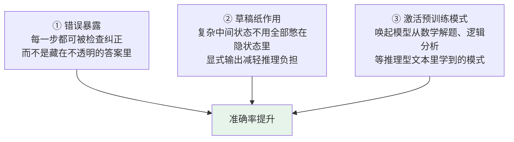
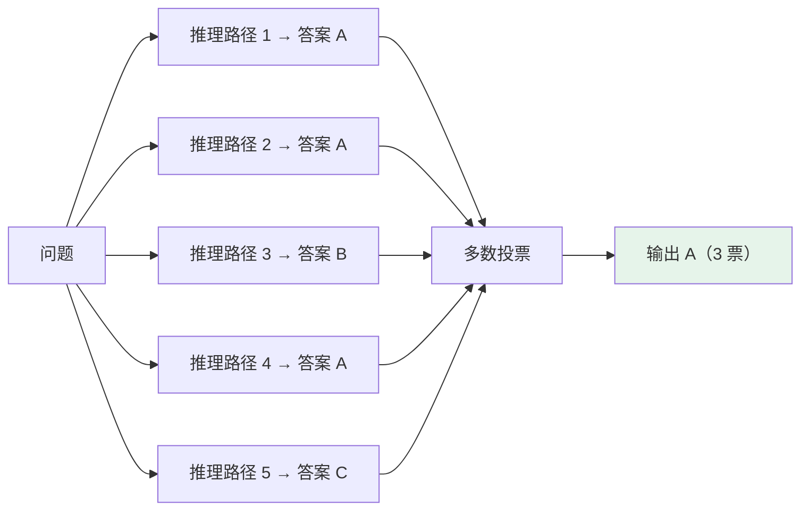

# 第十七章：CoT 思维链

## 17.1 没有 CoT 时模型在做什么

大语言模型在没有 CoT 时，处理问题的方式**有点像人没睡醒时凭直觉答题**：看到题目，从记忆里拼出一个听起来合理的答案，**跳过了中间的推理过程**。

简单问题没什么问题。但一旦涉及多步计算、逻辑推导或因果链，**直接跳答案就很容易出错**——因为模型没有一步步「检查」自己的逻辑。

### 17.1.1 一个经典例子

> 小明有 5 个苹果，他给了小红 2 个，然后又买了 3 个，最后还剩几个？

直接输出答案可能只做了一步运算就报数。但如果让模型写出推理过程：

```
小明初始 5 个
给出 2 个后剩 3 个
再买 3 个后变成 6 个
```

**每一步都很容易验证，错误自然就少了。**

## 17.2 CoT 的核心思路

**本质是让模型「推出来」而不是「直接猜出来」。**

对复杂问题，答案无法直接从训练数据里召回，但可以通过一步步推理得到——每一步都基于上一步的结论。

### 17.2.1 为什么这个机制天然成立

**关键洞见：语言模型的生成方式本身就支持逐步推理。**

模型是一个 token 接一个 token 生成的，**每生成一个新 token 时都能看到前面所有已生成的内容**。所以让它先生成推理步骤，相当于**给后续的答案生成提供了更多「工作记忆」**。

### 17.2.2 一个必须区分的点

> **「让模型推理」和「把完整推理链展示给用户」不是一回事。**

现代产品和 API 往往让模型**内部完成推理**，最终只给用户简洁答案、关键依据或可核查步骤。这样既保留推理收益，又避免输出冗长、不稳定的思考链。

## 17.3 两种 CoT 形式

| | 做法 | 效果 | 适合 |
|---|---|---|---|
| **Few-shot CoT** | 在 Prompt 里给几个完整的「推理示例」，每个包含问题、逐步推理、最终答案 | **最稳定** | 对准确率要求高的场景 |
| **Zero-shot CoT** | 在问题末尾加一句「请分步思考后再给结论」 | 通常略逊于 Few-shot，但**很多场景已经够好** | Prompt 要简洁、任务不太复杂时 |

### 17.3.1 Zero-shot CoT 为什么令人惊讶

**仅仅加一句指令就能激活模型的推理能力**，让它自发地组织中间步骤——不需要写任何示例。这是研究里发现的一个有趣现象。

## 17.4 CoT 为什么有效



## 17.5 Self-Consistency：CoT 的升级版

**做法**：对同一个问题，**用较高的温度生成多条不同的推理路径**，然后取最终答案里出现最多次的那个（多数投票）。

### 17.5.1 直觉

> **正确的答案往往可以通过多种不同的推理路径得到，而错误的答案往往是随机产生的——不同路径不太可能收敛到同一个错误答案。**



### 17.5.2 收益与代价

| | |
|---|---|
| **收益** | 在 CoT 基础上再提升约 5–15% 准确率，**数学推理类任务尤其显著** |
| **代价** | 调用次数变多（通常 5–10 次），**成本和延迟随之增加** |

温度采样的机制见 [第十三章](13-temperature-top-p-top-k.md)。

## 17.6 CoT 的四个局限

**这是最容易被追问、也最能拉开差距的部分。**

### 17.6.1 token 消耗大

推理链会额外生成几百甚至上千个 token，**API 成本和响应时间都显著增加**。

### 17.6.2 对简单问题适得其反

让模型对「1+1 等于几」也展开推理，**只会浪费 token、降低速度，不会提升准确率**。

### 17.6.3 推理链本身也会出错

**如果第 2 步推理错了，第 3、4 步会基于错误前提继续推导**，最终答案大概率也是错的。

> **CoT 能减少跳跃性错误，但不能消除推理错误。** 这是它和「让模型变正确」之间的本质差别。

### 17.6.4 对纯记忆类任务没帮助

比如「2020 年奥运会在哪里举办」——**这类问题根本不需要推理**，展开推理链毫无收益。

### 17.6.5 适用边界

| 用 CoT | 不用 CoT |
|---|---|
| 数学题、逻辑题、代码调试 | 简单问答、分类、信息提取 |
| 多步因果推导 | 事实召回 |
| 需要中间结论可核查的场景 | 对延迟极敏感的场景 |

## 17.7 常见错误

### 17.7.1 说不出 CoT 为什么有效的底层机制

**模型是逐 token 生成、每步都能看到前文**，先写推理步骤等于给了它一张草稿纸。说不出这个就是只会背结论。

### 17.7.2 认为 CoT 能消除推理错误

它只能减少**跳跃性**错误。推理链第 2 步错了，后面会沿着错误前提一路错下去。

### 17.7.3 无差别地对所有任务加 CoT

对简单问答和纯记忆任务是纯浪费，还拖慢延迟。

### 17.7.4 把完整推理链直接展示给最终用户

生产环境通常只展示简要依据或最终答案，完整思考链冗长且不稳定。

### 17.7.5 忽略 CoT 的成本

几百到上千个额外 token，在高 QPS 场景是实打实的开销。

### 17.7.6 把 Self-Consistency 说成免费提升

它需要 5–10 次调用，成本和延迟是线性上去的。

### 17.7.7 把 CoT 等同于「规划能力」

CoT 只是最基础的一种显式推理手段。**规划是方向，CoT 是手段**——ToT、GoT 等更复杂的结构见 [Agent 主题第十一章](../agent/11-llm-agent-planning.md)。

## 17.8 本章总结

1. **没有 CoT 时模型是凭直觉跳答案**，多步任务容易出错因为没有一步步检查逻辑；
2. **CoT 的本质是让模型推出来而不是猜出来**；
3. **有效的底层机制**：模型逐 token 生成且每步都能看到前文，先写推理步骤 = 提供工作记忆；
4. **两种形式**：Few-shot CoT 给完整推理示例（最稳定），Zero-shot CoT 只加一句触发指令（简洁但略逊）；
5. **三个有效原因**：错误暴露可纠正、中间状态当草稿纸、激活预训练里的推理模式；
6. **Self-Consistency 是升级版**：高温生成多条路径 + 多数投票，提升 5–15%，代价是 5–10 倍调用；
7. **四个局限**：token 消耗大、对简单问题适得其反、推理链本身会出错并沿链传导、对纯记忆任务无帮助；
8. **CoT 减少跳跃性错误，但不能消除推理错误**；
9. **生产环境让模型内部推理，只对外输出简要依据或可核查结论**。

> **一句话概括：CoT 的价值不在于让模型变聪明，而在于把原本挤在一次 forward 里的隐式推理摊开成一串可以互相支撑、也可以被检查的中间结论。**

## 参考资料

- [Chain-of-Thought Prompting Elicits Reasoning in Large Language Models](https://arxiv.org/abs/2201.11903)
- [Large Language Models are Zero-Shot Reasoners（Let's think step by step）](https://arxiv.org/abs/2205.11916)
- [Self-Consistency Improves Chain of Thought Reasoning in Language Models](https://arxiv.org/abs/2203.11171)
- [Least-to-Most Prompting Enables Complex Reasoning in Large Language Models](https://arxiv.org/abs/2205.10625)
- [Tree of Thoughts: Deliberate Problem Solving with Large Language Models](https://arxiv.org/abs/2305.10601)
- [Towards Understanding Chain-of-Thought Prompting: An Empirical Study of What Matters](https://arxiv.org/abs/2212.10001)
- [Measuring Faithfulness in Chain-of-Thought Reasoning](https://arxiv.org/abs/2307.13702)
